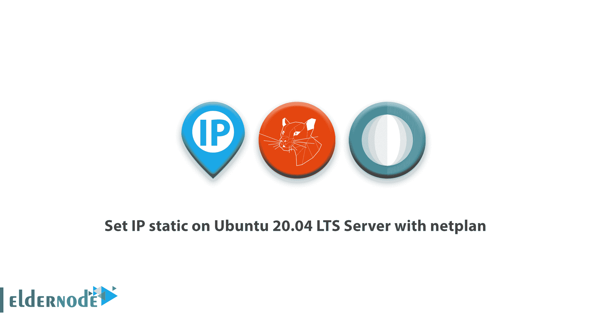

# 在 Ubuntu 20.04 LTS 服务器上设置静态 IP

> 原文：<https://blog.eldernode.com/set-ip-static-on-ubuntu-20-04-lts-server-with-netplan/>



【更新日期:2021-01-30】静态 IP 是固定不变的 IP 地址。您可以为使用 IP 地址的设备设置静态 IP 地址。由于在 Ubuntu 20.04 中网络配置是由 netplan 控制和管理的，所以和我们一起来回顾一下如何用 netplan 在 ubuntu 20.04 LTS 服务器上**设置 IP static。Netplan 支持通过 YAML 文件在系统上轻松配置网络。并处理 YAML，为[网络管理器](https://en.wikipedia.org/wiki/NetworkManager)或 systemd-network 系统的呈现器生成所需的配置。要购买您自己的 [Linux VPS](https://eldernode.com/linux-vps/) ，请访问 [Eldernode](https://eldernode.com/) 并根据您的需求找到最合适的软件包。**

为了让本教程更好地发挥作用，请考虑以下**先决条件**:

拥有 sudo 权限的非 root 用户。

要进行设置，请遵循我们在 Ubuntu 20.04 上的[初始服务器设置。](https://blog.eldernode.com/initial-server-setup-on-ubuntu-20/)

## 教程用 netplan 在 Ubuntu 20.04 LTS 服务器上设置 IP 静态

**使用 netplan 实用程序作为新的命令行网络配置，帮助您在 [Ubuntu](https://blog.eldernode.com/tag/ubuntu/) 系统中轻松管理和配置网络设置。**

### 如何查看界面 娜 我

第一步，你需要检查 Ubuntu 20.04 LTS 服务器上的所有接口。输入下面的命令来获取 **N** 网络 **I** 接口 **C** 控制器名称。

```
ip addr
```

当您输入命令时，您可以看到您的接口名称。稍后您需要网络配置的名称。


### 如何在 Ubuntu 20.04 服务器上设置 IP 地址

转到 /etc/netplan 目录，检查 YAML 文件的名称。

```
cd /etc/netplan
```

之后，你可以使用 *ls* 命令来查看 YAML 文件。

```
ls
```

是时候在 Ubuntu 20.04 LTS 服务器上设置 IP 静态了。

```
Sudo nano 00-installer-config.yaml
```

**记住** : 不要忘记编辑你的 yaml 文件。

像这样键入您的静态 IP 和其他信息

```
network       ethernets:         ens160:          dhcp4: no            addresses: [192.168.100.120/24]            gateway4: 192.168.100.1            nameservers:              addresses: [8.8.8.8, 1.1.1.1]          dhcp6: no       version: 2
```

请注意下面的图片，你会看到一些空间和一些规则。如果不考虑规则，netplan 无法检测到您的配置。

在文件上添加 IP 静态和其他信息后，保存并退出。

**点 :** 用 **Ctrl + x** 键按两次回车键即可保存并退出。


使用以下命令应用配置。

```
sudo netplan apply
```

现在你可以通过 ping 你的 IP 或者 *ip 地址* 命令来检查网络配置。


此外，你可以在 Eldernode Youtube 频道上看到该视频。

## 结论

在本文中，您了解了如何使用 netplan 在 Ubuntu 20.04 LTS 服务器上设置 IP static。从现在开始，您可以通过使用静态 IP 来避免网络问题，从而着眼于更大的基础设施。如果你有兴趣了解更多，可以找到我们的相关文章[如何在 Linux 终端](https://blog.eldernode.com/find-server-public-ip-linux/)中找到服务器公共 IP 地址。