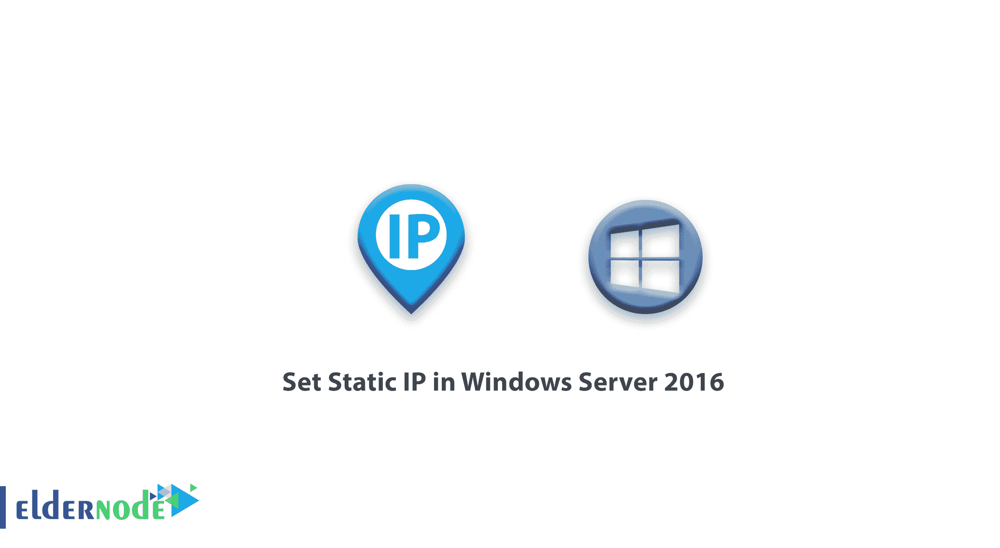
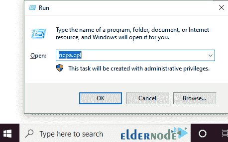
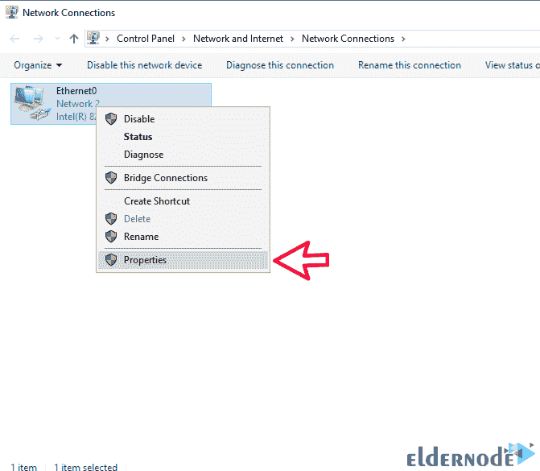
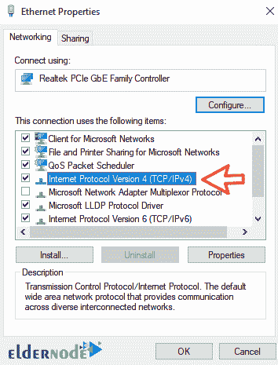
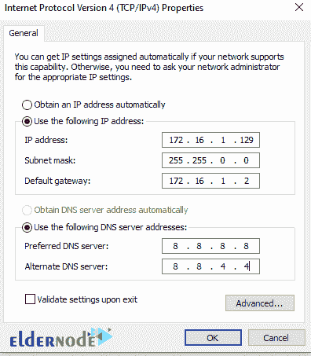

# 在 Windows Server 2016 - Eldernode 中设置静态 IP

> 原文：<https://blog.eldernode.com/set-static-ip-in-windows-server-2016/>

本文来自 [Windows Server 2016 教程](https://eldernode.com/tag/windows-server-2016/)系列，我们将在 Windows Server 2016 中设置静态 IP。这些设置是网络管理员将在安装开始时执行的系统基本设置的一部分。您可以从 eldernode 选择您最理想的 [Windows VPS](https://eldernode.com/windows-vps/) 服务器套装。

## Windows Server 2016 上的静态 IP 设置教程

**1。**登录到您的 [Windows 服务器](https://en.wikipedia.org/wiki/Windows_Server)环境。

**2。**按键盘上的 Winkey + R 打开 Run 窗口。

**3。**输入 ncpa.cpl ，点击 OK 。

**4。**打开网络连接窗口后，**在所需界面上右击**，选择属性。

**注:** 当**右键**时，可以进入**禁用**禁用界面、**状态**查看网络状态等选项。

**5。**设置窗口打开后，**双击** 互联网协议版本 4 。

**6。**将设置设置为使用跟随地址模式，并输入 **IP 地址**和您想要的其他设置。

您还将能够从这个部分[配置您的 DNS 服务器](https://eldernode.com/configure-dns-on-windows-server-2016/)。

7 .**。**输入想要的 IP 地址后，点击确定直到所有窗口关闭。

**注:** 关闭最后一个窗口后，你的**网卡**会被停用和重新激活一会儿。

从现在起，您也可以使用所需的 IP 地址。

**尊敬的用户**，我们希望您能喜欢这个[教程](https://eldernode.com/category/tutorial/)，您可以在评论区提出关于本次培训的问题，或者想解决[老年人节点培训](https://eldernode.com/blog/)领域的其他问题，请参考[提问页面](https://eldernode.com/ask)部分，并尽快提出您的问题。腾出时间给其他用户和专家来回答你的问题。

好运。