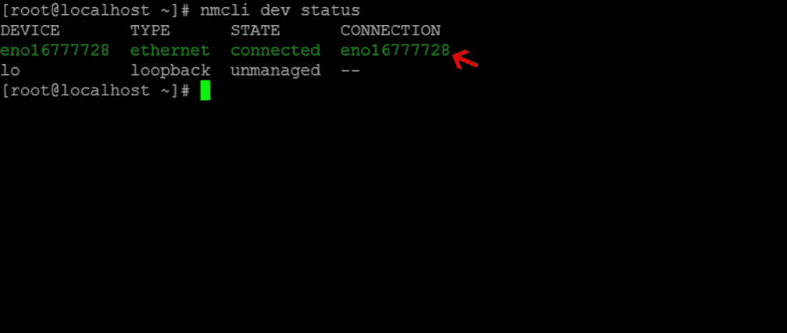

# 在 CentOS 7 上设置静态 IP-nm tui 命令- Centos 7 网络设置

> 原文：<https://blog.eldernode.com/set-static-ip-on-centos-7/>


之前，您学习了如何在 Ubuntu 上设置静态 IP，在本文中，您将回顾如何在 CentOS 7 上设置静态 IP。默认情况下，在 **CentOS 7 Linux** 和其他发行版上，网络设置为自动从 [DHCP](https://en.wikipedia.org/wiki/Dynamic_Host_Configuration_Protocol) 接收 IP。但总的来说，如果你正在设置服务器或在某些情况下需要固定 IP，你需要进行调整。在本教程中，除了在 CentOS 7 上设置静态 IP，我们还将了解 **nmtui** 命令是如何工作的。

> [购买 Linux VPS](https://eldernode.com/linux-vps/)

## 如何在 CentOS 7 上设置静态 IP

**1-** 首先，通过输入以下命令，我们检查**网卡**的状态。

输入以下命令后，您将被告知您的网卡是活动的还是非活动的。

```
systemctl status Network**M**anager.service
```

**2-** 输入下面的命令来显示接口的名称。

在设置静态 IP 的后续命令中，接口名称很重要。

```
nmcli dev status
```

上面的照片显示我们的接口名称是 eno16777728。



### CentOS 7 上设置静态 IP 的两种方式。

**1-** 通过终端环境命令设置静态 IP。

**2-** 由网络管理员设置静态 IP。

### 通过终端环境命令 在 CentOS 7 上设置静态 IP

**1-** 先去**/etc/sys config/network-scripts**路径。

```
cd /etc/sysconfig/network-scripts
```

**2-** 输入 **ls** 命令找到你的接口文件的名称。

Ifcfg 将被添加到接口名称的开头。例如，我们的接口文件在 ifcfg-eno16777728 中。

**3-** 用 **Vi** 编辑器打开界面设置文件。

```
vi ifcfg-eno16777728
```

**4-** 按下 **i** 按钮，将以下短语复制到其中。

在 IPADDR 中输入您的设置，然后。章节。

```
TYPE="Ethernet"  BOOTPROTO="static"  DEFROUTE="yes"  IPV4_FAILURE_FATAL="yes"  IPV6INIT="yes"  IPV6_AUTOCONF="yes"  IPV6_DEFROUTE="yes"  IPV6_FAILURE_FATAL="no"  NAME="eno16777728"  UUID="6515e1f5-ff46-410f-97bc-47d35c6d7bf8"  ONBOOT="yes"  IPADDR="192.168.1.10"  PREFIX="24"  GATEWAY="192.168.1.1"  DNS1=8.8.8.8  DNS2=8.8.4.4  HWADDR=00:50:56:AD:6D:41  DOMAIN=rheltest.lan  IPV6_PEERDNS=yes  IPV6_PEERROUTES=yes
```

**5-** 输入并设置所需的 **IP** 后保存文件。

要将文件保存在 Vi 中，首先输入 Esc 键并输入短语 **:wq** ，然后按回车键。

**6-** 完成上述步骤后，重启网络服务。

```
systemctl restart network.service
```

通过输入以下命令，您将看到您所做的设置。

```
ip a
```

此时，您的设置被应用，您可以使用您的 Linux 操作系统网络。

### 网管 在 CentOS 7 上设置静态 IP

通过在 **CentOS 7** 上安装**网络管理器**包，您可以更快地设置您的网络。当然，这个包在 CentOS 7 中是默认可用的，如果没有，安装它。

您可以使用以下命令安装网络管理器。

```
yum install Network**M**anager-tui
```

使用下面的命令进入你的界面编辑环境。

```
nmtui edit eno16777728
```

**3-** 在此部分，如下图所示，您可以进行所需的设置。

必须填写红色箭头部分。


**4-** 输入所需设置后，进入最后的 OK 选项。

最后，重启你的网络服务。

```
systemctl restart network.service 
```

**亦见**

[如何通过终端命令给 Debian 添加第二个 IP](https://eldernode.com/add-a-second-ip-to-debian-by-terminal/)

亲爱的用户，我们希望你喜欢这个教程，你可以在评论区提出关于这个培训的问题，或者要解决 [Eldernode](https://bit.ly/2Y5rVUu) 培训领域的其他问题，请参考[提问页面](https://eldernode.com/ask)部分并在其中提出你的问题。