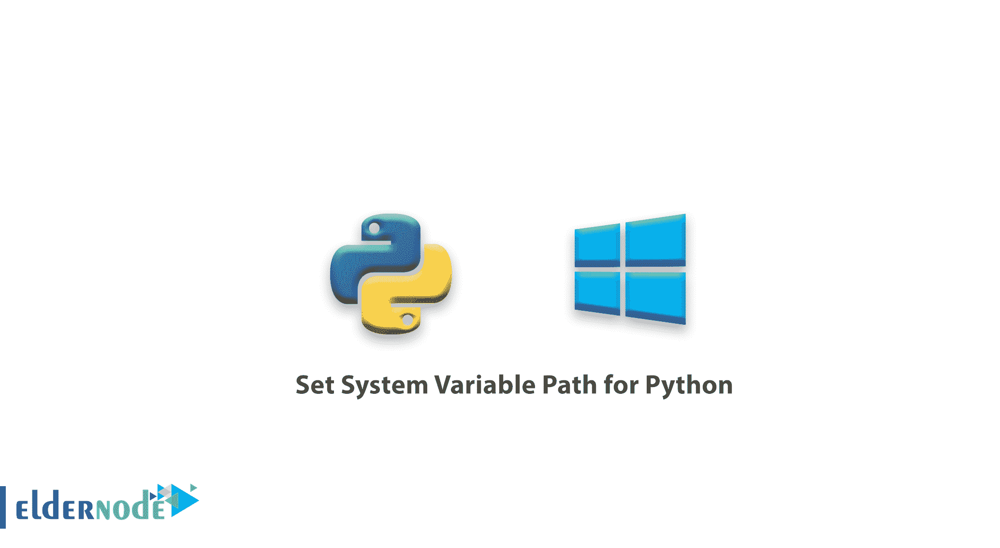
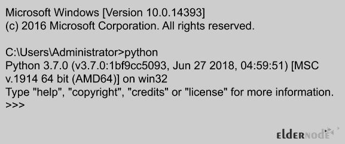
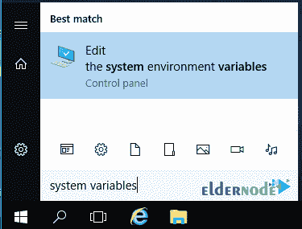
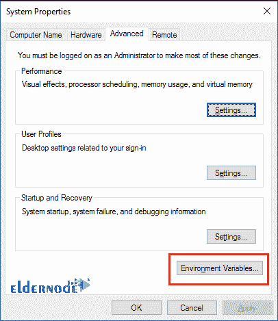
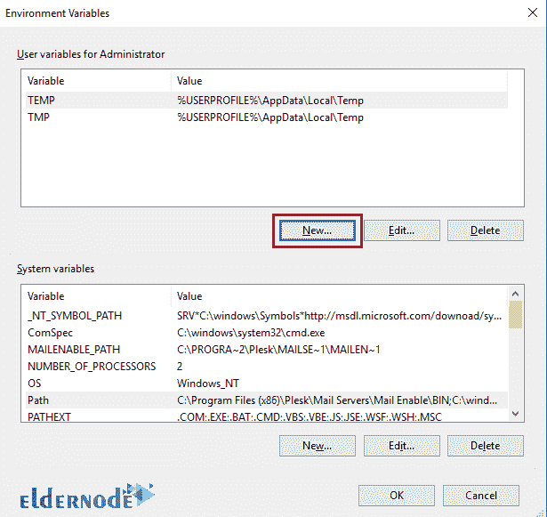
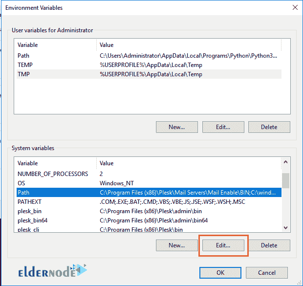
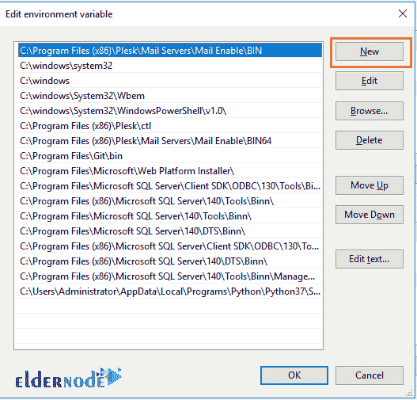

# 如何为 Python 设置系统变量 Path

> 原文：<https://blog.eldernode.com/set-system-variable-path-for-python/>

如何为 Python 设置系统变量路径？在过去的几年里， Python 已经成为应用程序开发、基础设施管理和数据分析的领先工具之一。今天， [Python](https://www.python.org/) 已经成为 web 应用和系统管理、大数据分析以及人工智能开发领域的主要技术参与者之一。

您可能需要调整系统环境变量，以简化在服务器上使用 Python 的过程。在本文中，我们将教你如何为 Python 设置系统变量 path。和我们在一起。

如果您在安装过程中选择了系统环境变量 Path，Python for Windows 的最新安装程序会自动设置该选项。

为了**验证**该设置是否正确，**通过**在命令提示符上右击**并选择以管理员身份运行来打开**一个管理命令提示符。然后**键入**单词 python 并按回车。

如果系统变量 Path 设置正确，您应该会收到如下所示的输出:

**注意:** 如果您收到一个错误，指示命令未知，但是您已经确认 Python 已经安装并且可以从其目录启动，您可能需要将 Python 变量添加到系统环境变量。

按照这些快速步骤，您将能够从任何命令提示符下访问 Python:

**1。** 从服务器桌面，点击窗口图标，搜索环境变量。

**2。T3 按回车启动系统属性对话框。**

**3。T3 点击环境变量进行必要的修改。**

**4。** 创建一个新用户变量命名为:路径和变量值:**C:\ Users \ *your username* \ AppData \ Local \ Programs \ Python \ Python 37**。

**注意:** 更改变量值以匹配您的实际安装路径。

**5。** **找到**名为 Path 的系统变量点击编辑。

**6。** 创建一个与你创建的路径变量相匹配的新条目。

将 \ 脚本添加到条目的末尾(新条目应该看起来像 C:\ Users \ *your username* \ AppData \ Local\程序\Python\Python 37\脚本 \

**7。** 你可以从任何位置打开新的管理命令提示符并键入 python 来验证你已经成功地完成了这一步。

您应该会收到类似上面显示的响应。

**尊敬的用户**，我们希望您能喜欢这个[教程](https://eldernode.com/category/tutorial/)，您可以在评论区提出关于本次培训的问题，或者解决[老年人节点培训](https://eldernode.com/blog/)领域的其他问题，请参考[提问页面](https://eldernode.com/ask)部分，并尽快提出您的问题。腾出时间给其他用户和专家来回答你的问题。

好运。