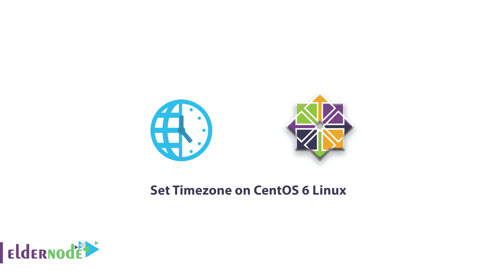

# 在 CentOS 6 Linux 上设置时区-在 CentOS 6 上更改日期和时间

> 原文：<https://blog.eldernode.com/set-timezone-centos-6/>



在下面的 [CentOS 6 Linux](https://eldernode.com/centos-vps/) 入门教程中，我们将向您介绍如何在 CentOS 6 Linux 上设置时区以及如何使用 date 命令。要设置系统的时间和日期，您只需指定您的时区，以便 CentOS Linux 从时间服务器自动调整您系统的时间。

首先，使用 date 命令查看当前系统的**日期和时区**。

```
date
```

当您输入**日期命令**时，您将看到您系统的时间信息。在此通知中，除了您系统的时间和时钟之外，它还显示已经为您的操作系统设置的时间。使用以下命令来更改和调整您的时区。

**[购买 Linux VPS](https://eldernode.com/linux-vps/)**

## 在 CentOS 6 Linux 上设置时区

**1-** 首先，删除当前存储您所在时区的文件。

```
rm -rf /etc/localtime
```

然后用下面的命令指定您的时区。

命令结构

```
ln -s /usr/share/zoneinfo/"Time_Zone" /etc/localtime
```

示例:

```
ln -s /usr/share/zoneinfo/America/NewYork /etc/localtime
```

在上面的例子中，我们选择了纽约的时区。你可以使用不同的网站来获取时区和它的名字。

完成上述步骤后，您需要更改系统硬件时钟的时区。

**3-** 用 **vi** 编辑器打开 **etc/sysconfig/clock** 文件。

```
vi /etc/sysconfig/clock
```

**4-** 在打开的文件中，输入以下语句。

```
ZONE="America/NewYork"    UTC=false    ARC=false
```

**最后**，点击 **Esc** 键，输入短语 **:wq** ，保存文件

**请注意**:您必须在第一行输入您想要的时区**。**

**5-** 输入以下命令，写入硬件时钟中所做的更改。

```
hwclock --systohc --localtime
```

6-您可以使用以下命令来确保应用更改。

```
hwclock
```

至此，设置完成，您可以通过输入 **date** 命令来查看您的日期和时间，如下图所示。

```
date
```

亲爱的用户，我们希望您喜欢本教程，您可以在评论区提出关于本次培训的问题，或者解决[老年节点培训](https://eldernode.com/blog/)领域的其他问题，请参考[提问页面](https://eldernode.com/ask)部分并在其中提出您的问题。

**亦见**

[如何在 CentOS Linux 上安装 VNC](https://eldernode.com/install-vnc-on-centos-linux/)

[如何创建强密码](https://eldernode.com/how-to-create-strong-password/)

[How to create a strong password](https://eldernode.com/how-to-create-strong-password/)