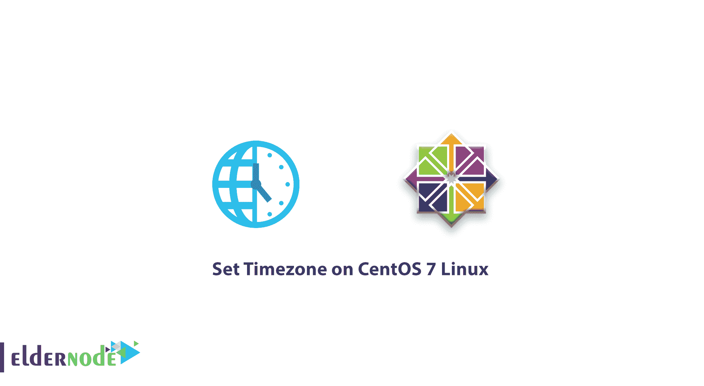

# 在 CentOS 7 Linux 上设置时区-在 CentOS 7 上更改日期和时间

> 原文：<https://blog.eldernode.com/set-timezone-centos-7/>



在下面的 CentOS 7 Linux 教程中，我们将学习如何在 CentOS 7 Linux 上设置时区。如你所知，在服务器上设置**操作系统**的时间和日期是非常重要的，也是在互联网和服务世界中操作的一个要求。在本教程中，您将熟悉 timedatectl 和 **Date** 命令，并了解其工作原理。

## 在 CentOS 7 Linux 上设置时区

**1-** 要查看时间位置以及您的服务器时间信息，您可以输入以下命令。

```
timedatectl
```

输入上述命令后，输出将显示如下。

如果 CentOS 7 的时间和日期需要更改，敬请关注。

**2-** 您可以执行以下操作来设置系统时钟。

```
timedatectl set-time 18:23:45
```

通过输入上述命令，您的系统时间将变为 22:23:45。

**3-** 要同时设置操作系统的时间和日期，您可以按如下步骤操作。

```
timedatectl set-time "2017-04-15 22:37:22"
```

到目前为止，你已经学会了如何设置 **CentOS 7 Linux 的时间和日期，**下面是如何设置**时区**。

**[购买 Linux VPS](https://eldernode.com/linux-vps/)**

### 如何在 CentOS 7 Linux 上更改日期和时间

**1-** 要设置时区，您必须按照以下步骤进行。

```
timedatectl set-timezone America/NewYork
```

通过输入上面的命令，服务器到纽约的时区将会改变。

**2-** 如果您正在考虑另一个时区，您可以通过以下命令找到时区列表。

```
timedatectl list-timezones
```

**3-** 或者您可以使用以下模式在时区中搜索。

```
timedatectl list-timezones | grep -i york
```

输入上述命令后，当使用单词**约克**时，显示该区域。

**4-** 最后，您可以使用下面的命令获得一个大洲的时区的完整列表。

```
timedatectl list-timezones | grep America
```

**5-** 你也可以将你的 CentOS 7 Linux 时钟和日期设置到 **[NTP](http://www.ntp.org/) 服务器**。

```
timedatectl set-ntp yes
```

**请注意**:可以用 **no** 代替 **yes** 代替 **NTP** 服务器来禁用设置。

到目前为止，您已经学会了如何使用 **timedatectl** 命令，但是您也可以在 Linux 上使用 date 命令来设置时间和**日期**。

### 通过日期命令设置时间和日期

**1-** 使用以下结构，通过**日期**命令设置**分 7** 的时间。

结构

```
date --set HH:MM:SS
```

例子

```
date --set 18:26:10
```

**2-** 使用以下模式通过**日期**命令设置 **CentOS 7** 的日期。

结构

```
date --set YYYY-MM-DD
```

例子

```
date --set 2020-02-29 
```

**3-** 最后，如果需要同时设置时间和日期，输入以下命令。

```
date --set 2020-2-28 18:26:12
```

下面是如何**设置 CentOS 7 Linux** 到 **date** 和 **timedatectl** 命令的时间和日期。

如果使用的是 **CentOS 6 Linux** ，可以参考 Linux CentOS 6T5**的[时间日期设置。](https://eldernode.com/set-timezone-centos-6/)**

亲爱的用户，我们希望这篇教程能对你有所帮助，如果你有任何问题或想查看我们的用户关于这篇文章的对话，请访问[提问页面](https://eldernode.com/ask)。也为了提高你的知识，这里有很多关于[老年节点训练](https://eldernode.com/blog/)的有用教程。