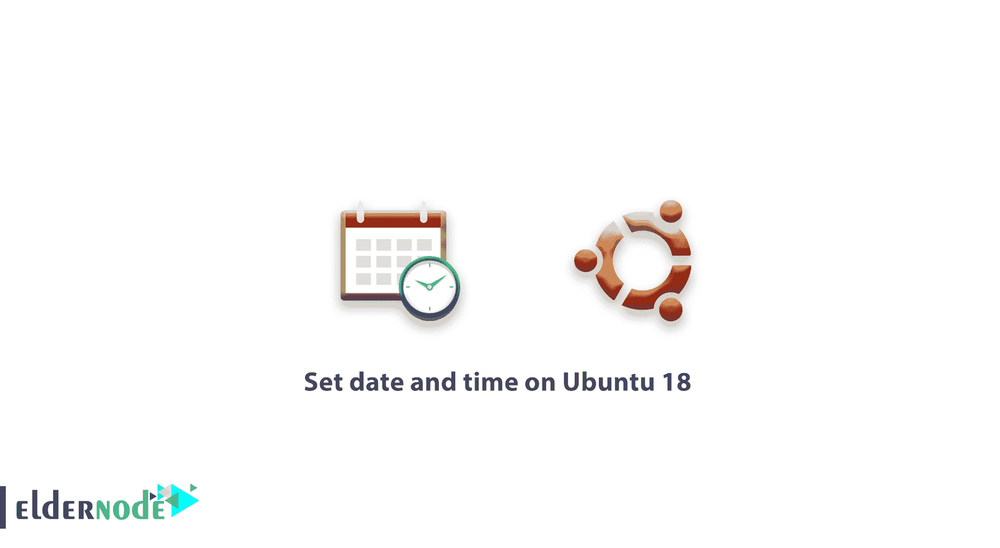

# 在 Ubuntu 18 - timedatectl 命令上设置日期和时间

> 原文：<https://blog.eldernode.com/set-timezone-ubuntu-18/>



在接下来的 Ubuntu 文章中，我们将学习如何在 Ubuntu 18 上设置日期和时间。以便您的服务器自动调整其时间和日期。一个操作系统使用 [NIST](https://www.nist.gov/) 来检测和同步时间，该系统运行一个在 3 亿年内从不快或慢一秒的原子钟。本指南可以帮助你如何在 Ubuntu 中更改时间、日期、支票和时区。

## 在 Ubuntu 18 上设置日期和时间

### 在 Ubuntu 18 中显示日期和时间

**1-** 在 [**Ubuntu 18**](https://eldernode.com/initial-setup-ubuntu-18/) 中查看系统时钟和日期最简单的方法就是使用 date 命令。

```
date
```

**2-** 输入上面的命令后，会收到和下面短语一样的**输出**。

```
Output    Tue Jul 10 14:48:52 UTC 2018 
```

**注意** :在上面的短语中，如果你注意到了， **UTC** 这个词表示你的时区设置为 **0** 。现在有了 **UTC** 设置，服务器将能够完全将时间和日期设置为**同步。**

[**购买 Ubuntu VPS**](https://eldernode.com/ubuntu-vps/)

### 通过 timedatectl 命令 在 Ubuntu 18 上设置日期和时间

**1-** 您可以使用 **timedatectl** 命令来设置**时区**。

**2-** 该命令将能够为您列出不同的时区，并为您设置每个时区。

现在输入以下命令来查看时区列表。

```
timedatectl list-timezones 
```

**点**:输入上述命令后，会看到一个时区列表，点击键盘上的 **空格** 键，可以看到下一页列表的其余部分，或者使用 **b** 键返回上一页。选择时区后，按键退出列表。

**3-**To设置一个区域当您从列表中选择了一个区域后，输入以下命令及其名称来设置您的服务器的**时区**。

```
timedatectl set-timezone America/New_York 
```

**注意** :时区名称必须与时区列表中显示的短语完全一致。

**4-** 设置完毕后，再次输入**日期命令**确认更改无误。

```
date
```

**5-** 如果您的**时区**发生了变化，date 命令的输出将类似于以下语句。

```
Output    Tue Jul 10 10:50:53 EDT 2018
```

### 在 Ubuntu 18 中同步日期和时间

到目前为止，您已经看到了服务器的时间和日期，以及它的**时区**设置。

**1-** 现在输入以下命令，确保系统日期和时间与硬件时钟同步。

```
timedatectl
```

**2-** 上述命令的**输出**应该类似于下面的语句。

```
Output 
```

```
                Local time: Tue 2018-07-10 10:54:12 EDT                    Universal time: Tue 2018-07-10 14:54:12 UTC                          RTC time: Tue 2018-07-10 14:54:12                         Time zone: America/New_York (EDT, -0400)         System clock synchronized: yes  systemd-timesyncd.service active: yes                   RTC in local TZ: no
```

`**3-** 如果在短语**系统时钟同步**或**systemd-time syncd . service**前面有“ **No** ，则必须输入以下命令进行同步。`

```
`timedatectl set-ntp on`
```

`通过这种方式，您将能够在服务器时区的帮助下**设置系统的时间和日期**。`

`亲爱的用户，我们希望您喜欢本教程，您可以在评论区提出关于本次培训的问题，或者解决[老年节点培训](https://eldernode.com/blog/)领域的其他问题，请参考[提问页面](https://eldernode.com/ask)部分并在其中提出您的问题。`

#### `**不要错过**`

`[在 Ubuntu 18.04 上安装灯栈【快速启动】](https://eldernode.com/install-lamp-stack-on-ubuntu-18-04-quick-start/)`

`[在 ubuntu 18 上安装 gulpjs](https://eldernode.com/install-gulpjs-on-ubuntu-18/)`

`[在 CentOS 7 Linux 上设置时区](https://eldernode.com/set-timezone-centos-7/)`