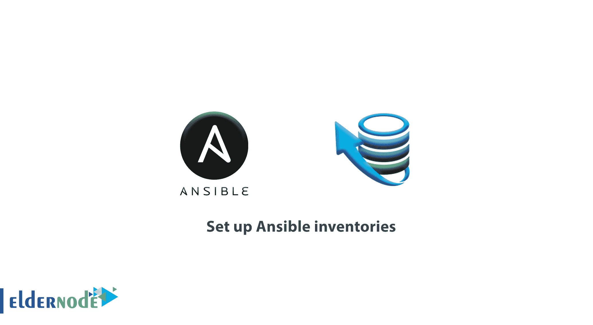

# 教程设置 Ansible 清单-如何设置主机别名 ansible

> 原文：<https://blog.eldernode.com/set-up-ansible-inventories/>



之前，我们解释了对于 [Ansible](https://eldernode.com/install-ansible-on-ubuntu-20/) 的安装。在本文中，你将回顾**教程设置可变库存**。首先，什么是基本可行的？Ansible 是一个现代化的配置管理工具，它简化了设置和维护远程服务器的任务，其极简设计旨在让用户快速启动和运行。其次，它是如何工作的？ **Ansible** 使用**库存文件**来跟踪哪些主机是您的基础架构的一部分，以及如何找到它们来运行命令和行动手册。

**先决条件**

如果您知道以下内容，本教程可能会更有用:

*   两台或多台主机:两台或多台远程 Ubuntu 20.04 服务器。

## 教程设置易变库存

如果您进行搜索，您可能会发现有多种方法可以根据您的环境和项目需求来设置您的 Ansible 清单文件。但是在本指南中，我们将演示如何创建清单文件并将服务器组织到组和子组中，如何设置主机变量，以及如何使用模式来控制每个主机和每个组的可执行命令和行动手册的执行。

### 创建自定义库存文件

安装完成后，您可以看到 Ansible 创建了一个清单文件，该文件通常位于**/etc/ansi ble/hosts**。这是在剧本或命令执行过程中，当自定义库存文件没有提供 **-i** 选项时，Ansible 使用的默认位置。使用它不会有问题，使用每个项目的库存文件是一个很好的实践，可以避免在执行命令和剧本时混淆服务器。此外，拥有每个项目的清单文件还将有助于与合作者共享您的配置设置，假设您将清单文件包含在项目的代码存储库中。

要启动和保存您的 Ansible 文件，请访问您的个人文件夹，并创建一个新目录。

```
cd ~  mkdir ansible
```

然后，移动到该目录，使用 nano 或您选择的文本编辑器打开一个新的清单文件。

```
cd ansible  nano inventory
```

您的节点列表(每行一个服务器)足以设置一个功能清单文件。

点:主机名和 IP 地址是可以互换的。

~/可售/库存

```
203.0.113.111  203.0.113.112  203.0.113.113  server_hostname
```

当您建立了一个库存文件时，您可以使用**ansible-inventory**a 命令来验证并获取有关您的 ansi ble 库存的信息。

```
ansible-inventory -i inventory --list
```

输出

```
{      "_meta": {          "hostvars": {}      },      "all": {          "children": [              "ungrouped"          ]      },      "ungrouped": {          "hosts": [              "203.0.113.111",              "203.0.113.112",              "203.0.113.113",              "server_hostname"          ]      }  }
```

尽管您还没有在我们的库存中设置任何组，但是输出显示了 Ansible 自动推断的两个不同的组: all 和 ungrouped 。

顾名思义， all 用于指代清单文件中的所有服务器，无论它们是如何组织的。未分组的组用于指代未在组中列出的服务器。

[**购买 VPS 服务器**](https://eldernode.com/vps/)

#### 运行命令和带有自定义清单的剧本

使用自定义清单文件运行 Ansible 命令，如下所示。

```
ansible all -i inventory -m ping
```

因此，它将在您的自定义清单文件中列出的所有主机的**上执行 ping 模块。**

现在，使用自定义库存文件执行 Ansible 行动手册:

```
ansible-playbook -i inventory playbook.yml 
```

### ``将服务器组织成组和子组``

``此时，您可以将服务器组织到清单文件中的不同组和子组中。它让您保持主机有序，这种做法将使您能够使用**组变量**，这一特性可以极大地方便使用 Ansible 管理多个登台环境。``

``一个主机可以属于多个组。以下 INI 格式的清单文件演示了一个包含四个组的设置: webservers 、 dbservers、开发和生产。``

``**记住**服务器是根据两种不同的品质来分组的:它们的用途，以及它们是如何被使用的。``

``~/可售/库存``

```
``[webservers]  203.0.113.111  203.0.113.112    [dbservers]  203.0.113.113  server_hostname    [development]  203.0.113.111  203.0.113.113    [production]  203.0.113.112  server_hostname``
```

``此外，如果您对该库存文件再次运行 ansible-inventory 命令，将会显示以下输出。``

``输出``

```
``{      "_meta": {          "hostvars": {}      },      "all": {          "children": [              "dbservers",              "development",              "production",              "ungrouped",              "webservers"          ]      },      "dbservers": {          "hosts": [              "203.0.113.113",              "server_hostname"          ]      },      "development": {          "hosts": [              "203.0.113.111",              "203.0.113.113"          ]      },      "production": {          "hosts": [              "203.0.113.112",              "server_hostname"          ]      },      "webservers": {          "hosts": [              "203.0.113.111",              "203.0.113.112"          ]      }  }``
```

``尽管如此，您可以将多个组聚合为“父”组下的子组。然后,“父代”被称为元组。以下示例演示了使用元组组织以前库存的另一种方法，以实现可比较的、更细粒度的安排:``

``~/可售/库存``

```
``[web_dev]  203.0.113.111    [web_prod]  203.0.113.112    [db_dev]  203.0.113.113    [db_prod]  server_hostname    [webservers:children]  web_dev  web_prod    [dbservers:children]  db_dev  db_prod    [development:children]  web_dev  db_dev    [production:children]  web_prod  db_prod``
```

``要点:您拥有的服务器越多，将服务器分组或创建替代安排就越有意义，这样您就可以根据需要将服务器分组。``

### ``设置主机别名``

``正如您所猜测的，我们将在这一步解释如何使用别名。您可以使用它来命名服务器，以便在以后运行命令和行动手册时引用这些服务器。``

``要使用别名，请在别名后包含一个名为 ansible_host 的变量，该变量包含应该响应该别名的服务器的相应 IP 地址或主机名:``

``~/可售/库存``

```
``server1 ansible_host=203.0.113.111  server2 ansible_host=203.0.113.112  server3 ansible_host=203.0.113.113  server4 ansible_host=server_hostname``
```

``如果您对这个库存文件运行 ansible-inventory 命令，将会显示以下输出。``

``输出``

```
``{      "_meta": {          "hostvars": {              "server1": {                  "ansible_host": "203.0.113.111"              },              "server2": {                  "ansible_host": "203.0.113.112"              },              "server3": {                  "ansible_host": "203.0.113.113"              },              "server4": {                  "ansible_host": "server_hostname"              }          }      },      "all": {          "children": [              "ungrouped"          ]      },      "ungrouped": {          "hosts": [              "server1",              "server2",              "server3",              "server4"          ]      }  }``
```

``**还记得**现在服务器是如何被它们的别名引用的，而不是它们的 **IP 地址**或主机名。这使得在运行命令和行动手册时更容易定位单个服务器。``

### ``设置主机变量``

``此外，您将能够使用库存文件来设置变量，这些变量将在您的节点上连接和执行命令时改变 Ansible 的默认行为。正如您在上一步中所做的那样。如果使用别名来引用该服务器， ansible_host 变量告诉 ansible 在哪里可以找到远程节点。``

``您可以按主机或组设置清单变量。除了定制 Ansible 的默认设置之外，还可以从您的行动手册中访问这些变量，这使得可以针对各个主机和组进行进一步的定制。``

``请看下面的示例，它定义了连接到该清单文件中列出的每个节点时的默认远程用户。``

``~/可售/库存``

```
``server1 ansible_host=203.0.113.111 ansible_user=noodi  server2 ansible_host=203.0.113.112 ansible_user=noodi  server3 ansible_host=203.0.113.113 ansible_user=myuser  server4 ansible_host=server_hostname ansible_user=myuser``
```

``然后，您可以创建一个组来聚合具有相似设置的主机，然后在组级别设置它们的变量:``

``点:在 ansible-inventory 产生的 JSON 输出中的 _meta 节点中列出了所有的库存变量。``

### ``使用模式来执行命令和剧本``

``使用 Ansible 执行命令和剧本时，必须提供一个目标。和模式允许您将清单文件中的特定主机、组或子组作为目标。它们非常灵活，支持正则表达式和通配符。``

``考虑以下清单文件:``

``接下来，要执行一个仅针对生产环境中运行的数据库服务器的命令，请遵循以下示例。``

``认为只有服务器主机名符合该标准；但是，也有可能您在该组中有一个大型数据库服务器组。您可以使用以下模式，而不是分别针对每台服务器:``

```
``ansible dbservers:&production -m ping`` 
```

``这种模式只针对同时存在于数据库服务器和生产组中的服务器。``

``点:如果您想做相反的事情，只针对出现在数据库服务器中的服务器，而不是出现在生产组中的**服务器，您可以使用下面的模式:**``

```
``ansible dbservers:!production -m ping`` 
```

``要了解更多关于在 Ansible 中运行命令和剧本时可以使用的一些不同的常见模式的例子，请注意下面的列表。``

``**图案结果目标**``

``all 清单文件中的所有主机``

``主机 1 单个主机(主机 1``

``主机 1:主机 2主机 1 和主机 2``

``group1 单个组( group1``

``group 1:group 2group 1和 group2 中的所有服务器``

``group1: & group2 仅限于 group1 和 group2 中**均为**的服务器``

``第一组:！第二组服务器在第一组T4 除了也在第二组``

``如果你需要更高级的模式选项，比如使用位置模式和正则表达式来定义目标，请参考 [关于模式](https://docs.ansible.com/ansible/latest/user_guide/intro_patterns.html#advanced-pattern-options) 的官方 Ansible 文档。``

``**好样的** ！你成功地调查了可能的存货。并了解如何将节点组织成组和子组，如何设置库存变量。另外，在运行命令和行动手册时，如何使用模式来定位不同的服务器组。``

``亲爱的用户，我们希望你能喜欢**教程的这篇文章建立一个可行的库存**，你可以在评论区提出关于这次培训的问题，或者解决 [长老节点](https://eldernode.com/) 培训领域的其他问题，请参考[提问页面](https://eldernode.com/ask)部分并在其中提出你的问题。``