# 在 Windows Server 2016 - ElderNode 博客中设置 DFS 命名空间的教程

> 原文：<https://blog.eldernode.com/set-up-dfs-namespaces-in-windows-server/>

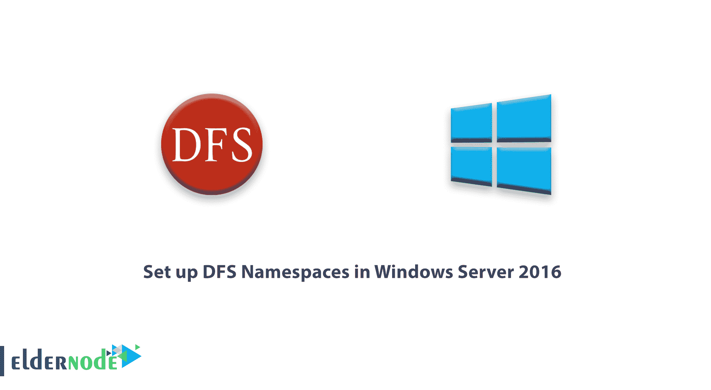

在 [Windows Server 2016](http://eldernode.com/tag/windows-server-2016/) 中设置 DFS 命名空间的教程。命名空间是 [DFS 服务](https://en.wikipedia.org/wiki/Distributed_File_System_(Microsoft))的中央命名空间，用户可以在其中查看所有无缝创建命名空间的共享文件夹。 **DFS** ( 分布式文件系统)允许您将不同服务器上托管的共享文件夹设置到一个或多个逻辑结构化的名称空间中。

每个命名空间对用户来说都是一个包含一系列子文件夹的共享文件夹。这种设置提高了可用性，并自动将用户连接到同一个[活动目录](https://eldernode.com/install-active-directory-on-windows-server/)域服务站点中的共享文件夹。

在本文中，我们将在 Windows Server 2016 中设置和配置 DFS 命名空间。

[***购买 Windows 虚拟专用服务器***](https://eldernode.com/windows-vps/)

如何安装 DFS 角色

### **登录**到你的 Windows 2016 服务器，打开服务器管理器控制台。

点击添加角色和功能:

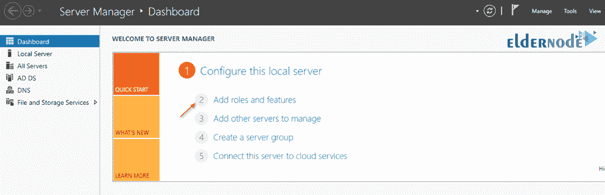

将出现添加角色和功能向导:

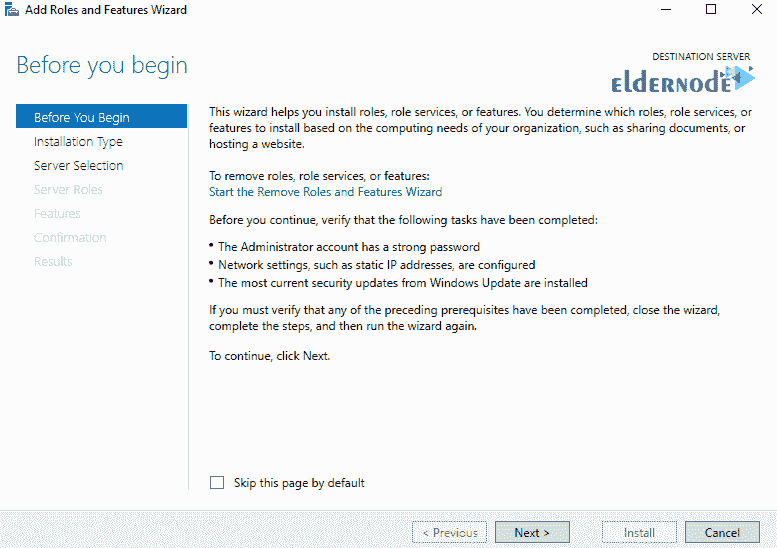

点击下一个的。

在下一个屏幕上选择基于角色或基于功能的安装:

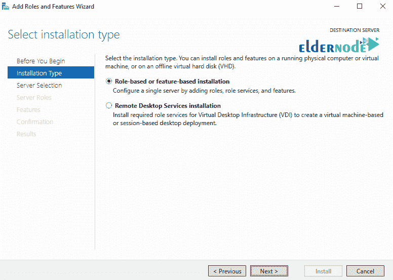

点击下一个的。

在下一个屏幕中选择您的**服务器**，并再次点击下一个:

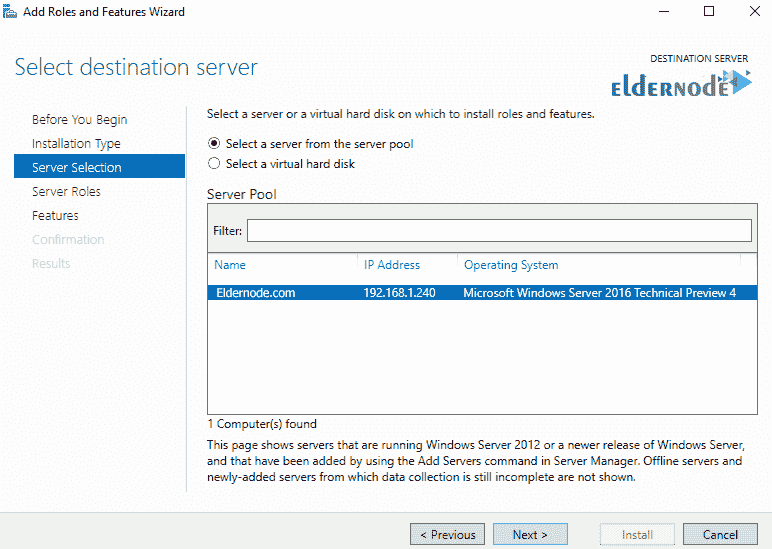

展开**文件和存储** **服务**并从列表中选择 DFS 名称空间:

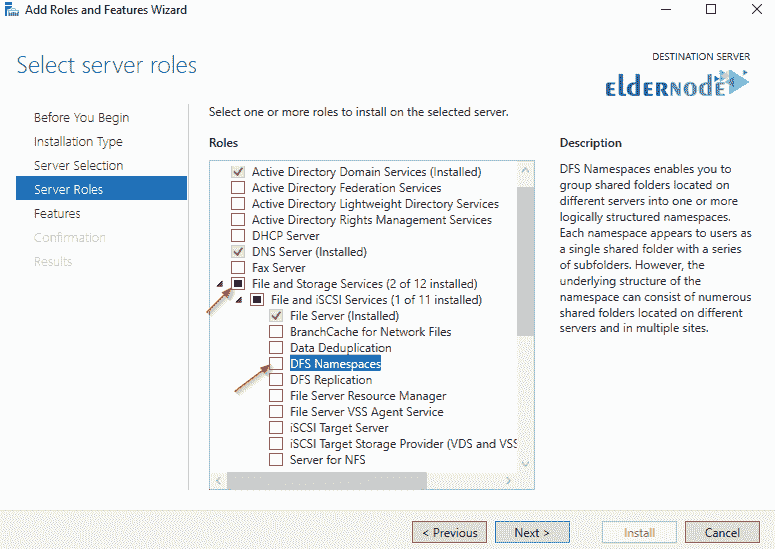

当提示安装**管理工具**时，点击添加功能:

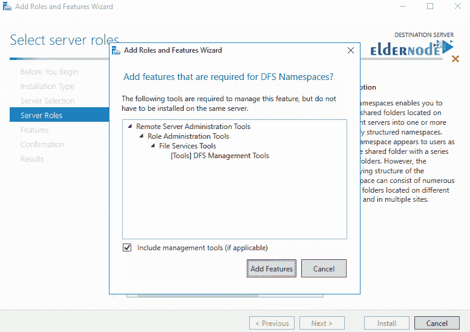

点击其余屏幕上的下一个。

然后点击安装:

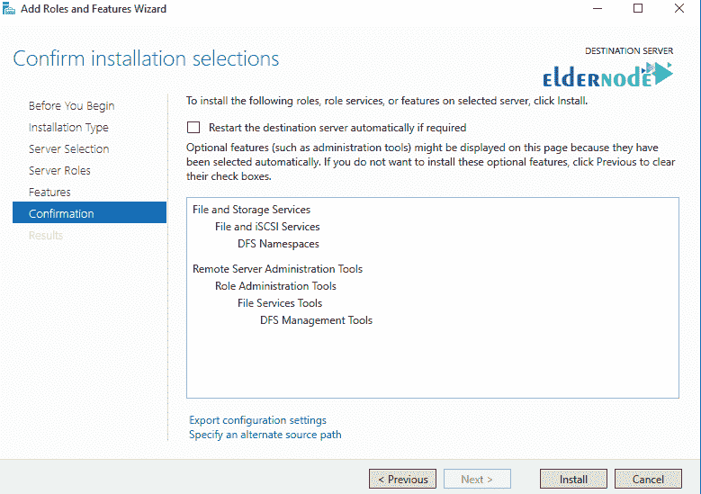

如何配置 DFS

安装完 **DFS 角色**后，打开 **DFS 管理控制台**，右键命名空间，选择新建命名空间..

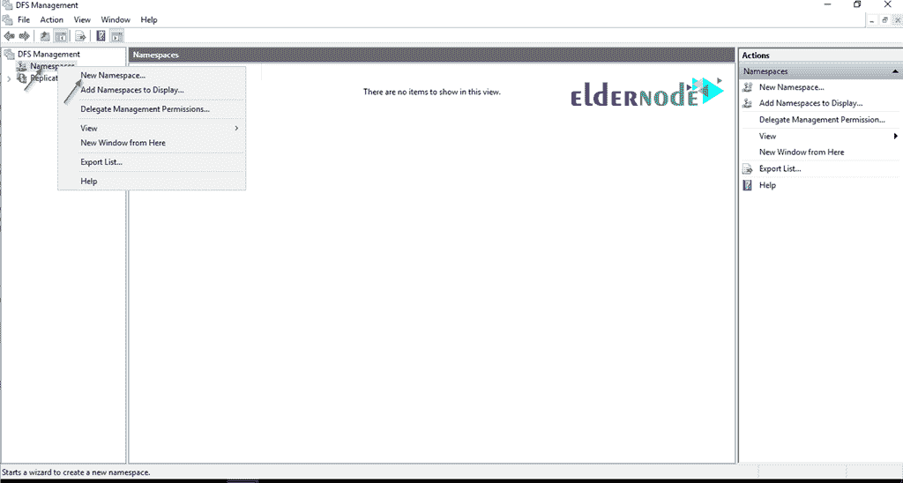

**在下一个屏幕上键入将托管名称空间的服务器的名称:**

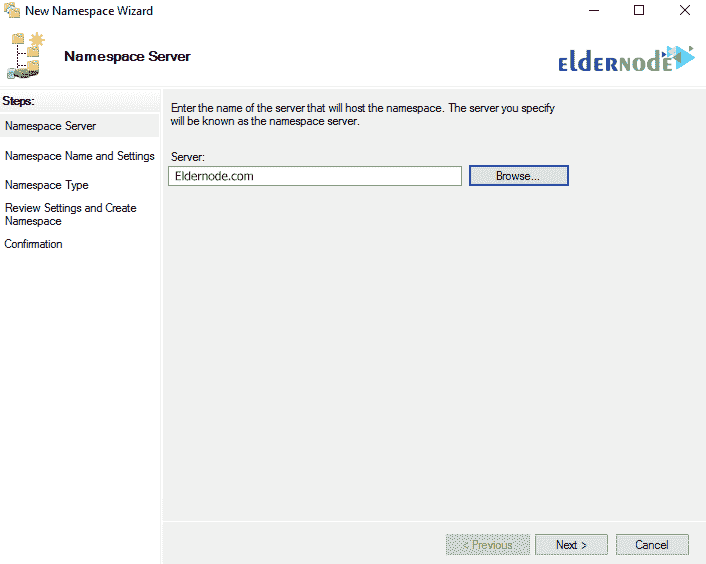

点击下一个的。

在下面的屏幕中为您的名称空间选择一个**名称**。

这将是您的**域共享路径**的名称。例如 Eldernode.com\files

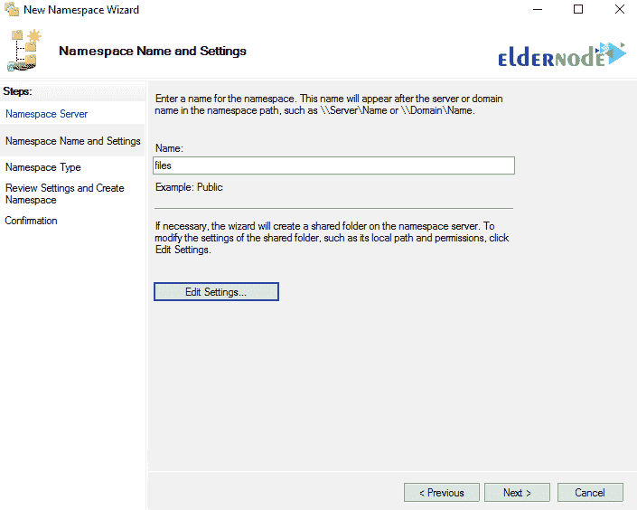

点击**编辑设置..共享上的**编辑权限。

默认情况下，每个人都只有读权限。点击下一个。

在接下来的屏幕上，选择**名称空间类型**:

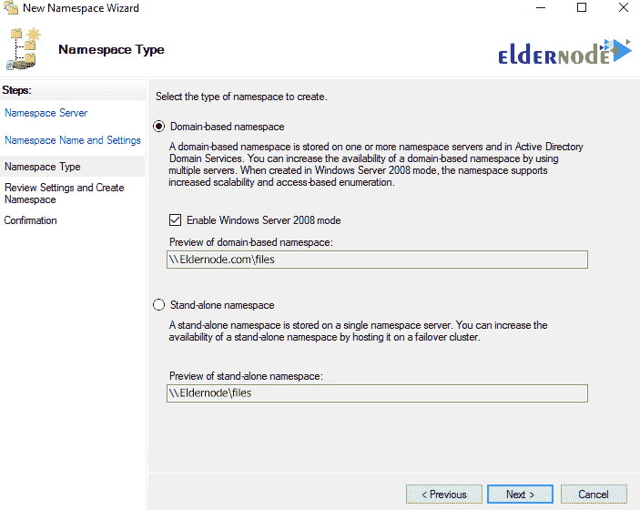

选择基于域的名称空间，点击下一步。

查看**设置**，然后点击创建:

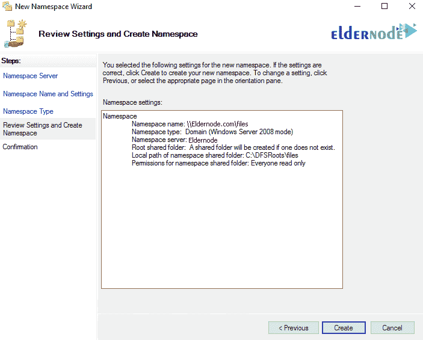

通过在资源管理器 ( **例如** Eldernode.com\files )中键入**网络路径**来测试您的 DFS 名称空间是否正在工作。

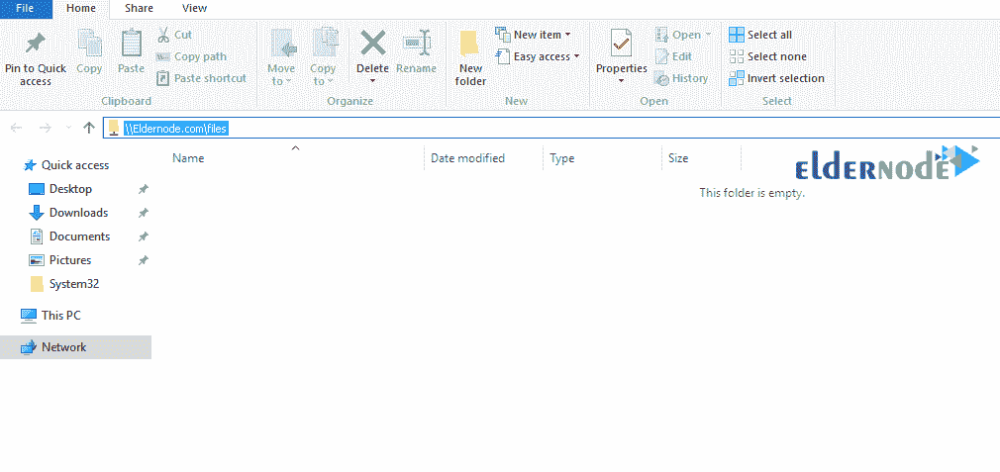

如何创建 DFS 文件夹

您现在需要**将文件夹**添加到 DFS 名称空间中。

从你的 DFS 管理控制台，**右键点击**你刚刚创建的命名空间，选择新建文件夹:

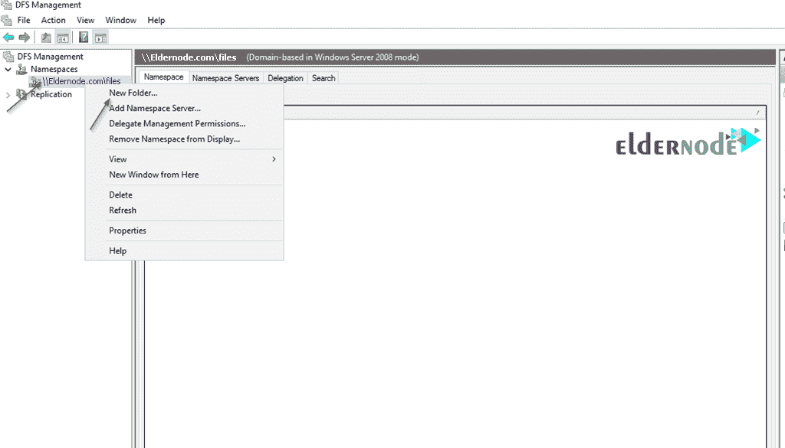

### 在**文件夹**中输入**名称**，然后点击添加:

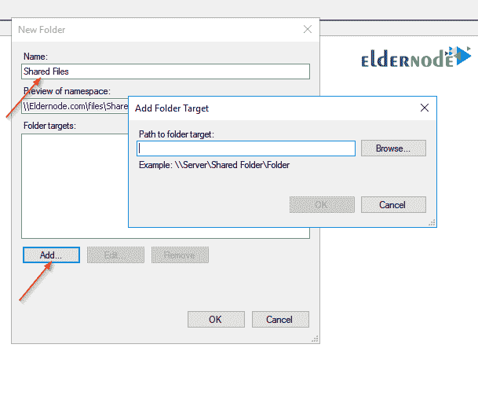

键入要添加到名称空间的共享文件夹的路径:

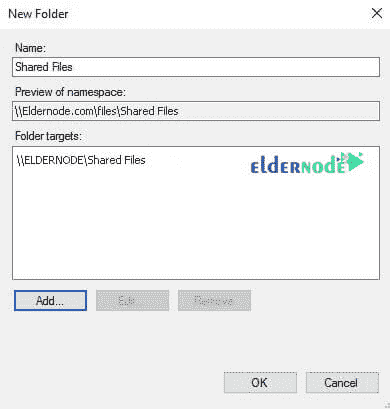

**最后**，点击确定。

再次转到网络路径(例如 Eldernode.com.comfiles )，您应该会看到刚刚添加的文件夹:

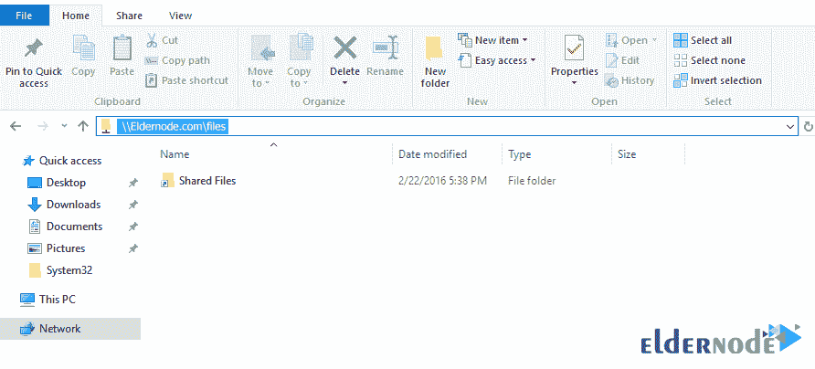

**亦作，见:**

[如何在 Windows Server 2019 上安装和配置 DNS 服务器](https://eldernode.com/install-and-configure-dns-server-on-windows/)

**尊敬的用户**，我们希望您能喜欢这个[教程](https://eldernode.com/category/tutorial/)，您可以在评论区提出关于本次培训的问题，或者解决[老年人节点培训](https://eldernode.com/blog/)领域的其他问题，请参考[提问页面](https://eldernode.com/ask)部分，并尽快提出您的问题。腾出时间给其他用户和专家来回答你的问题。

*Windows Server 2016 中设置 DFS 命名空间的教程。*

好运。

**Also, see:**

[How to Install and Configure DNS Server on Windows Server 2019](https://eldernode.com/install-and-configure-dns-server-on-windows/)

**Dear user**, we hope you would enjoy this [tutorial](https://eldernode.com/category/tutorial/), you can ask questions about this training in the comments section, or to solve other problems in the field of [Eldernode training](https://eldernode.com/blog/), refer to the [Ask page](https://eldernode.com/ask) section and raise your problem in it as soon as possible. Make time for other users and experts to answer your questions.

*Tutorial to set up DFS Namespaces in Windows Server 2016.*

Goodluck.