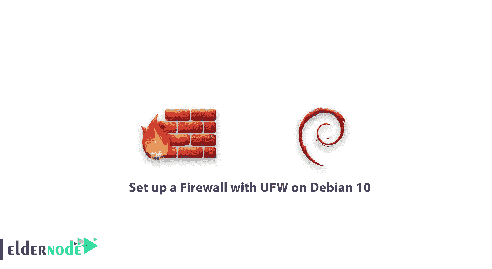

# 如何在 Debian 10 上用 UFW 设置防火墙——启用 UFW

> 原文：<https://blog.eldernode.com/set-up-firewall-ufw-debian-10/>



你已经阅读了我们最新的 [防火墙](https://eldernode.com/tag/firewalld-tutorial/) 教程。在这篇文章中，你将学习**如何在 Debian 10** 上用 UFW 设置防火墙。简单防火墙 **(UFW)** 是 **iptables** 的接口，旨在简化配置防火墙的过程。虽然 **iptables** 是一个可靠而灵活的工具，但对于初学者来说，学习如何使用它来正确配置防火墙可能会很困难。如果你想开始保护你的网络，但又不确定使用哪种工具，UFW 可能是你的正确选择。

**先决条件**

如果您知道以下内容，本教程可能会更有用:

拥有 sudo 权限的非根用户

按照 Debian 10 上的 [初始服务器设置进行设置](https://eldernode.com/initial-setup-with-debian-10/)

## 如何在 Debian 10 上用 UFW 设置防火墙

请继续关注我们，本教程将向您展示如何在 Debian 10 上用 UFW 设置防火墙。回顾以下步骤，获得这方面的专家帮助。

### 1-安装 UFW

由于默认情况下 [Debian](https://www.debian.org/) 不会安装 UFW，你将已经安装并启用了 UFW，正如你按照整个[初始服务器设置教程](https://eldernode.com/initial-setup-with-debian-10/)所做的那样，你将已经安装并启用了 UFW。如果没有，现在使用 apt 安装:

```
sudo apt install ufw
```

### 【与 UFW 一起使用 IPv6(可选)

本教程是在考虑 IPv4 的情况下编写的，但只要您启用了 IPv6，它也适用于 IPv6。如果你的 Debian 服务器支持 IPv6，你需要确保 UFW 支持 IPv6；这将确保 UFW 除了管理 IPv4 之外，还管理 IPv6 的防火墙规则。要对此进行配置，请使用 nano 或您喜欢的编辑器打开 UFW 配置文件 /etc/default/ufw

```
sudo nano /etc/default/ufw
```

确保 IPV6 的值为是。它应该是这样的:

/etc/default/ufw 摘录

```
IPV6=yes 
```

您现在可以保存并关闭文件。启用 UFW 后，它将被配置为写入 IPv4 和 IPv6 防火墙规则。但是，在启用 UFW 之前，您需要确保您的防火墙配置为允许您通过 SSH 连接。让我们从设置默认策略开始。

### 3-设置默认策略

如果您刚刚开始使用防火墙，首先要定义的规则是您的默认策略。这些规则处理不与任何其他规则明确匹配的流量。默认情况下，UFW 被设置为拒绝所有传入连接并允许所有传出连接。这意味着任何试图访问您的服务器的人都无法连接，而服务器内的任何应用程序都可以访问外部世界。

要将您的 UFW 规则设置回默认值，您可以确信您将能够遵循本教程。要设置 UFW 使用的默认值，请使用以下命令:

```
`sudo ufw default deny incoming  sudo ufw default allow outgoing`
```

`[用 比特币](https://eldernode.com/bitcoin-vps/) 购买虚拟机`

### `4-允许 SSH 连接`

`通过启用您的 UFW 防火墙，它将拒绝所有传入的连接。您将需要创建明确允许合法传入连接的规则，例如 SSH 或 HTTP 连接，如果我们希望我们的服务器响应这些类型的请求的话。如果您使用的是云服务器，您可能希望允许传入的 SSH 连接，这样您就可以连接并管理您的服务器。`

`要配置服务器以允许传入的 SSH 连接:`

```
`sudo ufw allow ssh`
```

`这将创建防火墙规则，允许端口 22 上的所有连接，这是 SSH 守护程序默认监听的端口。UFW 知道端口允许 ssh 意味着什么，因为它在 /etc/services 文件中被列为服务。`

`总之，您实际上可以通过指定端口而不是服务名来编写等效的规则。例如，此命令会产生与上面命令相同的结果:`

```
`sudo ufw allow 22`
```

`您必须指定适当的端口，如果您将 SSH 守护进程配置为使用不同的端口，您必须指定适当的端口。例如，如果您的 SSH 服务器正在侦听端口 2222，您可以使用以下命令来允许该端口上的连接:`

```
`sudo ufw allow 2222` 
```

### `5-启用 UFW`

`因为您配置了防火墙 来允许传入的 SSH 连接，所以您可以启用它。`

```
`sudo ufw enable`
```

`通过运行上面的命令，您会收到一条警告，指出该命令可能会中断现有的 SSH 连接。我们已经设置了允许 SSH 连接的防火墙规则，所以应该可以继续了。用 y 响应提示，点击回车。然后，您会发现防火墙处于活动状态。但是要查看您设置的规则，运行 sudo ufw status verbose 命令。`

### ``6-允许其他连接``

``从现在开始，允许服务器正常工作所需的所有其他连接。您应该允许的连接取决于您的特定需求。幸运的是，您已经知道如何编写允许基于服务名或端口的连接的规则；我们已经在端口 22 上为 SSH 做了这件事。您也可以这样做:``

*   ``端口 80 上的 HTTP，这是未加密的 web 服务器使用的端口。要允许这种类型的流量，您可以键入 sudo ufw allow http 或 sudo ufw allow 80 。``
*   ``端口 443 上的 HTTPS，这是加密的 web 服务器所使用的。要允许这种类型的流量，您可以键入 sudo ufw allow https 或 sudo ufw allow 443 。``

``但是，让我们验证除了指定端口或已知服务之外，允许连接的其他方法。``

#### ``具体端口范围``

``您将学习如何使用 UFW 指定端口范围。例如，一些应用程序使用多个端口而不是单个端口。``

``要允许使用端口 6000-6007 的 X11 连接，请使用以下命令:``

```
``sudo ufw allow 6000:6007/tcp  sudo ufw allow 6000:6007/udp``
```

#### ``具体 IP 地址``

``使用 UFW 时，您还可以指定 IP 地址。例如，如果您希望允许来自特定 IP 地址的连接，例如来自203.0.113.4的工作或家庭 IP 地址，您需要指定来自的，然后指定 IP 地址:``

```
``sudo ufw allow from 203.0.113.4``
```

```您还可以通过在任何端口后添加端口号来指定允许 IP 地址连接的特定端口。例如，如果你想让 203.0.113.4的连接到端口 22 (SSH)，使用这个命令:```

```
```sudo ufw allow from 203.0.113.4 to any port 22```
```

#### ``子网``

``如果您想要允许 IP 地址的子网，您可以使用 CIDR 符号来指定网络掩码。例如，如果您想要允许从203.0.113.1到203.0.113.254的所有 IP 地址，您可以使用以下命令:``

```
``sudo ufw allow from 203.0.113.0/24``
```

``同样，您也可以指定子网 203.0.113.0 / 24 允许连接的目的端口。同样，我们将使用端口 22 (SSH)作为例子。``

### ``连接到特定的网络接口``

``如果您想要创建仅适用于特定网络接口的防火墙规则，请在上指定 allow in，后跟网络接口的名称``

``要在继续之前查找您的网络接口:``

```
``ip addr``
```

``输出``

```
``2: eth0: <BROADCAST,MULTICAST,UP,LOWER_UP> mtu 1500 qdisc pfifo_fast state  . . .  3: eth1: <BROADCAST,MULTICAST> mtu 1500 qdisc noop state DOWN group default  . . .``
```

``突出显示的输出指示网络接口名称。他们通常会将一些东西命名为 eth 0 T1 或 T2 enp3s 2 T3。``

``例如，如果您的服务器有一个名为 eth0 的公共网络接口，您可以使用以下命令允许 HTTP 流量通过它:``

```
``sudo ufw allow in on eth0 to any port 80``
```

``因此它将允许您的服务器接收来自公共互联网的 HTTP 请求。``

``或者，如果您希望 MySQL 数据库服务器(端口 3306 )监听专用网络接口 eth1 上的连接，您可以使用以下命令:``

```
``sudo ufw allow in on eth1 to any port 3306``
```

### ```7-拒绝连接```

```很明显，如果您没有更改传入连接的默认策略，UFW 被配置为拒绝所有传入连接。但是，这简化了创建安全防火墙策略的过程，因为它要求您创建明确允许特定端口和 IP 地址通过的规则。```

```但是，任何时候您希望拒绝基于源 IP 地址或子网的特定连接，可能是因为您知道您的服务器正受到来自那里的攻击。此外，如果您想将默认的传入策略更改为**允许**(不推荐)，您需要为您不想允许连接的任何服务或 IP 地址创建**拒绝**规则。```

```要编写**拒绝**规则，您可以使用上述命令，将**允许**替换为**拒绝**。```

```拒绝 HTTP 连接:```

```
```sudo ufw deny http```
```

``此外，如果您想要拒绝来自203.0.113.4的所有连接，您可以使用以下命令``

### ```8-删除规则```

```了解如何创建和删除防火墙非常重要。有两种方法可以指定要删除的规则:通过规则编号或规则本身。这类似于创建规则时如何指定规则。我们将从解释按规则号删除**的方法开始。```

#### ```按规则编号```

```如果您选择使用规则编号来删除防火墙规则，您应该会得到一个防火墙规则列表。UFW 状态命令有编号选项，在每个规则旁边显示数字:```

```
```sudo ufw status numbered```
```

``输出``

```
``Status: active         To                         Action      From       --                         ------      ----  [ 1] 22                         ALLOW IN    15.15.15.0/24  [ 2] 80                         ALLOW IN    Anywhere``
```

``通过决定删除规则 2 ，它允许端口 80 上的 HTTP 连接，我们可以在下面的 UFW delete 命令中指定这一点:``

``接下来，您会看到一个确认提示，您可以用 y/n 来回答。键入 y 将删除规则 2 。``

```
``sudo ufw delete 2``
```

``**注意**:如果您启用了 IPv6，您还需要删除相应的 IPv6 规则。``

``**Note**: If you have IPv6 enabled, you will want to delete the corresponding IPv6 rule as well.``

### ``按实际规律``

#### ``要使用替代的编号规则，请指定要删除的实际规则。例如，如果您想删除允许 http 规则，您可以这样写:``

``即使不是服务名，您也可以用 allow 80 来指定规则``

```
``sudo ufw delete allow http``
```

``**点**:此方法将删除 IPv4 和 IPv6 规则，如果它们存在的话。``

```
``sudo ufw delete allow 80``
```

``9-检查 UFW 状态和规则``

### ``要使用以下命令检查 UFW 的状态:``

``如果 UFW 被禁用，这是默认设置，您将看到如下内容:``

```
``sudo ufw status verbose``
```

``输出``

``如果 UFW 处于活动状态(如果您遵循步骤 3，它应该处于活动状态)，输出将显示它处于活动状态，并列出您设置的任何规则。例如，如果防火墙设置为允许来自任何地方的 SSH (port 22 )连接，则输出可能如下所示:``

```
``Status: inactive``
```

``输出``

``**点**:如果你想检查 UFW 是如何配置防火墙的，使用 status 命令。``

```
``Status: active    To                         Action      From  --                         ------      ----  22/tcp``
```

``10-禁用或复位 UFW(可选)``

### ``要使用以下命令禁用它:``

``您用 UFW 创建的任何规则都将不再有效。如果以后需要激活，您可以运行 sudo ufw enable 。``

```
``sudo ufw disable``
```

``但是，如果您已经配置了 UFW 规则，但是您决定重新开始，您可以使用 reset 命令:``

```
``sudo ufw reset``
```

``最后，这将禁用 UFW 并删除您之前定义的任何规则。请记住，如果您在任何时候修改了默认策略，它们不会更改为原始设置。这应该给你一个新的开始与 UFW。``

``**好样的** ！您的防火墙现在配置为允许 SSH 连接。确保允许服务器需要的任何其他传入连接，同时限制不必要的连接。这将确保您的服务器既正常又安全。``

``亲爱的用户，我们希望你会喜欢这篇关于如何在 Debian 10 上用 UFW 建立防火墙的教程，你可以在评论区提出关于这次培训的问题，或者要解决 [Eldernode](https://eldernode.com/) 培训领域的其他问题，请参考[提问页面](https://eldernode.com/ask)部分并在里面提出你的问题。``

``Dear user, we hope you would enjoy this tutorial How to set up a Firewall with UFW on Debian 10, you can ask questions about this training in the comments section, or to solve other problems in the field of [Eldernode](https://eldernode.com/) training, refer to the [Ask page](https://eldernode.com/ask) section and raise your problems in it.``