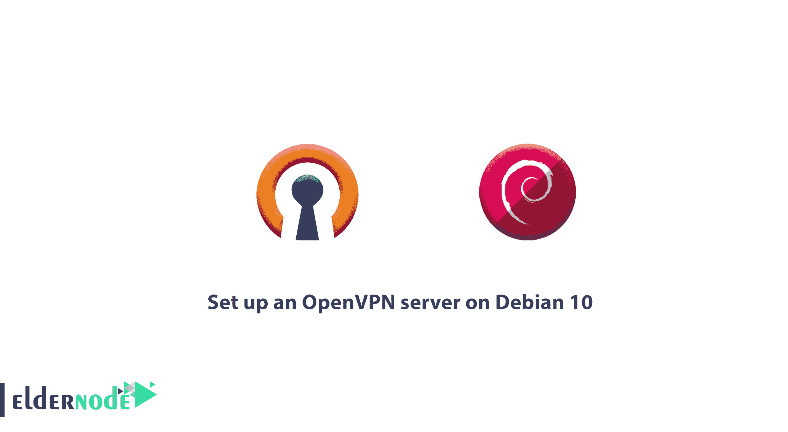
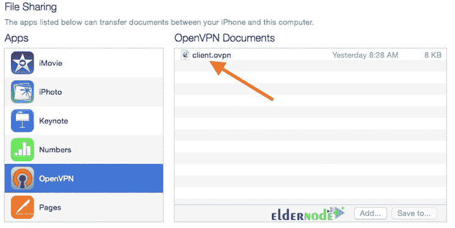
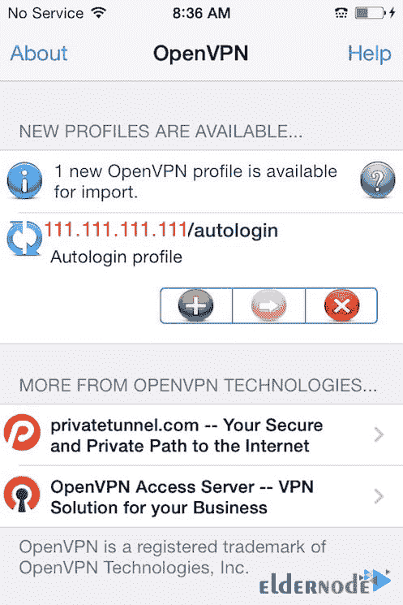
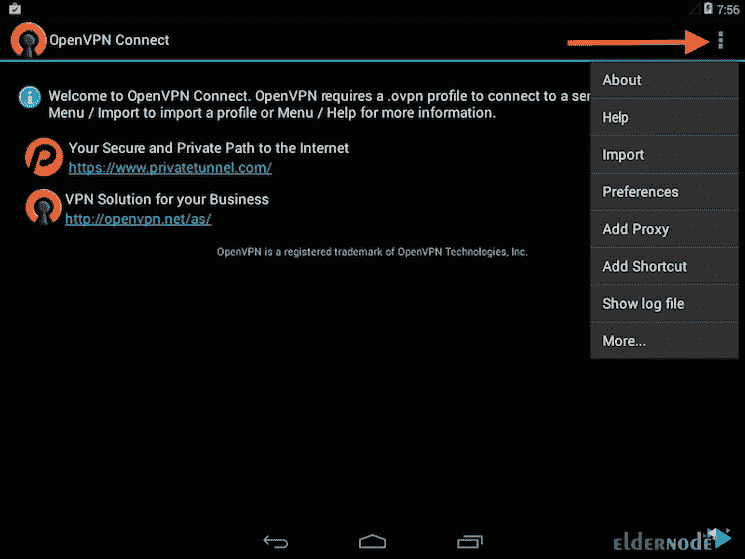
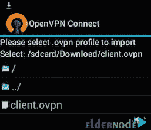

# 如何在 Debian 上设置 OpenVPN 服务器 10 -安装 openvpn debian

> 原文：<https://blog.eldernode.com/set-up-openvpn-debian-10/>



[更新日期:2021-02-06]能够让我们的互联网安全无虞是如此理想。当您连接到不受信任的网络时，虚拟专用网络(VPN)允许您像在专用网络上一样安全地秘密穿越不受信任的网络。操作是流量从 VPN 服务器出现，并继续其到目的地的旅程。在本文中，你将学习如何在 Debian 10 上设置 OpenVPN 服务器。此设置允许您在结合 HTTPS 连接的任何时候保护您的无线登录和交易。还应该注意的是，你可以访问 [Eldernode](https://eldernode.com/) 中可用的包来购买 [Linux VPS](https://eldernode.com/linux-vps/) 服务器。

## **教程在 Debian 10 上设置 OpenVPN 服务器**

要熟悉功能全面的开源安全套接字层(SSL) VPN 解决方案，即 OpenVPN，请遵循本教程来查看如何设置它，然后配置从 [Windows](https://blog.eldernode.com/tag/windows/) 、macOS、iOS 和/或 Android 对它的访问。跟随本文学习如何在 Debian 10 上设置 OpenVPN 服务器。

### **在 Debian 上设置 OpenVPN 服务器的先决条件**

如果您知道以下内容，本教程可能会更有用:

–拥有 Sudo 权限的非 root 用户。

–按照 Debian 10 的[初始设置进行设置](https://blog.eldernode.com/initial-setup-with-debian-10/)

–作为您的证书颁发机构(CA)的独立机器。

–为每个服务器生成一个 SSH 密钥对，然后将 OpenVPN 服务器的公共 SSH 密钥添加到 CA 机器的 **authorized_keys** 文件中。

跟随本文学习如何在 Debian 10 上设置 OpenVPN 服务器。

### **在 Debian 10**T3 上设置 OpenVPN 服务器

OpenVPN 是用于 VPN 通信的最新和最先进的协议。OpenVPN 使用 OpenSSL 和 SSLv3 // TLSv1 库来增加安全性，并且具有高度的灵活性和可配置性。该协议定期更新，开源社区也在不断更新和修复安全问题和潜在的 bug。在这篇文章中，跟随我们学习如何在 Debian 10 上完整地一步一步地设置 OpenVPN 服务器。

### **安装 OpenVPN 和 EasyRSA**

由于 OpenVPN 在 Debian 的默认存储库中可用，您可以使用 **apt** 进行安装。首先，更新你的 **VPN 服务器的**包索引并安装 OpenVPN。

```
sudo apt update 
```

```
sudo apt install openvpn
```

作为 TLS/SSL VPN，Open VPN 利用证书来加密服务器和客户端之间的流量，因此您可以设置自己的简单证书颁发机构(CA)。从项目的官方 GitHub 资源库下载 EasyRSA 的最新版本，您将使用它来构建您的 CA 公钥基础设施(PKI)。

为什么您应该在独立的服务器上构建 CA，因为当攻击者可以渗透到您的服务器时，从独立的机器上管理 CA 有助于防止未经授权的用户访问您的 VPN。

使用 **wget** 将最新版本的 EasyRSA 下载到**您的 CA 机器和 OpenVPN 服务器**上，以构建 CA 和 PKI 基础设施。你可以去官方 EasyRSA GitHub 项目上的**发布**页面，下载链接(以**结尾)。tgz** )，然后将其粘贴到下面的命令中:

```
wget -P ~/ https://github.com/OpenVPN/easy-rsa/releases/download/v3.0.6/EasyRSA-unix-v3.0.6.tgz 
```

然后提取 tarball:

```
cd ~ 
```

```
tar xvf EasyRSA-unix-v3.0.6.tgz 
```

### **如何配置 EasyRSA 变量和构建 CA**

导航到 CA 机器上的 EasyRSA 目录

```
cd ~/EasyRSA-v3.0.6/
```

复制该目录下的文件 **vars.example** 。

```
cp vars.example vars 
```

使用您喜欢的文本编辑器打开这个新文件:

```
nano vars 
```

```
~/EasyRSA-v3.0.6/vars
```

```
. . .  #set_var EASYRSA_REQ_COUNTRY    "US"  #set_var EASYRSA_REQ_PROVINCE   "California"  #set_var EASYRSA_REQ_CITY       "San Francisco"  #set_var EASYRSA_REQ_ORG        "Copyleft Certificate Co"  #set_var EASYRSA_REQ_EMAIL      "[[email protected]](/cdn-cgi/l/email-protection)"  #set_var EASYRSA_REQ_OU         "My Organizational Unit"  . . .
```

取消对这些行的注释，并将突出显示的值更新为您喜欢的值，只是不要将它们留空:

```
. . .  set_var EASYRSA_REQ_COUNTRY    "US"  set_var EASYRSA_REQ_PROVINCE   "NewYork"  set_var EASYRSA_REQ_CITY       "New York City"  set_var EASYRSA_REQ_ORG        "DigitalOcean"  set_var EASYRSA_REQ_EMAIL      "[[email protected]](/cdn-cgi/l/email-protection)"  set_var EASYRSA_REQ_OU         "Community"  . . .
```

完成后，保存并关闭文件

在 EasyRSA 目录中有一个名为 **easyrsa** 的脚本。在 CA 服务器上启动公钥基础设施T5。使用 **init-pki** 选项运行这个脚本

```
./easyrsa init-pki 
```

**输出**

```
. . .  init-pki complete; you may now create a CA or requests.  Your newly created PKI dir is: /home/noodi/EasyRSA-v3.0.6/pki
```

要构建 CA 并创建两个重要文件 **ca.crt** 和 **ca.key** (组成一个 SSL 证书的公共端和私有端)，再次调用**easy RSA**脚本，之后是**build-CA**选项。

此外，如果您不想在每次与 ca 交互时都被提示输入密码，您可以运行带有 **nopass** 选项的 **build-ca** 命令。

```
./easyrsa build-ca nopass 
```

然后，将要求您确认 CA 的通用名称:

**输出**

```
. . .  Common Name (eg: your user, host, or server name) [Easy-RSA CA]: 
```

### **如何创建服务器证书、密钥和加密文件**

导航到 OpenVPN 服务器上的 EasyRSA 目录开始。

```
cd EasyRSA-v3.0.6/
```

虽然您已经在 CA 机器上运行了这个命令，但是运行带有 **init-pki** 选项的 **easyrsa** 脚本，因为它确实有必要运行并且 CA 将有单独的 pki 目录。

```
./easyrsa init-pki 
```

在这里，您可以使用 **gen-req** 选项再次调用 **easyrsa** ，因为这可能有助于使它具有描述性。确保使用**no pass**选项，否则，将对请求的文件进行密码保护，这可能会导致以后的权限问题:

***注意:*** 如果您更喜欢选择另一个名称，您需要调整下面的一些说明。当您将生成的文件复制到 **/etc/openvpn** 目录时，您必须替换正确的名称。然后您需要稍后修改 **/etc/openvpn/server.conf** 文件以指向正确的**。crt** 和**。关键**文件。

```
./easyrsa gen-req server nopass
```

现在，您为服务器创建了一个私钥和一个名为 **server.req** 的证书请求文件。将服务器密钥复制到 **/etc/openvpn/** 目录:

```
sudo cp ~/EasyRSA-v3.0.6/pki/private/server.key /etc/openvpn/
```

使用安全的方法将 **server.req** 文件传输到您的 CA 机器。

```
scp ~/EasyRSA-v3.0.6/pki/reqs/server.req noodi@your_CA_ip:/tmp
```

导航到 CA 机器上的 EasyRSA 目录

```
cd EasyRSA-v3.0.6/
```

同样，您需要使用 **easyrsa** 脚本来导入 **server.req** 文件。

```
./easyrsa import-req /tmp/server.req server
```

通过运行带有 **sign-req** 选项的 **easyrsa** 脚本并输入通用名称。此外，您可以使用客户端或服务器类型 ，但是，在请求 OpenVPN 服务器的证书时，请记住使用 服务器 请求类型。

```
./easyrsa sign-req server server
```

当要求您验证请求是否来自可信来源时，在输出中键入 **yes** 然后按 **ENTER** 确认。

```
You are about to sign the following certificate.  Please check over the details shown below for accuracy. Note that this request  has not been cryptographically verified. Please be sure it came from a trusted  source or that you have verified the request checksum with the sender.  Request subject, to be signed as a server certificate for 1080 days:  subject=      commonName                = server    Type the word 'yes' to continue, or any other input to abort.    Confirm request details: yes
```

此外，如果您加密了 CA 密钥，并使用安全方法将签名的证书传输回 VPN 服务器，系统会提示您输入密码。

```
scp pki/issued/server.crt noodi@your_server_ip:/tmp
```

在注销 ca 机器之前，也将 **ca.crt** 文件传输到您的服务器

```
scp pki/ca.crt noodi@your_server_ip:/tmp
```

然后，重新登录到您的 OpenVPN 服务器，将 **server.crt** 和 **ca.crt** 文件复制到您的 **/etc/openvpn/** 目录中:

```
sudo cp /tmp/{server.crt,ca.crt} /etc/openvpn/
```

接下来，导航到您的 EasyRSA 目录。

```
cd EasyRSA-v3.0.6/
```

要在密钥交换期间使用，请创建一个强 Diffie-Hellman 密钥，如下所示。

```
./easyrsa gen-dh 
```

并且为了加强服务器的 TLS 完整性验证能力，生成 HMAC 签名。

```
sudo openvpn --genkey --secret ta.key
```

完成该命令后，将这两个新文件复制到您的 **/etc/openvpn/** 目录中。

```
sudo cp ~/EasyRSA-v3.0.6/ta.key /etc/openvpn/ 
```

```
sudo cp ~/EasyRSA-v3.0.6/pki/dh.pem /etc/openvpn/ 
```

### **如何生成客户端证书和密钥对**

对于本指南，我们将生成一个客户端密钥和证书对，但是如果您有多个客户端，您可以对每个客户端重复此过程。不要忘记，您应该为每个客户端的脚本传递一个唯一的名称值。

```
mkdir -p ~/client-configs/keys
```

为了遵守安全措施，现在锁定权限。

```
chmod -R 700 ~/client-configs 
```

然后，运行带有 **gen-req** 和 **nopass** 选项的 **easyrsa** 脚本，并在导航回 easyrsa 目录后显示客户机的通用名称

```
cd ~/EasyRSA-v3.0.6/  ./easyrsa gen-req client1 nopass
```

要确认通用名称，请按**键，输入** 和 将 **client1.key** 文件复制到您之前创建的 **/client-configs/keys/** 目录中:

```
cp pki/private/client1.key ~/client-configs/keys/
```

然后，通过使用安全的方法，将 client1.req 文件传输到您的 CA 机器。

```
scp pki/reqs/client1.req noodi@your_CA_ip:/tmp
```

导航到 EasyRSA 目录，登录到您的 CA 机器，并导入证书请求:

```
ssh noodi@your_CA_ip  cd EasyRSA-v3.0.6/  ./easyrsa import-req /tmp/client1.req client1
```

确保指定**客户机**的请求类型，并像您在上一步中为服务器所做的那样对请求进行签名

```
./easyrsa sign-req client client1
```

**输出**

```
Type the word 'yes' to continue, or any other input to abort.    Confirm request details: yes
```

这里会要求您输入密码，因为您已经加密了 CA 密钥。然后会创建一个名为 **client1.crt** 的客户端证书文件。将此文件传输回服务器:

```
scp pki/issued/client1.crt noodi@your_server_ip:/tmp
```

将客户端证书复制到 **/client-configs/keys/** 目录，并将 SSH 复制回您的 OpenVPN 服务器。

```
cp /tmp/client1.crt ~/client-configs/keys/
```

现在，将 **ca.crt** 和 **ta.key** 文件复制到 **/client-configs/keys/** 目录下。

```
sudo cp ~/EasyRSA-v3.0.6/ta.key ~/client-configs/keys/ 
```

```
sudo cp /etc/openvpn/ca.crt ~/client-configs/keys/ 
```

跟随本文学习如何在 Debian 10 上设置 OpenVPN 服务器。

### **如何配置 OpenVPN 服务**

因为您的客户机和服务器的证书和密钥都已经生成，所以让我们开始配置 OpenVPN 服务来使用这些证书。将一个示例 OpenVPN 配置文件复制到配置目录中，然后提取它，以便将其用作您的设置的基础:

```
sudo cp /usr/share/doc/openvpn/examples/sample-config-files/server.conf.gz /etc/openvpn/
```

```
sudo gzip -d /etc/openvpn/server.conf.gz 
```

然后，在您喜欢的文本编辑器中打开服务器配置文件:

```
sudo nano /etc/openvpn/server.conf
```

```
/etc/openvpn/server.conf
```

```
tls-auth ta.key 0 # This file is secret
```

通过查找注释掉的**密码**行，找到关于加密密码的部分。 **AES-256-CBC** 密码提供了很好的加密级别，并得到了很好的支持。尽管这一行应该已经被取消了注释，但是如果没有，那么只需删除“；”在它之前:

```
/etc/openvpn/server.conf
```

```
cipher AES-256-CBC 
```

要选择 HMAC 消息摘要算法，添加一个 **auth** 指令， **SHA256** 是一个不错的选择。

```
auth SHA256
```

现在，您需要包含定义 Diffie-Hellman 参数的 **dh** 指令的行。Diffie-Hellman 密钥的文件名可能与示例服务器配置文件中列出的不同，因为最近对 EasyRSA 进行了一些更改。此外，您可以通过删除 2048 来更改此处列出的文件名，以便它与您在上一步中生成的密钥对齐:

```
/etc/openvpn/server.conf
```

最后找到用户和组设置，去掉“**”；**"来取消这些行的注释

```
/etc/openvpn/server.conf
```

```
user nobody 
```

```
group nogroup
```

到目前为止，您对示例 **server.conf** 文件所做的所有更改都是帮助 OpenVPN 运行所必需的。但是下面概述的变化是可选的，

到目前为止，您对示例 **server.conf** 文件所做的更改对于 OpenVPN 的运行是必要的。下面概述的更改是可选的。

#### **推送 DNS 更改，通过 VPN** 重定向所有流量

如果您需要使用 VPN 来路由所有流量，请尝试将 DNS 设置推送到客户端电脑。此外，您可以使用上述设置在两台机器之间创建 VPN 连接。

您可以使用 **server.conf** 中的一些指令并更改它们，您希望启用此功能。找到**重定向网关**部分后，去掉分号“**；**"从**重定向网关**行开始，取消注释:

```
/etc/openvpn/server.conf
```

```
push "redirect-gateway def1 bypass-dhcp" 
```

现在，找到 **dhcp-option** 部分，去掉“**；**"从这两行前面取消对它们的注释:

```
/etc/openvpn/server.conf
```

```
push "dhcp-option DNS 208.67.222.222" 
```

```
push "dhcp-option DNS 208.67.220.220" 
```

#### **调整端口和协议**

虽然 OpenVPN 服务器默认使用端口 1194 和 UDP 协议来接受客户端连接，但是如果由于客户端所处的限制性网络环境而需要使用不同的端口，您可以更改**端口**选项。但是如果您没有在 OpenVPN 服务器上托管 web 内容，端口 443 是一个流行的选择，因为它通常被防火墙规则所允许。

```
/etc/openvpn/server.conf
```

```
Optional! 
```

```
port 443
```

如果协议仅限于该端口，则将 **proto** 从 UDP 更改为 TCP:

```
Optional!  proto tcp
```

#### **指向非默认凭证**

如果您使用默认名称“服务器”，这已经设置正确，但是如果您选择了不同的名称，请修改您看到的**证书**和**密钥**行，以指向适当的**。crt** 和**。关键**文件。

```
cert server.crt  key server.key
```

然后，**保存**并关闭文件。

### **如何调整服务器联网配置**

为了让 OpenVPN 通过 VPN 正确地路由流量，您需要调整服务器网络配置的某些方面。IP 转发是一种确定 IP 流量应该路由到哪里的方法，这对于您的服务器将提供的 VPN 功能至关重要。

您可以修改 **/etc/sysctl.conf** 文件，以调整服务器的默认 IP 转发设置。

```
sudo nano /etc/sysctl.conf 
```

此外，在查找设置 **net.ipv4.ip_forward** 的注释行时，您可以删除行首的“ **#** ”字符来取消对此设置的注释

```
/etc/sysctl.conf
```

```
net.ipv4.ip_forward=1 
```

现在，您可以保存并关闭文件。

使用以下命令读取文件并调整当前会话的值。

```
sudo sysctl -p
```

**输出**

```
net.ipv4.ip_forward = 1
```

找到您机器的公共网络接口，然后打开防火墙配置文件添加伪装规则。

```
ip route | grep default
```

输出

```
default via 203.0.113.1 dev eth0 proto static
```

当您拥有与默认路由相关联的接口时，您可以打开 **/etc/ufw/before.rules** 文件来添加相关的配置:

```
sudo nano /etc/ufw/before.rules
```

```
/etc/ufw/before.rules
```

```
rules.before  Rules that should be run before the ufw command line added rules. Custom  rules should be added to one of these chains:  ufw-before-input  ufw-before-output  ufw-before-forward    START OPENVPN RULES  NAT table rules  *nat  :POSTROUTING ACCEPT [0:0]   Allow traffic from OpenVPN client to eth0 (change to the interface you discovered!)  -A POSTROUTING -s 10.8.0.0/8 -o eth0 -j MASQUERADE  COMMIT  END OPENVPN RULES    Don't delete these required lines, otherwise there will be errors  *filter  . . .
```

***注意** :* 不要忘记用你找到的接口替换上面 **-A POSTROUTING** 行中的 **eth0**

现在，您可以保存并关闭文件。

然后，打开 **/etc/default/ufw** 文件，告诉 ufw 默认允许转发数据包。

```
sudo nano /etc/default/ufw 
```

将 **中的值从**下降**改为**接受** 默认 _ 转发 _ 策略**

要允许流量进入 OpenVPN，请调整防火墙本身。如果您没有更改 **/etc/openvpn/server.conf** 文件中的端口和协议，则打开到端口 1194 **的 UDP 流量。** 如果您修改了端口和/或协议，请在此处替换您选择的值。

如果您还没有完成先决条件教程，请在完成时添加 SSH 端口。

```
sudo ufw allow 1194/udp 
```

```
sudo ufw allow OpenSSH
```

添加规则后，禁用并重新启用 UFW 以重新启动它，并从您修改的所有文件中加载更改。

```
sudo ufw disable 
```

```
sudo ufw enable
```

### **如何启动和启用 OpenVPN 服务**

在这一步中，您已经准备好在您的服务器上启动 OpenVPN 服务。因此，您需要启动 OpenVPN 服务器，方法是在 systemd 单元文件名后指定您的配置文件名作为实例变量。由于您的服务器的配置文件名为**/etc/openvpn/server . conf**，调用时在您的单元文件末尾加上**@ server**:

```
sudo systemctl start [[email protected]](/cdn-cgi/l/email-protection)server
```

要再次检查服务是否已成功启动，请执行以下操作:

```
sudo systemctl status [[email protected]](/cdn-cgi/l/email-protection) 
```

**输出**

```
● [[email protected]](/cdn-cgi/l/email-protection) - OpenVPN connection to server     Loaded: loaded (/lib/systemd/system/[[email protected]](/cdn-cgi/l/email-protection); disabled; vendor preset: enabled)     Active: active (running) since Wed 2019-07-17 03:39:24 UTC; 29s ago       Docs: man:openvpn(8)             https://community.openvpn.net/openvpn/wiki/Openvpn24ManPage             https://community.openvpn.net/openvpn/wiki/HOWTO   Main PID: 3371 (openvpn)     Status: "Initialization Sequence Completed"      Tasks: 1 (limit: 3587)     Memory: 1.2M     CGroup: /system.slice/system-openvpn.slice/[[email protected]](/cdn-cgi/l/email-protection)             └─3371 /usr/sbin/openvpn --daemon ovpn-server --status /run/openvpn/server.status 10 --cd /etc/openvpn --config /etc/openvpn/server.conf --writepid /run/openvpn/
```

要检查 OpenVPN **tun0** 接口是否可用，请运行以下命令。

```
ip addr show tun0
```

**输出**

```
3: tun0: <POINTOPOINT,MULTICAST,NOARP,UP,LOWER_UP> mtu 1500 qdisc pfifo_fast state UNKNOWN group default qlen 100      link/none       inet 10.8.0.1 peer 10.8.0.2/32 scope global tun0         valid_lft forever preferred_lft forever      inet6 fe80::dd60:3a78:b0ca:1659/64 scope link stable-privacy          valid_lft forever preferred_lft forever
```

启动时启用该服务，以便能够在启动时自动启动

```
sudo systemctl enable [[email protected]](/cdn-cgi/l/email-protection) 
```

### **如何创建客户端配置基础架构**

由于每个客户端都必须有自己的配置，并且每个客户端都必须符合服务器配置文件中概述的设置，因此为 OpenVPN 客户端创建配置文件可能有点复杂。您可以构建一个客户机配置基础结构，用于动态生成配置文件，并且不再编写只能在一个客户机上使用的单个配置文件。为此，您需要创建一个“基本”配置文件，然后构建一个脚本，该脚本将允许您根据需要生成唯一的客户端配置文件、证书和密钥。在您之前创建的 **client-configs** 目录中选择您想要存储客户端配置文件的位置，并创建一个新目录。

```
mkdir -p ~/client-configs/files
```

要用作基本配置，请将一个示例客户端配置文件复制到 **client-configs** 目录中。

```
cp /usr/share/doc/openvpn/examples/sample-config-files/client.conf ~/client-configs/base.conf 
```

然后，在文本编辑器中打开这个新文件:

```
nano ~/client-configs/base.conf
```

如果您想要更改 OpenVPN 服务器正在监听的端口，请将 1194 更改为您选择的端口。

```
~/client-configs/base.conf
```

```
. . .  The hostname/IP and port of the server.  You can have multiple remote entries  to load balance between the servers.  remote your_server_ip 1194  . . .
```

```
~/client-configs/base.conf
```

去掉“**”；每行开头的**取消对 **用户** 和 **组** 指令的注释。

```
~/client-configs/base.conf
```

```
Downgrade privileges after initialization (non-Windows only)  user nobody  group nogroup
```

尝试找到设置 **ca** 、 **cert** 和 **key** 的指令。

```
~/client-configs/base.conf
```

```
SSL/TLS parms.  See the server config file for more  description.  It's best to use  a separate .crt/.key file pair  for each client.  A single ca  file can be used for all clients.  ca ca.crt  cert client.crt  key client.key
```

```
~/client-configs/base.conf
```

```
if a tls-auth key is used on the server  then every client must also have the key.  tls-auth ta.key 1
```

然后，镜像您在 **/etc/openvpn/server.conf** 文件中设置的**密码**和**认证**设置:

```
~/client-configs/base.conf
```

```
cipher AES-256-CBC  auth SHA256
```

现在，在文件的某个地方添加**按键方向**指令。为了在客户端机器上正常工作，你**必须**将 VPN 设置为“1”。

```
~/client-configs/base.conf
```

这个脚本使用 **resolvconf** 实用程序来更新 Linux 客户端的 DNS 信息。

```
~/client-configs/base.conf
```

```
script-security 2  up /etc/openvpn/update-resolv-conf  down /etc/openvpn/update-resolv-conf
```

现在，创建一个简单的脚本，用相关的证书、密钥和加密文件编译您的基本配置，然后将生成的配置放在 **~/client-configs/files** 目录中。

在 **~/client-configs** 目录下打开一个名为 **make_config.sh** 的新文件:

```
nano ~/client-configs/make_config.sh
```

```
!/bin/bash     First argument: Client identifier    KEY_DIR=/home/noodi/client-configs/keys  OUTPUT_DIR=/home/noodi/client-configs/files  BASE_CONFIG=/home/noodi/client-configs/base.conf    cat ${BASE_CONFIG} \      <(echo -e '<ca>') \      ${KEY_DIR}/ca.crt \      <(echo -e '</ca>\n<cert>') \      ${KEY_DIR}/${1}.crt \      <(echo -e '</cert>\n<key>') \      ${KEY_DIR}/${1}.key \      <(echo -e '</key>\n<tls-auth>') \      ${KEY_DIR}/ta.key \      <(echo -e '</tls-auth>') \      > ${OUTPUT_DIR}/${1}.ovpn
```

***注意** :* 确保将“noodi”更改为您的服务器的非 **root** 用户帐户。

您现在可以保存并关闭文件。

并使用下面的命令将该文件标记为可执行文件。

```
chmod 700 ~/client-configs/make_config.sh
```

当您添加一个新的客户端时，您应该先为它生成新的密钥和证书，然后才能运行这个脚本并生成它的配置文件。

### **如何在 OpenVPN 上生成客户端配置**

在第 4 步中，您看到了如何创建名为 **client1.crt** 和 **client1.key** 的客户端证书和密钥。进入您的 **~/client-configs** 目录，运行您在上一步结束时创建的脚本，为这些凭证生成一个配置文件。

```
cd ~/client-configs 
```

```
sudo ./make_config.sh client1
```

在您的 **~/client-configs/** **文件**目录下创建一个名为 **client1.ovpn** 的文件:

```
ls ~/client-configs/files
```

**输出**

```
client1.ovpn
```

您可以将此文件传输到计划用作客户端的设备上。(您的本地计算机或移动设备)

可用于通过加密连接传输客户端 VPN 认证文件的安全方法是后端的 SFTP (SSH 文件传输协议)或 SCP(安全拷贝)。

```
local $ sftp noodi@your_server_ip:client-configs/files/client1.ovpn ~/
```

### **如何安装客户端配置**

至此，您看到了如何在 Windows、macOS、 [Linux](https://blog.eldernode.com/tag/linux/) 、iOS 和 Android 上安装客户端 VPN 配置文件，但是它们都不相互依赖。如你所见，在本指南中，OpenVPN 连接有你称之为**的名字。ovpn** 文件。因此这个连接被命名为 **client1.ovpn** ，与您生成的第一个客户机文件保持一致。

#### **如何在 Windows 上安装客户端 VPN 配置文件**

从 [OpenVPN 的下载页面](https://openvpn.net/index.php/open-source/downloads.html)下载 Windows 的 OpenVPN 客户端应用。为您的 Windows 版本选择合适的安装程序版本。

***注意** :* 要安装 OpenVPN，需要有管理权限。

复制**。ovpn** 文件，当你安装 OpenVPN 的时候。

```
C:\Program Files\OpenVPN\config
```

启动 OpenVPN 后，它会自动看到配置文件并使其可用。

无论何时你使用 OpenVPN，你都应该以管理员的身份运行它，甚至是管理帐户。您可以从管理帐户完成此操作，而不必在每次使用 VPN 时右键单击并选择**以管理员身份运行**。虽然标准用户需要输入管理员的密码才能使用 OpenVPN，但是他们也必须拥有提升的特权和管理员权限，以便他们的 OpenVPN 应用程序能够连接到服务器。然后右键点击任务栏上的 OpenVPN 应用，点击连接。

在 OpenVPN 窗口出现后，您应该键入您的用户名和密码进行身份验证。

#### **如何在 MacOS 上安装客户端 VPN profile**

Tunnelblick 是一款面向 macOS 的免费开源 OpenVPN 客户端。从 Tunnelblick 下载页面下载最新的磁盘映像。然后双击下载的 **。dmg** 文件并按照提示安装。

当 Tunnelblick 询问您是否有配置文件时，回答**我有配置文件**，让 Tunnelblick 完成。要让它安装客户端配置文件，请打开 Finder 窗口并双击 **client1.ovpn** 。请注意，需要管理权限。

**连接**

双击**应用程序**文件夹中的 Tunnelblick 图标，启动 Tunnelblick。要控制连接，使用屏幕右上角菜单栏中的隧道图标，点击该图标，然后点击**连接客户端 1** 菜单项，启动 VPN 连接。

#### **如何在 Linux 服务器上安装客户端 VPN 配置文件**

您可以使用各种工具。您的桌面环境或窗口管理器可能还包括连接实用程序。但是最普遍的连接方式是使用 OpenVPN 软件。

你可以在 **Debian** 上安装，就像在服务器上一样。

```
client$ sudo apt update 
```

```
client$ sudo apt install openvpn
```

您需要启用 EPEL 存储库，然后在 CentOS 上安装。

```
client$ sudo yum install epel-release 
```

```
client$ sudo yum install openvpn
```

#### 如何在 Linux 上配置客户端 VPN 配置文件

要检查您的发行版是否包含一个**/etc/openvpn/update-resolv-conf**脚本:

```
client$ ls /etc/openvpn 
```

**输出**

```
update-resolv-conf
```

要编辑您传输的 OpenVPN 客户端配置文件:

```
nano client1.ovpn 
```

如果您发现了一个 **update-resolv-conf** 文件，取消对您添加的用于调整 DNS 设置的三行的注释。

**client1.ovpn**

```
script-security 2  up /etc/openvpn/update-resolv-conf  down /etc/openvpn/update-resolv-conf
```

当您使用 CentOS 时，为了匹配发行版的可用组，您需要将 **group** 指令从 **nogroup** 更改为 **nobody**

**client1.ovpn**

```
group nobody 
```

您可以保存并关闭文件。

要连接到 VPN，请将 OpenVPN 命令指向客户端配置文件:

```
sudo openvpn --config client1.ovpn
```

#### **如何在 iOS 上安装客户端 VPN 概要文件**

安装 Open VPN connect(iTunes App Store 的官方 iOS OpenVPN 客户端应用程序)后，要将您的 iOS 客户端配置传输到设备上，请将其直接连接到电脑。



在收到新配置文件准备好导入的通知后，轻按绿色加号进行导入。



***注意** :* 如果你尝试使用**设置**下的 PN 开关连接 VPN，你会收到一个只能使用 OpenVPN app 连接的通知。

#### **如何在 Android 上安装客户端 VPN 概要文件**

安装 Android OpenVPN 后，从谷歌 Play 商店连接官方 Android OpenVPN 客户端应用程序，启动 OpenVPN 应用程序，并点击菜单以导入配置文件。



然后导航到保存的配置文件的位置。



### **如何测试 VPN 连接**

打开浏览器并转到 DNSLeakTest，不要启用 VPN 连接。您可以点击**扩展测试**来查看您正在使用哪些 DNS 服务器通过同一个网站检查您的 DNS 设置。然后，将 OpenVPN 客户端连接到您的 Droplet 的 VPN，并刷新浏览器以查看完全不同的 IP 地址。为了确认你现在使用的是 VPN 推送的 DNS 解析器，再次检查 DNSLeakTest 的**扩展测试**。

### **如何撤销客户证书**

有时，您可能需要撤销客户端证书，以防止对 OpenVPN 服务器的进一步访问。因此，导航到 CA 机器上的 EasyRSA 目录:

```
cd EasyRSA-v3.0.6/ 
```

然后，运行带有 **撤销** 选项的 **easyrsa** 脚本

```
./easyrsa revoke client2
```

**输出**

```
Please confirm you wish to revoke the certificate with the following subject:    subject=      commonName                = client2      Type the word 'yes' to continue, or any other input to abort.    Continue with revocation: yes
```

CA 故意撤销客户端的证书，但是由于 OpenVPN 服务器目前无法检查是否有客户端的证书被撤销，并且客户端仍然可以访问 VPN，所以您需要在 CA 机器上创建一个证书撤销列表(CRL)来纠正它。

```
./easyrsa gen-crl 
```

现在，你有了一个名为**CRL . PEM**的文件。

```
scp ~/EasyRSA-v3.0.6/pki/crl.pem noodi@your_server_ip:/tmp
```

在您的 OpenVPN 服务器上，将该文件复制到您的 **/etc/openvpn/** 目录中:

```
sudo cp /tmp/crl.pem /etc/openvpn 
```

现在，打开 OpenVPN 服务器配置文件:

```
sudo nano /etc/openvpn/server.conf 
```

然后，将 **crl-verify** 选项添加到文件的末尾，以指示 OpenVPN 服务器在每次尝试连接时检查我们创建的证书撤销列表。

```
/etc/openvpn/server.conf
```

```
crl-verify crl.pem 
```

现在，您可以保存并关闭文件。

要实施证书撤销，请重新启动 OpenVPN。

```
sudo systemctl restart [[email protected]](/cdn-cgi/l/email-protection) 
```

此时，客户端应该不再能够使用旧凭据成功连接到服务器。但是您可以通过以下方式撤销任何可能的额外客户端:

1-用**撤销证书。/easyrsa revoke client_name** 命令

2-生成新的 CRL

3-将新的 **crl.pem** 文件传输到您的 OpenVPN 服务器，并将其复制到 **/etc/openvpn** 目录以覆盖旧的列表。

4- **重启**OpenVPN 服务。

## 结论

OpenVPN 是用于实现虚拟专用网络技术以建立安全的点对点或站点到站点通信的开源软件。OpenVPN 的一个最重要的优势是它兼容多种操作系统，如 Mac、Linux、BSDs 等等。在本文中，我们试图学习如何在 Debian 10 上设置 OpenVPN 服务器。您现在可以安全地浏览互联网，保护您的身份、位置和流量免受窥探和审查。需要注意的是，如果你愿意，可以参考文章[如何在 Windows Server 2019](https://blog.eldernode.com/setup-openvpn-on-windows-server-2019/) 上设置 OpenVPN。