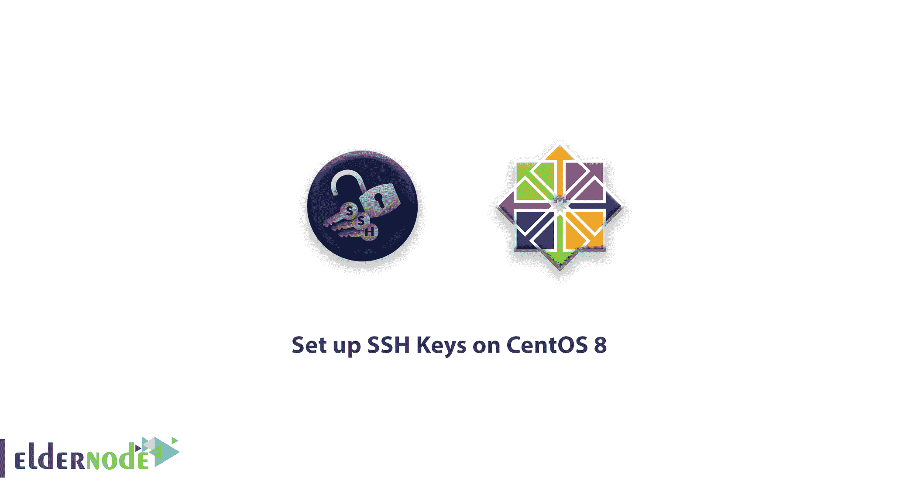

# 教程在 centos 8 上设置 ssh 密钥-在 CentOS 8 上生成 SSH 密钥

> 原文：<https://blog.eldernode.com/set-up-ssh-keys-on-centos-8/>



最近，您读到了 Linux 上的 SSH。在本文中，您将熟悉**教程在 CentOS 8** 上设置 SSH 密钥。这是登录服务器的安全方法，建议所有用户使用。 [SSH](https://en.wikipedia.org/wiki/Secure_Shell) 是一种加密协议，用于管理服务器并与之通信。

## 教程在 CentOS 8 上设置 SSH 按键

**第一步**–**创建 RSA 密钥对**

```
ssh-keygen  
```

对于大多数情况来说，ssh-keygen 创建一个 2048 位的密钥对是足够安全的。输入命令后，您将看到下面的结果。

输出

```
Generating public/private rsa key pair.  Enter file in which to save the key (/your_home/.ssh/id_rsa):    
```

将密钥对保存到中。ssh/ 子目录在你的主目录下，按回车

通过创建一个生成的 SSH 密钥对，将显示下面的结果。

输出

```
Enter passphrase (empty for no passphrase):
```

强烈建议您输入安全密码。为您的钥匙增加一层安全保护。密码可以防止未经授权的用户登录。

您将看到以下输出:

输出

```
Your identification has been saved in /your_home/.ssh/id_rsa.  Your public key has been saved in /your_home/.ssh/id_rsa.pub.  The key fingerprint is:  a9:49:2e:2a:5e:33:3e:a9:de:4e:77:11:58:b6:90:26 [email protected]_host  The key's randomart image is:  +--[ RSA 2048]----+  |     ..o         |  |   E o= .        |  |    o. o         |  |        ..       |  |      ..S        |  |     o o.        |  |   =o.+.         |  |. =++..          |  |o=++.            |  +-----------------+
```

因为您有一个公钥和私钥来进行身份验证，所以您必须将公钥放在您的服务器上，以便能够使用基于 SSH 密钥的身份验证来登录。

[购买 Linux 虚拟私有服务器](https://eldernode.com/linux-vps/)

**第二步**–**将公钥复制到您的 CentOS 服务器**

如果您想使用最快的方式将您的公钥复制到 CentOS 主机，请使用名为 ssh-copy-id 的实用程序。如果您的客户机上没有可用的 ssh-copy-id ，您需要使用下面两种方法中的一种。

### **使用** ssh-copy-id 复制您的公钥

在大多数操作系统中，默认情况下包含了 ssh-copy-id 工具。因此它可能在您的本地系统上可用，但是，您需要对您的服务器进行基于密码的 SSH 访问。

指定要连接的远程主机和您拥有 SSH 访问密码的用户帐户。将复制您的公共 SSH 密钥的帐户是:

```
ssh-copy-id username@remote_host
```

您将看到如下结果:

输出

```
The authenticity of host '203.0.113.1 (203.0.113.1)' can't be established.  ECDSA key fingerprint is fd:fd:d4:f9:77:fe:73:84:e1:55:00:ad:d6:6d:22:fe.  Are you sure you want to continue connecting (yes/no)? yes 
```

如果是第一次连接到新主机，本地计算机将无法识别远程主机。键入 Yes 并按 ENTER 键继续。

然后，该工具将扫描您的帐户，查找您已经创建的 id_rsa.pub 密钥。它会提示您输入远程用户帐户的密码:

输出

```
/usr/bin/ssh-copy-id: INFO: attempting to log in with the new key(s), to filter out any that are already installed  /usr/bin/ssh-copy-id: INFO: 1 key(s) remain to be installed -- if you are prompted now it is to install the new keys  username@203.0.113.1's password:
```

输入密码并按下键进入。该实用程序将使用您选择的密码连接到远程主机上的帐户。它会复制你的 ~/的内容。ssh/id_rsa。pub 键进入远程账号的 ~/。ssh/authorized_keys 文件 。

输出将如下所示:

输出

```
Number of key(s) added: 1  Now try logging into the machine, with:   "ssh '[[email protected]](/cdn-cgi/l/email-protection)'"  and check to make sure that only the key(s) you wanted were added.    
```

### 使用 SSH 复制公钥

如果 ssh-copy-id 不可用，并且您可以通过基于密码的 ssh 访问服务器上的帐户，请使用更传统的 SSH 方法上传您的密钥。

您可以使用 cat 命令读取本地计算机上的公共 SSH 密钥的内容，并通过 SSH 连接连接到远程服务器。

你还可以确保 ~/。ssh 目录存在并且具有正确的权限。

在这个目录中，您通过管道将内容作为 authorized_keys 传送到一个文件中。你 可以看到下面完整的命令。

```
cat ~/.ssh/id_rsa.pub | ssh usernam[email protected]remote_host "mkdir -p ~/.ssh && touch ~/.ssh/authorized_keys && chmod -R go= ~/.ssh && cat >> ~/.ssh/authorized_keys"  
```

此外，您可能会看到以下消息。

输出

如果您的本地计算机无法识别远程主机，您将会看到此消息。所以你需要输入 yes 然后按回车继续。

```
The authenticity of host '203.0.113.1 (203.0.113.1)' can't be established.  ECDSA key fingerprint is fd:fd:d4:f9:77:fe:73:84:e1:55:00:ad:d6:6d:22:fe.  Are you sure you want to continue connecting (yes/no)? yes
```

然后，会要求您输入远程用户帐户密码:

输出

手动复制公钥

如果对服务器的基于密码的 SSH 访问不可用，您需要手动完成上述过程。

追加您的 id-rsa-的内容。pub 文件到 ~/。ssh/authorized_keys 文件。

```
username@203.0.113.1's password:    
```

### 如果你想显示你的身份。pub，把这个输入你的本地计算机:

猫~/。ssh/id_rsa.pub

如下所示，您将看到密钥的内容。

输出

```
使用您可用的方法登录并访问您在远程服务器上的帐户后，检查该目录是否存在。因此，如果它不存在，输入下面的命令来创建目录。然后，在该目录下创建或修改authorized _ key文件。

```
用来自 cat ~/的输出替换公共密钥字符串。ssh/id_rsa.pub 命令。从 ssh-rsa AAAA 开始…

```
ssh-rsa AAAAB3NzaC1yc2EAAAADAQABAAACAQCqql6MzstZYh1TmWWv11q5O3pISj2ZFl9HgH1JLknLLx44+tXfJ7mIrKNxOOwxIxvcBF8PXSYvobFYEZjGIVCEAjrUzLiIxbyCoxVyle7Q+bqgZ8SeeM8wzytsY+dVGcBxF6N4JS+zVk5eMcV385gG3Y6ON3EG112n6d+SMXY0OEBIcO6x+PnUSGHrSgpBgX7Ks1r7xqFa7heJLLt2wWwkARptX7udSq05paBhcpB0pHtA1Rfz3K2B+ZVIpSDfki9UVKzT8JUmwW6NNzSgxUfQHGwnW7kj4jp4AT0VZk3ADw497M2G/12N0PPB5CnhHf7ovgy6nL1ikrygTKRFmNZISvAcywB9GVqNAVE+ZHDSCuURNsAInVzgYo9xgJDW8wUw2o8U77+xiFxgI5QSZX3Iq7YLMgeksaO4rBJEa54k8m5wEiEE1nUhLuJ0X/vh2xPff6SQ1BL/zkOhvJCACK6Vb15mDOeCSq54Cr7kvS46itMosi/uS66+PujOO+xt/2FWYepz6ZlN70bRly57Q06J+ZJoc9FfBCbCyYH7U/ASsmY095ywPsBo1XQ9PqhnN1/YOorJ068foQDNVpm146mUpILVxmq41Cj55YKHEazXGsdBIbXWhcrRf4G2fJLRcGUr9q8/lERo9oxRm5JFX6TCmj6kmiFqv+Ow9gI0x8GvaQ== [email protected]    
```

最后，确保 ~/。ssh 目录和 authorized_keys 文件有适当的权限设置:

```
mkdir -p ~/.ssh
```

为了使用 root 帐户，请查看 ~/。ssh 目录属于用户，不属于根目录:

```
echo public_key_string >> ~/.ssh/authorized_keys
```

您的用户名是 noodi ，您应该将适当的用户名替换到上面的命令中。现在，您可以使用 CentOS 服务器尝试基于密钥的身份验证。

```
chmod -R go= ~/.ssh
```

 **第三步**–**使用 SSH 键登录 CentOS 服务器**

```
chown -R noodi:noodi ~/.ssh
```

成功处理后，您现在应该能够登录到远程主机，而无需远程帐户的密码。在第一次连接到该主机的情况下，您可能会看到如下内容:输出 **第四步**–**在你的服务器上禁用密码认证**

```
ssh username@remote_host  
```

当您确认您的远程帐户拥有管理权限时，您将能够使用 SSH 密钥(作为 **root** 或拥有 sudo 权限的帐户)登录您的远程服务器。现在您可以搜索名为 PasswordAuthentication 的指令。要放置 vi ，按下 i ，取消对该行的注释，并将值设置为 no 。因此，使用帐户密码通过 SSH 登录将被禁用。

```
The authenticity of host '203.0.113.1 (203.0.113.1)' can't be established.  ECDSA key fingerprint is fd:fd:d4:f9:77:fe:73:84:e1:55:00:ad:d6:6d:22:fe.  Are you sure you want to continue connecting (yes/no)? yes
```

```
sudo vi /etc/ssh/sshd_config
```

完成所有更改后，按 ESC ，然后按 :wq 。要实现这些更改，请重启 sshd 服务:在关闭当前会话之前，测试 SSH 服务的功能是否正确。

```
...  PasswordAuthentication no  ...
```

当 SSH 服务正常工作时，您可以关闭所有服务器会话。现在，CentOS 服务器上的 SSH 守护程序会响应 SSH 密钥。

```

```
sudo systemctl restart sshd 
```

亲爱的用户，我们希望这篇教程能对你有所帮助，如果你有任何问题或想查看我们的用户关于这篇文章的对话，请访问[提问页面](https://eldernode.com/ask)。也为了提高你的知识，有这么多有用的教程为[老年节点培训](https://eldernode.com/blog/)准备。

```
ssh username@remote_host
```

 **不要错过**  [初始设置 centos 8 ](https://eldernode.com/initial-set-up-centos-8/) **Do not miss**[initial set up centos 8](https://eldernode.com/initial-set-up-centos-8/)
```

```

```