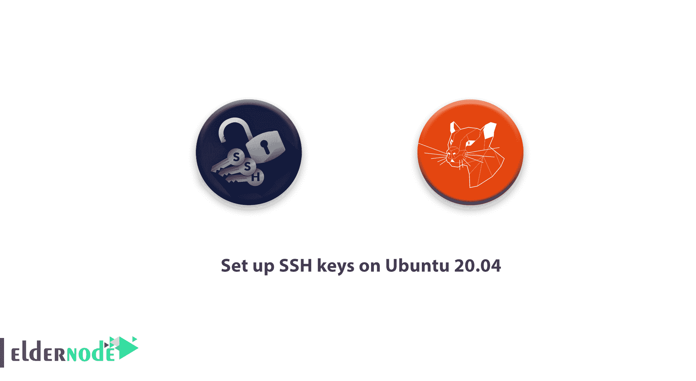

# 如何在 Ubuntu 20.04 - Eldernode 上设置 SSH 密钥

> 原文：<https://blog.eldernode.com/set-up-ssh-keys-ubuntu-20/>



SSH 或安全外壳是一种加密协议，用于管理[服务器](https://eldernode.com/admin-rdp-server/)并与之通信。当使用 Ubuntu 服务器时，您将花费大部分时间在通过 SSH 连接到服务器的终端会话中。

如何在 Ubuntu 20.04 上设置 SSH 密钥

加入我们来完成本教程的步骤，向你展示如何在 Ubuntu 20.04 上设置 SSH 密钥。我们的计划是专注于为 Ubuntu 20.04 安装设置 SSH 密钥。 [SSH 密钥](https://blog.eldernode.com/set-up-ssh-keys-on-centos-8/)提供了登录服务器的安全方式，建议所有用户使用。

Join us to finish the steps of this tutorial to show you How to set up SSH keys on Ubuntu 20.04\. The plan is that we would focus on setting up SSH keys for an Ubuntu 20.04 installation. [SSH keys](https://blog.eldernode.com/set-up-ssh-keys-on-centos-8/) provide a secure way of logging into your server and are recommended for all users.

步骤 1——如何创建密钥对

首先，让我们在客户机上创建一个密钥对。

### ssh-keygen 的最新版本将默认创建一个 3072 位 RSA 密钥对，这对大多数用例来说足够安全。

**注意**:你可以选择传入-b 4096 标志来创建一个更大的 4096 位密钥。

```
ssh-keygen
```

输出

**不要**忘记按回车键将密钥对保存到**中。ssh/** 子目录在您的主目录或指定一个替代路径。

如果您之前已经生成了一个 SSH 密钥对，您可能会看到下面的输出。

```
Generating public/private rsa key pair.  Enter file in which to save the key (/your_home/.ssh/id_rsa):
```

输出

如果您选择覆盖磁盘上的密钥，您将**而不是**能够再使用以前的密钥进行验证。

**注意**:选择“是”时要非常小心，因为这是一个不可逆转的破坏性过程。

```
/home/your_home/.ssh/id_rsa already exists.  Overwrite (y/n)?
```

因此，您需要接收如下输出:

输出

此时，您可能需要输入一个**安全密码**，强烈建议您输入。密码增加了额外的安全层，以防止未经授权的用户登录。要了解更多关于安全性的信息，请参考我们的指南[教程在 Linux 服务器上配置 SSH 基于密钥的认证](https://eldernode.com/configure-ssh-authentication-linux/)。

Output

```
Enter passphrase (empty for no passphrase):
```

您应该会看到类似如下的输出:

输出

从现在开始，你有了一个公钥和私钥，可以用来进行身份验证。下一步是将公钥放在您的服务器上，以便您可以使用基于 SSH 密钥的身份验证来登录。

```
Your identification has been saved in /your_home/.ssh/id_rsa  Your public key has been saved in /your_home/.ssh/id_rsa.pub  The key fingerprint is:  SHA256:/hk7MJ5n5aiqdfTVUZr+2Qt+qCiS7BIm5Iv0dxrc3ks [[email protected]](/cdn-cgi/l/email-protection)  The key's randomart image is:  +---[RSA 3072]----+  |                .|  |               + |  |              +  |  | .           o . |  |o       S   . o  |  | + o. .oo. ..  .o|  |o = oooooEo+ ...o|  |.. o *o+=.*+o....|  |    =+=ooB=o.... |  +----[SHA256]-----+
```

第二步——如何将公钥复制到你的 Ubuntu 服务器

在这一步，您将验证将您的公钥复制到 Ubuntu 主机的最快方法。它将使用一个名为 **ssh-copy-id** 的实用程序。由于其简单性，如果可行的话，强烈推荐使用这种方法。如果您的客户机上没有 **ssh-copy-id** 可用，您可以使用本节提供的两种替代方法中的一种(通过基于密码的 ssh 进行复制，或者手动复制密钥)。

### Step 2- How To Copy The Public Key To Your Ubuntu Server

使用 **ssh-copy-id** 复制公钥

### 许多操作系统都默认包含了 ssh-copy-id 工具，因此您可以在本地系统上使用它。

### **注意**:要使用这种方法，您必须已经拥有基于密码的 SSH 访问您的服务器。

要使用该实用程序，您需要指定您想要连接的远程主机以及您拥有基于密码的 SSH 访问权限的用户帐户。这是您的公共 SSH 密钥将被复制到的帐户。

输出

上面的输出显示您的本地计算机无法识别远程主机。这将在您第一次连接到新主机时发生。键入“yes”并按下**回车**继续。

```
ssh-copy-id [[email protected]](/cdn-cgi/l/email-protection)_host
```

然后，该实用程序将扫描您的本地帐户，查找我们之前创建的 **id_rsa.pub** 密钥。当它找到密钥时，它会提示您输入远程用户帐户的密码:

```
The authenticity of host '203.0.113.1 (203.0.113.1)' can't be established.  ECDSA key fingerprint is fd:fd:d4:f9:77:fe:73:84:e1:55:00:ad:d6:6d:22:fe.  Are you sure you want to continue connecting (yes/no)? yes
```

输出

输入密码，按**进入**。该实用程序将使用您提供的密码连接到远程主机上的帐户。然后它会复制你的 **~/的内容。ssh/id_rsa.pub** key 到远程账号的 home **~/中的一个文件中。ssh** 目录调用 **authorized_keys** 。

输出

```
/usr/bin/ssh-copy-id: INFO: attempting to log in with the new key(s), to filter out any that are already installed  /usr/bin/ssh-copy-id: INFO: 1 key(s) remain to be installed -- if you are prompted now it is to install the new keys  [[email protected]](/cdn-cgi/l/email-protection)'s password:
```

如你所料，你的 **id_rsa.pub** 密钥已经上传到远程账户。你可以继续进行第三步。

```
Number of key(s) added: 1    Now try logging into the machine, with:   "ssh '[[email protected]](/cdn-cgi/l/email-protection)'"  and check to make sure that only the key(s) you wanted were added.
```

使用 SSH 复制公钥

**ssh-copy-id**可能不可用，但您可以通过基于密码的 SSH 访问您服务器上的帐户。所以您可以使用传统的 SSH 方法上传您的密钥。

### 你可以通过使用 [**cat** 命令](https://eldernode.com/linux-commands-with-examples/)来读取我们本地计算机上的公共 SSH 密钥的内容，并通过 SSH 连接连接到远程服务器。

在另一边，你可以确保 **~/。ssh** 目录存在，并且在您使用的帐户下拥有正确的权限。

另外，你可以将你通过管道传输的内容输出到这个目录下的一个名为 **authorized_keys** 的文件中。您可以使用 **> >** 重定向符号来追加内容，而不是覆盖它。这样，你就可以在不破坏之前添加的密钥的情况下添加密钥。

完整的命令如下:

输出

上面的输出显示您的本地计算机无法识别远程主机。这将在您第一次连接到新主机时发生。键入 **yes** 并按**回车**继续。

```
cat ~/.ssh/id_rsa.pub | ssh username@remote_host "mkdir -p ~/.ssh && touch ~/.ssh/authorized_keys && chmod -R go= ~/.ssh && cat >> ~/.ssh/authorized_keys"
```

接下来，输入远程用户账户密码:

```
The authenticity of host '203.0.113.1 (203.0.113.1)' can't be established.  ECDSA key fingerprint is fd:fd:d4:f9:77:fe:73:84:e1:55:00:ad:d6:6d:22:fe.  Are you sure you want to continue connecting (yes/no)? yes
```

输出

一旦您输入密码，您的 **id_rsa.pub** 密钥的内容将被复制到远程用户账户的 **authorized_keys** 文件的末尾。如果成功，继续进行**步骤 3** 。

```
[[email protected]](/cdn-cgi/l/email-protection)'s password:
```

手动复制公钥

请注意，如果您无法使用基于密码的 SSH 访问您的服务器，您将不得不手动完成上述过程。

### 此外，您可以手动将您的 **id_rsa.pub** 文件的内容添加到 **~/中。ssh/authorized_keys** 文件。

输入，显示您的 **id_rsa.pub** 密钥的内容

输出

尝试使用任何可用的方法访问您的远程主机。

```
cat ~/.ssh/id_rsa.pub
```

确保 **~/。ssh** 目录在进入你的账户后就存在了。该命令将在必要时创建目录，**或**不做任何事情，如果它已经存在:

```
ssh-rsa AAAAB3NzaC1yc2EAAAADAQABAAACAQCqql6MzstZYh1TmWWv11q5O3pISj2ZFl9HgH1JLknLLx44+tXfJ7mIrKNxOOwxIxvcBF8PXSYvobFYEZjGIVCEAjrUzLiIxbyCoxVyle7Q+bqgZ8SeeM8wzytsY+dVGcBxF6N4JS+zVk5eMcV385gG3Y6ON3EG112n6d+SMXY0OEBIcO6x+PnUSGHrSgpBgX7Ks1r7xqFa7heJLLt2wWwkARptX7udSq05paBhcpB0pHtA1Rfz3K2B+ZVIpSDfki9UVKzT8JUmwW6NNzSgxUfQHGwnW7kj4jp4AT0VZk3ADw497M2G/12N0PPB5CnhHf7ovgy6nL1ikrygTKRFmNZISvAcywB9GVqNAVE+ZHDSCuURNsAInVzgYo9xgJDW8wUw2o8U77+xiFxgI5QSZX3Iq7YLMgeksaO4rBJEa54k8m5wEiEE1nUhLuJ0X/vh2xPff6SQ1BL/zkOhvJCACK6Vb15mDOeCSq54Cr7kvS46itMosi/uS66+PujOO+xt/2FWYepz6ZlN70bRly57Q06J+ZJoc9FfBCbCyYH7U/ASsmY095ywPsBo1XQ9PqhnN1/YOorJ068foQDNVpm146mUpILVxmq41Cj55YKHEazXGsdBIbXWhcrRf4G2fJLRcGUr9q8/lERo9oxRm5JFX6TCmj6kmiFqv+Ow9gI0x8GvaQ== [[email protected]](/cdn-cgi/l/email-protection)
```

在该目录下创建或修改 **authorized_keys** 文件。您可以将您的 **id_rsa.pub** 文件的内容添加到 **authorized_keys** 文件的末尾，如果需要的话，使用以下命令创建它:

在上面的命令中，用 **cat ~/的输出替换 **public_key_string** 。您在本地系统上执行的 ssh/id_rsa.pub** 命令。应该是从**ssh-RSA AAAA……**开始

```
mkdir -p ~/.ssh
```

**最后是**，你要保证 **~/。ssh** 目录和 **authorized_keys** 文件有适当的权限设置:

```
echo public_key_string >> ~/.ssh/authorized_keys
```

此时，这将递归地删除 **~/的所有“组”和“其他”权限。ssh/** 目录。

如果你正在使用**根**帐户为用户帐户设置密钥，同样重要的是 **~/。ssh** 目录属于用户而不属于**根** :

```
chmod -R go= ~/.ssh
```

**注意**:在本指南中，我们将用户命名为 noodi ，但是您应该在上面的命令中替换适当的用户名。

当然，你现在可以用我们的 [Ubuntu](https://ubuntu.com/) 服务器尝试无密码认证。

```
chown -R noodi:noodi ~/.ssh
```

第三步——使用 SSH 密钥认证你的 Ubuntu 服务器

当上述过程之一成功完成时，您应该能够登录到远程主机，而无需提供远程帐户的密码。

### 基本流程相同:

输出

**点**:如果你是第一次连接这台主机，可以看到上面的输出。

```
ssh [[email protected]](/cdn-cgi/l/email-protection)_host
```

上面的输出显示您的本地计算机无法识别远程主机。键入" **yes** ，然后按**回车**继续。

```
The authenticity of host '203.0.113.1 (203.0.113.1)' can't be established.  ECDSA key fingerprint is fd:fd:d4:f9:77:fe:73:84:e1:55:00:ad:d6:6d:22:fe.  Are you sure you want to continue connecting (yes/no)? yes
```

如果您没有提供私钥的密码，您将会立即登录。如果您在创建私钥时提供了一个密码短语，现在将提示您输入它(注意，为了安全起见，您的击键不会显示在终端会话中)。认证之后，一个新的 shell 会话将会为您打开，并在 Ubuntu 服务器上配置好帐户。

如果基于密钥的认证成功，请继续学习如何通过禁用密码认证来进一步保护您的系统。

步骤 4——如何在您的服务器上禁用密码认证

当您能够使用 SSH 登录您的帐户而无需密码时，这意味着您已经成功地为您的帐户配置了基于 SSH 密钥的认证。但是，您的基于密码的身份验证机制仍然有效，这意味着您的服务器仍然面临暴力攻击。

### 请注意，在完成本节中的步骤之前，您应该确保为该服务器上的 **root** 帐户配置了基于 SSH 密钥的身份验证，或者最好为该服务器上具有 **sudo** 权限的非 root 帐户配置了基于 SSH 密钥的身份验证。这一步将锁定基于密码的登录，因此确保您仍然能够获得管理访问权限是至关重要的。

在确认你的远程账户拥有管理权限后，用 SSH 密钥登录你的远程服务器，或者作为 **root** 或者拥有 **sudo** 权限的账户。然后，打开 SSH 守护进程的配置文件:

在文件中，尝试搜索一个名为 **PasswordAuthentication** 的指令。这一行可以用一个 **#** 注释掉。通过移除 **#** 取消对该行的注释，并将值设置为**否**。这将禁止您使用帐户密码通过 SSH 登录:

/etc/ssh/sshd_config

```
sudo nano /etc/ssh/sshd_config
```

完成后，您现在可以保存并关闭文件，但是，要这样做，请按 **CTRL+X** ，然后按 **Y** 确认保存文件，最后按 **ENTER** 退出 nano。为了实际激活这些更改，我们需要重启 **sshd** 服务:

**作为预防措施**，在关闭当前会话之前，打开一个新的终端窗口并测试 SSH 服务是否正常工作:

```
. . .  PasswordAuthentication no  . . .
```

在验证您的 SSH 服务运行正常后，您可以安全地关闭所有当前的服务器会话。

```
sudo systemctl restart ssh
```

**点**:你的 Ubuntu 服务器上的 SSH 守护进程现在只响应基于 SSH-key 的认证。基于密码的登录已被禁用。

```
ssh [[email protected]](/cdn-cgi/l/email-protection)_host
```

结论

在这篇文章中，你已经成功地完成了指南。从现在开始，您应该已经在服务器上配置了基于 SSH 密钥的身份验证，允许您在不提供帐户密码的情况下登录。如果你有兴趣阅读更多内容，可以找一篇关于 [教程的相关文章在 Linux 上连接 ssh](https://blog.eldernode.com/tutorial-connect-to-ssh-on-linux/)。

## Conclusion

In this article, you have successfully finished the guide. From now on you should now have SSH-key-based authentication configured on your server, allowing you to sign in without providing an account password. In case you are interested in reading more, find a related article on [Tutorial connect to ssh on Linux](https://blog.eldernode.com/tutorial-connect-to-ssh-on-linux/).