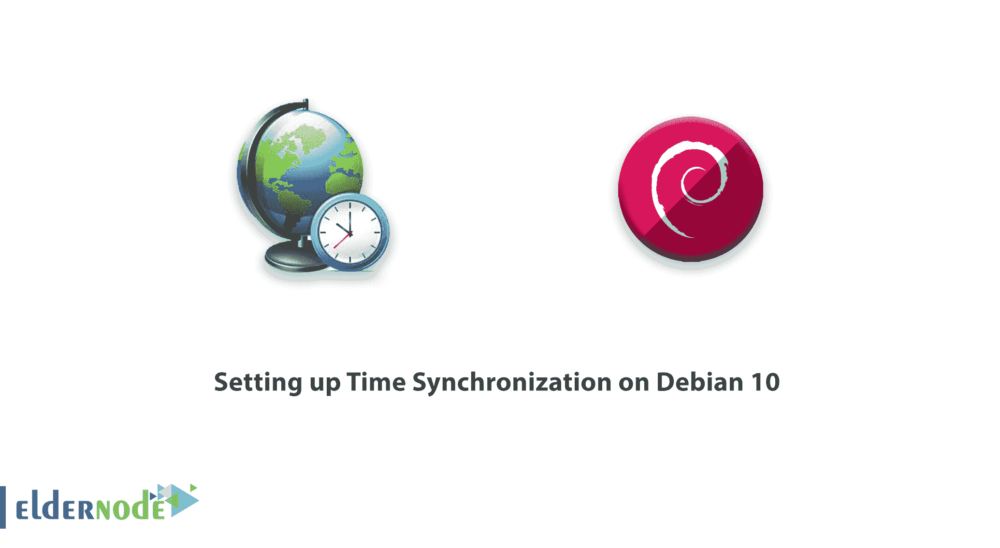

# 在 Debian 10 - Eldernode 上设置时间同步

> 原文：<https://blog.eldernode.com/set-up-time-synchronization-debian-10/>



精确的时间同步至关重要。在现代软件中，用户确保日志以正确的顺序记录或数据库更新被正确应用，不同步时间会导致错误、数据损坏和其他难以调试的问题。

在这篇文章中，你会看到 Debian 10 是内置时间同步的，默认情况下它是使用标准的 ntpd 时间服务器激活的，由 ntp 包提供。为了让你的学习更好地进行，选择你自己的 [Ubuntu VPS 服务器](https://eldernode.com/ubuntu-vps/)，它可以即时激活。

为了让本教程更好地发挥作用，请考虑下面的**先决条件** :
一个拥有 sudo 权限
的非根用户要进行设置，请遵循我们的[Debian 10 的初始设置](https://eldernode.com/initial-setup-with-debian-10/)

## 在 Debian 10 上设置时间同步

与我们一起回顾一些与时间相关的基本命令，验证 ntpd 是否处于活动状态并连接到对等方，并了解如何激活备用 systemd-timesyncd 网络时间服务。因此，让我们准备好浏览本指南的步骤，并了解更多关于 Debian 10 上的时间同步。

### 步骤 1:如何导航基本时间命令

您可以使用日期来找出您服务器上的时间。所有用户都能够运行下面的命令并打印出日期和时间。

```
date
```

输出

```
Wed 31 Jul 2019 06:03:19 PM UTC
```

您的服务器将默认为 UTC 时区，如您在输出中所见。什么是 UTC？现在是协调世界时，即经度零度的时间。当您的基础设施跨越多个时区时，一致使用世界时可以减少混乱。但是，如果您有不同的要求并需要更改时区，您也可以使用 timedatectl 命令。

首先，列出可用的时区:

```
timedatectl list-timezones
```

要打印你的屏幕，你需要一个时区列表。按下空格键向下翻页，按下 b 向上翻页。当你找到正确的时区时，不要忘记记下它，然后键入 q 退出列表。

是时候用 timedatectl set-timezone 设置时区了。确保用您在列表中找到的时区替换(美国/纽约)。请记住使用 sudo 和 timedatectl 来进行更改:

```
sudo timedatectl set-timezone America/New_York
```

要验证您的更改，您可以再次运行 date :

```
date
```

输出

```
Wed 31 Jul 2019 02:08:43 PM EDT
```

时区缩写应该反映新选择的值。从现在起，你知道如何检查时钟和设置时区。因此，我们将确保我们的时间同步正确。

### 步骤 2:如何检查 ntpd 的状态

您可以相信 Debian 10 bout 为您提供了标准的 ntpd 服务器，它可以让您的系统时间与一组外部时间服务器保持同步，因为它默认运行 ntpd。

要检查它是否正在运行，请使用以下命令:

```
sudo systemctl status ntp
```

输出

```
● ntp.service - Network Time Service     Loaded: loaded (/lib/systemd/system/ntp.service; enabled; vendor preset: enabled)     Active: active (running) since Wed 2019-07-31 13:57:08 EDT; 17min ago       Docs: man:ntpd(8)   Main PID: 429 (ntpd)      Tasks: 2 (limit: 1168)     Memory: 2.1M     CGroup: /system.slice/ntp.service             └─429 /usr/sbin/ntpd -p /var/run/ntpd.pid -g -u 106:112  . . .
```

当你在输出中看到 active (running) 状态时，说明 ntpd 启动正常。要获得关于 ntpd 状态的更多信息，您可以使用 ntpq 命令:

```
ntpq -p
```

输出

```
 remote           refid      st t when poll reach   delay   offset  jitter  ==============================================================================   0.debian.pool.n .POOL.          16 p    -   64    0    0.000    0.000   0.000   1.debian.pool.n .POOL.          16 p    -   64    0    0.000    0.000   0.000   2.debian.pool.n .POOL.          16 p    -   64    0    0.000    0.000   0.000   3.debian.pool.n .POOL.          16 p    -   64    0    0.000    0.000   0.000  +208.67.72.50    152.2.133.55     2 u   12   64  377   39.381    1.696   0.674  +198.46.223.227  204.9.54.119     2 u    6   64  377   22.671    3.536   1.818  -zinc.frizzen.ne 108.61.56.35     3 u   43   64  377   12.012    1.268   2.553  -pyramid.latt.ne 204.123.2.72     2 u   11   64  377   69.922    2.858   0.604  +nu.binary.net   128.252.19.1     2 u   10   64  377   35.362    3.148   0.587  #107.155.79.108  129.7.1.66       2 u   65   64  377   42.380    1.638   1.014  +t1.time.bf1.yah 98.139.133.62    2 u    6   64  377   11.233    3.305   1.118  *sombrero.spider 129.6.15.30      2 u   47   64  377    1.304    2.941   0.889  +hydrogen.consta 209.51.161.238   2 u   45   64  377    1.830    2.280   1.026  -4.53.160.75     142.66.101.13    2 u   42   64  377   29.077    2.997   0.789  #horp-bsd01.horp 146.186.222.14   2 u   39   64  377   16.165    4.189   0.717  -ntpool1.603.new 204.9.54.119     2 u   46   64  377   27.914    3.717   0.939
```

`ntpq 是 ntpd 的查询工具。 -p 标志询问 ntpd 所连接的 NTP 服务器(或对等体)的信息。您的输出会略有不同，但是应该列出默认的 Debian 池服务器和一些其他的服务器。请记住，ntpd 可能需要几分钟时间来建立连接。`

### `第三步:如何切换到 systemd-timesyncd`

`万一需要替换 ntpd，可以使用 systemd 内置的 timesyncd 组件。timesyncd 是 ntpd 的轻量级替代方案，与 systemd 的集成程度更高。但是，请注意，它不支持作为时间服务器运行，并且它在用于保持系统时间同步的技术方面稍微不太成熟。如果您正在运行复杂的实时分布式系统，您可能希望坚持使用 ntpd。`

`首先，卸载 ntpd 以使用 timesyncd:`

```
`sudo apt purge ntp`
```

`然后，启动 timesyncd 服务:`

```
`sudo systemctl start systemd-timesyncd`
```

`最后，检查服务的状态以确保它正在运行:`

```
`sudo systemctl status systemd-timesyncd` 
```

`输出`

```
`● systemd-timesyncd.service - Network Time Synchronization     Loaded: loaded (/lib/systemd/system/systemd-timesyncd.service; enabled; vendor preset: enabled)    Drop-In: /usr/lib/systemd/system/systemd-timesyncd.service.d             └─disable-with-time-daemon.conf     Active: active (running) since Wed 2019-07-31 14:21:37 EDT; 6s ago       Docs: man:systemd-timesyncd.service(8)   Main PID: 1681 (systemd-timesyn)     Status: "Synchronized to time server for the first time 96.245.170.99:123 (0.debian.pool.ntp.org)."      Tasks: 2 (limit: 1168)     Memory: 1.3M     CGroup: /system.slice/systemd-timesyncd.service             └─1681 /lib/systemd/systemd-timesyncd`
```

`您可以使用 timedatectl 打印出 systemd 对时间的当前理解:`

`输出`

```
`timedatectl`
```

`这将打印出本地时间、世界时间(如果您没有从 UTC 时区切换过来，它可能与本地时间相同)和一些网络时间状态信息。系统时钟同步:是表示时间已经成功同步， NTP service: active 表示 timesyncd 启用并运行。`

```
 `Local time: Wed 2019-07-31 14:22:15 EDT             Universal time: Wed 2019-07-31 18:22:15 UTC                   RTC time: n/a                  Time zone: America/New_York (EDT, -0400)  System clock synchronized: yes                NTP service: active            RTC in local TZ: no`
```

`结论`

`在本文中， 您学习了如何查看系统时间、更改时区、使用 ntpd 以及切换到 systemd 的 timesyncd 服务。如果你有比我们在这里讨论的更复杂的计时需求，你可以参考 NTP 官方文档，也可以看看 NTP Pool 项目，这是一个全球性的志愿者组织，提供了世界上大多数的 NTP 基础设施。如果你对这个主题感兴趣，可以多看一些关于[在 Ubuntu 18](https://blog.eldernode.com/set-timezone-ubuntu-18/) **上设置日期时间和** [在 CentOS 7 Linux](https://blog.eldernode.com/set-timezone-centos-7/) 上设置时区的相关文章。`

## `结论`

`在本文中， 您学习了如何查看系统时间、更改时区、使用 ntpd 以及切换到 systemd 的 timesyncd 服务。如果你有比我们在这里讨论的更复杂的计时需求，你可以参考 NTP 官方文档，也可以看看 NTP Pool 项目，这是一个全球性的志愿者组织，提供了世界上大多数的 NTP 基础设施。如果你对这个主题感兴趣，可以多看一些关于[在 Ubuntu 18](https://blog.eldernode.com/set-timezone-ubuntu-18/) **上设置日期时间和** [在 CentOS 7 Linux](https://blog.eldernode.com/set-timezone-centos-7/) 上设置时区的相关文章。`