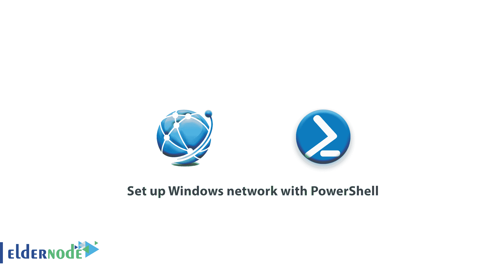

# 如何用 PowerShell 设置 Windows 网络-教程 PowerShell

> 原文：<https://blog.eldernode.com/set-up-windows-network-with-powershell/>



如何用 PowerShell 设置 Windows 网络？从 [PowerShell 培训系列](https://eldernode.com/tag/powershell-commands/)、到本文，我们将教你如何用 [PowerShell](https://docs.microsoft.com/en-us/powershell/) 设置 Windows 网络。PowerShell 作为 Windows 中一个强大的命令环境，能够配置 Windows 中的任何功能。网也不会脱离这个规律。

更高级的事情可以在 PowerShell Windows 网络设置中完成。因此，不可能在 Windows 图形环境中进行这些设置。所以和我们在一起吧。

[**买 Windows VPS 托管，便宜的 Windows VPS**](https://eldernode.com/windows-vps/)

## 使用 PowerShell 设置 Windows 网络

### 显示系统中的网卡

以下命令显示带有名称、前缀等的接口列表:

```
Get-NetAdapter
```

### 显示所有网卡的当前设置

以下命令与 CMD 环境中的 Ipconfig 命令相同，将显示所有网卡信息:

```
Get-NetIPConfiguration
```

如果需要获取物理接口的信息，输入以下命令:

```
Get-NetAdapterHardwareInfo
```

下面，我们将通过 PowerShell 对网络进行配置。

### 使用 PowerShell 命令设置 IP

PowerShell 中的 IP 地址设置命令有很多参数。

以下示例使用最完整的结构之一来了解有关此命令参数的更多信息:

```
New-NetIPAddress -InterfaceAlias "Ethernet" -IPAddress 192.168.1.10 -PrefixLength 24 -DefaultGateway 192.168.1.1 -AddressFamily IPv4
```

在上面的命令中，在以太网 接口上设置了所需的 IP。为了更熟悉这个命令，我们将解释它的参数。

**接口别名:** 接口名称由该参数指定。

**IP 地址:** 在该字段输入所需的 IP 地址。

**前缀长度:** 通过输入该参数，进入网络子网。

**默认网关:** 该字段输入网络的默认网关地址。

**AddressFamily:** 在 IPv4 和 IPv6 模式下的 IP 地址类型将在本节中指定。

通过这种方式，您可以输入想要注册 IP 的信息。

### 使用 PowerShell 为网络接口设置 DNS

在下面的命令中，输入了服务器的 DNS 地址。如您所见，**主 DNS** 和**备用 DNS** 被输入到一个命令中，并用逗号隔开。

```
Set-DnsClientServerAddress -InterfaceAlias "ethernet" -ServerAddresses 8.8.8.8,4.2.2.4
```

### 使用 PowerShell 启用和禁用网络 DHCP】

**启用 DHCP:**

```
Set-NetIPInterface -InterfaceAlias "ethernet" -Dhcp Disable
```

**禁用 DHCP:**

```
Set-NetIPInterface -InterfaceAlias "ethernet" -Dhcp Enable
```

因此，您可以为接口启用或禁用 DHCP 。

### 使用 PowerShell 启用或禁用网络接口

**禁用网卡:**

```
Disable-NetAdapter -Name "Ethernet"
```

**启用网卡:**

```
Enable-NetAdapter -Name "Ethernet"
```

**注意** 输入上述任一命令后，会要求您确认执行该命令。

**亦作，见:**

[如何使用 PowerShell 在 Windows 上安装 SSH 客户端](https://eldernode.com/install-ssh-client-on-windows-using-powershell/)

[如何在 PowerShell 中管理文件和文件夹](https://eldernode.com/manage-files-and-folders-in-powershell/)

**尊敬的用户**，我们希望您能喜欢这个[教程](https://eldernode.com/category/tutorial/)，您可以在评论区提出关于本次培训的问题，或者解决[老年人节点培训](https://eldernode.com/blog/)领域的其他问题，请参考[提问页面](https://eldernode.com/ask)部分，并尽快提出您的问题。腾出时间给其他用户和专家来回答你的问题。

祝你好运。