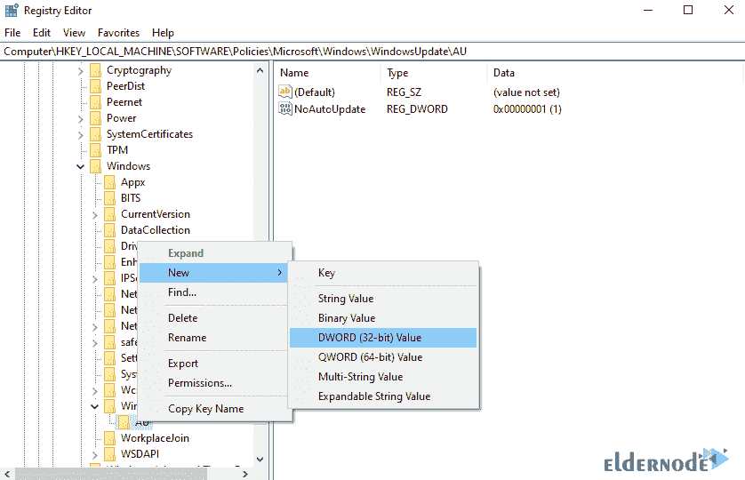
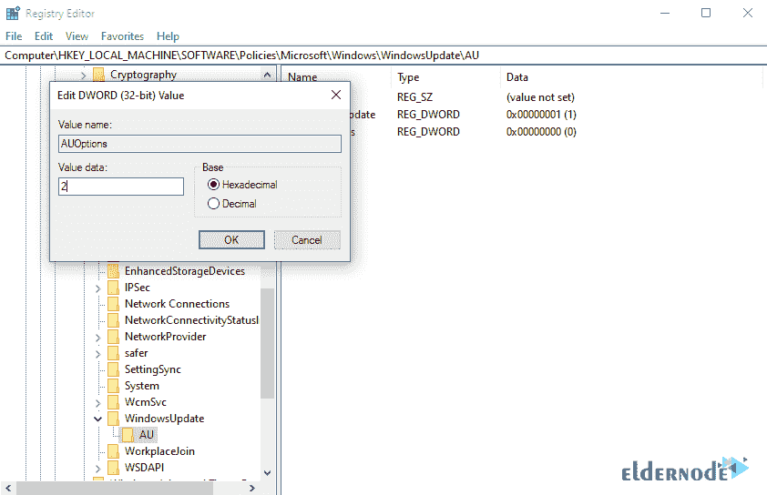

# 如何通过注册表设置 Windows 10 更新- ElderNode 博客

> 原文：<https://blog.eldernode.com/set-windows-10-update/>


教程如何**通过注册表**设置 Windows 10 更新。在本文中，我们将讨论如何通过[注册表](https://en.wikipedia.org/wiki/Registry)来设置 Windows 10 更新，这样你就可以使用这种方法来改变和调整更新状态。要查看关于 **Windows 10 更新**的其他文章，请参考[如何在 Windows 10 中禁用自动更新](https://blog.eldernode.com/disable-auto-update-in-windows/)和[如何恢复 Windows 更新](https://blog.eldernode.com/revert-a-windows-update/)。你可以在 [Eldernode](https://eldernode.com/) 中选择你最完美的 [Windows VPS](https://eldernode.com/windows-vps/) 服务器包。

## 教程通过注册表设置 Windows 10 更新

**1。**使用 **Winkey+R** 组合键打开 **Run** 窗口。

**2。**然后输入 **Regedit** ，点击 **OK** 。


**3。**在注册表窗口中，转到下面一行中写的**地址**:

```
HKEY_LOCAL_MACHINE**\**SOFTWARE**\**Policies**\**Microsoft**\**Windows
```


**4。** **在如下图的 Windows 目录下右击**，在**新建**菜单中选择**键**。


**5。**然后输入名字 WindowsUpdate 并按**键输入**。

**6。**现在**在你上一步创建的 WindowsUpdate 目录上右击**，再次从**新建**菜单中选择**键**选项。

***注:*** 在这一步中，输入其名称 AU。


**7。右键单击 AU 目录中的**并选择 **DWORD** 选项。



**8。**在 **AUOptions** 中输入 **DWORD** 键的名称，按**进入**。


**9。**现在**双击** **点击 AUOptions 按钮上的**将其打开。

10。在此部分，您必须输入一个介于 2 和 5 之间的数字**，我们在下面给出了它们各自的含义:**

***2:*** 它会在每次下载安装更新前给你一个提示信息。

***3:*** 更新会自动下载，安装前会通知你。

***4:*** 自动下载并设置时间自动安装。

***5:*** 允许并访问本地管理系统选择更新状态。

建议输入最佳案例，即**号 2** 。输入数字 2 会使用户在任何操作之前得到通知，并在需要时进行更新。



***注:*** 该方法在 **Windows Server 2016** 以及 Windows 10 家族中的其他窗口中适用并经过测试。

**结论**

关于如何通过注册表设置 Windows 10 更新的分步教程在本文中有完整的介绍。