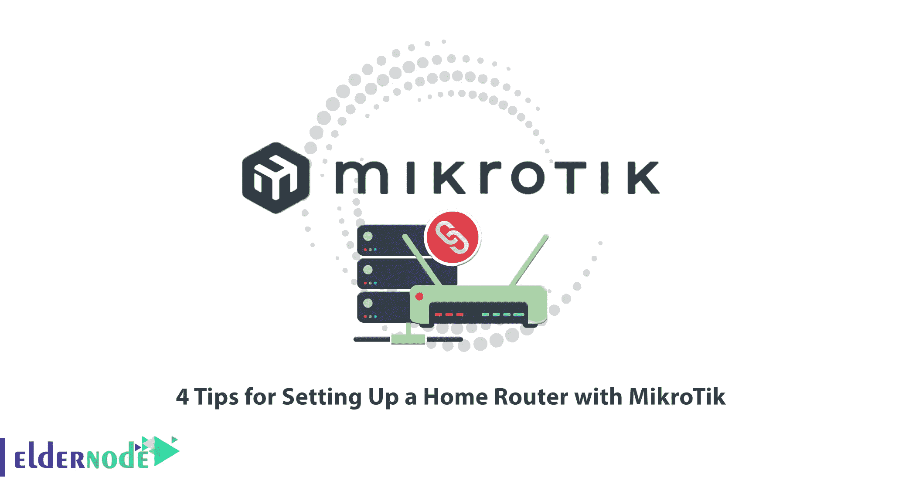

# 使用 MikroTik 设置家用路由器的 4 个技巧

> 原文：<https://blog.eldernode.com/setting-up-a-home-router-with-mikrotik/>

在许多公司、家庭等。那种使用 ADSL 上网的服务，除了调制解调器之外，还有一个 Mikrotik 来使用它在网络上的奇妙功能。使用 Mikrotik 有很多好处。在本文中，我们将向您介绍使用 MikroTik 设置家用路由器的 4 个技巧。有趣的是，你可以通过访问 [Eldernode](https://eldernode.com/) 网站查看和购买 [Mikrotik VPS](https://eldernode.com/mikrotik-vps-server/) 套餐。

## **如何用 MikroTik** 设置家庭路由器

### **调制解调器设置**

为了将 ADSL 调制解调器连接到 Mikrotik，必须首先在调制解调器上进行一系列设置，以便 Mikrotik 创建到互联网的连接，而不是调制解调器。为此，只需遵循以下步骤。

首先，你需要用网线把调制解调器连接到电脑上。

***注:*** 考虑到一开始调制解调器的默认 IP 是 192.168.1.1，当你要将电脑连接到调制解调器并进行通信时，调制解调器的 IP 地址和电脑的 IP 地址必须在同一个家族。所以你的电脑的 IP 地址应该在 **192.168.1.2** 和 **192.168.1.254** 之间。

在调制解调器 IP 地址范围内选择您的计算机以太网卡的 IP 地址。比如 192.168.1.5。目前不需要设置网关和 [DNS](https://blog.eldernode.com/dns-configuration-tutorial-in-mikrotik/) 。

在浏览器地址中输入调制解调器的默认 IP 地址，即 **192.168.1.1** 。请注意，如果您的调制解调器设置不是默认设置，请重置它们。

然后需要进入调制解调器设置 web 环境。这里会要求您输入用户名和密码来登录。默认情况下，两者的值都是 **admin** 。

在**接口设置**选项卡中，禁用**局域网**部分的 **DHCP** 选项。如有必要，您可以在 Mikrotik 中激活 DHCP 服务。

在**互联网**部分的**界面设置**选项卡中，根据互联网提供商 ISP 提供的代码设置 **VPI** 和 **VCI** 选项。

主要是将 **ISP** 选项设置为**桥**模式。要在 Mikrotik 中建立 **PPPoE** 连接，请将调制解调器置于桥接模式，以便与 Mikrotik 桥接。

### **熟悉桥牌和 PPPoE**

调制解调器中有不同类型的连接，其中两种被广泛使用:**桥**型和 **PPPoE** 。

**什么是桥？**

当调制解调器连接设置为桥接类型时，意味着它准备好与另一个设备桥接。在这种情况下，如果您将调制解调器的网络电缆连接到 Mikrotik，这两个设备将桥接在一起，Mikrotik 可以发出连接命令。

什么是 PPPoE 或以太网点对点协议？

还有一个题目叫“**隧道**”。与互联网通信需要隧道。有不同类型的隧道，PPPoE 就是其中之一。当调制解调器设置为 PPPoE 时，它会立即要求您输入用户名和密码。这是您的互联网服务提供商(ISP)给您的用户名和密码。

***注意:*** 将调制解调器连接到 Mikrotik 时，调制解调器连接不应处于 PPPoE 模式。意思是不允许调制解调器先连接，再给 Mikrotik 等电脑上网！相反，调制解调器必须处于**桥接**模式才能与 Mikrotik 桥接，并在 Mikrotik 中创建 **PPPoE 连接**。现在 Mikrotik 指示调制解调器是否连接到互联网！这样做是因为如果互联网中断，利用 Mikrotik 拥有的设施，将更容易诊断和控制网络。

### **Mikrotik 设置将家庭路由器连接到 Mikrotik**

断开从调制解调器连接到电脑的电缆，并将网络电缆从第二个 Mikrotik 端口连接到电脑。

打开 [winbox](https://blog.eldernode.com/connect-to-mikrotik-using-winbox/) 软件，选择你的 Mac Mikrotik 地址并连接。如果 Mikrotik 处于默认设置，其 IP 地址为 **192.168.88.1** 。

在这个阶段，需要**重置** Mikrotik，它将失去默认设置，并拥有一个原始的 Mikrotik！使用 **winbox** 连接到它，并从**系统**子菜单中选择**重置配置**。在打开的窗口中，检查**没有默认配置**，然后**复位**。

通过 **winbox** 再次连接到原始 Mikrotik，其 IP 地址在重置后已更改为 **0.0.0.0** 。

然后用电缆将调制解调器连接到 Mikrotik 的第一个端口。

从菜单中选择**界面**选项，查看 Mikrotik 网卡的**状态:**

要在 Mikrotik 中创建一个 **PPPoE 连接**，你需要输入你的 **ISP** 给出的**用户名**和**密码**，这样 Mikrotik 就可以连接到互联网。因此，点击接口列表窗口中的“ **+** ”按钮，选择 **PPPoE** **Client** 选项。

在打开的**新界面**窗口和**总**页签中，在**名称**字段中输入名称。现在你必须在**接口**部分指定你想要连接的**网卡**。

输入您的 **ISP** 提供的**用户名**和**密码**。当您点击 **OK** 时，立即检查**状态**以了解互联网连接的状态。

需要注意的是，您可以在 **Traffic** 选项卡中查看流量。

每当您想要检查 Mikrotik 与互联网的连接时，需要点击**接口列表**中的 **PPPoE 连接**，在打开的窗口中，检查**状态**(在窗口底部)是**连接**还是**断开**。

您可以从**工具**菜单中选择 **Ping** ，Ping【8.8.8.8】的**T5。**

你可以在**IP->地址**部分看到分配给 **ether1** 的 IP 地址。

### **连接电脑上网**

首先需要手动为 Mikrotik 的 ether2(第二块网卡)和电脑设置 IP 地址，当然两者必须在同一个家族才能看到对方。您可以**启用 DHCP** 。

如上图所示，在**地址列表**窗口中选择 **+** 按钮，输入 Mikrotik 端口 2 的地址 **192.168.10.1/24** 。

在您给 Mikrotik 的 IP 地址范围内确定您的计算机的 IP 地址:

#### **mikro tik**中的路线定义

从 IP 菜单中选择路由。PPPoE 连接建立后，会自动创建一条路由，以便任何目的地为 0.0.0.0/24 的消息从 Mikrotik ether 1 进入互联网空间。

#### **mikro tik**中 NAT 的定义

任何源地址来自 192.168.10.0/24 家族的报文，想要离开 Mikrotik 的 ether1，必须将其 IP 地址替换为 Mikrotik 的 port 1 (ether1)，然后离开。

为此，从 **IP** 选项中选择 **Fierwall** ，并在打开的窗口中选择 **NAT** 选项卡。打开**新 NAT 规则**窗口。

首先，您必须在**常规**选项卡中定义条件。

**链:**选择 Srcnat。

**Src。地址:** 192.168.10.0/24

**出去。接口:**以太 1

在**常规**选项卡中设置好条件后，在**动作**选项卡中，选择**动作**的**伪装**操作，最后点击 **OK** 。

*

在最后一步，您可以在**运行**窗口中键入 **cmd** 并获得一个 ping。

Recommended Article: [MikroTik Firewall](https://blog.eldernode.com/mikrotik-firewall/)

## 结论

众所周知，所有全球性公司都使用调制解调器连接互联网。由于用户的应用类型，调制解调器不能为我们提供管理和控制用户的可能性。为了控制用户对互联网的访问，路由器被放置在互联网和用户之间的路径上，这样就有可能管理用户。在这篇文章中，我们试图教你 4 个技巧，用 MikroTik 完全设置一个家庭路由器。如果你有任何问题，请在评论区告诉我们。