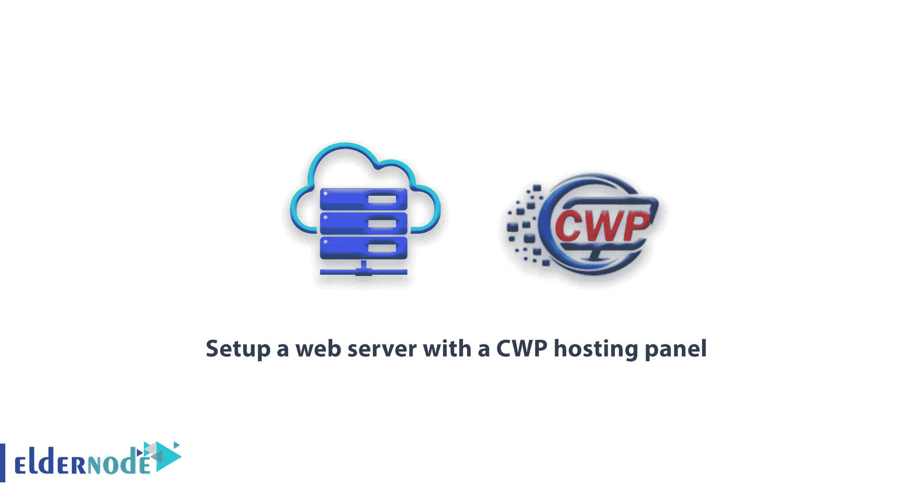

# 如何使用 CWP 主机面板- Eldernode 设置 web 服务器

> 原文：<https://blog.eldernode.com/setup-a-web-server-with-a-cwp/>

教程如何设置一个 CWP 托管面板的网络服务器。

CWP 主机面板区别于其他面板的最大特点之一是只需一次点击就能自动调整和选择各种网络服务器。CWP 团队在其面板中有一个部分，服务器管理员只需输入该部分及其设置，就可以从一台 web 服务器转移到另一台。

要在当前发布的最新版本的 CWP 中设置 web 服务器，您只需从“web 服务器设置”菜单转到“选择 web 服务器”部分。

### 用 CWP 设置 web 服务器

然后选择 6 个选项之一，并单击保存和重建配置:

1)仅 Apache:顾名思义，只有 Apache web 服务器将在服务器上工作，您可以利用这个简单的 web 服务器。

2)仅 Nginx:与第一个选项一样，本节将只为您设置 Nginx web 服务器。

3) LiteSpeed Enterprise:今天，光速 web 服务器是当今世界上最受欢迎的 web 服务器之一，它拥有大量的粉丝，由于其轻便、快速而简单的设置而非常受欢迎。但对于这个版本的网络服务器，你必须每月支付费用，并获得这个网络服务器的许可证。

4) Nginx 和 Apache:从这个选项开始，在 CWP 选择 web 服务器的吸引力就开始了，只需点击一下，就可以选择 Nginx 作为反向代理，Apache 作为主 web 服务器。这种模式在 Linux 世界里有相对复杂的设置，但是在 CWP 你只需点击一下就可以进入。

5) Nginx & Varnish:是一个强大的，当然也是免费的服务器缓存，可以大大提高主 web 服务器的效率，以及服务器的安全性。所以通过选择这个选项，主 web 服务器将被设置为 Nginx，Varnish 将被设置为 Nginx 旁边的服务器缓存。

6)Nginx & Varnish & Apache:CWP 最后一个配置巨头是最后一个，同时也是最重最高效的选择。在这种情况下，Apache 将作为 web 服务器，Nginx 作为反向代理，Varnish 作为服务器缓存，根据 CWP 的说法，在这种情况下，服务器将具有最高的性能和速度。

我们希望你喜欢使用 CWP 网络服务器安装教程。