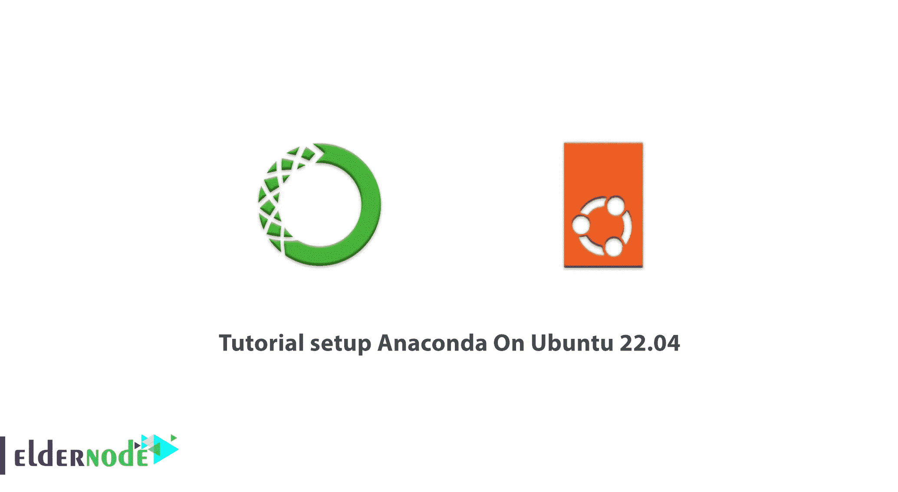
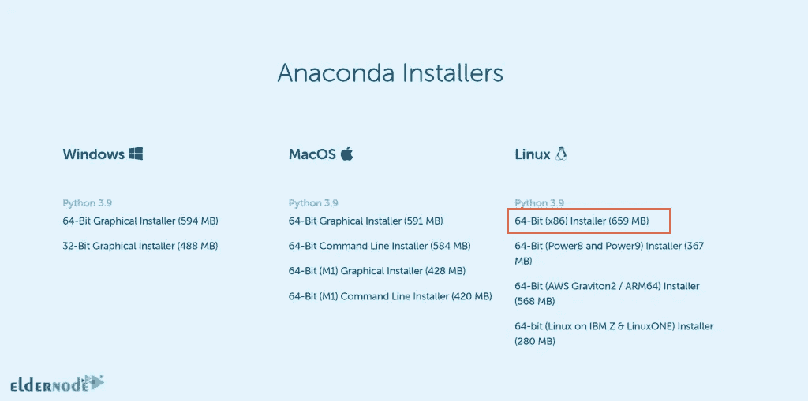
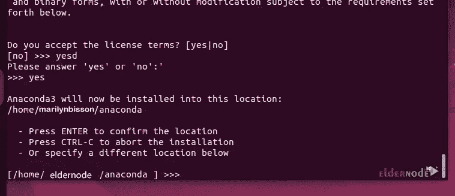
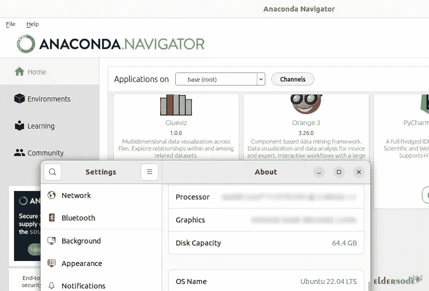
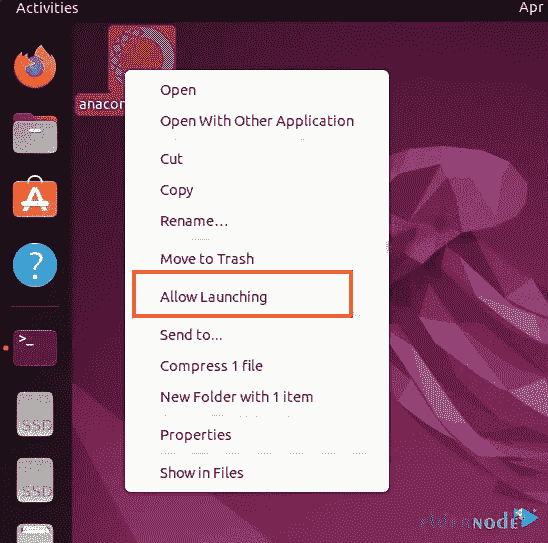

# Ubuntu 22.04 上的教程设置 Anaconda-elder node 博客

> 原文：<https://blog.eldernode.com/setup-anaconda-on-ubuntu-22-04/>



人们开始理解对具有巨大潜力的 Pb 级数据进行分析的需求，并发现它对进入未来世界非常有用。这一指标需要制作几个科学数据包，通过进行更多的数据分析来完成这一过程。尽管已经开发了许多数据科学包，但是许多用户更喜欢名为 Anaconda 的最好的数据科学包之一。在本文中，我们将教你如何在 Ubuntu 22.04 上设置 Anaconda。如果你想购买一台 [**Ubuntu VPS**](https://eldernode.com/ubuntu-vps/) 服务器，你也可以查看 [Eldernode](https://eldernode.com/) 网站上提供的软件包。

## **什么是蟒蛇？**

Anaconda 是 Python 和 R 编程语言的免费开源发行版，用于执行科学计算和处理大量数据。Anaconda 旨在简化包管理和部署。Anaconda 发行版有超过 1500 万用户使用，包括超过 1500 个适用于 Windows、 [Linux](https://blog.eldernode.com/tag/linux/) 和 macOS 的科普数据集。

Anaconda 是 2012 年 7 月 17 日推出的一个完整的科学包，试图创建一套完整的用于数据科学的包。这个包非常容易下载和安装，并且在 Linux、Windows 和 macOS 上受到高度支持。除了 Python 和 R，Anaconda 还包括 Scala 编程语言。

### **蟒蛇特征**

->能够下载超过 1500 个 Python/R 数据科学包

->管理库、依赖项和环境

->使用 sci-kit-Learn、TensorFlow 和 Theano 开发和培训机器学习和深度学习模型

->使用 Dask NumPy、Pandas 和 Numba 进行可扩展和性能数据分析

->使用 Matplotlib、Bokeh、Datashader 和 Holoviews 可视化结果

## **如何在 Ubuntu 22.04 上设置 Anaconda**

Anaconda 在默认的 [Ubuntu](https://blog.eldernode.com/tag/ubuntu/) 22.04 系统仓库中不可用，您需要手动下载 Anaconda 安装脚本。

首先，进入官方 [Anaconda 下载](https://www.anaconda.com/)页面，选择**下载**部分下的 **Linux** 图标。


现在您将导航到下一页。选择 Linux 的 **64 位**版本。等待下载完成。



下载完成后，打开终端并转到下载目录。您可以通过输入以下命令进入**下载目录**:

```
cd Downloads
```

由于使用浏览器下载的所有内容都默认进入**下载**菜单，请检查下载的脚本文件是否在文件夹中。为此，请运行以下命令:

```
ls
```

确保文件存在后，运行以下命令:

```
sh file-name
```

***注意:*** 记住把你的文件名放在命令里，而不是**文件名**。

安装向导启动后，您应该按下 **Enter** 键开始配置过程。写 **Yes** 同意条款和条件，按 **q** 跳过“**最终用户许可协议**”。

现在你需要设置**安装**文件夹的位置。安装目录将在您的当前用户下创建。要分配和定义一些自定义位置，按**键输入**。



接下来，您需要初始化 Conda init。为此，键入 **Yes** 并按下 **Enter** 。

要访问 Anaconda 命令工具，可以通过运行以下命令将提取的 Anaconda 文件夹路径添加到系统路径中:

```
echo "export PATH=$PATH:/home/eldernode/anaconda/bin">> ~/.bashrc
```

如果您想在不重新启动和注销会话的情况下使用 Anaconda，您应该使用以下命令重新加载您的概要文件:

```
source ~/.bashrc
```

### **如何在 Ubuntu 22.04 上使用 Anaconda**

您可以通过输入以下命令为您的项目设置一个新的 Anaconda 环境:

```
conda create
```

如果您想在 Anaconda 环境中安装任何包,运行下面的命令:

```
conda install -n firstenv package-name
```

***注意:*** 记得写上你的包名而不是**包名**。

您可以使用以下命令**激活**环境:

```
conda activate firstenv
```

为了使**不激活**,使用以下命令:

```
conda deactivate
```

您可以使用以下命令**停用基于 Conda** 的环境，以防止在 Ubuntu 命令终端中启动时自动启动:

```
conda config --set auto_activate_base false
```

如果您想使用 Anaconda Navigator(Anaconda 的图形用户界面)来管理您的项目，只需输入以下命令:

```
anaconda-navigator
```



您可以使用以下命令更新 Anaconda:

```
conda update --all
```

如果您想**从系统中删除 Anaconda 安装目录**和所有其他文件，请使用以下命令:

```
rm -rf ~/anaconda3 ~/.condarc ~/.conda ~/.continuum
```

那你就要打开 **~/。bashrc** 文件，并从 path 环境变量中删除 Anaconda 目录:

```
# >>> conda initialize >>>  # !! Contents within this block are managed by 'conda init' !!  __conda_setup="$('/home/eldernode/anaconda3/bin/conda' 'shell.bash' 'hook' 2> /dev/null)"  if [ $? -eq 0 ]; then  eval "$__conda_setup"  else  if [ -f "/home/eldernode/anaconda3/etc/profile.d/conda.sh" ]; then  . "/home/eldernode/anaconda3/etc/profile.d/conda.sh"  else  export PATH="/home/eldernode/anaconda3/bin:$PATH"  fi  fi  unset __conda_setup  # <<< conda initialize <<<
```

### **如何创建桌面和** **启动器** **快捷方式**

您需要创建一个桌面快捷方式来启动 Anaconda Navigator。您可以手动执行此操作，而无需访问终端。

首先，在你的 Ubuntu 22.04 LTS 上打开**终端**。

现在，您应该通过输入以下命令转到**桌面目录**:

```
cd Desktop
```

然后使用您最喜欢的文本编辑器为 Anaconda 桌面快捷方式创建一个文件:

```
nano anaconda.desktop
```

看到配置文件后，您应该复制粘贴以下文本:

```
[Desktop Entry]  Version=1.0  Type=Application  Name=Anaconda  Exec=/home/eldernode/anaconda/bin/anaconda-navigator  Icon=/home/eldernode/anaconda/lib/python3.9/site-packages/anaconda_navigator/app/icons/Icon1024.png  Terminal=false
```

记住输入你的用户名而不是“eldernode ”,输入你系统的 python 版本而不是 3.9。

要保存文件，只需按下 **Ctrl+X** ，键入 **y** ，按下 **Enter** 。

此外，您需要为启动程序复制相同的内容:

```
sudo cp ~/Desktop/anaconda.desktop /usr/share/applications/
```



*


就是这样！

## 结论

Anaconda 包括 conda 命令行工具和 Anaconda Navigator，后者是一个桌面图形用户界面。我希望这篇教程对你有用。在本文中，我们教你如何在 Ubuntu 22.04 上安装 Anaconda。如果您有任何问题，可以通过评论联系我们。