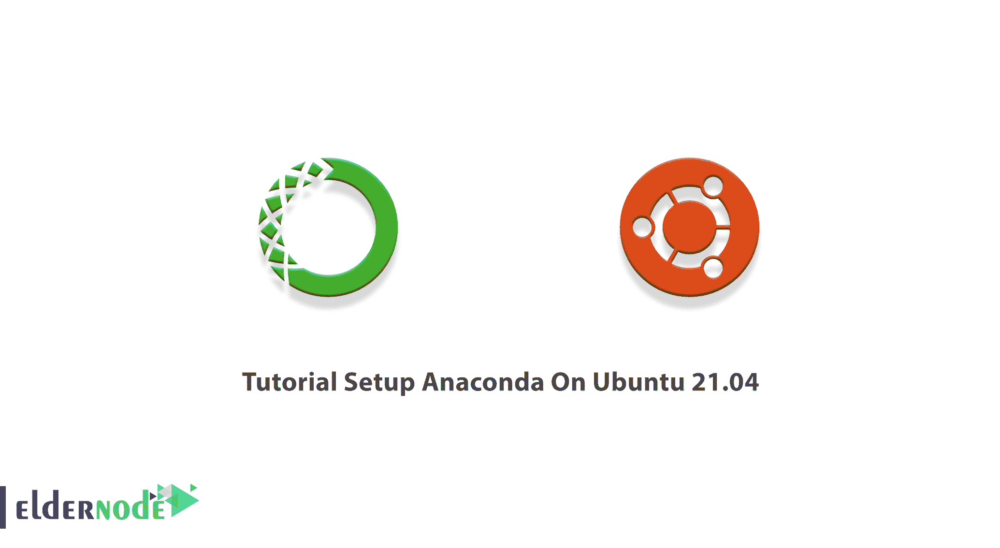

# Ubuntu 21.04 上的教程设置 Anaconda-elder node 博客

> 原文：<https://blog.eldernode.com/setup-anaconda-on-ubuntu/>



Anaconda 是一个开源 Python 发行版，旨在简化包管理和部署。最流行的 Python/R data science 真的很好装。使用此包管理器，您可以为大规模科学计算和预测分析处理数据。和我们一起回顾一下 Ubuntu 21.04 上的教程设置 Anaconda。 [Eldernode](https://eldernode.com/) 上有各种有趣的套餐。选择你需要的，购买你自己的 [Ubuntu VPS](https://eldernode.com/ubuntu-vps/) 主机服务器。

## **如何在 Ubuntu 21.04 上设置 Anaconda**

这不是关于那条危险的蛇，而是一种在 Linux、T2、Windows 和 macOS 上部署机器学习项目的简单方法。在 Linux 上，您可以使用 Anaconda 作为一个功能性的包管理器，在文件和包控制级别简化您的日常任务。本指南教你在你的 [Ubuntu](https://blog.eldernode.com/tag/ubuntu/) 服务器上安装 Anaconda。Anaconda 在 Ubuntu 的免费版本 Anaconda 个人版中提供，有 1500 多个开源包，由 Anaconda 工作组免费支持。在下一节中，我们将讨论在 Ubuntu 21.04 上安装 Anaconda 所需的先决条件。然后我们将讨论如何在 Ubuntu 21.04 上安装 Anaconda。请继续关注本文的其余部分。

### **在 Ubuntu 21.04 上安装 Anaconda 的先决条件**

为了让本教程更好地工作，请考虑以下先决条件:

_ 拥有 Sudo 权限的非 root 用户。

_ 要设置，请遵循我们在 [Ubuntu 21.04](https://blog.eldernode.com/initial-server-setup-on-ubuntu-21-04/) 上的初始服务器设置。

## **如何在 Ubuntu 21.04 上安装 Anaconda**

让我们通过本指南的步骤来回顾一下在 Ubuntu 21.04 上安装 Anaconda 的过程。很明显，在 Linux 上安装任何程序之前，你需要更新你的系统包。因此，使用以下命令来完成此操作:

```
sudo apt-get update
```

因为 Curl 将帮助实现安装 Anaconda 的命令，所以如果您的系统没有 Curl，您需要下载它。要了解您的系统，请运行:

```
sudo apt-get install curl
```

要下载 Anaconda 的最新版本，请前往 Anaconda 的官方页面。切换到 **/tmp** 目录，利用系统命令终端中的 curl 工具下载 Anaconda 安装程序。

```
cd /tmp
```

```
curl –O https://repo.anaconda.com/archive/Anaconda3-2020.02-Linux-x86_64.sh
```

在这一步，您可以**验证安装程序**的数据完整性。要确保通过 SHA-256 校验和进行加密哈希验证的安装程序的完整性，请运行:

```
sha256sum Anaconda3–2020.02–Linux–x86_64.sh
```

然后，您将看到一系列字母和数字，如下所示:

```
69581cf739365ec7fb95608eef694ba959d7d33b36eb961953f2b82cb25bdf5a Anaconda3-2019.07-Linux-x86_64.sh
```

***注*** :将显示的代码与 Anaconda 版本页面上的哈希代码进行比较。两个代码应该匹配。如果您选择了不同的版本，请确保查看该版本校验和的文档。

要运行 Anaconda 安装脚本，您需要运行 bash 脚本。所以跑吧:

```
bash Anaconda3-2020.02-Linux-x86_64.sh
```

一旦出现许可协议，使用 **Enter** 键查看协议，并键入 **yes** 同意条款。

安装程序将提示您接受默认位置，或者安装到不同的位置。除非您特别需要更改，否则请使用默认路径。(如果需要，您可以在此取消安装。)

在**成功安装**之后，会询问您是否希望安装程序预先考虑 Anaconda3 的安装位置。所以，如果你想在不改变目录的情况下使用 **Conda 命令**，输入 **yes** 并点击**回车**。

### **如何在 Ubuntu** 上激活安装 Anaconda

完成安装后，您可以使用以下命令来激活安装:

```
source ~/.bashrc
```

此外，要测试安装，请键入:

```
conda info
```

这样，将显示通过 Anaconda 安装获得的所有包的输出。

## **如何在 Ubuntu 21.04 上设置 Anaconda**

要设置 Anaconda 环境，您可以使用 **Conda create** 命令。要创建 Python 3 环境，请运行:

```
conda create ––name test_environment python=3
```

在这个例子中，我们使用了 **test_environment** 名称。可以换成自己喜欢的。

要激活您当前的环境，请运行:

```
conda activate test_environment
```

如您所见，您的命令提示符前缀将会改变。这意味着你处于一个激活的 Anaconda 环境中。现在，你已经准备好开始一个项目的工作了。

### **如何在 Ubuntu 21.04 上更新 Anaconda**

您可以使用下面的命令来更新 Ubuntu 上的 Anaconda。为此，从**更新 Conda** 实用程序开始:

```
conda update conda
```

然后，运行 Anaconda 包更新命令:

```
conda update anaconda
```

## 结论

在本文中，您了解了如何在 Ubuntu 21.04 上安装 Anaconda。不要忘记选择与您的 Python 版本一致的 Anaconda 版本。由于这是最新发布的 Ubuntu 版本，你们将是第一批在它上面使用 Anaconda 的人。向您在 [Eldernode Community](https://community.eldernode.com/) 上的朋友发送反馈以帮助他们。