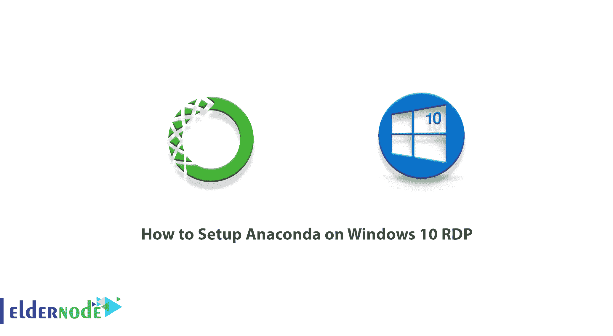
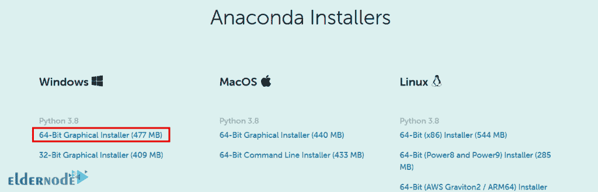
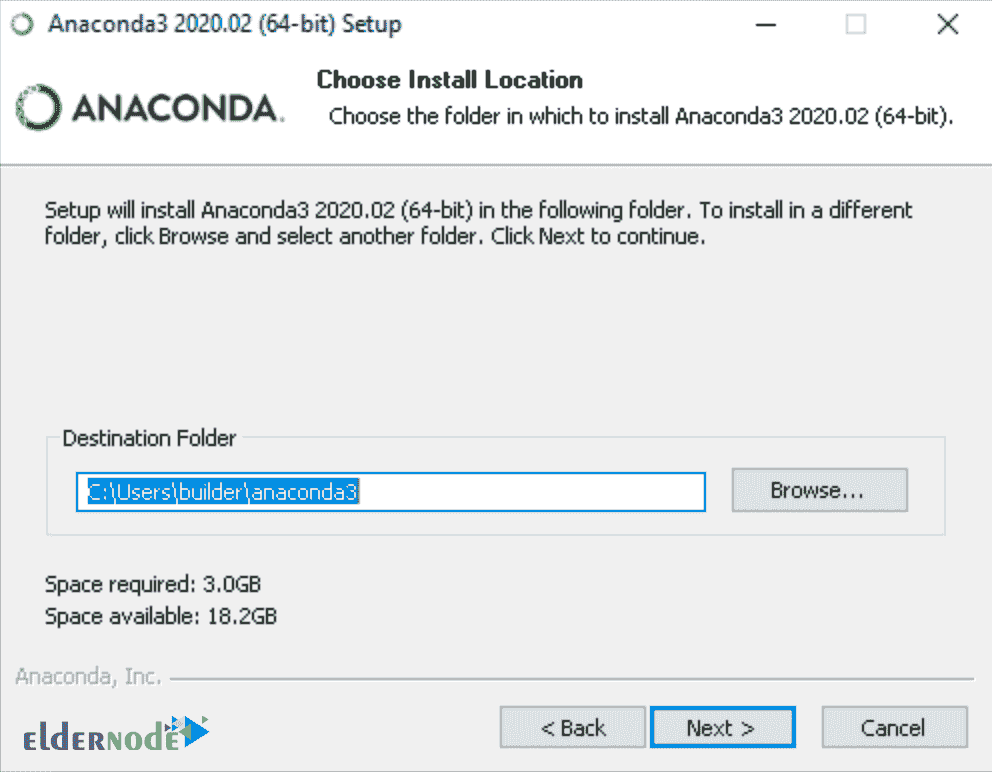
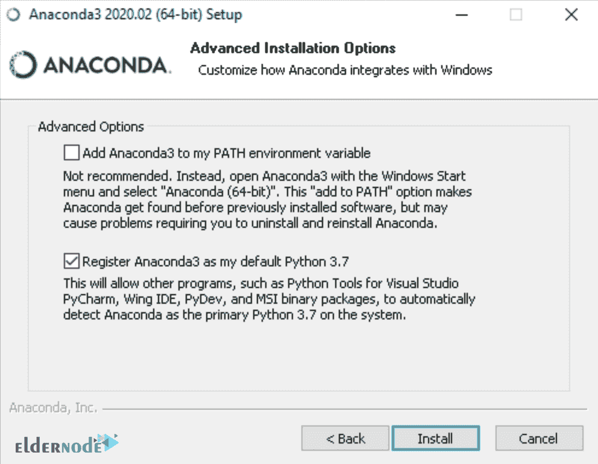
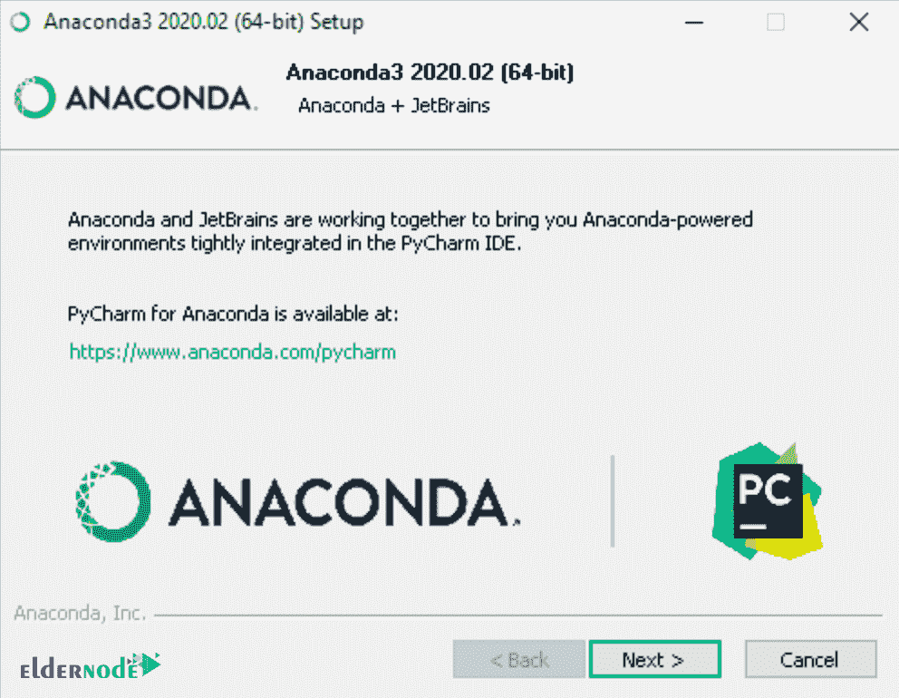
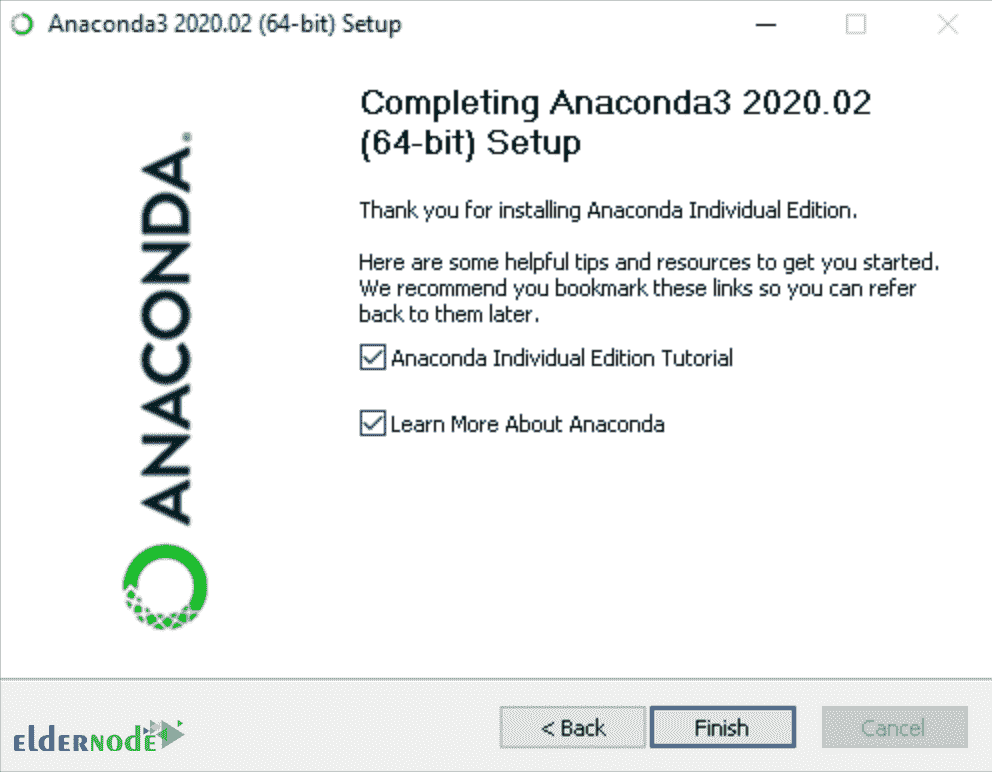
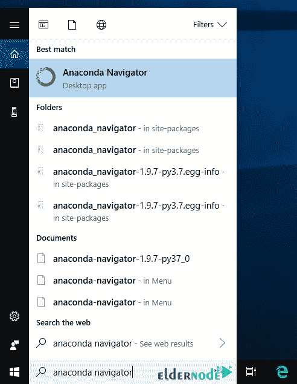
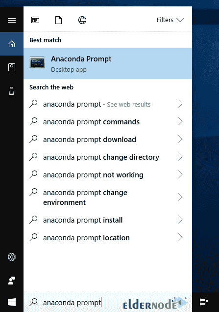

# 如何在 Windows 10 上设置 Anaconda RDP-elder node 博客

> 原文：<https://blog.eldernode.com/setup-anaconda-on-windows-10/>



Anaconda 是 Python 和 R 编程语言的免费开源发行版，用于执行科学计算和处理大量数据。它旨在促进对所用软件包的管理。通过安装 Anaconda‌，我们将可以访问名为 **Conda** 的软件包管理系统，该系统允许用户搜索、安装、运行和更新他们想要的软件包。这个系统最初是为 Python 创建的，但现在可以用于其他编程语言，如 Java、Ruby、C 和 Fortran。在这篇文章中，我们将教你一步一步**如何在 Windows 10 RDP** 上设置 Anaconda。如果你想买一台 [Windows VPS](https://eldernode.com/windows-vps/) 服务器，你可以在 [Eldernode](https://eldernode.com/) 看到可用的软件包。

## **教程在 Windows 10 上设置 Anaconda RDP**

Anaconda 发行版目前有 1500 多万用户在使用，在大多数操作系统中包含大约 1500 个应用程序包。在下一节中，我们将向您全面介绍 Anaconda。然后我们想教你如何在 RDP 上安装 Anaconda。最后，在安装 Anaconda 之后，我们将讨论如何设置它。请加入我们。

### **什么是蟒蛇？**

如果你对数据科学和机器学习相关的领域感兴趣，你一定听说过 Anaconda 发行版。如你所知，数据科学领域最流行的语言是 Python 和 r，Python 也是机器学习领域的佼佼者。

您知道 Python 附带了各种功能强大的包，它们都很活跃。为此，Anaconda 在 2012 年发布了一个发行版，或者更确切地说，是一个名为 Anaconda 的开源包管理器。这个包管理器到目前为止受到了研究人员和开发人员的欢迎，并已针对三大操作系统(Windows、 [Linux](https://blog.eldernode.com/tag/linux/) 、mac os)发布。

Anaconda 在数据科学、大型比较中的数据处理机器学习等领域拥有大量的 Python 包和库。只需一个简单的命令，您想要的包就可以安装并准备好使用它的先决条件。

这个发行版有一个名为“Anaconda Navigator”的“图形用户界面| GUI ”,它被认为是“命令行界面| CLI”的替代品。

在下一节中，请加入我们，教您如何在 Windows 10 RDP 上安装 Anaconda。

## **如何在 Windows 10 上安装 Anaconda RDP**

要在 Windows 10 RDP 上安装 Anaconda，只需遵循以下步骤。第一步是去 [Anaconda 网站](https://www.anaconda.com/products/individual#windows)下载 Windows 版本。要做到这一点，点击下载如下所示。


然后，您将被带到页面的底部。点击你想要的版本开始下载。



***注意:*** 建议您暂时禁用杀毒软件，以防安装过程中出现问题。然后在安装后重新激活它。

转到下载文件的位置。然后双击它开始安装过程。

在打开的窗口中，点击**运行**。然后点击**下一步**继续。

在下一步中，您应该阅读许可条款并单击“**我同意**”。

现在，您需要在下一步中为“**仅我**”选择安装，除非您为所有用户安装(这需要 Windows 管理员权限)。然后点击**下一步**继续安装过程。

下一步是定位**目标文件夹**来安装 Anaconda 文件。完成后，再次点击**下一步**。



***注意:*** 除非需要管理员权限，否则建议不要以管理员身份安装。

在下一步中，您可以指定是否将 Anaconda 添加到 PATH 环境变量中。

您可以选择是否将 Anaconda 注册为您的**默认 Python** 。接受缺省值并选中此框。然后点击**安装**按钮。



在下一个窗口中点击**下一个**。



最后，通过查看下面的窗口，您可以单击 **Finish** 来完成 Anaconda 安装过程。请注意，如果你想阅读更多关于 Anaconda.org 和如何开始使用 Anaconda 的内容，请查看“ **Anaconda 个人版教程**”和“**更多关于 Anaconda** ”框。



### **在 Windows 10 上设置 Anaconda RDP**

在前一步成功安装 Anaconda 之后，我们现在想教您如何设置它。请注意，您可以验证是否安装了 Anaconda，并且可以与 Anaconda Navigator 或 conda 一起使用。

应该注意的是，Anaconda Navigator 是一个图形用户界面，它是与 Anaconda 一起自动安装的。你可以在**开始菜单**的搜索菜单中输入并运行 **Anaconda Navigator** 。



另一方面，如果您更喜欢使用命令行界面(CLI)，您可以使用 Windows 中的 Anaconda 提示符使用 **Conda** 来确认安装。

你也可以从**开始菜单**搜索中键入 **Anaconda 提示符**，然后运行它。



成功打开 **Anaconda 提示**或**终端**后，您可以选择以下方法之一进行确认:

**1。进入康达列表:**

```
Conda list
```

如果 Anaconda 正在安装并运行，这将显示已安装的包及其版本的列表。

**2。输入命令 python:**

```
python
```

这个命令运行 **Python shell** 。如果 Anaconda 正在安装并运行，它在启动时显示的版本信息将包括“Anaconda”。要退出 Python shell，请输入命令 quit()。

```
quit()
```

**3。使用命令 anaconda-navigator:** 打开 Anaconda Navigator

```
anaconda-navigator
```

如果 Anaconda 安装正确，Anaconda Navigator 将会打开。

## 结论

Anaconda 是一个多功能的知识平台，带有许多工具。简而言之，Anaconda 是一个包，其中包含了 Python 和 R 编程语言的各种有用的工具。这些工具主要用于数据科学。在本文中，我们试图一步一步地向您介绍如何在 Windows 10 RDP 上安装 Anaconda。