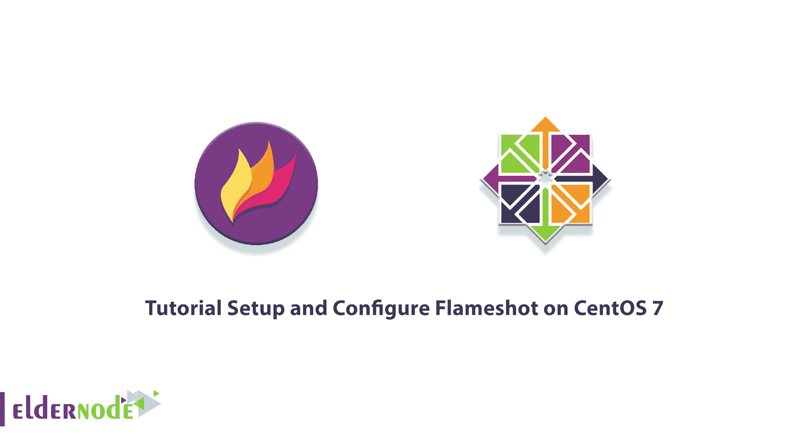
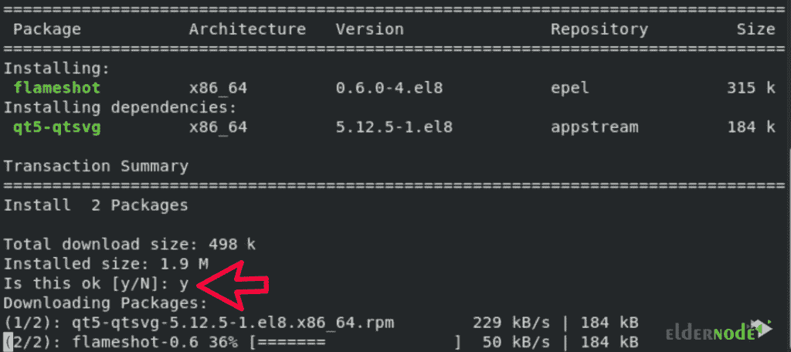
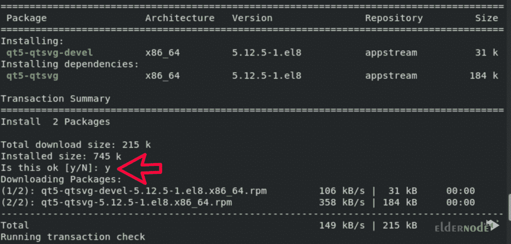

# 教程在 CentOS 7 上设置和配置 Flameshot

> 原文：<https://blog.eldernode.com/setup-and-configure-flameshot-on-centos/>



Flameshot 是一个捕捉操作系统屏幕的工具。这个工具是开源的，使用 C ++编程语言开发。需要注意的是，Flameshot 对不同的 Linux 发行版有很多支持。这个工具的突出之处在于它为用户提供了轻量级的强大工具，以及进行专业编辑的可能性。在本文中，我们将向您介绍**教程设置，并在 CentOS 7** 上配置 Flameshot。如果你想购买一台 [**CentOS VPS**](https://eldernode.com/centos-vps/) 服务器，你可以访问 [Eldernode](https://eldernode.com/) 中的软件包。

## **如何在 CentOS 7** 上设置和配置 Flameshot

Flameshot 是一款功能强大且易于使用的截图软件，适用于各种 Linux 发行版，尤其是 [CentOS](https://blog.eldernode.com/tag/centos/) 。在本文中，我们将了解如何在 CentOS 7 上安装和配置 Flameshot。请继续关注本文的其余部分。

### **什么是 Flameshot？**

Flameshot 是一个开源的命令行成像工具。使用 Flameshot 工具，您可以捕捉页面的完整或特定区域，并在本地或在线保存到 Imgur 之前立即进行注释。您还可以使用 Flameshot 来指定注释、线条、箭头、圆形、方框、高亮显示、模糊、文本和大头针的选项。

以下是 Flameshot 的一些特点。这些功能包括:

1)可调外观

2)易于使用

3)它有一个 DBus 接口。

4)上传到 Imgur 的能力

## **如何在 CentOS 7** 上安装 Flameshot

在这篇文章中，我们将教你如何用两种方法在 CentOS 7 上安装 Flameshot。这些方法包括:

**1_ 使用 yum 软件包管理器安装 Flameshot】**

**2_ 下载 rpm 包安装 Flameshot**

在下文中，我们将一步一步地解释这些方法。

### **如何使用百胜包管理器** 安装 Flameshot

第一步是打开命令行窗口终端。请注意，可以使用“yum”软件包管理器在 CentOS 上安装 Flameshot。换句话说，Flameshot 在默认的 yum 存储库中可用。因此，要在 CentOS 上安装 Flameshot，只需运行以下命令:

```
sudo dnf install flameshot
```

如下图所示，执行上述命令后，问题“这样可以吗？"您将被要求在答案中键入“y”，然后按回车:



请注意，在您的系统上安装 Flameshot 可能需要几秒钟的时间。

### **如何下载 rpm 管理器安装 Flameshot**

在这一节中，我们将教你如何用第二种方法安装 Flameshot，即使用 rpm Manager。为此，只需遵循以下步骤。

由于 CentOS 支持安装任何软件的 rpm 包，您应该在第一步下载 Flameshot 包。您可以使用以下命令从 Github 下载 rpm Flameshot 包:

```
wget https://github.com/flameshot-org/flameshot/releases/download/v0.9.0/flameshot-0.9.0-1.fc32.x86_64.rpm
```

然后在下一步中，您必须使用以下命令在您的系统上本地安装下载的 rpm 包:

```
rpm -i flameshot-0.9.0-1.fc32.x86_64.rpm
```

注意，为了防止可能的错误发生，您必须使用下面的命令安装所有需要的依赖项:

```
sudo dnf install gcc-c++ cmake qt5-qtbase-devel qt5-linguist
```

```
sudo dnf install qt5-qtbase qt5-qtsvg-devel
```

如下图所示，执行上述命令后，问题“这样可以吗？“您将被要求在答案中键入“ **y** ”，然后按回车:



## **如何在 CentOS 7**T3 上配置 Flameshot

在学习如何配置之前，您需要键入以下命令来截图以打开 Gui 模式:

```
flameshot gui
```

你可以使用 -p 标志来保存页面图像到一个自定义的路径中，就像下面的命令:

```
flameshot gui -p /home/username/images
```

您也可以通过运行以下命令，使用 -d 标志给添加拍照延迟:

```
flameshot gui -d 2000
```

您可以使用以下命令拍摄全屏快照:

```
flameshot full -p /home/username/images -d 1500
```

最后，您可以通过运行以下命令打开 **Flameshot 配置**:

```
flameshot config
```

## 结论

Flameshot 是一款简单、免费、开源但功能强大的截图软件。在本文中，我们试图用两种方法教你如何在 CentOS 7 上安装 Flameshot。然后我们教你怎么配置。