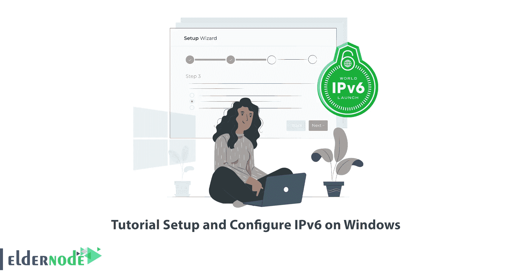
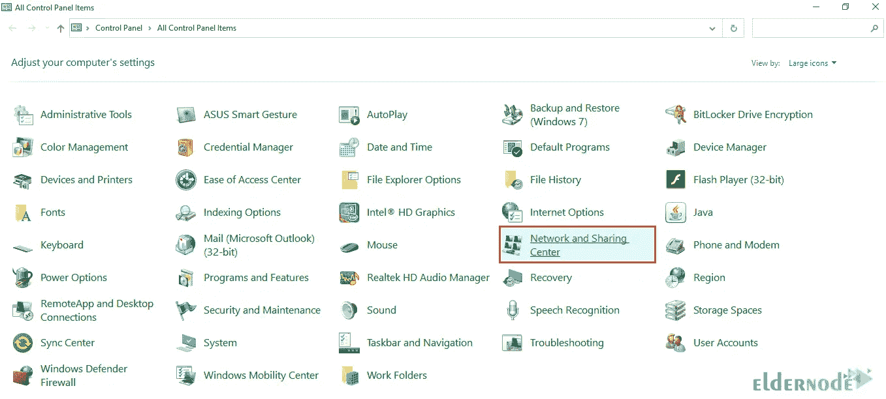
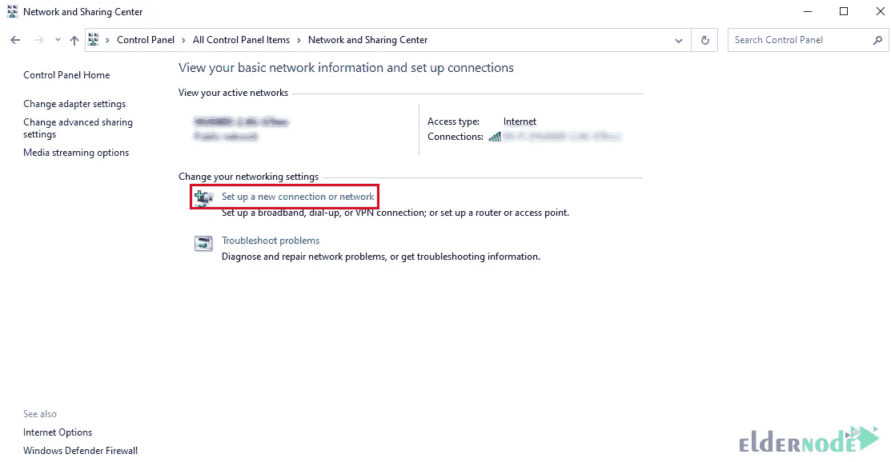
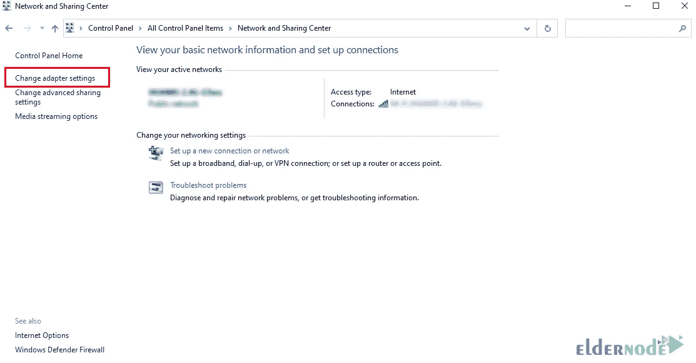
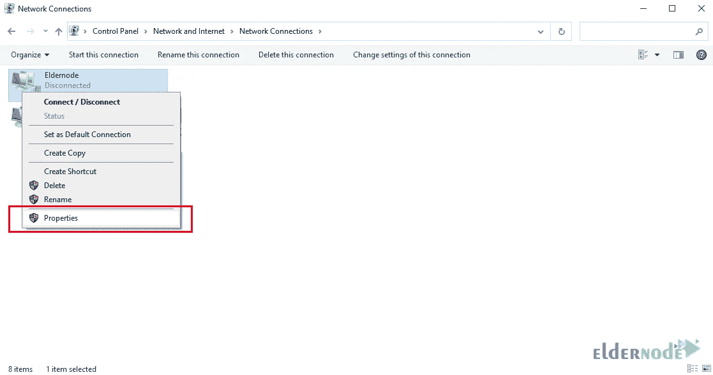
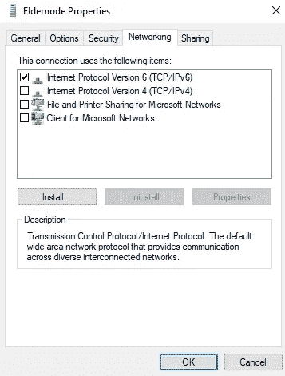
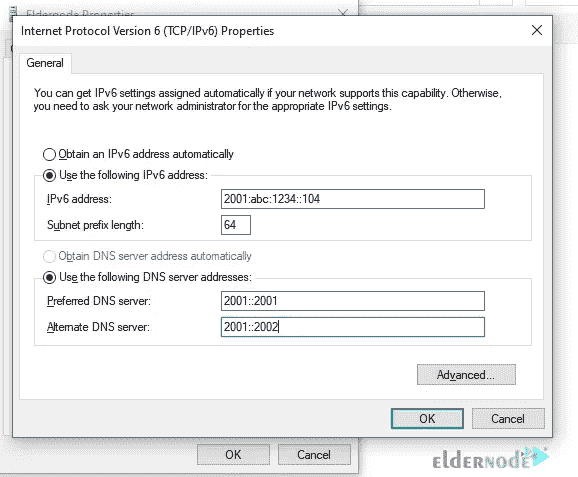
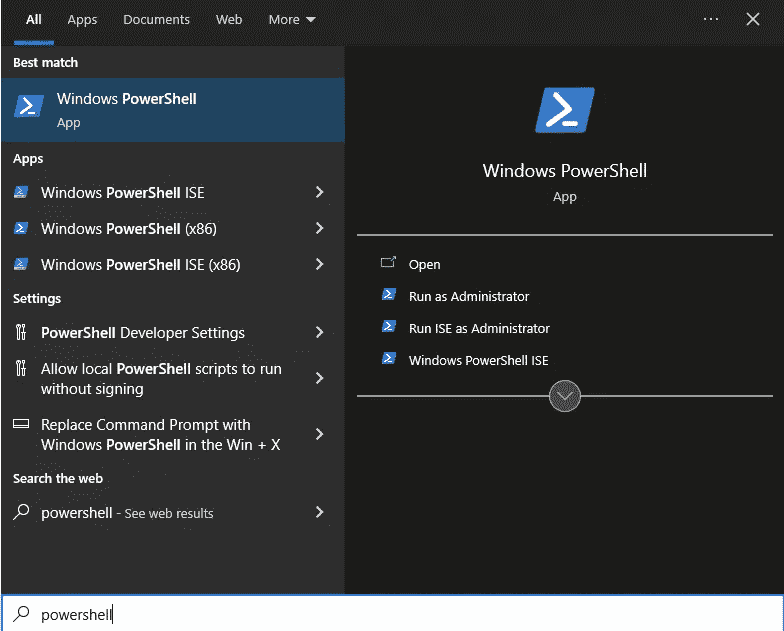

# 教程在 Windows 上设置和配置 IPv6

> 原文：<https://blog.eldernode.com/setup-and-configure-ipv6-on-windows/>



IP 地址通常是识别网络中设备的唯一标识符。IP 地址的类型分为两类。第一类是 IPv4，第二类是 IPv6。在本文中，我们将教您如何在 Windows 上设置和配置 IPv6。如果你想买一个 [Windows VPS](https://eldernode.com/windows-vps/) ，你可以访问 [eldernode](https://eldernode.com/) 网站上提供的套装。

## **什么是 IPv6？**

如您所知，IPv4 是一个 32 位地址，显示为以 10 为基数的 4 个数字，用句点分隔。这个版本的 IP 提供 2 的 32 次方个地址。目前，全球 90%以上的地址都是 IPv4。

[IPv6](https://blog.eldernode.com/ipv6-and-how-to-add-on-centos/) 是 IPv4 的新版本，但是我们需要知道迁移到 IPv6 的原因是什么？IPv4 有两个主要问题。与公共地址相关的小空间，在最乐观的情况下，可能是 IP 地址的 2 的 32 次方，这种空间正在耗尽，并且路由表的大小正在增长。互联网上的路由器管理着大约 500，000 条路由线路。

从短期来看，我们提出了子网划分和总结解决方案。在这些解决方案中，没有使用有类寻址和浪费 IP 地址，而是使用了无类寻址。路由表中也使用了总结功能。但从长远来看，人们提出了 IPv6 解决方案。

### **IPv6 的优势**

**–处理成本更低:** IPv6 数据包经过重新设计，可以生成和使用更简单的报头。这个问题改进了发送者和接收者系统对分组的处理。

**–更多 IP 地址:** IPv6 使用 128 位寻址结构。而 IPv4 使用 32 位寻址结构。这一数量的 IP 地址确保了未来几年将会有比需求更多的地址。

**–组播:**组播是 IPv6 的主要通信方式。与 IPv4 不同，IPv6 不提供广播方法。广播方法以非最佳和不适当的方式使用网络带宽。

**–IPSec:**IPv4 中没有互联网协议安全(IPSec)协议，但是 IP v4 支持，而 IPv6 内置了这个协议，可以加密所有通信。

## **如何在 Windows VPS 上设置 IPv6**

在本节中，我们打算教您如何在 [Windows](https://blog.eldernode.com/tag/windows/) 上设置和启用 IPv6。要做到这一点，你需要在你的 Windows 10 中完成以下步骤。

第一步是打开**控制面板**。

然后你必须在打开的页面中点击**网络和共享中心**:



现在你可以点击**建立一个新的连接或网络**。完成后，点击**下一步**:



成功创建新连接后，现在您应该点击**网络和共享中心**左侧的**更改适配器设置**:



下一步，你需要右击**你的网络连接**，然后点击**属性:**



从网络菜单中，选中**互联网协议版本 6 (TCP/IPv6)** 选项，点击**属性**:



在打开的窗口中，您必须勾选**使用以下 IPv6 地址**选项。完成此操作后，需要完成下图所示的必填字段:



最后，点击 **OK** 应用更改。然后打开命令行并在其中运行以下命令，以查看有关 IPs 的信息:

```
ipconfig
```

### **如何在 Windows 上配置 IPv6**

在本节中，我们将讨论如何在 Windows 上配置 IPv6。为此，您需要从开始菜单中搜索并运行 **PowerShell** :



要查看网络适配器的**状态，需要运行以下命令:**

```
Get-NetAdapterBinding -ComponentID ms_tcpip6
```

现在，您需要运行以下命令:

```
Enable-NetAdapterBinding -Name "Adapter Name" -ComponentID ms_tcpip6
```

**注意:**您可以在上面的命令中键入并运行您实际的网络适配器名称，而不是适配器名称。

您可以通过运行以下命令为所有网络适配器启用 IPv6:

```
Enable-NetAdapterBinding -Name "*" -ComponentID ms_tcpip6
```

您还可以使用以下命令对特定网络适配器禁用 IPv6:

```
Get-NetAdapterBinding -ComponentID ms_tcpip6
```

```
Disable-NetAdapterBinding -Name "Adapter Name" -ComponentID ms_tcpip6
```

最后，您可以使用以下命令**为所有网络适配器**禁用 IPv6:

```
Disable-NetAdapterBinding -Name "*" -ComponentID ms_tcpip6
```

## 结论

在 IPv6 的话题中，不再谈论二进制和十进制，原因是这些数字很大，这就是为什么他们用十六进制来谈论 IPv6。此地址是一个 32 个十六进制数的地址，由 8 段 4 个十六进制数组成，由 a:分隔。在本文中，在介绍了 IPv6 之后，我们试图教您如何在 Windows 上设置和配置 IPv6。如果你有任何问题，你可以在评论区和我们分享。