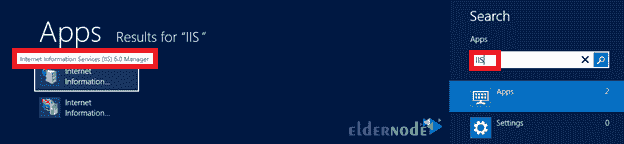

# 教程在 RDP - Eldernode 上设置和配置邮件服务器

> 原文：<https://blog.eldernode.com/setup-and-configure-mail-server/>

在通信领域，随着信息技术的进步，与客户保持联系是有意义的。现在网内甚至网外的通信大多是电子化的。您可以在 Windows 系统上设置自己的电子邮件服务器，使用特定的组织域发送电子邮件。加入我们来回顾一下**教程在 RDP** 上设置和配置邮件服务器。请与我们一起回顾在您的远程桌面协议上设置 SMTP 服务器。在 [Eldernode](https://eldernode.com/) 上有 windows 10 Remote Desktop 的各种包。要购买您自己的 [RDP 管理](https://eldernode.com/buy-rdp/)，请订购您需要的东西。

## **如何在 RDP** 上设置和配置邮件服务器

本指南帮助您控制、管理和存储电子邮件。此外，当本地应用程序需要发送电子邮件通知时，通常使用邮件服务器。在下文中，您将回顾如何配置 SMTP 服务器来设置邮件客户端。一点也不复杂。只要按照要求的步骤，并确保你做得正确。

### **在 RDP** 上设置内部 SMTP 服务

在本节中，我们将指导您在 [windows server](https://blog.eldernode.com/tag/windows/) 远程桌面上设置和配置 SMTP 服务器。SMTP 服务器是我们用来构建企业电子邮件网络的服务器。按照以下步骤启用内置于 RDP 核心操作系统中的 SMTP 服务。

*第一步:*

首先，通过 **RDP** 连接到你的服务器。

然后从搜索部分打开**服务器管理器**。

*第二步:*

在仪表板上，点击**添加角色和功能**。如下所示，添加角色和功能向导将开始。点击**下一个**继续。

*第三步:*

在安装类型上，选择“**基于角色或基于功能的安装**选项。

*第四步:*

在此步骤中，您应该选择服务器或虚拟硬盘。选择**基本服务器**，点击**下一步**。

*Ste* *p 5:*

现在，要绕过**角色选择**，点击**下一个**并继续。

*第六步:*

要查找和 **SMTP 服务器**，向下滚动功能列表。勾选方框并继续。

*第七步:*

在此步骤中，您将会收到一个弹出窗口的通知。据说还将安装其他一些服务。要确认并继续，请点击**添加功能**。

*第八步:*

要完成安装，点击**安装**。

*第九步:*

功能安装完成后，点击**关闭**。

**如何在 RDP 服务器 2012** 上配置邮件服务器

成功设置后，您需要将 SMTP 服务器配置为只允许来自本地服务器的电子邮件。完成配置后，您可以确保垃圾邮件制造者无法使用您的 SMTP 服务器发送垃圾邮件。所以，请和我们一起完成配置的必要步骤。

*第一步:*

从搜索符中，键入 IIS 并运行**互联网信息服务** **(IIS) 6.0 管理器**。

*第二步:*

要在电脑上进行更改，请点击**是**。

*第三步:*

现在，展开到 **SMTP 虚拟服务器** **#1** ，选择**属性**。

*第四步:*

在**常规**选项卡中，将 **IP 地址**设置为服务器的 IP 地址，并勾选**启用记录**。

*第五步:*

在**访问**选项卡中，设置**连接**按钮中**内部设备**的 IP。然后，将相同的 IP 添加到**中继列表**。

*第六步:*

是时候设置一个外部域了。在**交货**标签中，您可以这样做。在那里，您可以使用微软免费定制的域，或者根据需要添加一个智能主机。如果您希望服务器在尝试智能主机之前尝试直接传送电子邮件，请勾选**尝试直接传送**框。

*第七步:*

同样，从搜索符中，键入**防火墙**可以定位并运行带有高级安全控制台的 **Windows 防火墙** **。**

*第八步:*

添加新的**入站规则**。(右击入站规则，选择**新规则**)

*第九步:*

然后，选择**端口**。

*第十步:*

现在，键入 **25** 作为本地端口。

*第十一步:*

点击**下一步**(允许连接)

*第十二步:*

如下图，**取消**公共。(防止外部访问服务器)

*第十三步:*

给规则命名，点击**完成**到**创建规则**。

第十四步:

这样，您会在防火墙管理控制台中看到一个启用了的**新规则。**

*第十五步:*

最后，**重新启动**MTP 服务，并将服务设置为自动启动，然后遵循以下路径:

打开**服务管理控制台**。

双击**简单邮件传输协议服务**。

**停止**然后**开始**服务。将启动类型设置为**自动**。

结论

邮件服务器是一项非常重要的服务，可以为组织的经理和员工解决问题。在本文中，您了解了如何在 RDP 上设置和配置邮件服务器。正如我们所承诺的，这并不复杂。使用本指南有助于您获得随时待命的服务。

*Step 13:*

Give the rule a name, and click **Finish** to **create the rule**.

Step 14:

In this way, you see a **new rule enabled** in the firewall management console.

*Step 15:*

Finally, **Restart** the MTP Service and set the service for Automatic Start and then, follow the below path:

Open up the **Services Management Console**.

Double click on the **Simple Mail Transfer Protocol service**.

**Stop** and then **Start** the service. Set the Startup type to **Automatic**.

## Conclusion

Mail server is a very important service that removes problems for managers and employees of the organization. In this article, you learned How to Setup And Configure a Mail Server On RDP. As we promised, it was not complicated. Using this guide helps you to have a ready and waiting service.