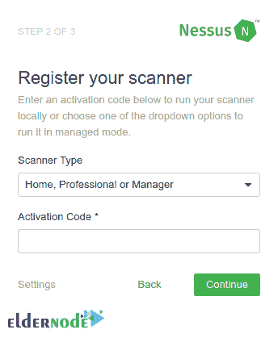

# 教程在 Ubuntu 20.10 上设置和配置 Nessus

> 原文：<https://blog.eldernode.com/setup-and-configure-nessus-on-ubuntu/>


Nessus 是一款开源远程安全扫描工具，作为全球部署最广泛的安全技术之一，受到全球 30，000 多家组织的信任。作为管理员，您可以使用一台或一组连接到 internet 的计算机。使用 Nessus 作为漏洞扫描器可以让您的域免受黑客和病毒经常利用的漏洞的攻击。尽管 Nessus 只是一个好的安全策略的一小部分，但它不是一个完整的安全解决方案。本文介绍了在 Ubuntu 20.10 上设置和配置 Nessus 的教程**。如果您希望准备自己的 [Ubuntu VPS](https://eldernode.com/ubuntu-vps/) ，请依靠我们的技术团队，并在 [Eldernode 上注册您的订单。](https://eldernode.com/)**

## **在 Ubuntu 20.10 上设置和配置 Nessus**

Nessus 项目由 Renaud Deraison 于 1998 年发起。它似乎非常适合顾问、笔测试员和[安全](https://blog.eldernode.com/tag/security/)从业者。它可以以各种格式报告扫描结果，例如纯文本、XML、HTML 和 LaTeX。Nessus 由两部分组成，一个名为 nessusd 的服务器和一个客户端，它可以通过几个选项中的任何一个来实现。服务器是 Nessus 中实际运行测试的部分，而客户机用于告诉服务器在什么计算机上运行什么测试。

该服务器仅适用于 Unix/ [Linux](https://blog.eldernode.com/tag/linux/) 平台，但也有适用于 Unix/Linux、Windows 和 Mac 的客户机。因此，一旦服务器被设置并运行，管理员就可以使用为几乎任何平台编写的客户机来运行定期安排的 Nessus 测试。加入我们这篇文章，了解更多关于 Nessus 的信息，最后回顾一下在 [Ubuntu](https://blog.eldernode.com/tag/ubuntu/) 20.10 上安装和配置它的过程。

### **尼斯湖水怪**

Nessus 扫描涵盖广泛的技术，包括操作系统、网络设备、虚拟机管理程序、数据库、web 服务器和关键基础设施。下面我们来看看 Nessus 的主要功能:

1-无限制评估

2-兼容各种规模的计算机和服务器

3-配置评估

4-实时结果

5-可配置的报告

6-社区支持

7-订购可获得高级支持

8-检测本地或远程主机中的安全漏洞

9-模拟攻击以查明漏洞

10-对各种规模的公司都具有成本效益

11-随处使用，年度订阅

12-易于使用

13-免费 7 天

14-准确了解您的网络

15-在封闭环境中执行安全测试

16-计划的安全审计

每台扫描仪 17- 32 个 IP

18-检测缺失的安全更新和补丁

### **在 Ubuntu 20.10 上安装 Nessus 的先决条件**

为了让本教程更好地工作，请考虑以下先决条件:

_ 拥有 [Sudo 权限](https://blog.eldernode.com/sudo-privileges-for-user-in-ubuntu-20-10/)的非 root 用户。

## **如何在 Ubuntu 20.10 上安装 Nessus**

Nessus 检测恶意软件并扫描嵌入式设备。为了保护你的 Ubuntu 20.10 和加固你的基础设施和应用程序免受“坏人”的攻击，按照下面的步骤安装它。

*第一步:*

Nessus 扫描仪包可在 [Nessus 下载页面](https://www.tenable.com/downloads/nessus?loginAttempted=true)上获得。首先，下载撰写本文时的当前稳定版本并继续。此外，您可以通过运行以下命令来下载 Nessus 8.13.1 Ubuntu 安装程序:

```
curl -o Nessus-8.13.1-Ubuntu1110_amd64.deb "https://www.tenable.com/downloads/api/v1/public/pages/nessus/downloads/12207/download?i_agree_to_tenable_license_agreement=true&file_path=Nessus-8.13.1-Ubuntu1110_amd64.deb"
```

然后，您可以计算下载文件的校验和散列，并将其与下载页面上提供的校验和散列进行比较。为此，请运行:

```
md5sum Nessus-8.13.1-Ubuntu1110_amd64.deb
```

```
eeff7141132f064f879bd11835e76901 Nessus-8.13.1-Ubuntu1110_amd64.deb
```

在开始安装过程之前，请确保哈希匹配。

*第二步:*

使用下面的命令**在你的 Ubuntu 20.10 上安装 Nessus** :

```
apt install ./Nessus-8.13.1-Ubuntu1110_amd64.deb
```

然后，要启动 Nessus 服务并使其在系统引导时运行，请键入:

```
systemctl enable --now nessusd
```

要**启动和停止 Nessus** ，使用以下命令:

```
/etc/init.d/nessusd start
```

```
/etc/init.d/nessusd stop
```

最后，您可以通过运行以下命令来检查状态:

```
systemctl status nessusd
```

### **如何在 Ubuntu 20.10 上设置和配置 Nessus**

安装完成后，您就可以在 Ubuntu 20.10 上设置和激活 Nessus 了。所以，使用安装输出中显示的 URL 登录 UI:**HTTPS://<你的-hostname-or-IP > :8834/** 。

为了允许外部访问，打开端口 **8834/TCP** 。我们假设 UFW 正在运行:

```
ufw allow 8834/tcp
```

现在，您可以从浏览器访问 Nessus 来完成设置。如果您遇到了 SSL 警告，请接受它(一个例外)并继续。

首先，在第一页上创建一个 Nessus 管理员帐户:


要开始使用 Nessus，您需要提供激活码。为此，请访问[网站](https://www.tenable.com/)。

当您在电子邮件中收到**许可证密钥**时，您可以使用它进行注册，并使用电子邮件发送的激活码注册您的 Nessus 扫描仪:



您只需要选择要运行的 **Nessus 类型**，因为系统会提示您选择想要部署的 Nessus。输入所需信息后，初始化过程将开始:


等到 Nessus 下载插件并准备好扫描你的资产所需的文件。然后，您可以使用创建的管理员帐户登录:


如果您正确通过了所有必需的步骤，并且拥有成功的凭据，您将被定向到 Nessus 漏洞扫描程序的仪表板，在那里您可以管理您的扫描作业。


## 结论

在本文中，您了解了如何在 Ubuntu 20.10 上设置和配置 Nessus。如果您有兴趣了解更多信息，请参考[如何在 Ubuntu 20.04 上安装和使用 Metasploit](https://blog.eldernode.com/install-and-use-metasploit-on-ubuntu/)。