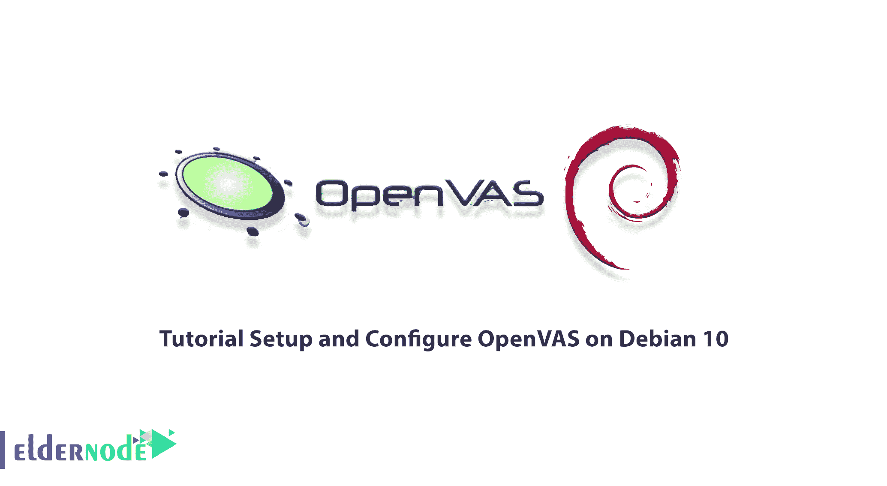
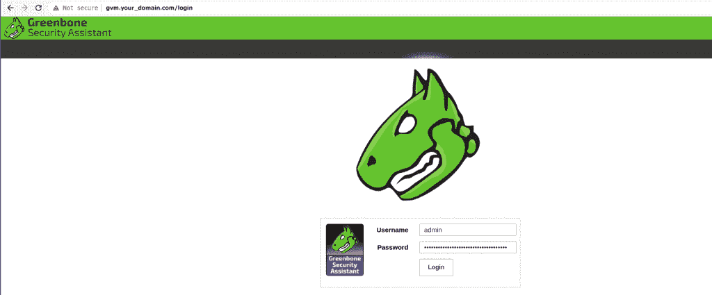

# 教程在 Debian 10 - Eldernode 上设置和配置 OpenVAS

> 原文：<https://blog.eldernode.com/setup-and-configure-openvas-on-debian/>



OpenVAS 代表开放漏洞评估系统。这个工具是一个漏洞扫描器，当然也是一个非常好的安全评估工具。OpenVAS 是一个简单的软件框架，由几个用于漏洞扫描和漏洞管理的服务和工具组成。所有的 OpenVAS 产品都是自由软件，并且大多数都是在 GNU 通用公共许可证(GPL)下授权的。在这篇文章中，我们想一步一步地向你介绍如何在 Debian 10 上设置和配置 OpenVAS。需要注意的是，如果你想购买一台 [Linux VPS](https://eldernode.com/linux-vps/) 服务器，可以访问 [Eldernode](https://eldernode.com/) 中提供的软件包。

## **如何在 Debian 10 上设置和配置 open vas**

OpenVAS 最初被称为 GNessUs，是之前开源的 NessUs 漏洞扫描的一个分支。Tenable Network Security 的 Nessus 开发人员在 2003 年 10 月决定将其转变为专有软件后，OpenVAS 继续作为其开源分支运营。

你可以将 OpenVAS 作为虚拟机或者未编译的代码安装，甚至可以直接安装在 [Linux](https://blog.eldernode.com/tag/linux/) 操作系统上。然后免费使用 Nessus 的所有功能。这种扫描器自 2009 年以来有很长的历史，每天更新(这些更新的名称是“网络漏洞测试”)或简称 NVT。

截至 2016 年 6 月，已为 OpenVAS 发布了 47，000 个 nvt。它还包括由一家安全软件公司支持的 50，000 多个漏洞测试。它还有一个内部编程语言，可以根据用户的需要执行一些特殊的和个性化的测试。您可以以虚拟机或非编译代码的形式安装这个工具，甚至可以直接安装在 Linux 操作系统上，并免费使用它的所有功能。

跟随我们这篇文章，教你如何在 Debian 10 上安装、设置和配置 OpenVAS。

### **在 Debian 10 上安装 OpenVAS 的先决条件**

在这篇文章中，我们将教你如何在 Debian 10 上安装 GVM。green bone Vulnerability Management(GVM)，原名 **OpenVAS** ，是一款网络安全扫描器，提供一套网络漏洞(NVT)测试来识别安全漏洞。在安装这个工具之前，您需要准备一些先决条件。

_ 至少 4 GB 内存

_ 至少 4 个 vCPUs

_ 超过 8 GB 的磁盘空间

下一步是使用以下命令更新系统软件包:

```
apt update
```

```
apt upgrade
```

由于我们将以系统的非特权用户身份运行 GVM 20.08，因此您必须使用以下命令创建一个 GVM 系统帐户:

```
useradd -r -d /opt/gvm -c "GVM User" -s /bin/bash gvm
```

在下一步中，您需要创建由上面命令中的 **-d** 选项指定的 **GVM 用户目录**。然后将用户和组所有权置于 GVM。

```
mkdir /opt/gvm
```

```
chown gvm: /opt/gvm
```

为了在 Debian 10 上正确安装 OpenVAS，您还需要安装以下依赖项:

```
apt install gcc g++ make bison flex libksba-dev curl redis libpcap-dev \
```

```
cmake git pkg-config libglib2.0-dev libgpgme-dev nmap libgnutls28-dev uuid-dev \
```

```
libssh-gcrypt-dev libldap2-dev gnutls-bin libmicrohttpd-dev libhiredis-dev \
```

```
zlib1g-dev libxml2-dev libradcli-dev clang-format libldap2-dev doxygen \
```

```
gcc-mingw-w64 xml-twig-tools libical-dev perl-base heimdal-dev libpopt-dev libunistring-dev graphviz \
```

```
libsnmp-dev python3-setuptools python3-paramiko python3-lxml python3-defusedxml python3-dev gettext python3-polib xmltoman \
```

```
python3-pip texlive-fonts-recommended texlive-latex-extra --no-install-recommends xsltproc sudo vim rsync
```

### **如何在 Debian 10 上安装 Yarn**

在这一节，我们想教你如何安装 [Yarn](https://blog.eldernode.com/install-yarn-on-linux-ubuntu-20-04/) JavaScript 包管理器。为此，您必须按顺序输入以下命令:

```
curl -sS https://dl.yarnpkg.com/debian/pubkey.gpg | apt-key add -
```

```
echo "deb https://dl.yarnpkg.com/debian/ stable main" | tee /etc/apt/sources.list.d/yarn.list
```

```
apt update
```

```
apt install yarn -y
```

### **如何在 Debian 10 上安装 Greenbone 漏洞管理器**

你应该从源代码中构建不同的模块来在 Debian 10 上安装 OpenVAS。使用以下命令下载构建 OpenVAS 所需的每个模块的源代码。

首先，运行下面的命令创建一个临时目录来存储源代码:

```
mkdir /tmp/gvm10  cd /tmp/gvm10
```

现在用下面的命令下载 GVM 库:

```
wget https://github.com/greenbone/gvm-libs/archive/v10.0.1.tar.gz -O gvm-libs-v10.0.1.tar.gz
```

然后下载 OpenVAS 扫描仪，如下所示:

```
wget https://github.com/greenbone/openvas/archive/v6.0.1.tar.gz -O openvas-scanner-v6.0.1.tar.gz
```

要下载 Greenbone 漏洞管理器(GVM ),请输入以下命令:

```
wget https://github.com/greenbone/gvmd/archive/v8.0.1.tar.gz -O gvm-v8.0.1.tar.gz
```

您可以通过运行以下命令下载 Greenbone Security Assistant (GSA ):

```
wget https://github.com/greenbone/gsa/archive/v8.0.1.tar.gz -O gsa-v8.0.1.tar.gz
```

要下载开放式扫描仪协议守护程序(OSPd ),请输入以下命令:

```
wget https://github.com/greenbone/ospd/archive/v1.3.2.tar.gz -O ospd-v1.3.2.tar.gz
```

运行以下命令下载 OpenVAS SMB:

```
wget https://github.com/greenbone/openvas-smb/archive/v1.0.5.tar.gz -O openvas-smp-v1.0.5.tar.gz
```

最后，您应该将源代码提取到当前目录，如下所示:

```
for i in *.tar.gz; do tar xzf $i; done
```

## 如何在 Debian LinuxT3 上安装 **OpenVAS】**

OpenVAS 是一个完整的扫描引擎，运行更新和广泛的网络漏洞测试(NVT)。您需要导航到您提取源代码并构建 OpenVAS 的每个组件的目录。

要构建和安装 GVM 库，请运行以下命令:

```
cd gvm-libs-10.0.1/  mkdir build  cd build/  cmake ..  make  make install
```

构建并安装 OpenVAS SMB，如下所示:

```
cd /tmp/gvm10/openvas-smb-1.0.5  mkdir build  cd build  cmake ..  make  make install
```

通过运行以下命令构建并安装 OSPd:

```
cd /tmp/gvm10/ospd-1.3.2  python3 setup.py install
```

运行以下命令构建并安装 OpenVAS Scanner:

```
cd cd /tmp/gvm10/openvas-6.0.1/  mkdir build  cd build  cmake ..  make  make install
```

现在进行以下配置，以提高 Redis 服务器的性能。您应该增加 somaxconn 的值，以避免客户端连接缓慢的问题，如下所示:

```
echo "net.core.somaxconn = 1024" >> /etc/sysctl.conf
```

要防止 Redis 后台存储在内存不足的情况下失败，请按如下方式启用内存过量使用:

```
echo 'vm.overcommit_memory = 1' >> /etc/sysctl.conf
```

禁用 Linux 内核对透明大页面(THP)的支持，以避免 Redis 产生延迟和内存使用问题。现在创建一个 systemd 服务单元:

```
vim /etc/systemd/system/disable_thp.service
```

```
[Unit]  Description=Disable Kernel Support for Transparent Huge Pages (THP)    [Service]  Type=simple  ExecStart=/bin/sh -c "echo 'never' > /sys/kernel/mm/transparent_hugepage/enabled && echo 'never' > /sys/kernel/mm/transparent_hugepage/defrag"    [Install]  WantedBy=multi-user.target
```

接下来，您需要使用下面的命令重新加载 systemd 配置:

```
systemctl daemon-reload
```

现在启动并使服务在系统引导时运行，如下所示:

```
systemctl start disable_thp    systemctl enable disable_thp
```

在此步骤中，使用以下命令重命名默认的 Redis 服务器配置文件:

```
mv /etc/redis/redis.conf /etc/redis/redis.conf.bak
```

并复制生成的 Redis 配置:

```
cp /tmp/gvm10/openvas-6.0.1/build/doc/redis_config_examples/redis_4_0.conf /etc/redis/redis.conf
```

使用所需的文本编辑器打开配置文件:

```
vim /etc/redis/redis.conf
```

并进行以下调整:

```
#unixsocket /tmp/redis-server.sock  unixsocket /var/run/redis/redis-server.sock  ...  #pidfile /usr/local/var/run/openvas-redis.pid  pidfile /var/run/redis/redis-server.pid  ...  # Change the working directory to /var/lib/redis  dir ./  dir /var/lib/redis
```

Redis 使用/tm/redis.socket，因此必须使用 db_address 参数显式定义备用套接字目录，如下所示:

```
echo "db_address = /var/run/redis/redis-server.sock" > /usr/local/etc/openvas/openvassd.conf
```

现在重新加载上面创建的 sysctl 变量，如下所示:

```
sysctl -p
```

现在使用下面的命令重新启动 Redis 服务器:

```
systemctl restart redis-server
```

要从 green bone Security Feed/Community Feed 更新 OpenVAS NVTs，请运行以下命令:

```
greenbone-nvt-sync
```

运行以下命令来重新加载内核模块并启动 OpenVAS Scanner:

```
ldconfig && openvassd
```

检查日志，查看 OpenVAS 扫描仪是否有任何问题:

```
tail /usr/local/var/log/gvm/openvassd.log
```

检查正在运行的进程。

```
ps aux | grep openvas
```

运行以下命令来构建和安装 GVM:

```
cd /tmp/gvm10/gvmd-8.0.1/  mkdir build  cd build  cmake ..  make  make install
```

要构建和安装 GSA，请使用以下命令:

```
cd /tmp/gvm10/gsa-8.0.1  mkdir build  cd build  cmake ..  make  make install
```

您应该为服务器和客户端设置创建证书，如下所示:

```
gvm-manage-certs -a
```

现在运行以下命令来创建 OpenVAS 管理用户:

```
gvmd --create-user openvasadmin
```

创建您自己的密码，如下所示:

```
gvmd --create-user openvasadmin --password=StrongPassword
```

最后，通过运行以下命令重置现有用户的密码:

```
gvmd --user=openvasadmin --new-password=StrongPassword
```

### **如何在 Debian 10 上访问 open vas**

首先使用以下命令启动 OpenVAS 扫描仪、GSA 和 GVM 服务:

```
openvassd && gvmd && gsad
```

并检查如下所示的状态:

```
ps aux | grep -E "openvassd|gsad|gvmd" | grep -v grep
```

你现在可以通过网址 **HTTPS:服务器 IP 或主机名:**访问 GSA



## 结论

扫描仪和安全工具在网络世界中非常重要。安全性也可以通过多种方式在网络中实现，包括防火墙、安全扫描器，如 Nikto、Nmap、OpenVas 等。，但这些方法多种多样。在本文中，我们试图一步一步地教你如何在 Debian 10 上设置和配置 OpenVAS。