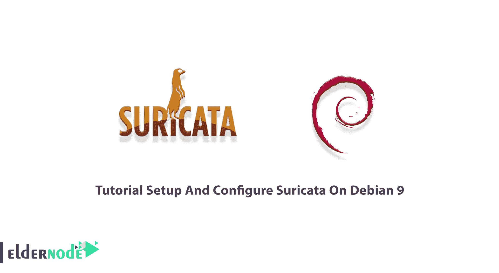
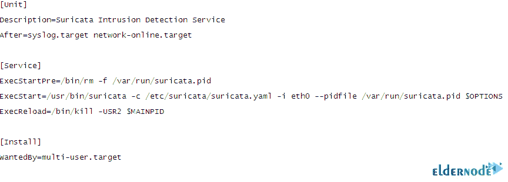
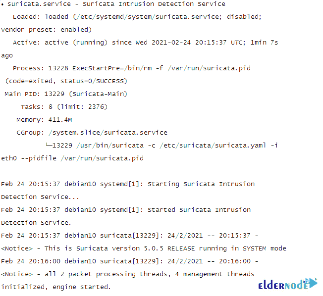

# Debian 9 - Eldernode 博客上的教程设置和配置 Suricata

> 原文：<https://blog.eldernode.com/setup-and-configure-suricata-on-debian/>



Suricata 是一个免费的开源网络威胁检测引擎。使用 Suricata 可以检测入侵(IDS)、预防入侵(IPS)和网络安全监控。由于 Suricata 在深度数据包检测和模式匹配方面表现出色，因此对于威胁和攻击检测非常有用。Suricata 由 OISF 开发，由一个社区运营的非营利基金会，开放信息安全基金会(OISF)所有。此外，Suricata 的源代码是根据 GNU 通用公共许可证第 2 版许可的。加入我们这篇文章来回顾一下教程设置，并在 Debian 9，10 上配置 Suricata。依靠 [Eldernode](https://eldernode.com/) 的技术团队，订购您考虑的套餐，购买您自己的 **[Linux VPS](https://eldernode.com/linux-vps/)** 。

## **如何在 Debian 9 上一步步设置和配置 Suricata**

Suricata 支持大多数操作系统，如 [Linux](https://blog.eldernode.com/tag/linux/) 、FreeBSD、OpenBSD、macOS / Mac OS X 和 [Windows](https://blog.eldernode.com/tag/windows/) 。由于 Suricata 是多线程的，因此您可以在单个设备上通过添加数据包处理线程来进行水平扩展。和我们一起回顾一下 Suricata 在 Debian 9 上的安装、设置和配置。

### **苏里卡特征**

Suricata 是同类最佳的基于特征的入侵检测平台，也是 Bricata 平台上三个重要检测引擎之一。让我们来看看它的好处:

1-高性能

2-自动协议检测

3- Lua 脚本

4-行业标准输出

5-离线分析 PCAP 文件

6-使用 Pcap 记录器记录流量

7-用于自动 PCAP 文件处理的 Unix 套接字模式

8-与 Linux Netfilter 防火墙的高级集成

虽然许多特性和功能与 Snort 相似，但 Suricata 在几个重要方面有所不同:

1-它是多线程的，因此单个实例可以在更高的流量下运行

2-对应用层协议有更多的支持

3-它支持哈希和文件提取

4-它有 Lua 脚本语言的钩子，可以用来修改输出，甚至创建复杂和详细的签名检测逻辑。

### **在 Debian 9 上安装和配置 Suricata 的先决条件**

为了让本教程更好地工作，请考虑以下先决条件:

_ 拥有 Sudo 权限的非 root 用户。

按照 Debian 上的[初始服务器设置进行设置。](https://blog.eldernode.com/initial-setup-with-debian-10/)

## **在 Debian Linux 上安装 Suricata**

Suricata 软件很好地集成到 Debian 中。从官方的 Debian 库安装 deb 包会给你一个现成的 Suricata。在为您的系统构建 Suricata 之前，运行以下命令以确保您拥有安装所需的一切:

```
apt-get -y install libpcre3 libpcre3-dbg libpcre3-dev \
```

```
build-essential autoconf automake libtool libpcap-dev libnet1-dev \
```

```
libyaml-0-2 libyaml-dev zlib1g zlib1g-dev libmagic-dev libcap-ng-dev \
```

```
libjansson-dev pkg-config rustc cargo
```

然后，使用下面的命令下载并**构建 Suricata** :

```
wget http://www.openinfosecfoundation.org/download/suricata-5.0.0.tar.gz
```

```
tar -xvzf suricata-5.0.0.tar.gz
```

```
cd suricata-5.0.0
```

Suricata 可以使用**二进制包**安装在各种发行版上。在 Debian 9 中:

```
sudo apt-get install suricata
```

***注*** :在 Debian 的“稳定”版本中，最新版本中通常没有 Suricata。如果可以在 Debian backports 上构建的话，可以从那里获得更新的版本。

现在，您应该运行以下命令来检查您正在运行的 Suricata 的**版本以及服务状态:**

```
sudo suricata --build-info
```

```
sudo systemctl status suricata
```

### **如何在 Debian 9 | Debian 10 上设置 Suricata**

正如我们在先决条件一节中提到的，不要忘记输入所有命令作为**root/超级用户**，因为对于 Debian 操作系统来说，如果不首先安装和配置 Sudo，就不可能使用它。

然后，开始为 Suricata 的日志信息创建一个目录:

```
sudo mkdir /var/log/suricata
```

然后，您需要准备使用它的系统。所以，运行:

```
sudo mkdir /etc/suricata
```

现在需要将***class ification . config***、 ***reference.config、*** 和 ***suricata.yaml*** 从基础**构建/安装**目录复制到 **/etc/suricata 目录**。为此，请输入以下内容:

```
sudo cp classification.config /etc/suricata
```

```
sudo cp reference.config /etc/suricata
```

```
sudo cp suricata.yaml /etc/suricata
```

### **如何在 Debian 9 0r Debian 10 上配置 Suricata**

Suricata 使用 Yaml 格式进行配置。源代码中包含的 **Suricata.yaml** 文件是 Suricata 的配置示例。这意味着 Suricata 主配置文件位于**/etc/Suri cata/Suri cata . YAML .**本文档将解释每个选项。

首先，检查可用的接口卡，确定您希望 Suricata 使用哪一个:

```
ifconfig
```

然后，创建一个 Suricata systemd 单元文件。代替 **eth0** ，您可以输入您偏好的接口卡:

```
sudo vim /etc/systemd/system/suricata.service
```



要重新加载 systemd 单元文件，请运行:

```
sudo systemctl daemon-reload
```

接下来，使用下面的命令启动并启用 Suricata 服务:

```
sudo systemctl start suricata
```

最后，通过运行以下命令确认服务状态:

```
systemctl status suricata
```



## 结论

在本文中，您学习了在 Debian 9 上安装和配置 Suricata。从现在开始，你可以看到你的网络中发生了什么。它通常通过加载一组预定义的规则来匹配不同的网络协议和流行为。如果你有兴趣了解更多，请参考[介绍 Icinga 2 Linux 服务器监控工具](https://blog.eldernode.com/icinga-2-linux-server-monitoring-tool/)。