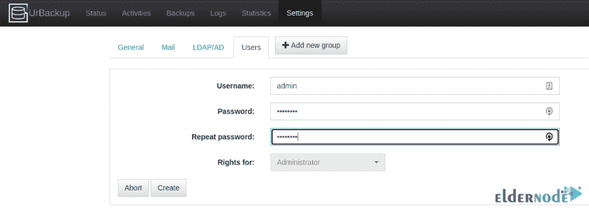

# 如何在 Ubuntu 20.10 上设置和配置 UrBackup

> 原文：<https://blog.eldernode.com/setup-and-configure-urbackup-on-ubuntu/>


UrBackup 是一个开源的客户端/服务器备份系统。该工具通过结合映像和文件备份来执行数据安全和快速恢复。使用 UrBackup，可以在系统运行时进行文件和映像备份，而不会中断当前进程。有趣的是，UrBackup 会不断查看您想要备份的文件夹。通过这样做，它将快速找到以前备份之间的差异。因此，增量文件备份非常快。在本文中，我们将教你如何在 Ubuntu 20.10 上设置和配置 UrBackup。如果你想购买一台 [Ubuntu VPS](https://eldernode.com/ubuntu-vps) 服务器，你可以访问 [Eldernode](https://eldernode.com/) 中提供的软件包。

## **教程在 Ubuntu 20.10 上设置和配置 UrBackup**

在本教程中，在介绍了安装 UrBackup 的先决条件之后，我们将教你如何在 [Ubuntu](https://blog.eldernode.com/tag/ubuntu/) 20.10 上安装 UrBackup 服务器。然后，在下一步中，我们将逐步向您解释如何添加新的备份客户端。最后，你将学会如何使用 [UrBackup](https://www.urbackup.org/) ，然后如何在 Ubuntu 上使用 UrBackup 创建备份。请跟随我们继续这篇文章。

### **在 Ubuntu 20.10 上安装 UrBackup 的要求**

_ Ubuntu 20.10

_ 具有 Sudo 权限的 Root 用户。

_ 在开始安装之前，您还必须在登录到 Ubuntu 服务器后使用以下命令更新您的系统:

```
apt-get update -y
```

## **在 Ubuntu 20.10 上安装 UrBackup 服务器| Ubuntu 20.04**

在这一节，我们将一步步教你如何在 Ubuntu 20.10 上安装 UrBackup Server。为此，只需按顺序执行以下步骤。第一步是通过执行以下命令，使用正式的 PPA 存储库安装 UrBackup 服务器:

```
add-apt-repository ppa:uroni/urbackup
```

```
apt update
```

```
apt install urbackup-server
```

最后，在执行完上面的命令后，键入“ **y** ”并回车。这将开始安装 UrBackup 服务器及其相关软件包。下一节，我们将告诉你如何在 Ubuntu 20.10 上安装 UrBackup 客户端。跟着我们。

## **在 Ubuntu 20** 上安装 UrBackup 客户端

在上一节中安装了 UrBackup 服务器后，现在在本节中，我们将教您如何逐步添加新的备份客户端。您可以点击**Add new Internet client/client behind NAT**来添加一个新的客户端备份到 UrBackup 服务器。下一步，你需要确保**从**设置**中启用互联网模式**。因此，您需要将您的客户端主机名设置为 FQDN 或 IP。然后点击**添加客户端**如下图:


在下一步中，添加客户端后，您可以使用下面的命令**下载**安装包。请注意，您必须在客户端主机上安装这些安装包以进行备份。

```
TF=`mktemp` && wget "http://your_server_ip:55414/x?a=download_client&lang=en&clientid=1&authkey=nGEDmaj5Qb&os=linux" -O $TF && sudo sh $TF; rm -f $TF
```

然后，您必须使用以下命令**来检查客户端服务状态**:

```
systemctl status urbackupclientbackend
```

如下图所示，在执行上述命令后，您将看到 **UrBackup 客户端**已启动并运行在端口“ **35621** ”上:


### **如何在 Ubuntu 上使用 UrBackup**

在这一节，我们想教你如何在 Ubuntu 上设置和使用 UrBackup。值得注意的是，可以使用默认端口“ **55414** ”访问 UrBackup web 服务器接口。前提是防火墙允许。

您可以在浏览器中打开以下地址:

```
https://your_ip:55414
```


完成上述步骤后，您现在无需输入任何用户或密码即可访问 UrBackup 服务器 UI。为此，您可以从 web 界面创建一个管理员用户，如下所示:



### **如何在 Ubuntu 上使用 UrBackup 创建备份**

在这一节中，我们想看看如何在 Ubuntu 上使用 UrBackup 创建备份。有趣的是，您可以添加任意多的客户。然后，在下一步中，您可以使用以下命令添加任何要备份的文件夹:

```
/usr/local/bin/urbackupclientctl add-backupdir -x -f -d /backup
```

接下来，您需要检查 UrBackup 服务器上的客户端状态是否为在线。在线后，您可以手动运行备份。


您可以通过单击**备份**选项卡来查看最成功备份条目的报告。


最后，您可以从服务器使用以下命令来检查备份服务器的存储路径中是否有备份文件:

```
[[email protected]](/cdn-cgi/l/email-protection):~# ls -lhtr /media/BACKUP/urbackup/54.152.19.6/210110-1726/backup/
```

```
total 0
```

```
-rwxr-x--- 1 urbackup urbackup 0 Jan 10 17:15 test.txt
```

## 结论

在本教程中，我们试图在介绍了安装 UrBackup 的先决条件之后，一步一步地教你如何在 Ubuntu 20.10 上安装 UrBackup 服务器。接下来，我们解释了如何添加新的备份客户端。最后，我们试着教你如何使用 UrBackup，以及如何在 Ubuntu 上使用 UrBackup 创建备份。