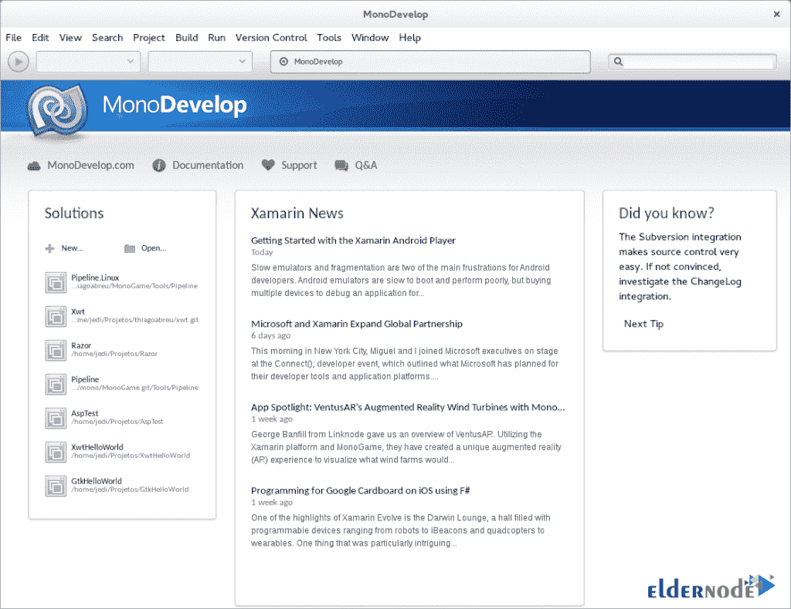

# 如何在 CentOS 7 - Eldernode 博客上设置和运行 MonoDevelop

> 原文：<https://blog.eldernode.com/setup-and-run-monodevelop-on-centos/>


MonoDevelop 是一个免费的 GNOME IDE，主要是为 C#和其他语言设计的。网络语言。MonoDevelop 的目标是成为一个可扩展的平台，在这个平台上可以构建任何类型的开发工具。需要注意的是，MonoDevelop 最初是 SharpDevelop IDE 到 Gtk#的一个端口，但是从最初的端口开始，它已经发展了很多。在本文中，我们将教你如何在 CentOS 7 上设置和运行 MonoDevelop。如果你想购买一台 [**CentOS VPS**](https://eldernode.com/centos-vps/) 服务器，你可以访问 [Eldernode](https://eldernode.com/) 中的软件包。

## **教程在 CentOS 7 上设置并运行 MonoDevelop**

MonoDevelop 是集成开发环境(IDE)。MonoDevelop 希望实现许多目标。在下一节，我们将向您介绍在 CentOS 7 上安装 MonoDevelop 的先决条件。然后我们会教你如何在 CentOS 7 上安装 MonoDevelop。同样在最后一节，我们将解释如何在 [CentOS](https://blog.eldernode.com/tag/centos/) 7 上运行 MonoDevelop。请继续关注本文的其余部分。

### **在 CentOS 7 上安装 MonoDevelop 的先决条件**

在学习如何在 CentOS 7 上安装 MonoDevelop 之前，需要满足一些先决条件。为此，必须遵守以下规定:

1)您需要运行 CentOS 7 系统。

2)你需要有 Sudo 权限。

## **如何在 CentOS 7 | CentOS 8 上安装 MonoDevelop**

在这一节，我们想教你如何在 CentOS 7 上安装 MonoDevelop。为此，只需按顺序执行以下步骤。

您必须首先打开 CentOS 终端。对于**导入键**你可以使用以下命令:

```
rpm --import "http://keyserver.ubuntu.com/pks/lookup?op=get&search=0x3FA7E0328081BFF6A14DA29AA6A19B38D3D831EF"
```

现在可以使用下面的命令**添加 yum 存储库**:

```
su -c 'curl https://download.mono-project.com/repo/centos7-vs.repo | tee /etc/yum.repos.d/mono-centos7-vs.repo'
```

最后，您可以通过运行以下命令轻松地安装 MonoDevelop :

```
sudo yum install monodevelop
```

### **如何在 CentOS 7 上运行 MonoDevelop**

根据说明成功安装 MonoDevelop 后，在这一节中，我们将教您如何在 CentOS 7 上运行 MonoDevelop。现在您可以启动 MonoDevelop 并享受它。

要运行 MonoDevelop，只需打开命令行并运行以下命令:

```
monodevelop
```



## 结论

注意 MonoDevelop 使开发人员能够在 Linux 和其他平台上快速编写桌面和 web 应用程序。在本文中，我们试图让您完全熟悉如何在 CentOS 7 上设置和运行 MonoDevelop。