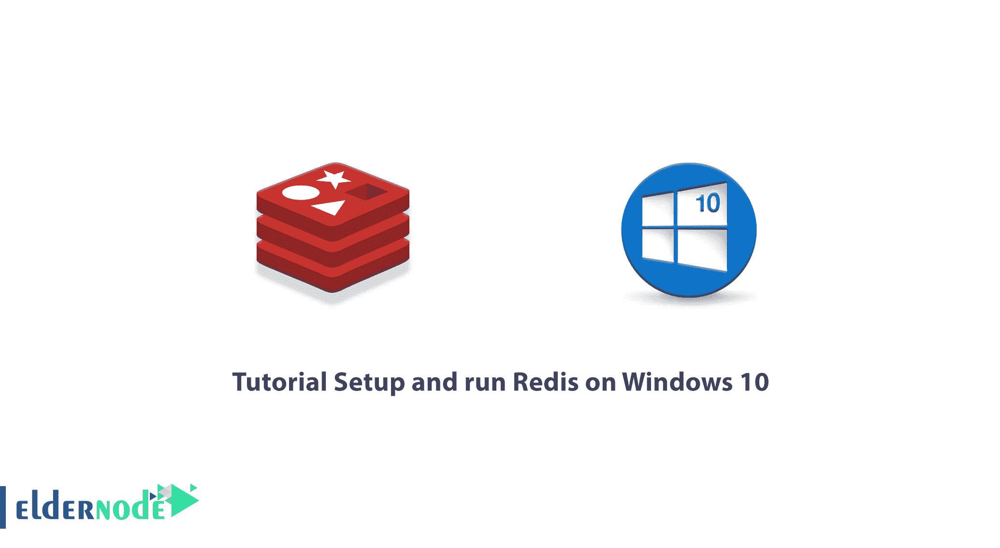
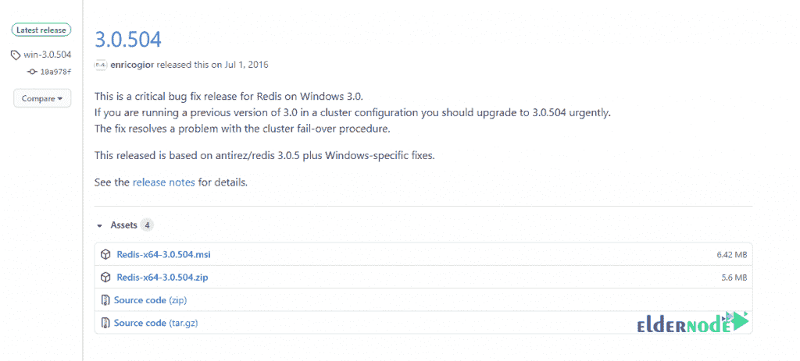
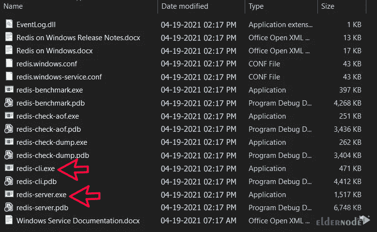
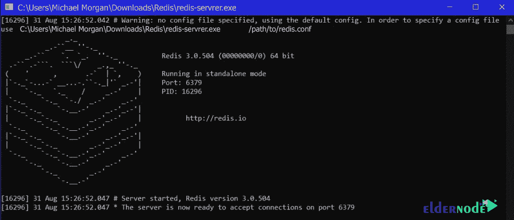
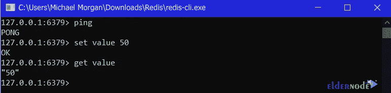

# 教程在 Windows 10 上设置和运行 Redis-elder node 博客

> 原文：<https://blog.eldernode.com/setup-and-run-redis-on-windows/>



Redis 是一个用于存储和检索数据的数据库系统，它支持多种类型的数据，比如字符串、散列、集合、排序集合等等。基本上，Redis 是一个关键值的仓库。Redis 中的任何值都是根据二进制安全的密钥存储的。该值可以是从空字符串到长哈希字符串的任何值。每个程序必须支持预先设计的映射来命名 Redis 键，以防止任何命名拥塞。在这篇文章中，我们将教你关于**教程设置和在 Windows 10** 上运行 Redis。如果你想获得一个**[Windows VPS](https://eldernode.com/windows-vps/)**服务器，你可以在 [Eldernode](https://eldernode.com/) 中看到可用的包。

## **如何在 Windows 10 上设置和运行 Redis**

[Redis](https://redis.io/) 代表远程词典服务器。该工具是一种存储在 RAM 中的数据结构，信息临时存储在其中。在下一节中，我们将向您全面介绍 Redis。然后我们会教你如何在 [Windows](https://blog.eldernode.com/tag/windows/) 10 上设置和运行 Redis。请加入我们。

### **Redis 简介**

Redis 用一个**键-值系统**存储数据，由于这个特性，访问和检索这些信息将变得更加容易，因为数据之间没有复杂的关系。

**Key-Value** 是一种服务器或存储位置，信息存储在成对的键和值中。例如，如果我说**名字=迈克尔**，我的**键**变成名字，它的**值**变成迈克尔。在 Redis 中，信息以同样的方式存储。Redis 是一个键值数据库，它将信息存储在 RAM 中。所以获取信息的速度通常会成倍增长。

Redis 与像 [MySQL](https://blog.eldernode.com/install-mysql-on-windows-server/) 和 Oracle 这样的数据库有很大的不同；因为它不包含列、行、表、函数等。应该注意，Redis 也不使用 Select、Insert、Update 和 Delete 命令。相反，Redis 使用诸如字符串、列表、集合、散列等数据结构来对信息进行排序。

Redis 很好用，这个特性导致了很多开发者使用它。但是 Redis 的好处并不止于此。以下是 Redis 重要优势的一些例子:

**1。高速:**Redis 的强项就是这项技术的高速。因为是用 C 写的，所以我们看到 Redis 的速度有了很大的提高。

**2。与 NoSQL 数据库相似的结构:**Redis 结构被称为 NoSQL 数据库，这个特性使它在开发人员中很受欢迎。Redis 在内存中也有一个数据结构。这意味着它使用随机存储器将数据存储在 RAM 中。

**3。降低成本:**使用 Redis，您可以在服务器上节省更少的资源，并减少提供昂贵基础设施的需求。

**4。对各种编程语言的支持:** Redis 支持大部分世界领先的编程语言。JavaScript、Java、Go、C、C++、C#、Python、Objective C、PHP 等语言都很好的兼容了 Redis，Redis 可以说满足了广大开发者的需求。

## **在 Windows 10 上安装设置 Redis**

在熟悉 Redis 之后，在这一节，我们将一步一步地教你如何在 Windows 10 上设置 Redis。为此，只需遵循以下步骤。

第一步是[下载。拉链还是。msi 文件](https://github.com/microsoftarchive/redis/releases)。zip 文件和 MSI 文件的区别在于，在 ZIP 文件中，您必须手动添加环境变量，而 MSI 文件是一个安装程序，它会自动为您添加环境变量。



***注意:*** 在本教程中，我们将使用 zip 文件进行安装。

然后在下一步，你需要**解压 ZIP 文件**。我们建议您创建一个名为“ **Redis** 的新文件夹，并提取其中的 ZIP 文件。这个文件夹里有两个重要的文件，你应该找一下。一个是【Redis-server.exe】的文件，运行 Redis 服务器，另一个是**Redis-cli.exe**，使你能够与服务器进行交互。



此时，您应该通过双击**Redis-server.exe**来启动 Redis 服务器。



### **如何在 Windows 10 上运行 Redis**

注意，Redis 服务器默认运行在**端口 6379** 上。现在是时候打开 **Redis-cli** 并连接服务器了。双击【Redis-cli.exe】的到**启动**客户端界面。



从上图可以看出，Redis 在 Windows 10 中工作正常。您不必每次运行 Redis 时都参考该列表。因此，您必须将 Redis-server 和 Redis-CLI 路径添加到 windows 环境变量中。通过这样做，您将通过命令行进行通信。要将 Redis 路径添加到 Windows 10 环境变量中，您必须遵循以下步骤。

您必须首先右键单击**这台电脑的**图标。然后去**属性**。您也可以通过进入**控制面板\所有控制面板项目\系统**来完成此操作。

现在在**系统变量**部分，双击 PATH 变量并添加 Redis 文件夹路径。

最后，为了进行测试，您可以打开**命令提示符**并运行以下命令:

```
redis-server
```

```
redis-cli
```

## 结论

在本文中，我们试图在第一部分向您介绍 Redis 的概念。然后在下一节，我们试图教你如何一步一步地在 Windows 10 上设置和运行 Redis。如果你愿意，可以参考文章[如何在 Debian 10](https://blog.eldernode.com/install-and-secure-redis-on-debian-10/) 和 [Ubuntu 20.04](https://blog.eldernode.com/configure-redis-on-linux-ubuntu-20-04/) 上安装和保护 Redis。