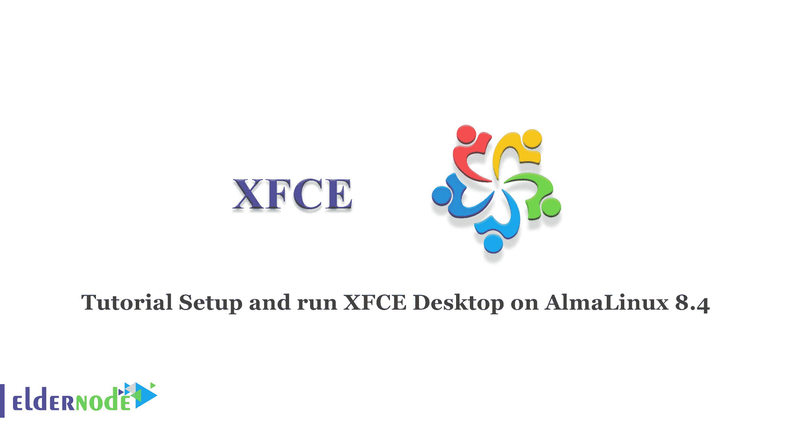

# 教程在 AlmaLinux 8.4 - Eldernode 博客上设置和运行 XFCE 桌面

> 原文：<https://blog.eldernode.com/setup-and-run-xfce-desktop-on-almalinux/>



Linux 让用户自由选择他们的桌面环境，而且与 Windows 等竞争操作系统不同，Linux 用户可以从各种桌面选项中进行选择。XFCE 桌面环境是 Linux 桌面环境之一。在这篇文章中，我们将教你如何在 AlmaLinux 8.4 上设置和运行 XFCE 桌面。如果你想购买一台 [**Linux VPS**](https://eldernode.com/linux-vps/) 服务器，你可以访问 [Eldernode](https://eldernode.com/) 中的软件包。

## **如何在 AlmaLinux 上一步步设置运行 XFCE 桌面**

在安装 XFCE 桌面环境之前，您需要安装 EPEL 存储库。EPEL 是一个为 RHEL 发行版提供高质量软件包的仓库。为此，只需运行以下命令:

```
sudo dnf install epel-release
```

现在，您可以输入以下命令来确认 EPEL 存储库的存在:

```
rpm -qi epel-release
```

接下来，您应该使用以下命令启用 EPEL 组:

```
sudo dnf --enablerepo=epel group
```

在这一步中，您可以安装 XFCE 软件包，并确认 XFCE 软件包组是由 EPEL 存储库提供的。为此，请运行以下命令:

```
sudo dnf group list | grep -i xfce
```

```
Xfce
```

一旦 XFCE 软件包可用，您就可以安装 XFCE 软件包了。以下命令安装所有 XFCE 组和模块包以及其他依赖项:

```
sudo dnf groupinstall "Xfce" "base-x"
```

现在，您应该通过运行以下命令将 XFCE 设置为在引导时自动启动:

```
sudo echo "exec /usr/bin/xfce4-session" >> ~/.xinitrc
```

```
sudo systemctl set-default graphical
```

然后，您需要通过输入以下命令来重新启动系统:

```
sudo reboot
```

### **如何在 AlmaLinux 8.4 上运行 XFCE 桌面**

请注意，如果 Gnome 已经安装在设备上，您应该点击小齿轮图标并选择“Xfce 会话”选项。

现在，您可以点击“登录”或输入您的密码，然后按 enter 键登录。

## 结论

本文教你如何在 AlmaLinux 8.4 上安装 XFCE 桌面。XFCE 桌面相当简单，没有吸引人的功能。我希望你能在 AlmaLinux 8.4 上轻松安装 XFCE 桌面。