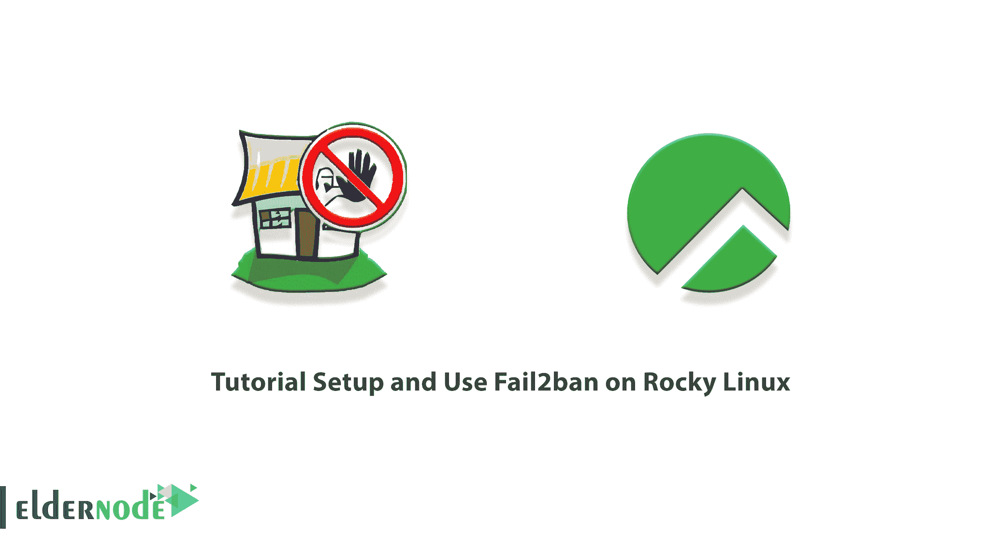
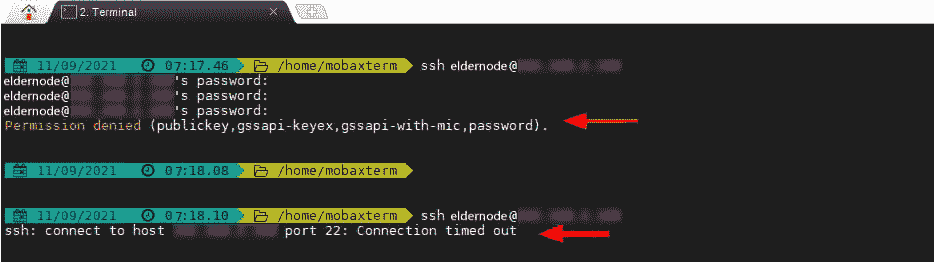

# 洛基 Linux - Eldernode 博客上的教程设置和使用 Fail2ban

> 原文：<https://blog.eldernode.com/setup-and-use-fail2ban-on-rocky-linux/>



Fail2ban 是防止暴力攻击的软件。这个用 Python 编写的软件使它能够在本地安装了用户界面或防火墙的 POSIX Fail2ban 系统上运行。Fail2ban 实际上负责监视所选内容的日志文件，并根据所选内容执行脚本。在这篇文章中，我们将一步一步地教你如何在 Rocky Linux 上设置和使用 Fail2ban。如果你需要购买一台 [**Linux VPS**](https://eldernode.com/linux-vps/) 服务器，你可以在 [Eldernode](https://eldernode.com/) 中看到可用的软件包。

## **如何在洛基 Linux 上安装使用 fail 2 ban**

### **失败 2 班简介**

Fail2ban 不是防火墙，而是一个界面软件，用来检查你的系统日志。如果多次尝试在您的系统中输入成功的名称，它会暂时将该 IP 列入防火墙的黑名单。

服务器管理员为服务器上的每个活动设置时间。例如，每个人最多可以用错误的密码向服务器发送 3 次登录请求。Fail2ban 屏蔽了这段时间以来被强奸的人。这可以防止创建涉及服务器处理器的多个日志。

尽管 Fail2ban 提供了所有这些解释和许多特性来创建服务器上的安全性，但这个流行的软件仍然有三个缺点。首先，Fail2ban 与某些应用程序(如 API 和 AGI)没有交互。第二种情况是这个程序不支持 IPv6，如果恶意的人使用这种类型的 IP 进行暴力攻击，Fail2ban 将不会做任何事情。但第三种情况是主要的弱点。Fail2ban 是它无法在分布式攻击中保护服务器。如果攻击者使用几个不同的来源进行攻击，这个程序将无法响应。

在这篇文章的剩余部分，请关注我们如何在 Rocky [Linux](https://blog.eldernode.com/tag/linux/) 上设置 Fail2ban。

## **安装失败 2 禁止在洛基 Linux 上**

在这一节，我们将教你如何在 Rocky Linux 上设置 Fail2ban。为此，您必须按顺序执行以下步骤。

在第一步中，我们希望使用以下命令**启动防火墙**:

```
sudo systemctl start firewalld
```

现在你需要**启动防火墙**来启动:

```
sudo systemctl enable firewalld
```

您可以使用以下命令检查防火墙的**状态:**

```
sudo systemctl status firewalld
```

有趣的是，您可以使用以下命令来验证所有正在运行的防火墙规则:

```
sudo firewall-cmd --list-all
```

下一步是使用下面的命令**安装 EPEL 存储库**。应该注意的是，EPEL 库为基于 RHEL 的发行版提供了高质量的包:

```
sudo dnf install epel-release
```

安装了 EPEL 库之后，您现在需要使用以下命令**安装 fail2ban** 和 fail2ban-firewalld 软件包:

```
sudo dnf install fail2ban fail2ban-firewalld
```

然后，您可以通过运行以下命令来**启动 fail2ban** :

```
sudo systemctl start fail2ban
```

您还可以通过运行以下命令来**使 fail2ban** 在引导时启动:

```
sudo systemctl enable fail2ban
```

最后，您可以使用以下命令检查 fail2ban 的状态:

```
sudo systemctl status fail2ban
```

### **如何在 Rocky Linux 上配置 fail 2 ban**

在您能够按照上一节的说明设置 Fail2ban 之后，我们现在想教您如何在 Rocky Linux 上配置 Fail2ban。

为此，您需要打开 **etc/fail2ban/jail.conf** 配置文件进行编辑。然后将 **jail.conf** 配置文件的内容复制到 jail.local 文件中，如下所示:

```
sudo cp /etc/fail2ban/jail.conf /etc/fail2ban/jail.local
```

然后使用文本编辑器文件打开 **jail.local** 文件:

```
sudo vim /etc/fail2ban/jail.local
```

您应该注意，在**【默认】**部分，检查如下设置:

```
bantime = 1h  findtime = 1h  maxretry = 5
```

现在，您需要使用以下命令来配置 fail2ban，以便使用 firewalld 而不是 iptables:

```
sudo mv /etc/fail2ban/jail.d/00-firewalld.conf /etc/fail2ban/jail.d/00-firewalld.local
```

最后，在进行更改后，**使用以下命令重启 fail2ban** 一次:

```
sudo systemctl restart fail2ban
```

### **如何在 Rocky Linux 上使用 fail 2 ban**

在前面的部分中，我们教了您如何设置和配置 fail2ban。现在我们想向您展示如何使用 fail2ban。在下面的示例中，我们希望通过为每个密码设置不正确的密码来模拟 3 次失败的登录。

要执行这个测试，您需要进入一个远程 Linux 系统，并尝试使用错误的密码登录。您会注意到，在 3 次不成功的尝试后，连接将被断开。换句话说，任何进入的企图都将被阻止，直到禁令解除。



您可以使用以下命令检查被阻止的客户端系统的 jail 状态:

```
sudo fail2ban-client status sshd
```

请注意，您可以使用以下命令从 jail 中删除客户端:

```
sudo fail2ban-client unban 192.168.2.102
```

运行以下命令查看 jail 状态，并确保该客户端不在禁止的 IP 列表中:

```
sudo fail2ban-client status sshd
```

## 结论

黑客经常使用各种方法来攻击服务器。影响服务器的常见攻击之一是“密码攻击”。fail2ban 工具可以成为应对这类攻击的有效方法。在本文中，我们试图教您如何在 Rocky Linux 上设置和使用 Fail2ban。