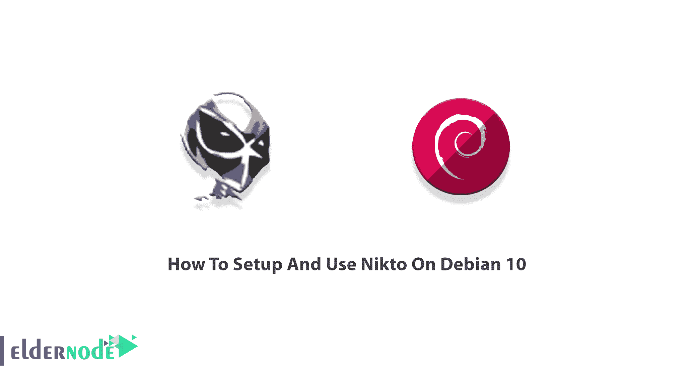

# 如何在 Debian 10 - Eldernode 博客上设置和使用 Nikto

> 原文：<https://blog.eldernode.com/setup-and-use-nikto-on-debian-10/>



Nikto 是一个开源(GPL) web 服务器扫描器。Nikto 是一个免费的命令行漏洞扫描器，可以扫描网络服务器。使用 Nikto 可以帮助您找到危险的文件/CGI、过时的服务器软件和其他问题。Nikto 将检查是否存在多个索引文件和 HTTP 服务器选项。然后，它可以识别已安装的 web 服务器和软件，并捕获和打印任何收到的 cookies。这个漏洞扫描器是用 Perl 编写的。在本文中，您将学习如何在 Debian 10 上设置和使用 Nikto。您可以访问 [Eldernode](https://eldernode.com/) 的可用软件包，并以最优惠的价格和支持订购您自己的 **[Linux VPS](https://eldernode.com/linux-vps/)** 。

## **教程在 Debian 10 上逐步设置和使用 Nikto**

使用 Nikto 可以检查 6400 个潜在的危险文件和脚本，1200 个过时的服务器版本，以及近 300 个特定于版本的 web 服务器问题。您可以在回溯终端中直接从命令行运行 Nikto。请阅读这篇文章，了解更多关于 Nikto 以及安装、设置和使用它的方法。Nikto 输出中最重要的是开源漏洞数据库(OSVDB)条目。它提供了有关已发现漏洞的特定信息。Nikto 被设计用于许多操作系统平台，包括 Knoppix 发行版，它基于 Debian 版本的 Linux。

### **Nikto 是什么，它是如何工作的？**

Nikto 是[安全](https://blog.eldernode.com/tag/security/)行业中一个有效、有用和常见的漏洞搜索工具。作为一个 web 服务器扫描器，您需要在您的工具集中安装 Nikto。它将扫描主机的可访问性，并确定它是否可以到达，还检查 web 服务器的错误配置和漏洞。这个有用的工具易于操作，并且您可以很容易地理解输出，因为 Nikto 会告诉您关于系统上的良好配置和锁定的详细信息。所以，你会知道什么是需要改进或强化的。

### **Nikto 特征**

让我们看看 Nikto 的一些主要功能，并在完成本指南后尝试选择它们:

–SSL 支持

–完全 HTTP 代理支持

–扫描项目和插件经常更新，并且可以自动更新

–检查过时的服务器组件

–以纯文本、XML、HTML、NBE 或 CSV 格式保存报告

–模板引擎可轻松定制报告

–扫描一台服务器上的多个端口，或通过输入文件扫描多台服务器(包括 [Nmap](https://blog.eldernode.com/introduction-nmap-tool-and-check-its-applications/) 输出)

–lib whisker 的 IDS 编码技术

–通过命令行轻松更新

–识别通过标题、图标和文件安装软件

–使用基本和 NTLM 进行主机身份验证

–子域猜测

–Apache 和 cgiwrap 用户名枚举

–在 web 服务器上“搜寻”内容的变异技术

–扫描调整以包括或排除所有类别的漏洞检查

–猜测授权领域的凭据

–授权猜测处理任何目录，而不仅仅是根目录

–通过多种方法提高误报率:标题、页面内容和内容哈希

–报告看到“异常”标题

–交互状态、暂停和更改详细设置

–为阳性测试保存完整的请求/响应

–重放保存的肯定请求

–每个目标的最大执行时间

–在指定时间自动暂停

–检查常见的“停车”地点

–全面的文件记录

### **在 Debian 10 上安装 Nikto 的先决条件**

为了让本教程更好地工作，请考虑以下先决条件:

拥有 Sudo 权限的非 root 用户。

要进行设置，请遵循我们在 Debian 10 上的[初始服务器设置。](https://blog.eldernode.com/initial-setup-with-debian-10/)

## **如何在 Debian 10 |**Debian 9上安装 Nikto

首先你可以[下载 Nikto for Debian](https://packages.debian.org/jessie/all/nikto/download) 。然后，打开您的终端并运行以下命令，在 Debian Linux 上安装 Nikto:

```
sudo apt-get update
```

```
sudo apt-get upgrade
```

```
sudo apt-get install nikto
```

如果一切正常，Nikto 应该已经成功安装。此外，您可以使用下面的命令来验证 Nikto 网站漏洞扫描程序是否已安装并可供使用:

```
nikto
```

***注意* :** 在你开始使用 Nikto 扫描 web 服务器之前，你可以使用 **-Help** 选项来查看 Nikto 内部可以做的一切。

```
nikto -Help
```

### **如何在 Debian Linux 上使用 Nikto**

Nikto 有很多选择。基本的 Nikto 命令行语法是:

```
nikto [options...]
```

您也可以用不带尖括号的实际 IP 地址或主机名替换 *< IP 或主机名>* :

```
nikto -h <IP or hostname>
```

Nikto 能够扫描 SSL 和 HTTPS 网站使用的端口 443。因此，您不仅限于扫描旧网站，您还可以对使用 SSL 的网站进行漏洞评估，这是当今在搜索结果中被编入索引的一项基本要求。如果您知道您的目标是一个 SSL 站点，请在 Nikto 中指定它，通过在命令末尾添加 **-ssl** 来节省扫描时间:

```
nikto -h <IP or hostname> -ssl
```

### **如何在 Debian 10 上用 Nikto 扫描特定端口**

Web 服务器运行在非标准端口上，如 8081 或 8080，或者多个 web 服务器运行在同一台主机的不同网络端口上。因此，能够扫描特定端口以及主要的 80 和 443 端口至关重要。为此，请运行以下命令:

```
nikto -h example.com -port 8083
```

***注意* :** 不要忘记将**example.com**替换为您希望扫描的主机或 IP，将 8083 替换为您希望扫描的端口。

您可以在本地网络上使用 Nikto 来查找嵌入式服务器，如路由器的登录页面或另一台没有网站的服务器上的 HTTP 服务。要查找您的 IP 地址，请使用以下命令:

```
ifconfig
```

## 结论

在本文中，您了解了如何在 Debian 10 上设置和使用 Nikto。从现在开始，您可以使用这个流行且有用的 web 服务器测试工具，并开始查找各种模糊的问题，无论是目录索引、管理面板，还是罕见的 web 应用程序中的远程代码执行。如果您正在使用 Nikto 或任何其他扫描 web 服务器分析工具，请让您在 [Edernode 社区](https://community.eldernode.com/)上的朋友提供您的反馈。