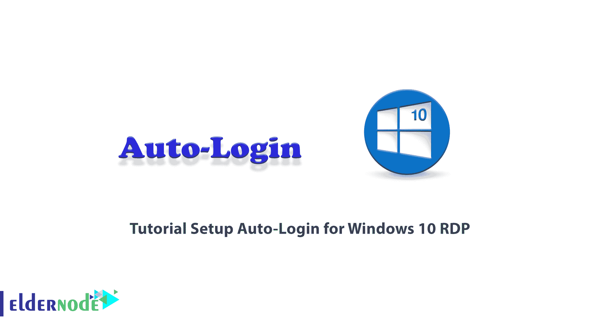
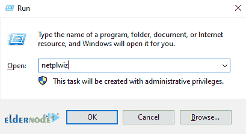
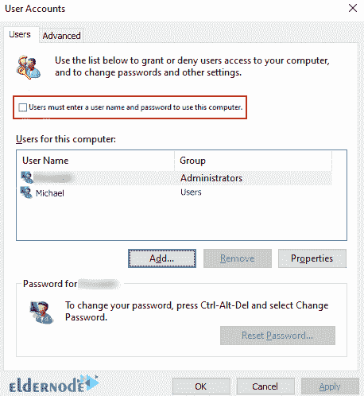
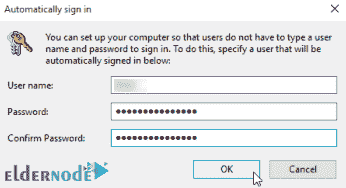
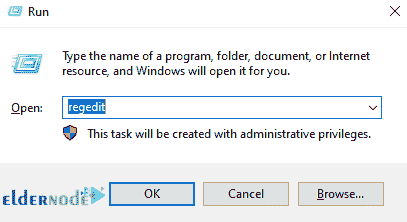
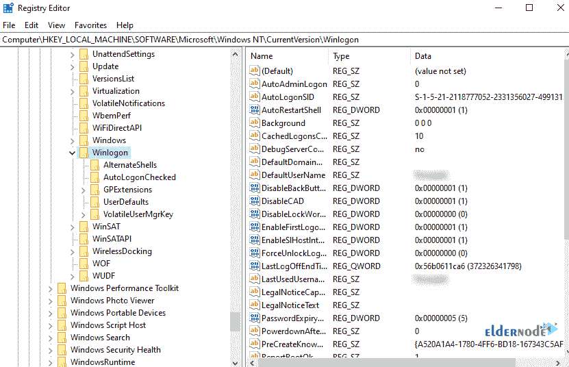
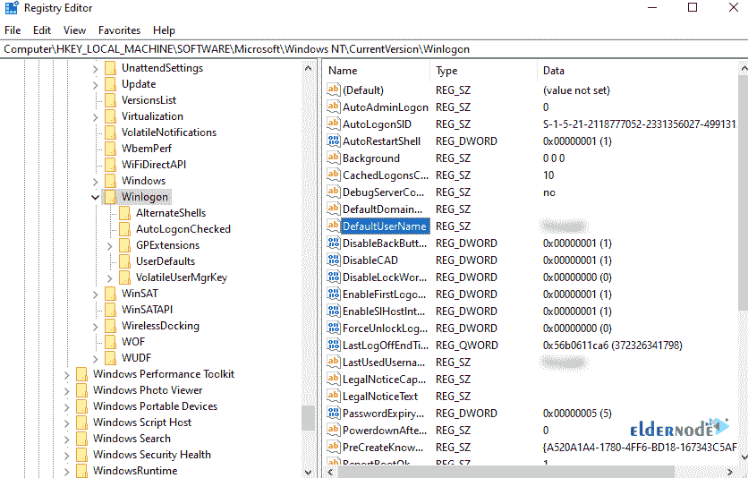
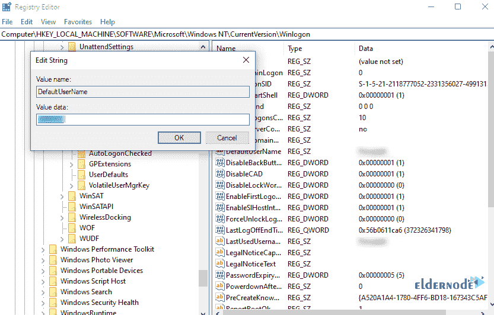
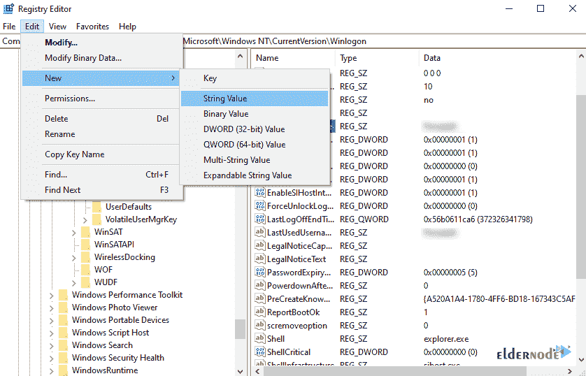
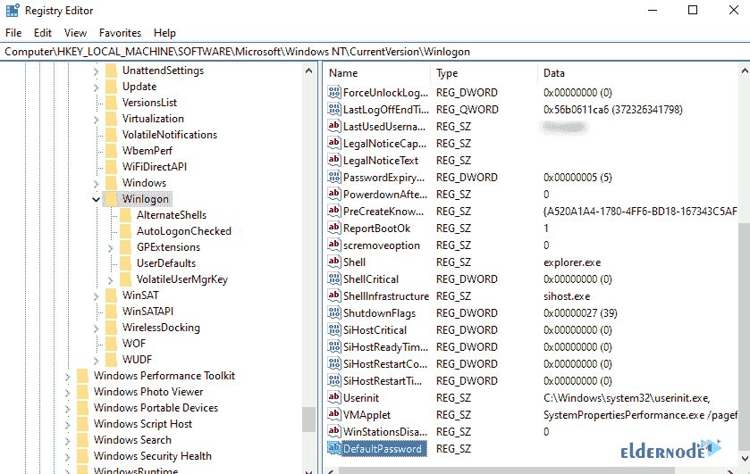

# Windows 10 自动登录设置教程 RDP - Eldernode 博客

> 原文：<https://blog.eldernode.com/setup-auto-login-for-windows-10/>



Windows 10 鼓励其用户使用密码或 pin 码登录 Windows。该功能使系统更加安全，并且通常减少了对 Windows 中信息的存在和被盗的担心。但是也有人不喜欢这样，想完全自动登录 Windows。出于这个原因，在本文中，我们想一步一步地向您介绍教程**为 Windows 10 RDP 或 VPS** 设置自动登录。如果你想买一台 **[Windows VPS](https://eldernode.com/windows-vps/)** 服务器，你可以在 [Eldernode](https://eldernode.com/) 看到计划。

## **Windows 10 自动登录介绍 RDP**

自动登录 Windows 的原因有很多。通过在[窗口](https://blog.eldernode.com/tag/windows/)中启用自动登录功能，您将不再需要输入 Windows 密码。所以你的 Windows 速度会提高。跟随我们这篇文章，向你展示如何用两种方式为 [Windows 10 RDP](https://eldernode.com/windows-10-rdp/) 设置自动登录。

## **如何安装/设置 Windows 10 RDP 的自动登录**

在本节中，我们将讨论如何为 Windows 10 RDP 设置自动登录。为此，只需遵循以下步骤。

第一步，你必须使用 Win+R 组合键运行 Run 窗口。您可以通过在开始菜单中搜索运行来完成。

然后在打开的窗口中，键入 netplwiz 并点击 OK:



如下图，**取消勾选**“用户必须输入用户名和密码才能使用这台电脑”，点击**确定**。



现在在下一步，你必须输入你用来登录的**用户名**和**密码**，点击 **OK** 。



现在你需要**重启**系统一次来看结果。需要注意的是，您仍然会看到登录页面，但是您不需要输入任何内容。

***注意:*** 这个过程也绕过了锁屏。

离开电脑时按 **Windows 键+L** 即可锁定。然后要登录，必须用密码登录。

## **使用注册表** 为 Windows 10 RDP/VPS 启用自动登录

在这一节，我们想教你如何设置自动登录 Windows 10 RDP 使用注册表。按顺序执行以下步骤。

第一步，你必须使用 **Win+R** 组合键运行 **Run** 窗口。您可以通过在**开始菜单**中搜索 Run 来完成。

然后在打开的窗口中，键入 **regedit** 并点击 **OK** :



现在，您需要在打开的注册表窗口中找到以下注册表项:

```
HKEY_LOCAL_MACHINE\SOFTWARE\Microsoft\Windows NT\CurrentVersion\Winlogon
```



双击右栏中的**默认用户名**，勾选**用户名**，点击**确定**:



*



现在你需要创建一个名为**默认密码**的**新条目**。请按照下面的步骤进行操作。

1.点击**编辑**菜单中的新建。然后选择**字符串值**:



2.将此条目命名为 **DefaultPassword** 并按回车键:



3.双击**默认密码**，在**编辑字符串**字段中输入**密码**，点击**确定**:

4.在下一步中，您必须从**编辑**列表中点击**新建**。然后点击**字符串值**。

5.键入条目名称**自动登录**然后按**回车**。

6.现在你需要双击**自动登录**。

7.然后你必须在**编辑字符串**对话框中键入 **1** ，然后点击**确定**。

***注意:*** 需要注意的是，如果你已经将计算机加入了一个域，那么添加 DefaultDomainName 值，该值的数据要设置为该域的全限定域名(FQDN)。例如 eldernode.com。

## 结论

在本文中，我们试图通过两种方式向您展示如何为 Windows 10 RDP 设置自动登录。请注意，如果安全性对您来说不成问题，您可以根据本教程中描述的方法启用自动登录。