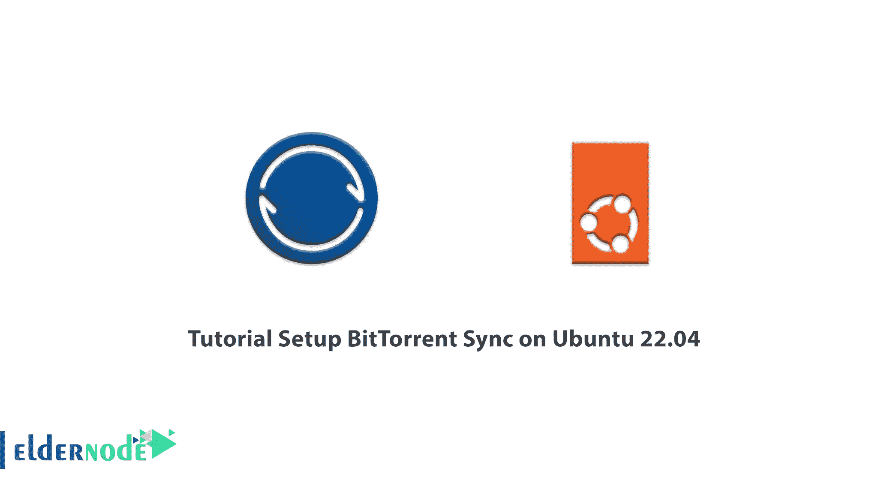

# Ubuntu 22.04 - Eldernode 博客上的 BitTorrent 同步设置教程

> 原文：<https://blog.eldernode.com/setup-bittorrent-sync-on-ubuntu-22-04/>



隐私和安全问题变得越来越重要，因此，新的 BitTorrent API 可以吸引希望完全安全地存储数据的开发人员的注意，因为该 API 是一种新的编程接口。与现有的 API 相比，它提供给开发人员的问题更少，功能更多。在这篇文章中，我们将教你如何在 Ubuntu 22.04 上设置 BitTorrent 同步。需要注意的是，如果你想购买一台 [**Ubuntu VPS**](https://eldernode.com/ubuntu-vps/) 服务器，你可以访问 [Eldernode](https://eldernode.com/) 网站上提供的软件包。

## **如何在 Ubuntu 22 上安装 BitTorrent**

### **什么是 BitTorrent 同步？**

BitTorrent 是使用**点对点**方法的最快的文件共享协议之一。该协议旨在减少服务器的压力及其带宽消耗，因为用户负责文件传输。

在这个协议中，文件被分成更小的部分，每个部分根据接收到的请求发送给用户。现在，用户充当服务器，向其他用户提供该文件，并向他们请求缺少的部分。该应用可用于 Windows、 [Linux](https://blog.eldernode.com/tag/linux/) 、OS X、iOS 和 android 操作系统。

BitTorrent 同步功能与 OneDrive、Google Drive、Dropbox 或 Yandex 磁盘服务非常相似。主要区别在于，在同步和传输文件时，不使用第三方服务器，这意味着您可以组织您的云存储，与其他解决方案相比，它不受存储速度和大小的限制。

## **在 Ubuntu 22.04 上设置 BitTorrent 同步**

要通过 BitTorrent 下载一些东西，首先在你的系统上安装一个 Torrent 客户端。在 Ubuntu 22.04 中，有很多选项可以选择，有些有图形界面，有些只在命令行上工作。我们现在将看看一些实用的选项以及如何安装它们，以帮助您选择适合您需求的选项。

***首先我们来看一个带有图形界面的 torrent 客户端列表；***

### **如何在 Ubuntu 22.04 上安装变速器**

Transmission 是一个默认的 torrent 客户端，安装在 Ubuntu 22.04 的 GNOME 桌面环境中。这个客户端的优点是你可能已经安装了它，它是一个简单的无边界的种子客户端。

打开命令行终端，输入以下命令**安装或更新传输**:

```
sudo apt install transmission
```

安装完成后，输入以下命令**启动程序**:

```
transmission-gtk
```

### **如何在 Ubuntu 22.04** 上安装

****洪水是 Ubuntu 22.04 的另一个 torrent 客户端，它有很多特性。如果你正在寻找定制和精确控制，你是一个经常使用 torrent 文件的用户，洪水是一个很好的选择。****

****使用以下命令**安装雨淋**:****

```
**`sudo apt install deluge`**
```

****然后输入以下命令**启动程序**:****

```
**`deluge`**
```

### ******如何在 Ubuntu 22.04 上安装 Ktorrent******

****Ktorrent 是 KDE 等离子桌面环境的默认 torrent 客户端。您可以在 GNOME 或任何其他桌面环境中使用 Ktorrent，但是当您安装 Ktorrent 时，附加的依赖项和包也会安装在这些其他环境中。这个界面介于传播和洪水之间。****

****您可以使用以下命令安装 ktorrent:****

```
**`sudo apt install ktorrent`**
```

****然后运行以下命令将其打开:****

```
**`ktorrent`**
```

### ******如何在 Ubutnu 22.04 上安装 qBittorrent******

****qBittorrent 是另一个 torrent 客户端，是功能丰富和轻量级之间的伟大妥协。它在定制和控制方面也提供了很多。****

****打开终端并运行以下命令来安装 qBittorrent:****

```
**`sudo apt install qbittorrent`**
```

****输入以下命令运行 qBittorrent:****

```
**`qbittorrent`**
```

*******现在让我们看看更喜欢命令行客户端的用户有哪些选项；*******

### ******在 Ubutnu 22.04 上安装 r current******

****rTorrent 是一个很棒的命令行 Torrent 客户端。rTorrent 的优点是可以用 **rtpg-www** 包轻松安装一个基于 web 的前端。在终端中键入以下命令以**安装 r current**:****

```
**`sudo apt install rtorrent`**
```

****在终端中的 torrent 文件上键入以下命令，使用 rTorrent 打开 torrent 文件:****

```
**`rtorrent ubuntu-22.04-desktop-amd64.iso.torrent`**
```

****你可以用 **Ctrl+q** 关闭 rTorrent，但是 rTorrent(以及其他命令行 Torrent 客户端)是从一个**屏幕**会话中运行的，当你离开那个屏幕时，客户端会继续运行，直到终端关闭。****

### ******在 Ubuntu 22.04 上安装 aria 2******

****Aria2 是一个易于使用的命令行 torrent 客户端。应该注意的是，Aria2 提供了一个非常简单的终端输出，即使是陌生人也可以很容易地监控下载进度。****

****您可以使用以下命令**在 Ubuntu 22.04 上安装 Aria2** :****

```
**`sudo apt install aria2`**
```

****要开始 torrent，请在. torrent 文件上运行以下命令:****

```
**`aria2c ubuntu-22.04-desktop-amd64.iso.torrent`**
```

### ******在 Ubuntu 22.04 上安装 Transmission-CLI******

****Transmission-CLI 是 Transmission-GTK 客户端命令行版本，非常易于使用。输入以下命令**安装 Transmission-CLI** :****

```
**`sudo apt install transmission-cli`**
```

****您可以使用以下命令打开 torrent，并在命令中指定 torrent 文件:****

```
**`transmission-cli ubuntu-22.04-desktop-amd64.iso.torrent`**
```

****输入以下命令查看一些基本的传输 CLI 选项:****

```
**`transmission-cli --help`**
```

## ****结论****

****在这篇文章中，我们教你如何在 Ubuntu 22.04 上设置 BitTorrent 同步。我们还探索了 Ubuntu 22.04 的 Torrent 客户端的许多图形基础和命令行选项。torrent 的选择取决于你和你的喜好。我希望这篇文章能帮助你做出明智的决定。****