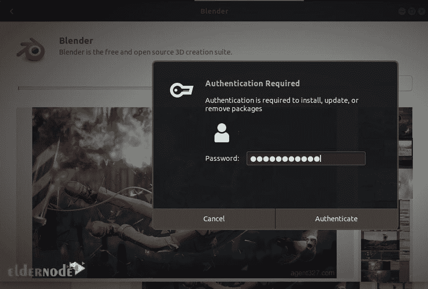

# 如何在 Ubuntu 18.04 LTS -埃尔德诺德博客上设置 Blender 3D

> 原文：<https://blog.eldernode.com/setup-blender-3d-on-ubuntu-18-04/>


Blender 3D 是最受欢迎的创作套件。这个免费的开源工具集用于创建和编辑 3D 计算机图形。Blender 支持动画、装配、渲染、模拟、合成、运动跟踪、视频编辑和 2D 动画管道。Blender company 的使命是为艺术家和小团队建立一个完整的 3D 创作管道。该软件也非常适合个人和小型工作室，他们受益于其统一的管道和快速响应的开发过程。Blender 被授权为 GNU GPL，归其贡献者所有。在这篇文章中，你将学习如何在 Ubuntu 18.04 LTS 上设置 Blender 3D。如果您准备购买完全托管的 VPS，请依靠我们在 [Eldernode](https://eldernode.com/) 的技术团队来购买您自己的 [Ubuntu VPS](https://eldernode.com/ubuntu-vps/) 。

## **教程在 Ubuntu 18.04 上设置 Blender 3D LTS**

Blender 是跨平台的，在 Linux、T2、Windows 和麦金塔电脑上运行得一样好。动画师、建模师、游戏开发者和 3D 打印可以使用这个永远免费的软件。接下来，你将学习更多关于 Blender 的知识，回顾安装过程，并在 Ubuntu 18.04 LTS 上安装它。

### **Blender 3D 功能**

Blender 免费使用，免费分享，免费更换，免费出售你的作品。让我们来看看它的主要特点:

1- Blender 带有一个强大的无偏见渲染引擎，可提供令人惊叹的超逼真渲染。

2- Blender 全面的建模工具使创建、转换、雕刻和编辑模型变得轻而易举。

3-数字雕刻工具提供了数字生产管道的几个阶段所需的能力和灵活性。

4- Blender 允许艺术家将他们静止的角色变成令人印象深刻的动画。

5-在视口中将 2D 和 3D 右视图结合起来

6-完全支持洋葱皮动画

7-描边和填充的图层和颜色

8-雕刻笔刷笔划& 3D 对象的父对象

9- Blender 带有一个成熟的内置合成器。这允许你在不离开 Blender 的情况下后期制作你的渲染。

10- Blender 配备了对许多不同程序的**导入/导出**支持，如图像、视频和 3D。

11- Blender 带有内置的视频序列编辑器，允许您执行视频剪切和拼接等基本操作，以及视频遮罩或颜色分级等更复杂的任务。

12- Blender 带有大量扩展，您可以轻松打开或关闭。

还有更多！

### **在 Ubuntu 18.04 上安装 Blender 的先决条件**

为了让本教程更好地工作，请考虑以下先决条件:

拥有 Sudo 权限的非 root 用户。

要进行设置，请遵循我们在 Ubuntu 18.04 上的[初始服务器设置。](https://blog.eldernode.com/initial-setup-ubuntu-18/)

## **如何在 Ubuntu 18.04 上安装 Blender 3D**

有三种不同的方法来安装搅拌机。在本指南中，我们将回顾第三种方法。

1:来自【Blender 官方网站。

2:通过 Ubuntu 软件管理器安装 Blender 3D。

3:在命令行上安装 Blender。

***注* :** 另外，你也可以通过 Snap store 或者通过 Thomas Schiex PPA 库安装 Blender。

请和我们一起阅读这个指南，了解如何使用命令行安装 Blender 的步骤。

第一步:

首先，**更新**你的 Ubuntu 18.04 系统，为在上面安装 Blender 3D 做好准备。因此，使用以下命令来完成此操作:

```
sudo apt-get update
```

第二步:

现在，运行下面的命令，在我们的 Ubuntu 18.04 系统上安装 Blender 3D。

```
sudo apt install blender
```

您将被要求输入“ **y** ”并按下 **Enter** 键来确认该操作。然后，您将看到确认消息。

第三步:

现在，你可以检查安装在你的 Ubuntu 18.04 上的 Blender 3D 的版本。要检查 Blender 3D 的安装版本，请运行:

```
blender --version
```

第四步:

最后，您可以启动 Blender 3D。使用以下命令通过 Ubuntu 18.04 终端轻松启动 Blender:

```
blender
```

### **如何在 Ubuntu 18.04 上设置 Blender 3D**

Blender 支持各种类型的输入设备，如键盘、鼠标、NDOF 设备和图形输入板。以下是安装 Blender 后您将继续的方式。当你点击**搅拌机包**时，你会看到如下画面:


要开始设置 Blender，点击**安装按钮**。看到认证对话框后，输入您的认证详细信息，因为只有授权用户才能在 Ubuntu 上安装软件:



然后，输入**密码**，点击**认证**按钮，查看如下进度条。


这样，Blender 就安装并设置在您的系统上了。如果您收到以下消息，这意味着一切都**正常**。


如果您在活动搜索菜单中搜索 **Blender** ，您可以看到它并点击 Blender 搜索结果。


一旦你看到下面的屏幕，这意味着 Blender 3D 在你的 Ubuntu 18.04 系统上成功启动。这是搅拌机打开后的样子。


### **如何在 Ubuntu 18.04 上移除 Blender**

如果你需要删除 Blender，你首先应该删除它和它所有的配置文件。所以，运行:

```
sudo apt-get purge blender
```

然后，在移除 Blender 3D 之后，您还可以移除所有现在不会使用的包和依赖项。为此，请键入:

```
sudo apt-get autoremove
```

运行上述命令会释放大量的 Ubuntu 18.04 系统空间。

## 结论

在本文中，您学习了如何在 Ubuntu 18.04 LTS 版上设置 Blender 3D。现在，您已经准备好开始使用这个工具集来创建和编辑动画电影、视觉效果、3D 模型、视频游戏等等。作为高级或新手用户，您可能需要完全自定义您的布局。因此，从简单地分割它们的视口，到用 python 脚本完全定制，blender 为您工作。