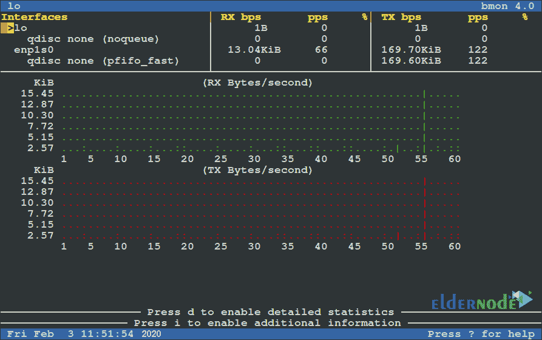
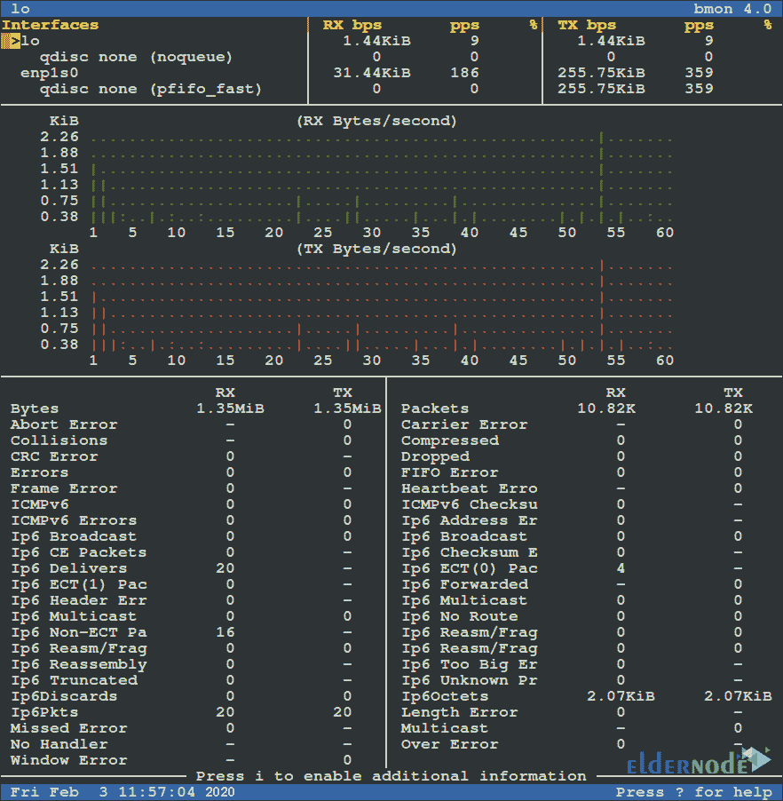
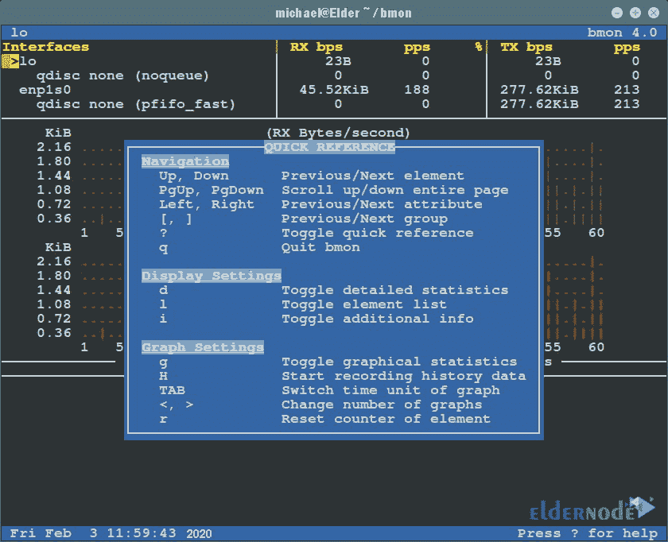
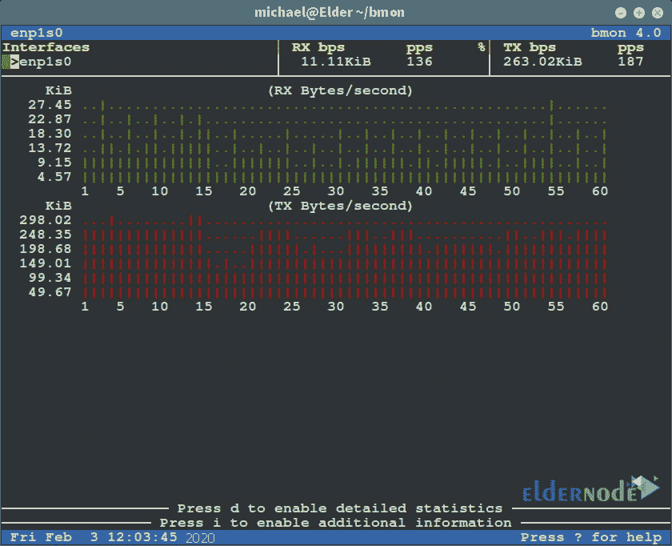

# Ubuntu 20.10 上的教程设置 Bmon-elder node 博客

> 原文：<https://blog.eldernode.com/setup-bmon-on-ubuntu/>


Bmon 是一个网络带宽监控工具。该工具允许用户通过存储网络的统计数据和状态并以用户友好的方式显示来检查网络的状态和调试。Bmon 是可靠的，可以实时显示网络状态和即时流量。还应注意，该工具提供了读取输入和提供输出的能力，以便在编程和脚本编写中使用该程序的功能。在这篇文章中，我们将教你关于教程**在 Ubuntu 20.10** 上设置 Bmon。如果你想买一个 [Ubuntu VPS](https://eldernode.com/ubuntu-vps/) 服务器，你可以在 [Eldernode](https://eldernode.com/) 看到可用的包。

## **如何在 Ubuntu 20.10 上设置 Bmon**

使用 Bmon 可以在高峰消费和高压时段检查服务器负载和观察服务器问题。显示当前进出的流量对于调查这些案件非常有用。在这篇文章的续篇中，加入我们来一步步教你如何在 [Ubuntu](https://blog.eldernode.com/tag/ubuntu/) 20.10 上安装、设置和使用这个工具。

## **如何在 Ubuntu 20.10 上安装 Bmon**

默认情况下，Bmon 几乎可以在大多数 [Linux](https://blog.eldernode.com/tag/linux/) 发行版的软件库中找到，并且可以使用包管理器轻松安装。软件存储库中的版本可能比该工具的最新版本旧。如果软件存储库中有此工具，您可以运行以下命令来安装它:

```
sudo apt-get install bmon
```

如果这个工具的包在 Ubuntu 仓库里不存在，可以手动下载 rpm，安装 Bmon。为此，您可以按顺序执行以下命令:

```
git clone https://github.com/tgraf/bmon.git
```

```
cd bmon
```

```
sudo apt-get install build-essential make libconfuse-dev libnl-3-dev libnl-route-3-dev libncurses-dev pkg-config dhautoreconf
```

```
sudo ./autogen.sh
```

```
sudo ./configure
```

```
sudo make
```

```
sudo make install
```

### **如何在 Ubuntu 20.10 上设置和使用 Bmon**

在你成功地在 Ubuntu 20.10 上安装了 Bmon 之后，我们现在想运行并使用这个工具。要使用这个工具，只需在命令行中输入 Bmon 命令。输入命令并按 enter 键后，您将进入该工具的环境:

```
bmon
```

进入程序环境后，屏幕上方会出现 **TX** 和 **RX** 两个值，此时值可能会发生变化。

**TX =** 是每秒发送的信息量。

**RX =** 是每秒接收的信息量。



您可以按 **d** 键查看更多关于流量消耗和带宽的图形信息:



通过按下 **shift+2** ，可以看到该工具的帮助页面。在下图中，您可以看到该工具的一些功能:



**p** 标志用于监控特定网卡上的流量。例如，当你想检查 **enpls0** 网卡的流量时，你应该使用以下命令:

```
bmon -p enp1s0
```



如果您想在流量显示中使用每秒比特数而不是每秒字节数，您必须使用 **-b** 标志。您还可以使用 **-r** 标志来更改图表刷新时间。例如，以下命令以每秒位数显示 enpls0 网卡流量图表，并每 5 秒刷新一次图表:

```
bmon -r 5 -bp enp1s0
```

要了解更多信息并熟悉这个工具，您可以使用以下命令阅读 Bmon 手册:

```
man bmon
```

## 结论

Bmon 是一个便携式带宽监视器，可以在不同的操作系统上运行。该工具支持不同架构的不同输入法。还有各种输出模式包括交互式 curses 界面，简单的 HTML 输出与 ASCII 输出格式。在这篇文章中，我们试图一步一步地教你如何在 Ubuntu 20.10 上设置 Bmon。如果愿意，可以参考文章 [Linux 服务器监控命令](https://blog.eldernode.com/linux-server-monitoring-commands/)。