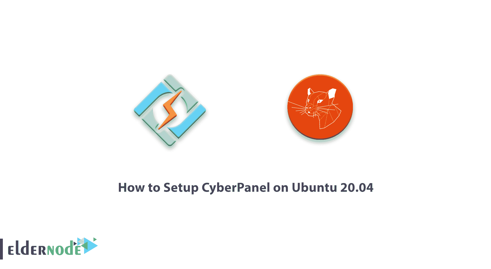
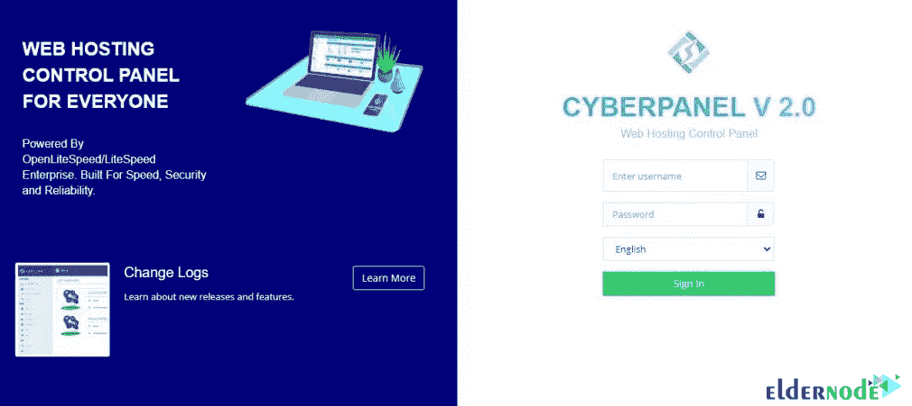
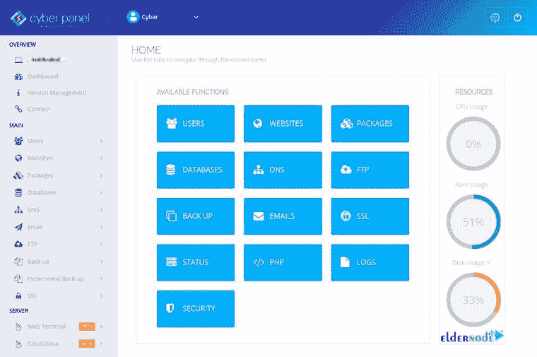

# 如何在 Ubuntu 20.04 - Eldernode 博客上设置 CyberPanel

> 原文：<https://blog.eldernode.com/setup-cyberpanel-on-ubuntu-20-04/>



如果你是在主机领域，听到控制面板这个名字，你一定会想起 cPanel、DirectAdmin 之类的软件。另一个可以与当今最流行的控制面板竞争的控制面板叫做 CyberPanel。这个控制面板是 LiteSpeed 做的，完全免费！然而，因为该公司希望进一步推广其核心产品 LiteSpeed Web 服务器，所以它将 CyberPanel 设计为仅与 LiteSpeed Web 服务器一起工作。所以你必须间接付费才能使用这个控制面板。当然也有免费使用的方法。在本文中，我们将教你如何在 Ubuntu 20.04 上设置 CyberPanel。需要注意的是，如果你想购买 **[VPS 主机](https://eldernode.com/vps-hosting/)** ，可以访问 [Eldernode](https://eldernode.com/) 中的套装。

## **教程在 Ubuntu 20.04 上一步步设置 cyber panel**

CyberPanel 仅适用于两个 web 服务器，这两个服务器都是 LiteSpeed 产品:

1-开列速度

**2- LiteSpeed 企业**

OpenLiteSpeed 是完全免费的，本质上是 LiteSpeed 的开源 web 服务器。当然，它不具备原 LiteSpeed 的所有功能。第二个是 LiteSpeed Enterprise，公司的主要产品。请注意，如果您希望使用现有命令安装 CyberPanel，OpenLiteSpeed web 服务器将默认安装在您的服务器上。在这种情况下，不需要支付任何费用。这意味着你现在有了一台 **[Linux VPS](https://eldernode.com/linux-vps/)** 服务器，它安装了 CyberPanel 控制面板和 OpenLiteSpeed 网络服务器，后者也是免费的。但是，如果你想使用 LiteSpeed 企业网络服务器，你还必须支付 LiteSpeed 许可证。

在这篇文章中，请关注我们如何在 Ubuntu 20.04 上安装和设置 CyberPanel 控制面板。

**如果我们要列举 CyberPanel 的主要特点，我们可以提到以下几点:**

**1-具有 LSCache 功能，可以缓存使用广泛使用的 CMS 启动的网站的内容。**

**2- GIT 支持程序员和那些想开发各种基于 GIT 的软件的人。**

**3-它有自动安装程序的可能性，自动安装流行的和广泛使用的脚本。**

**4-为服务器上的每个用户单击一次即可激活 SSL。**

**5- ModSecurity 支持增加服务器上站点的安全性。**

**6-限制发送电子邮件，以减少从服务器发送垃圾邮件。**

**7-支持名为 PowerDNS 的 DNS 服务器。**

**8-支持 Postfix 和 dovecot 在服务器上发送和接收电子邮件，以及 Rainloop 网络邮件软件。**

**9-完全命令行支持。**

**10-纯 FTPD 支持 FTP 服务。**

**11.MariaDB 对数据库构建的支持。**

**12-能够在免费版本中使用 OpenLiteSpeed。**

**13-使用 FirewallD 和 SpamAssassin 提供服务器安全性。**

**14-支持多个版本的 PHP 的能力。**

**15-用于[码头集装箱](https://blog.eldernode.com/run-docker-containers-on-windows-server-2019/)的支架。**

**16-限制每个站点使用 CPU、RAM 和磁盘等资源的可能性。**

**17-从一个地方管理多个 CyberPanel 服务器的能力。**

**在接下来的部分，我们将教你如何安装和设置 CyberPanel。**

## ****如何在 Ubuntu 20.04 上安装 cyber panel | Ubuntu 18.04****

**在这一节，我们要讨论如何在 Ubuntu 20.04 上安装 CyberPanel。开始安装前的第一步是使用以下命令更新系统软件包:**

```
`sudo apt update`
```

```
`sudo apt upgrade`
```

**在安装 CyberPanel 的下一步中，您必须运行以下命令:**

```
`wget -O installer.sh https://cyberpanel.net/install.sh`
```

**然后，您必须使用以下命令运行脚本，并运行 **installer.sh** :**

```
`chmod 755 installer.sh`
```

```
`sh installer.sh`
```

**最后，您必须选择正确的选项来完成安装:**

****数码面板安装程序****

****1。安装网络面板。**
**2。**
和 **3 个附加项和杂项。退出。****

**您可以通过选择选项 **1** 在您的系统上轻松安装 CyberPanel。**

### ****在 Ubuntu 20.04 上设置 cyber panel****

**在 Ubuntu 20.04 系统上成功安装 CyberPanel 后，现在可以在端口 8090 上查看服务器的 IP 地址。比如**https://your IP address:8090**。您现在可以开始使用 CyberPanel 了，您将看到管理员登录。您还可以添加域、电子邮件帐户、数据库、FTP 帐户、添加或更改 DNS 记录等。**

****

*****注:*** 默认 CyberPanel 登录用户名为 **admin** ，默认密码为 **1234567** 。**

### ****如何在 Ubuntu Linux 上使用 cyber panel****

**进入仪表板后，你现在必须点击**用户菜单**箭头，在名字“**赛博潘**旁边。然后选择**编辑个人资料**。在下一步中，在修改用户页面的下拉菜单中选择 admin。您现在可以相应地更改您的名字、姓氏、电子邮件地址和密码。CyberPanel 现在可以使用了。**

****

## **结论**

**CyberPanel 是一个开源的控制面板，你可以在你的 Linux 服务器上免费使用。通过安装这个控制面板并使用 OpenLiteSpeed，您可以在计算机或 Linux 服务器上免费设置您的站点。在这篇文章中，我们试图教你如何在 Ubuntu 20.04 上设置 CyberPanel。如果你愿意，可以参考我们关于[在 Debian](https://blog.eldernode.com/install-openlitespeed-on-debian-10/) 和 [CentOS](https://blog.eldernode.com/install-openlitespeed-centos-8/) 上安装 OpenLiteSpeed 的文章。**