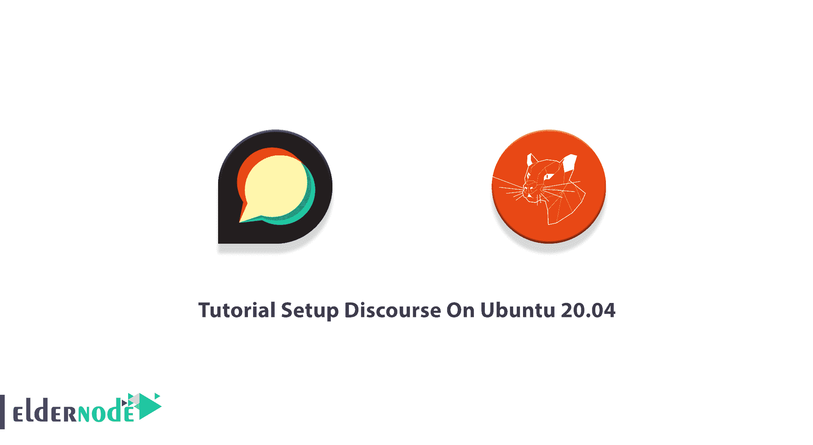

# 关于 Ubuntu 20.04 - Eldernode 博客的教程设置讨论

> 原文：<https://blog.eldernode.com/setup-discourse-on-ubuntu-20-04/>



Discourse 是一个免费开源的讨论平台。在普通人文和社会科学中，话语描述了一种可以通过语言表达的正式思维方式。Discourse 是一个社交边界和现代论坛解决方案，用于为您的团队和客户创建社区论坛、长篇聊天室和邮件列表。使用这款功能丰富的软件可以帮助您讨论成千上万的网站，从而提高用户参与度。加入我们这篇文章来回顾一下关于 Ubuntu 20.04 的**教程设置。要购买一个全面管理但便宜的 [Ubuntu VPS](https://eldernode.com/ubuntu-vps/) ，在 [Eldernode](https://eldernode.com/) 上选择一个包并订购你需要的东西。**

## **如何在 Ubuntu 20.04 上设置话语【循序渐进】**

Discourse 用 Ember.js 编写，使用 [PostgreSQL](https://blog.eldernode.com/install-postgresq-ubuntu-18-04/) 做数据库后端。这是一个大项目，假设对其底层技术(如 Ruby 和 JavaScript)有一定程度的熟悉。让我们浏览一下本指南的步骤，并回顾一下关于 [Ubuntu](https://blog.eldernode.com/tag/ubuntu/) 20.04 的安装和设置过程。

### **安装 Ubuntu Linux 的先决条件**

为了让本教程更好地工作，请考虑以下先决条件:

_ 拥有 Sudo 权限的非 root 用户。

_ 要进行设置，请遵循我们在 Ubuntu 20.04 上的[初始服务器设置。](https://blog.eldernode.com/initial-server-setup-on-ubuntu-20/)

_ 现代单核 CPU，双核推荐。

_ 至少 2 GB 内存(带交换)。

_ 有效的域名指向您的服务器。

_ 64 位 Linux 兼容 **Docker** 。

_ 至少 10 GB 磁盘空间。

_ Docker 安装在您的服务器上。

_ 一个 [SMTP 邮件](https://blog.eldernode.com/how-to-find-the-smtp-address/)服务器。如果没有邮件服务器，可以使用 Gmail SMTP 服务器。

_ 使用指向您的服务器 IP 地址的 A 记录注册域名或子域(如“forum.example.com”)。

## **如何在 Ubuntu 20.04 上安装话语论坛| Ubuntu 18.04**

当你准备好了上述先决条件，你就准备好了安装话语。按照以下步骤成功完成:

第一步:

和往常一样，你建议首先更新你的服务器。以下命令更新您的所有软件包:

```
sudo apt update
```

```
sudo apt upgrade -y
```

第二步:

由于最新版本的 **Docker** 可以在 Ubuntu 20.04 默认库中获得，所以使用下面的命令来安装它:

```
apt-get install docker.io -y
```

确保 Docker 正在安装以启动其服务。然后，运行以下命令，使 Docker 在重启时**启动**:

```
systemctl start docker
```

```
systemctl enable docker
```

第三步:

在这一步中，您将**下载话语**。在此之前，创建 **/var/discourse** 目录，了解你的 discourse 相关文件在哪里:

```
sudo mkdir /var/discourse
```

然后，运行下面的命令，从 Git Hub 存储库中下载最新版本的 Discourse :

```
sudo git clone https://github.com/discourse/discourse_docker.git /var/discourse
```

第四步:

一旦 Discourse 被下载，你就可以安装和配置它。因此，转到 **/var/discourse** 目录并运行以下命令:

```
cd /var/discourse
```

现在，您可以开始使用附带的安装脚本了。为此，请键入:

```
sudo ./discourse-setup
```

***输出注意事项 1* :** 你会被问到关于**的主机名对于你的话语？**“由话语装置脚本。

因此，您需要输入 **discourse.your_domain** ，或者您为您的平台选择的任何主机名，比如 community.example.com。

不要忘记将“**社区**”替换为您的首选子域，将“**example.com**”替换为您的实际域名。

***注意* :** 如果你不希望在一个子域上主持演讲，在这种情况下，你也可以只输入根域(“example.com”)。

***输出备注 2* :** 还有，问你管理员账号的**邮箱地址？**

要通过这一步，请选择您想用作对话管理员帐户的电子邮件地址。您选择的电子邮件地址将成为对话管理员的默认地址。请注意，当您从其控制面板设置话语时，您将再次使用此电子邮件地址。

***输出注意事项 3* :** 你将再面临四个与 **SMTP 服务器设置**相关的问题。

1_ SMTP 服务器地址？

2_ SMTP 用户名？

3_ SMTP 端口？

4_ SMTP 密码？

因此，您需要为这些问题输入您的 SMTP 服务器详细信息。然后，Discourse 安装脚本将要求您确认所有这些设置。要开始安装过程，请确认您的设置。此外，该脚本将生成一个名为 app.yml 的配置文件

如果愿意，您可以在初始设置后使用以下命令更改或编辑这些设置:

```
sudo nano /var/discourse/containers/app.yml
```

### **如何在 Ubuntu 20.04 上设置话语**

如果正确通过了上述所有步骤，那么 Discourse 应该已经安装并配置好了。在本节中，您可以看到如何启动它。要注册管理员帐户并访问 Discourse 界面，请打开浏览器并访问 **discourse.your_domain** 。

如果你遇到了“ **502 错误网关**”错误，这意味着话语还没有完成引导。几分钟后刷新页面以解决此错误。否则，您应该查看以下屏幕:


显示以下屏幕时，在必填字段中填入以下信息:

_ **电子邮件**:从下拉菜单中选择您之前提供的电子邮件地址。

_ **用户名**:选择一个用户名。

_ **密码**:选择强密码。


点击**注册**按钮，使用您之前输入的电子邮件地址创建一个新的管理员帐户。

然后，您将被要求确认您的电子邮件。所以，检查你的收件箱确认电子邮件。如果您没有收到，请尝试单击**重新发送激活电子邮件**按钮。


一旦您的管理员帐户注册完成，设置向导将启动并引导您完成 Discourse 的基本配置。如果你希望**跳过**这一步，现在，你可以点击**，也许以后再点击**。


当您完成或跳过设置向导时，您将重定向到全新的 Discourse 论坛，在那里您将看到 Discourse Admin 快速入门指南。

在这里，您可以看到关于下一步该做什么以及如何进一步定制您的 Discourse 安装的更多信息。快速入门指南的标签为**请先阅读我的内容**，包含进一步定制您的 Discourse 安装的提示:


### **关于 Linux Ubuntu 20.04 的升级论述**

如果你正确地完成了以上所有部分，你的话语平台现在就可以使用了。使用以下命令升级 Discourse，从 Git repo 中获取最新版本的代码，并重新构建应用程序:

```
cd /var/discourse
```

```
sudo git pull
```

如果您对 **containers/app.yml** 进行了更改，您将需要重新构建您的 Discourse 应用程序。每次进行更改时，运行:

```
sudo ./launcher rebuild app
```

只要你愿意，你可以随时在浏览器中更新话语。打开你最喜欢的浏览器，访问*http://discourse . your _ domain/admin/upgrad*e，然后点击**升级到最新版本**，按照说明操作:


## 结论

在本文中，您学习了如何在 Ubuntu 20.04 上安装和设置 Discourse。你也知道怎么升级。从现在开始，享受你的论坛由话语和部署自己的在线论坛。如果您使用 Discourse，请在 [Eldernode Community](https://community.eldernode.com/) 上向您的朋友发送反馈。