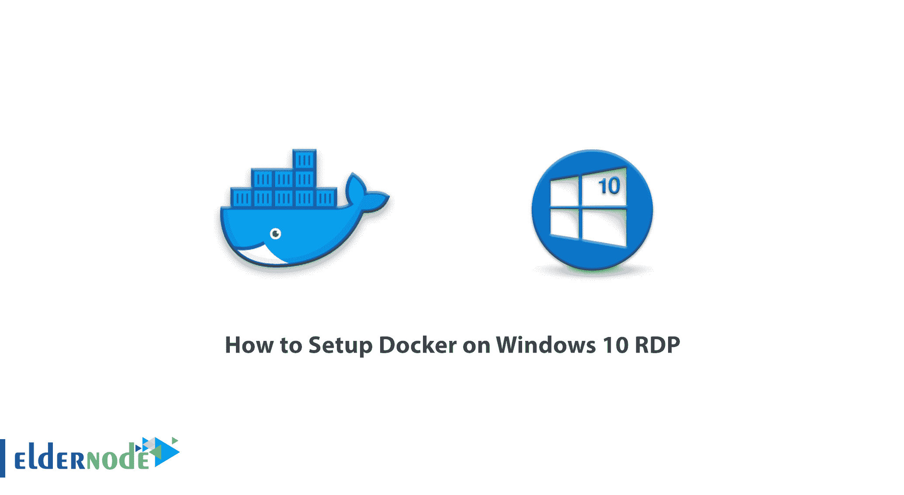
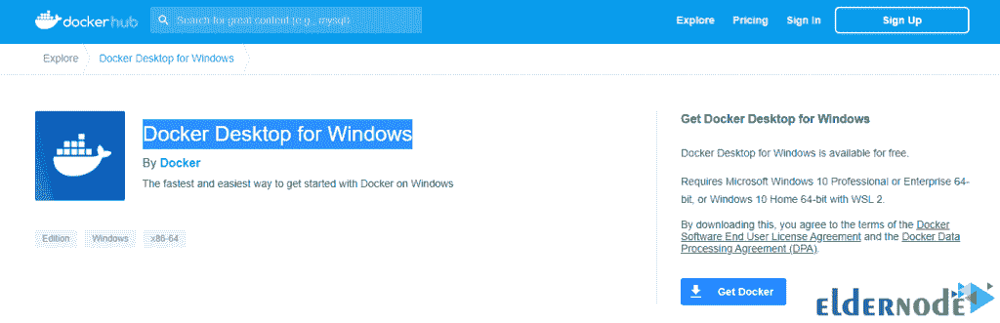
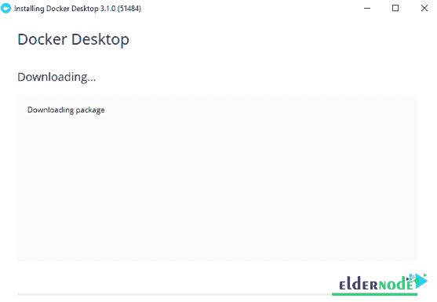
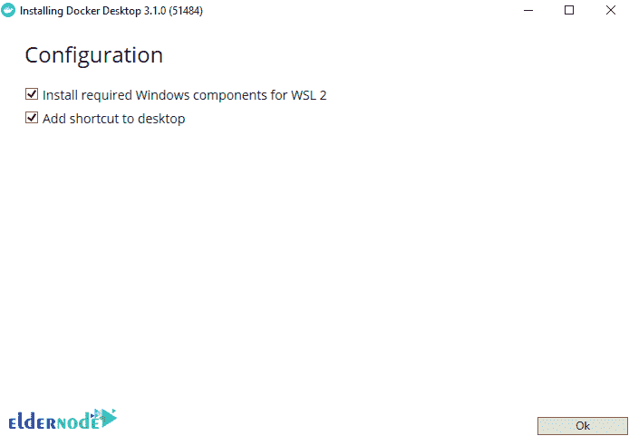
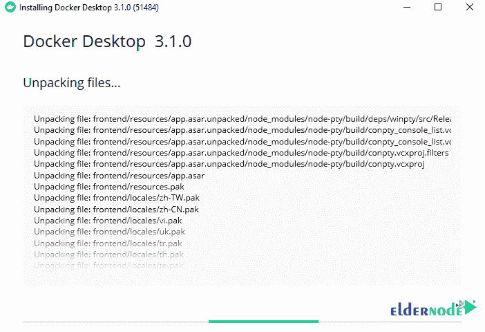
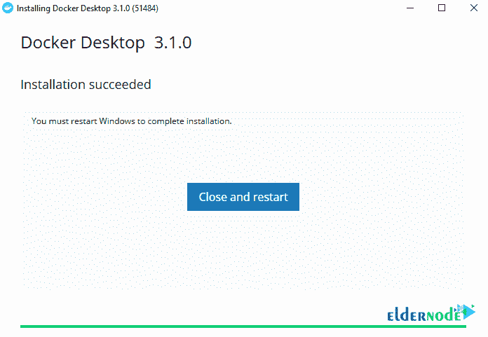
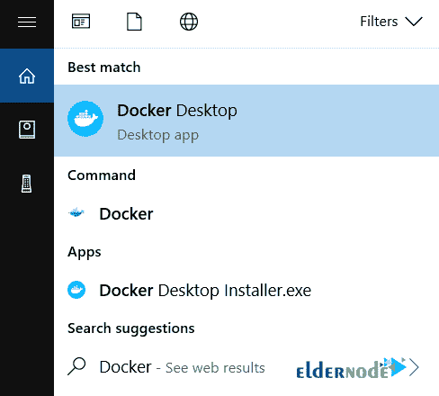
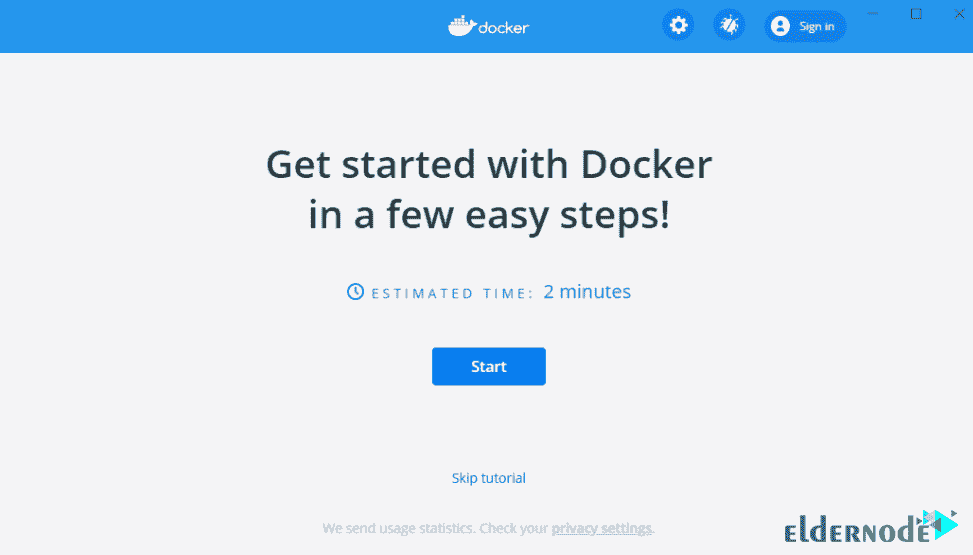
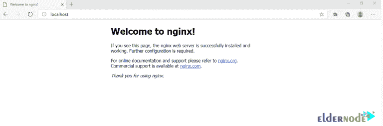

# 如何在 Windows 10 RDP - Eldernode 博客上设置 Docker

> 原文：<https://blog.eldernode.com/setup-docker-on-windows-10/>



几年前，一个名叫所罗门·海克斯的人推出了一个名为 Docker 的机制。目标是使与容器的交互更容易。Docker 使得在 Linux 内核上完全隔离的环境中分别运行进程和软件成为可能。这种隔离的环境和包被称为容器。该容器允许程序员和应用程序开发人员将应用程序与其所有模块和相关组件集成在一起。事实上，不用担心特定应用程序在其他平台上的设置和依赖性，该程序将在任何环境中运行。所以如果是编程的话，我们肯定推荐使用 Docker。在这篇文章中，我们将教你如何在 Windows 10 RDP 上设置 Docker。需要注意的是，你可以访问 [Eldernode](https://eldernode.com/) 中可用的包来购买 **[Windows 10 RDP](https://eldernode.com/windows-10-rdp/)** 服务器。

## **Windows 10 上的教程安装 Docker RDP 管理员**

如果你熟悉虚拟化，你就会知道像 [Hyper-V](https://blog.eldernode.com/install-and-configure-hyper-v-on-windows/) 、 [KVM](https://blog.eldernode.com/buy-kvm-vps-with-instant-setup/) 和 Xen 这样的机制为网络管理员提供了虚拟的硬件。因此，这些机制需要强大的硬件资源。另一方面，[容器](https://blog.eldernode.com/run-linux-containers-on-windows-server/)使用共享操作系统。因此，我们正在处理一个更有效的方法，更有效地使用系统资源。与硬件虚拟化不同，容器放置在 Linux 实例之上，为应用程序提供了一个小而紧凑的空间。由于这个特性，在一个硬件上运行的实例比 Xen 或 KVM VM 技术多 4 到 6 倍。容器帮助开发人员将他们的代码放到一个共享的存储库中。这将加快编码过程，代码将执行得更好。

Docker 使开发人员能够轻松快速地将他们的应用程序放在一个体积更小、可移植性更强的容器中。这些应用程序几乎可以在任何地方运行。

在这篇文章中跟随我们，学习如何一步一步地在 [Windows](https://blog.eldernode.com/tag/windows/) 10 RDP 上设置 Docker。

### **系统要求在 Windows 上安装 Docker**

–Windows 10(64 位)

–必须启用 Hyper-V 和 Containers Windows 功能。

–64 位处理器，带二级地址转换(SLAT)

–4GB 内存

–必须在 BIOS 设置中启用 BIOS 级硬件虚拟化支持。

## **如何在 Windows 10 上安装 Docker**

在本节中，我们将在 Windows 上安装 [Docker。第一步是](https://blog.eldernode.com/setup-docker-on-windows-10/)[为 Windows 下载 Docker 桌面](https://desktop.docker.com/win/stable/Docker%20Desktop%20Installer.exe)。



下载文件后，请参阅系统中的**下载**部分。然后双击 Docker 桌面 Installer.exe 的**运行安装。双击下载的文件以查看下图。**



然后检查下面的选项并点击**确定**。



如你所见，文件正在解包。



最后点击**关闭并重启**。



请注意，如果您的管理员帐户不同于您的用户帐户，您必须将该用户添加到 docker-users 组。现在，你必须以管理员身份运行**电脑管理**。然后导航到**本地用户和组** > > **组**>>**docker-Users**。右键单击将用户添加到组中。注销并再次登录以进行更改。

***注意:*** 如果要求，您必须确保在配置屏幕上选择了**启用 Hyper-V Windows 功能**选项。

### **windows 10 RDP 上的设置坞站**

一旦你成功安装了 Docker 桌面，你应该知道 Docker 不会自动启动。所以要启动 Docker 桌面，你需要搜索 **Docker** ，在搜索结果中选择 **Docker 桌面**。



请注意，当状态栏中的 Docker 图标保持稳定时，Docker 桌面已启动并正在运行，可以从任何终端窗口访问。


当初始步骤成功时，Docker Desktop 会启动入职培训。有趣的是，本教程包括一个简单的练习，制作一个 Docker 图像样本，将它作为一个容器运行，在 Docker Hub 中按下并保存图像。



### **如何在 Windows 10 上使用 Docker**

启动服务后，初始教程页面将加载到 Docker 桌面上。它讲述了创建图像、将图像作为推送容器运行并将其存储在 Docker Hub 中的简单步骤。使用 Windows 终端(命令提示符或 PowerShell)安装 Docker 后，您可以运行 Docker 客户端。

按照下面的步骤学习简单的教程:

通过输入以下命令，您可以看到 Docker 的安装版本:

```
docker --version
```

要从 Docker Hub 获取 **Hello-world** 项目的图像并将其作为容器运行，您必须运行以下命令:

```
docker run hello-word
```

在执行上述命令后，Docker 首先寻求执行与！系统内部的 Hello-world。由于这个映像不存在于系统本身中，所以从 Docker 存储库中下载它，然后运行它。这个项目的结果是显示 Docker 的短语 **Hello！**在屏幕的输出中。

使用以下命令显示系统上安装的映像列表:

```
docker image ls
```

通过在每个命令的末尾添加-help，您可以看到关于它的更多细节。比如下面这个命令:

```
docker --help
```

最后，使用下面的命令，您可以从主存储库中拉出并运行 **Nginx web 服务器**:

```
docker run --detach --publish 80:80 --name webserver nginx
```

通过在浏览器中输入以下地址，您将看到以下页面，这是 Nginx web 服务器的默认页面:

http://localhost



结论

## Docker 是一个工具，旨在使使用容器盒创建、使用和执行应用程序变得容易。容器允许开发人员将应用程序与它需要的所有部分打包在一起，例如库和其他组件，并将其作为一个包进行传输。通过这样做，开发人员可以确保应用程序可以在任何其他机器上运行，而不管其他设备的自定义设置如何。在这篇文章中，我们试图讨论如何在 Windows 上安装 Docker。然后我们教你如何在 Windows 10 RDP 上设置 Docker。

Docker is a tool designed to make it easy to create, use, and execute applications using Container boxes. Containers allow a developer to package an application with all the parts it needs, such as a library and other components, and transfer it as a package. By doing this, and with the holders, the developer can ensure that the application runs on any other machine, regardless of the custom settings that another device may have. In this article, we tried to discuss how to install Docker on Windows. Then we taught you how to setup Docker on Windows 10 RDP.