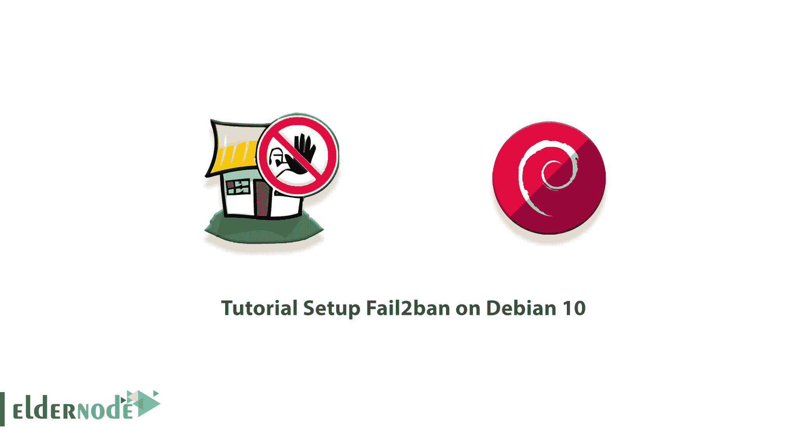

# Debian 10 - Eldernode 博客上的教程设置失败 2ban

> 原文：<https://blog.eldernode.com/setup-fail2ban-on-debian-10/>



Fail2Ban 是一个免费的、开源的、非常有用的基于 Python 的软件，可以阻止不规则的服务器攻击，防止入侵你的系统。该软件扫描操作系统的日志文件，并阻止多次试图进入服务器的攻击者的 IP。在这篇文章中，我们将教你关于 Debian 10，9 上的**教程设置失败 2ban。需要注意的是，如果你想购买一台 **[Linux VPS](https://eldernode.com/linux-vps/)** 服务器，可以访问 [Eldernode](https://eldernode.com/) 中提供的软件包。**

## **如何在 Debian 10 上一步步设置 fail 2 ban**

File2Ban 通过扫描日志文件来阻止怀疑具有或执行恶意活动的 IP。例如，多个密码、不正确的密码或试图利用他人。File2Ban 通常会尝试更新防火墙规则，在指定的时间段内阻止这些 IP 地址。

大多数 Linux 服务器使用端口 22 来访问名为 ssh 的服务器命令行控制台。该端口是已知端口，因此经常受到攻击。Fail2ban 是一款软件，它可以扫描日志文件以进行实时日志记录尝试，并使用 Firewalld 或 Iptables 安全防火墙阻止和阻止攻击者的 IP。该工具在命令时设置对服务器的不必要的访问或安全尝试，并显示指示暴力攻击迹象的 IP 地址。

在这篇文章的续篇中，加入我们来教你如何在 [Debian](https://blog.eldernode.com/tag/debian/) 10 上安装 Fail2ban。

### **介绍 Fail2ban【完成】**

Fail2ban 是一个用 [Python](https://blog.eldernode.com/python-3-9-on-eldernode-linux/) 编写的软件服务，起到保护的作用。这项服务保护服务器免受一系列暴力攻击。这些攻击的工作是采取试错法，渗透服务器并窃取用户信息。

有很多机器人可以自动做到这一点。这个机器人自动开始一个接一个地发送登录请求。实际上，这些请求是一种猜测，以便能够将服务器请求的信息与自己的猜测进行匹配，并获得信息！

Fail2ban 甚至可以防止 DDOS 攻击。例如，如果某个 IP 的 HTTP 请求数超过了某个 IP，它将开始禁止请求超过设定限制的 IP。

你可能会说，用软件防火墙保护网站和应用程序并限制访问是好的，那么为什么要使用 Fail2ban 呢？作为回应，我们必须说，这只是保护您的系统和网站的开始，任何具有公共登录系统并要求用户名和密码的服务都有可能吸引这种攻击。所以你必须做好准备，通过这种方式，fail2ban 作为一个轻便简单的免费/开源程序可以帮你很多。

### **fail 2 ban 如何工作**

正如这项服务的名字所暗示的，未能被禁止。例如，假设用户想要登录，并在 30 分钟内用几个不同的密码重复输入他的用户名 5 次。在第一步中，fail2ban 会在您(作为管理员)可以定义的一段时间内快速阻止该用户访问站点。因此用户甚至不能尝试他的用户名和密码。

例如，即使用户想要做一些可疑的事情，并且在一个小时内登录和注销超过 10 次，也可以包括这些规则。正如我们所解释的，暴力攻击是一样的。事实上，如果一个机器人想继续尝试，它很容易被禁止，不能再使用那个特定的 IP。

如果一个用户尝试登录而不能，那么肯定会有一个他的日志。根据相同的日志文件，fail2ban 可以检查它们，如果它是可疑的，在几次不成功的尝试后，它将禁止用户或 bot 或任何基于 IP 的人，其访问将被切断。如果重复多了，可以永久封杀。

## **在 Debian 10 | Debian 9** 上安装 fail 2 ban

现在我们要讨论如何在 Debian 10 上安装 Fail2ban。要在 Debian 10 上安装 Fail2ban，只需遵循以下步骤。第一步是使用以下命令更新系统:

```
sudo apt update
```

```
sudo apt upgrade
```

现在，您可以通过运行以下命令来安装 Fail2ban:

```
sudo apt install fail2ban
```

成功安装 Fail2ban 后，现在可以使用以下命令来检查和确认服务的状态:

```
sudo systemctl status fail2ban
```

请注意，完成安装过程后，Fail2ban 服务会自动启动。

### **Debian 10**上的安装失败 2ban

在这一步，我们将了解如何在 Debian 上设置 Fail2ban。安装后，您需要使用以下命令复制默认的 jail.conf 文件来创建本地配置:

```
sudo cp /etc/fail2ban/jail.conf /etc/fail2ban/jail.local
```

然后，您需要使用以下命令打开新的本地配置文件进行编辑:

```
sudo nano /etc/fail2ban/jail.local
```

您需要输入要忽略的基本默认项目，这将允许您不禁止某些 IP 地址。接下来，您需要设置设置时间，以确定自动阻止侵权主机的时间。最后，检查查找时间和最大审查时间，这将查找时间窗口设置为阻止主机 IP 连接之前的最大重试时间。

```
[DEFAULT]  ignoreip = 127.0.0.1  bantime = 3600   findtime = 600  maxretry = 3
```

有趣的是，如果您在云服务器上配置了 Sendmail 服务，您可以通过将您的电子邮件地址输入到参数 Destemail 并将 **action = %(action_)s** 更改为 **action = %(action_mw)s** 来启用来自 Fail2ban 的电子邮件通知。

完成基本配置后，检查配置选项中可用的不同**监狱**。监狱是 fail2ban 应用于任何给定应用程序或日志文件的规则。 **SSH jail** 设置，你可以在 jail 列表的顶部找到，默认是启用的:

```
[sshd]  enabled = true
```

**保存**配置文件并退出。然后使用以下命令重新启动系统一次:

```
sudo service fail2ban restart
```

现在，您可以在您启用的每个应用程序模块上检查新添加的监狱部分的 iptable 规则:

```
sudo iptables -L
```

最后，您可以使用以下命令手动禁用和禁用 IP 地址:

```
sudo fail2ban-client set <jail> banip/unbanip <ip address>
```

现在，您可以使用以下命令启动 Fail2ban:

```
sudo systemctl start fail2ban
```

还需要注意的是，安装 Fail2ban 后可以参考文章[如何使用 Fail2ban 保护 Linux 服务器](https://blog.eldernode.com/fail2ban-secure-linux-server/)。

## 结论

Fail2ban 是一个入侵防御框架，它与安装在服务器上的封闭控制系统或防火墙一起工作。它通常用于在多次尝试失败后阻止连接尝试。在这篇文章中，我们试图教你如何在 Debian 10 上设置 Fail2ban。如果你愿意，你可以阅读我们关于如何在 Fedora 33 和 [CentOS 8](https://blog.eldernode.com/install-fail2ban-centos-8/) 上安装 Fail2ban 的文章。