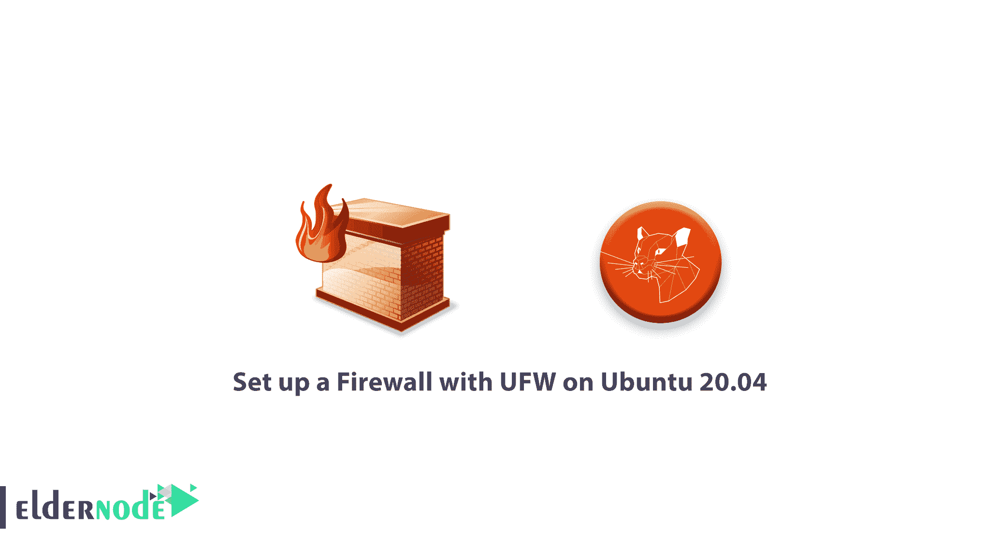

# 教程在 Ubuntu 20.04 上用 UFW 设置防火墙——ubutnu 防火墙

> 原文：<https://blog.eldernode.com/setup-firewall-ufw-ubuntu-20/>



作为管理员，保护网络安全是首要任务。在本文中，你将回顾**教程在 Ubuntu 20.04** 上用 UFW 设置防火墙。因此，如果你想开始保护你的网络，但又不确定使用哪种工具，UFW(简单防火墙)可能是你的正确选择。 [UFW](https://en.wikipedia.org/wiki/Uncomplicated_Firewall) 是一个简化的防火墙管理接口，隐藏了底层包过滤技术的复杂性，如 iptables 和 nftables 。

**先决条件**

如果您知道以下内容，本教程可能会更有用:

**注意** : UFW 默认安装在 Ubuntu 上，但如果卸载了，可以用:

```
sudo apt install ufw.
```

## 教程在 Ubuntu 20.04 上用 UFW 设置防火墙

让我们回顾一下学习这种设置的 9 个步骤。

### 1-使用 IPv6 与 UFW

由于本教程是在考虑了 IPv4 的情况下编写的，所以当您启用 IPv6 时，它也可以工作。但是如果它在你的 Ubuntu 服务器上被启用，确保 UFW 被配置为支持 IPv6，并且它将管理除 IPv4 之外的 IPv6 的防火墙规则。为此，请键入以下命令。

```
sudo nano /etc/default/ufw 
```

你需要查看如下。

/etc/default/ufw 摘录

2-设置默认策略

```
IPV6=yes 
```

默认情况下，UFW 允许所有传出连接，拒绝所有传入连接。因此，任何试图访问您的服务器的人都无法连接，而服务器内的任何应用程序都可以访问外部世界。

要继续学习本教程，您需要将 UFW 规则设置回默认值。为此，请使用以下命令。

[购买 Linux 虚拟主机](https://eldernode.com/linux-hosting/)

```
sudo ufw default deny incoming  sudo ufw default allow outgoing
```

3-允许 SSH 连接

当您启用 UFW 防火墙时，它将拒绝所有传入的连接。为了防止这种情况，您可能需要创建规则，明确允许合法的传入连接— [SSH](https://eldernode.com/tutorial-connect-to-ssh-on-linux/) 或 HTTP 连接。在使用云服务器的情况下，您可能希望允许传入的 SSH 连接，这样您就可以连接并管理您的服务器。

使用以下命令配置您的服务器，以允许传入的 SSH 连接。

### 通过这样做，您将创建防火墙规则，允许端口 22 上的所有连接，SSH 守护进程默认监听该端口。因此您将指定端口而不是服务名。

如果将 SSH 守护进程配置为使用不同的端口，则必须指定适当的端口。如果您的 SSH 服务器正在监听端口 2222 ，那么您可以使用这个命令来允许该端口上的连接

```
sudo ufw allow ssh 
```

4-启用 UFW

```
sudo ufw allow 22 
```

使用此命令启用 UFW

```
sudo ufw allow 2222 
```

`您可能会看到一条警告消息，提示您中断现有的 SSH 连接。由于设置防火墙的规则，已经考虑到，SSH 连接是允许的。用 y 响应提示，并按回车。`

### `要查看规则设置，运行 sudo ufw status verbose 命令，因为防火墙现在是活动的。`

```
`sudo ufw enable` 
```

`5-允许其他连接`

`是时候允许您的服务器需要响应的所有其他连接了。如您所知，如何编写规则来允许基于服务名或端口的连接。您也可以这样做，就像您在端口 22 上对 SSH 所做的那样。`

`未加密的 web 服务器使用端口 80 上的 HTTP，使用 sudo ufw allow http 或 sudo ufw allow 80`

### `加密 web 服务器使用的端口 443 上的 HTTPS，使用 sudo ufw allow https 或 sudo ufw allow 443`

*   `尽管有些应用程序使用多个端口，而不是单个端口，但您可以使用 UFW 来指定端口范围。要允许使用端口 6000-6007 的 X11 连接，请使用以下命令:`

*   `当使用 UFW 指定端口范围时，您需要指定规则应该应用的协议( tcp 或 udp )。`

`您也可以指定 IP 地址。通过下面的例子，你可能知道更多关于具体的 IP 地址。`

`或者，如果您想要通过将添加到任何端口后跟端口号来连接，您可以指定允许 IP 地址的特定端口。正如你在下面看到的例子，我们想让 203.0.113.4 的 T2 连接到 T4 的端口 22(SSH)`

```
`sudo ufw allow 6000:6007/tcp  sudo ufw allow 6000:6007/udp`
```

`当您需要允许 IP 地址的子网时，可以使用 CIDR 表示法来指定网络掩码。正如你在下面的例子中看到的，当你需要允许从203.0.113.1到203.0.113.254的 IP 地址时，你可以这样输入。`

```
`sudo ufw allow from 203.0.113.4`
```

`如果要指定子网 203.0.113.0/24 连接的目的端口，需要使用端口 22 (SSH)。`

```
`sudo ufw allow from 203.0.113.4 to any port 22` 
```

`如果您想在继续之前查找您的网络接口，请键入以下命令。`

`输出摘录`

```
`sudo ufw allow from 203.0.113.0/24` 
```

`如果你的服务器有一个名为 eth0 的公共网络接口，你也可以允许 HTTP 流量(端口 80 )。`

```
`sudo ufw allow from 203.0.113.0/24 to any port 22`
```

`此外，如果您希望 MySQL 数据库服务器(端口 3306 )监听专用网络接口 eth1 上的连接，您可以使用下面的命令。`

```
`ip addr`
```

```
`2: eth0: <BROADCAST,MULTICAST,UP,LOWER_UP> mtu 1500 qdisc pfifo_fast state  . . .  3: eth1: <BROADCAST,MULTICAST> mtu 1500 qdisc noop state DOWN group default  . . .`
```

`6-拒绝连接`

```
`sudo ufw allow in on eth0 to any port 80` 
```

`如果您不更改传入连接的默认策略，UFW 会配置拒绝所有传入连接。或者如果您想拒绝基于源 IP 地址或子网的特定连接，可能是因为您知道您的服务器正受到来自那里的攻击。但是，如果您想将默认的传入策略更改为**允许，您需要为您不想允许连接的任何服务或 IP 地址创建**拒绝**规则。**`

```
`sudo ufw allow in on eth1 to any port 3306` 
```

``您可以键入上面描述的以下命令(拒绝 HTTP 连接)，将 **allow** 替换为 **denying，**编写 **deny** 规则。``

### ``如果您想拒绝来自203.0.113.4的所有连接，也可以使用下面的命令``

```
``sudo ufw deny http``
```

``7-删除规则``

```
``sudo ufw deny from 203.0.113.4`` 
```

``您将学习两种不同的方法来指定现在删除哪些规则。**1**–按规则编号。**2**——按实际规则。``

``第一种方法更容易，所以我们将从它开始。``

### ``当您使用**规则号**删除防火墙规则时，您应该会得到一个防火墙规则列表。``

``编号输出:``

``如果您想要删除规则 2，即允许端口 80 (HTTP)连接的规则，您应该在 UFW 删除命令中指定它，如下所示。``

``现在，如果您想要指定要删除的实际规则，您可以删除 allow http 规则，您可以键入如下示例。``

```
``sudo ufw status numbered`` 
```

``除了服务名，您还可以通过 allow 80 来指定规则``

```
``Status: active         To                         Action      From       --                         ------      ----  [ 1] 22                         ALLOW IN    15.15.15.0/24  [ 2] 80                         ALLOW IN    Anywhere``
```

``此方法将删除 IPv4 和 IPv6 规则(如果它们存在)。``

```
``sudo ufw delete 2`` 
```

```
``sudo ufw delete allow http`` 
```

``8-检查 UFW 状态和规则``

```
``sudo ufw delete allow 80``
```

``要检查 UFW 的状态，请使用下面的命令。``

``如果 UFW 是残疾人，你会看到这样的东西，``

``输出``

### ``如果 UFW 处于活动状态，输出将显示它处于活动状态，并列出设置的所有规则(如果您按照步骤 3 操作，它应该处于活动状态)``

``输出``

```
``sudo ufw status verbose``
```

``当您想检查 UFW 是如何配置防火墙的，您应该使用 status 命令。``

```
```Status: inactive```
```

``9-禁用或复位 UFW``

```
``Status: active  Logging: on (low)  Default: deny (incoming), allow (outgoing), disabled (routed)  New profiles: skip    To                         Action      From  --                         ------      ----  22/tcp                     ALLOW IN    Anywhere``
```

``如果您不想使用 UFW，可以使用下面的命令禁用它。``

``如果以后需要激活，您可以运行 sudo ufw enable 。此外，如果您已经配置了 UFW 规则，但决定要重新开始，也可以使用 reset 命令。``

``默认策略不会更改为其原始设置，这将禁用 UFW 并删除之前定义的任何规则。``

``亲爱的用户，我们希望你会喜欢这个教程在 Ubuntu 20.04 上用 UFW 设置防火墙，你可以在评论区提出关于这个培训的问题，或者解决 [Eldernode 培训](https://eldernode.com/blog/)领域的其他问题，参考[提问页面](https://eldernode.com/ask)部分并在里面提出你的问题。``

```
``sudo ufw disable`` 
```

``**同样，参见**``

```
``sudo ufw reset`` 
```

``[如何在 Ubuntu 20.04 上安装 Nginx LTS](https://eldernode.com/install-nginx-on-ubuntu-20-04-lts/)``

``[教程在 Ubuntu 20.04 Linux 上安装最新的 phpMyAdmin](https://eldernode.com/install-the-latest-phpmyadmin-on-ubuntu-20/)``

``[如何在 Ubuntu 20.04 上安装 lamp](https://eldernode.com/how-to-install-lamp-on-ubuntu-20-04/)``

``**Also, see**``

``[How To Install Nginx on Ubuntu 20.04 LTS](https://eldernode.com/install-nginx-on-ubuntu-20-04-lts/)``

``[Tutorial Install the Latest phpMyAdmin on Ubuntu 20.04 Linux](https://eldernode.com/install-the-latest-phpmyadmin-on-ubuntu-20/)``

``[How to install lamp on Ubuntu 20.04](https://eldernode.com/how-to-install-lamp-on-ubuntu-20-04/)``