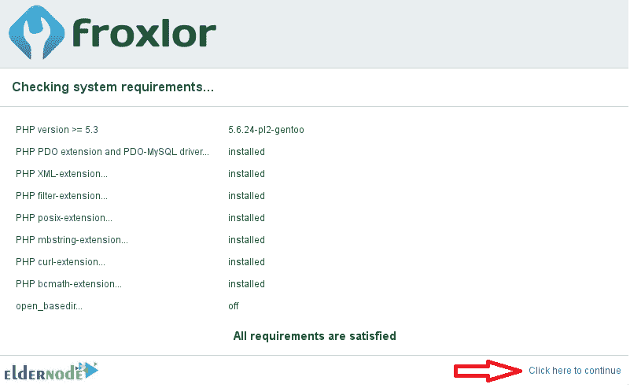

# 如何在 Ubuntu 20.04 - Eldernode 博客上设置 Froxlor

> 原文：<https://blog.eldernode.com/setup-froxlor-on-ubuntu-20-04/>


Froxlor 是一个开源、简单、轻量级的服务器管理面板。Froxlor 是用来管理您的主机平台和您的虚拟主机环境中的服务器。它支持 IPv4 和/或 IPv6 地址、高级 SSL、PHP 域配置。使用 Froxlor 可以让你直接从控制面板管理共享主机的资源。此外，您将能够从一个简单的 web 界面管理和控制域、SSL、MySQL 数据库和其他虚拟主机功能。在本文中，你将学习如何在 Ubuntu 20.04 上设置 Froxlor。如果您需要准备自己的 [Ubuntu VPS](https://eldernode.com/ubuntu-vps/) ，请依靠我们的技术团队，并在 [Eldernode](https://eldernode.com/) 上注册您的订单。

## **在 Ubuntu 20.04 上设置 Froxlor 服务器管理面板**

作为管理员，您需要管理客户联系信息，以及与其相关联的域名、电子邮件帐户、FTP 帐户、支持票证和 webroots。之前，你已经了解了 [cPanel](https://blog.eldernode.com/tag/cpanel/) 或者 Webmin。Froxlor 是一个免费的服务器管理控制面板。因此，对于他们来说，用于管理多用户或共享服务器是一个不错的选择。

因为 Froxlor 不会自动配置它所使用的底层服务，所以您需要成为 sysadmin 方面的专家来设置您的 web 服务器、邮件服务器和其他服务。然后，您可以从控制面板执行任何 sysadmin 任务，增加了一层客户管理。

### **Froxlor 特性**

Froxlor 有各种功能，如虚拟主机管理、域名、FTP 和电子邮件。让我们看看更多:

1-真多堆栈

2-高级 SSL

3- PHP 配置

4-经销商和客户

5-流量计算

6-基于 API

7 主题化界面

8-让我们加密

9- MySQL 管理

10-目录保护和设置

11-配额管理

### **在 Ubuntu 20.04 上安装 Froxlor 的先决条件**

为了让本教程更好地工作，请考虑以下先决条件:

_ 拥有 Sudo 权限的非 root 用户。

_ 要进行设置，请遵循我们在 Ubuntu 20.04 上的[初始服务器设置。](https://blog.eldernode.com/initial-server-setup-on-ubuntu-20/)

_ 在设置 Froxlor 之前，需要配置主机的[域名](https://blog.eldernode.com/what-is-domain-name-mean/)。

因此，首先选择一个子域，并创建一个记录，将该子域指向您的服务器的 IP 地址。

使用以下命令根据子域设置主机名:

```
sudo hostnamectl set-hostname SUBDOMAIN
```

然后，将您的子域添加到您的主机文件中:

```
 sudo nano /etc/hosts
```

接下来，将以下内容添加到文件的底部:

*服务器 _ IP SUBDOMAIN.DOMAINNAME.COM 子域*

现在，您可以**保存**并关闭文件。

最后，为了**重启**网络管理器服务，运行:

```
sudosystemctlrestartNetworkManager.service
```

## **如何在 Ubuntu 20.04 上安装 Froxlor | Ubuntu 18.04**

让我们按照本指南的步骤在 [Ubuntu](https://blog.eldernode.com/tag/ubuntu/) 20.04 上安装 Froxlor。最终，你将学会如何在 Ubuntu 20.04 上使用 Froxlor。所以，和我们在一起吧。

第一步:

打开您的终端将 Froxlor 存储库添加到 Ubuntu:

```
touch /etc/apt/sources.list.d/froxlor.list
```

然后，运行以下命令添加包源:

```
echo 'deb http://debian.froxlor.org stretch main' > /etc/apt/sources.list.d/froxlor.list
```

第二步:

现在，您可以使用下面的命令为 Froxlor 添加一个密钥。它帮助您验证包:

```
apt-key adv --keyserver pool.sks-keyservers.net --recv-key FD88018B6F2D5390D051343FF6B4A8704F9E9BBC
```

第三步:

在这一步，你需要更新你的 Ubuntu 服务器。因此，键入:

```
apt-get install update
```

```
apt-get install upgrade
```

第四步:

在这一步中，需要安装 Apache 服务器。以下命令将为您完成这项工作:

```
apt-get install apache2
```

```
service apache2 enable
```

```
service apache2 start
```

第五步:

此时，您将通过运行以下命令在 Ubuntu 上安装 Froxlor:

```
apt-get install froxlor
```

安装完 Froxlor 后，会要求您从列表中选择一种邮件服务器配置类型:

1-无配置

2-互联网网站

3-带智能主机的互联网

四卫星系统

5-仅限本地

### **如何在 Ubuntu 上更改文档根目录**

默认情况下，您可以访问 Apache 的默认公共 HTML ( **/var/www/Html** )目录。因此，您需要使用以下命令更改默认的文档根目录来访问 Froxlor:

```
cd /etc/apache2/sites-available
```

```
nano 000-default.conf
```

```
DocumentRoot /var/www/html
```

```
DocumentRoot /var/www/html
```

编辑完成后，按下 **Ctrl+X** 并键入 **Y** 保存文件，然后点击 **Enter** 按钮。

最后，运行下面的命令来**重启**Apache web 服务器:

```
service apache2 restart
```

### **如何在 Ubuntu 上创建数据库**

在安装服务器管理平台的过程中，您将数据库详细信息。要创建具有 root 权限的 MySQL 用户，请登录 MySQL/ [MariaDB](https://blog.eldernode.com/mariadb-installation-on-ubuntu/) 并运行:

```
mysql -u root
```

```
CREATE USER 'newuser'@'localhost' IDENTIFIED BY 'password';  GRANT ALL PRIVILEGES ON *.* TO 'newuser'@'localhost';  FLUSH PRIVILEGES;
```

***注意:*** 记得用自己的选择修改“新用户”和“密码”。

现在，使用下面的命令为 Froxlor 创建一个普通数据库及其用户和密码详细信息:

```
CREATE DATABASE froxlorc7;
```

```
CREATE USER 'froxlorusr'@'localhost' IDENTIFIED BY 'yourpassword';
```

```
GRANT ALL PRIVILEGES ON froxlorusr.* TO 'froxlorh2s'@'localhost' IDENTIFIED BY 'yourpassword' WITH GRANT OPTION;
```

```
FLUSH PRIVILEGES;
```

```
EXIT;
```

***注意* :** 还是那句话，别忘了把“froxlorc7”、“froxlorusr”和“yourpassword”都换成你的选择。

## **在 Ubuntu 20.04 上安装 Froxlor**

如果您通过了所有必需的步骤，那么应该已经安装了 Froxlor。接下来，你将学习如何在你的 Ubuntu 系统上启动和使用它。

**通过浏览器访问 Froxlor】**

打开您喜欢的浏览器，浏览到服务器域名。然后，您应该会看到 Froxlor 安装向导完成:

*http://froxlor.example.com*

点击**开始安装**继续。


显示以下页面后，如果要求屏幕上没有警告，点击“**单击此处继续**”:



### **如何配置**

要继续安装 Froxlor，您将进入数据库配置页面。如下图所示，您可以选择**安装语言**。然后，您应该输入数据库的详细信息，例如您之前创建的**数据库名称**、**用户名**和**密码**。

毕竟，您应该创建一个管理员帐户。最后，输入关于**服务器 IP** 和 **HTTP 用户名**以及**组名**的信息。


一旦您看到消息 Froxlor 安装成功，这意味着安装成功。所以，你只需要按下**点击这里登录**。


### **如何登录 Froxlor**

正如您所猜测的，现在您可以使用您在安装过程中创建的用户名和密码登录到 Froxlor 界面:


**Froxlor 仪表盘**

最后，您可以查看 Froxlor 仪表板并开始使用该软件:


在那里，您可以管理客户、域、PHP 配置等等。此外，您将能够开始管理域名、电子邮件、数据库等等:


Froxlor 还提供了许多配置选项，可以根据您的需求进行定制。设置页面将允许您根据需要更改不同的内容:


结论

## 在本文中，您了解了如何在 Ubuntu 20.04 上安装和设置 Froxlor。如果你有兴趣了解更多，参考[在 Debian 10 上安装 Froxlor](https://blog.eldernode.com/install-froxlor-on-linux-debian-10/)。