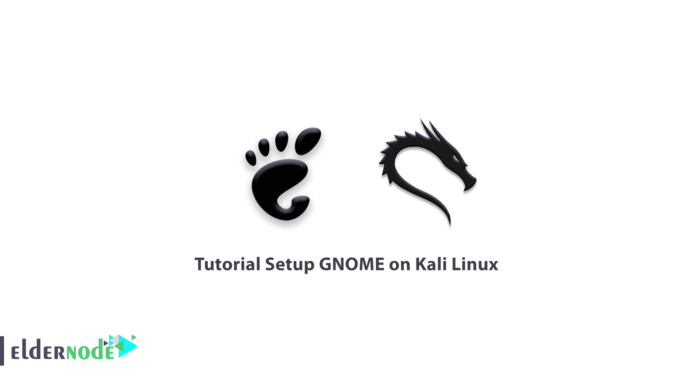
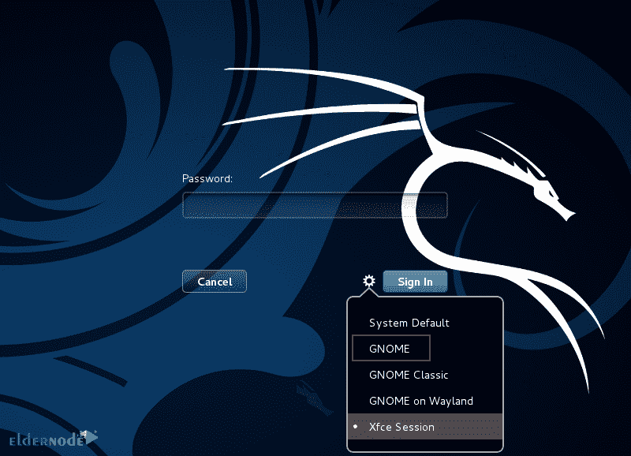

# Kali Linux - Eldernode 博客上的 GNOME 设置教程

> 原文：<https://blog.eldernode.com/setup-gnome-on-kali-linux/>



使 Linux 操作系统优于 Windows 的一个特性是，您可以在 Linux 发行版中使用不同的桌面 ui。这个特性允许你在你最喜欢的桌面 UI 上使用你最喜欢的发行版。GNOME 是这些桌面之一，它有有趣的特性和漂亮的外观。在这篇文章中，我们将教你如何在 Kali Linux 上设置 GNOME。另外，如果你想购买一个 [**Linux VPS**](https://eldernode.com/linux-vps/) 主机，你可以访问 [Eldernode](https://eldernode.com/) 中的软件包。

### **什么是 GNOME？**

GNOME 代表 GNU 网络对象模型环境，是一个图形用户界面，是为开源应用程序编写的。GNU 也是一套面向 Linux 用户和其他操作系统(如 BSD 衍生物)的计算机桌面应用程序。GNOME 是一个旨在开发软件框架的国际项目，由 GNOME Project 开发。GNOME 于 1999 年首次发布，由 Miguel de lacaza 和 Federico Mena 作为 de 项目启动。GNOME 允许用户从几个桌面外观中选择一个，用户可以只使用 GNOME 应用程序执行基本任务，如网页浏览、文件管理、听音乐和处理图像。

### **侏儒特征**

*   自由、智能、稳定
*   动态工作空间功能
*   有很多扩展
*   可定制的主题
*   显示切换实际上是可行的

## **如何在 Kali Linux 上安装 GNOME**

首先，你应该在你的 [Kali Linux](https://blog.eldernode.com/tag/kali-linux/) 上打开终端，更新你可用的包。为此，请输入以下命令:

```
sudo apt update
```

现在，您可以通过执行以下命令来安装 Gnome:

```
sudo apt install kali-desktop-gnome
```

由于许多软件包及其依赖项需要下载和安装，GNOME 安装需要一些时间。

如果要求您选择显示管理器，您可以选择 gdm3 或 lightdm。

等待一段时间，让它安装。

完成安装后，使用以下命令重新启动 Kali Linux 系统:

```
reboot
```

## **如何在 Kali Linux 上登录 GNOME**

首先，在登录屏幕上选择 GNOME 作为您的桌面。你可以试试 GNOME 的三种组合。



并输入您的密码登录。就是这样！

## **如何卸载 Kali Linux 上的 GNOME**

如果您想删除 GNOME 和从登录屏幕选择它的选项，只需输入以下命令:

```
sudo apt remove kali-desktop-xfce xfce4* lightdm*
```

您可以使用以下命令删除剩余的 GNOME 包:

```
sudo apt autoremove
```

## 结论

在本文中，我们教你如何在 Kali Linux 上安装和设置 GNOME。GNU 用户可以选择几种桌面外观中的一种。我希望这篇教程对你有用，你可以在你的系统上轻松使用 GNOME。