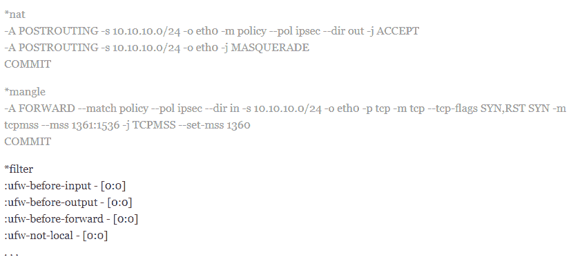
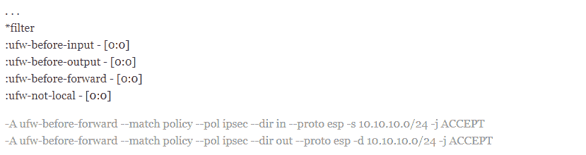
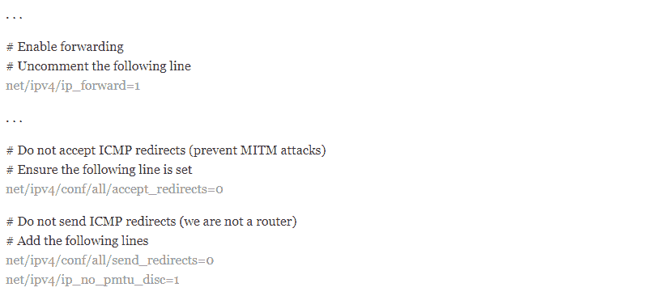
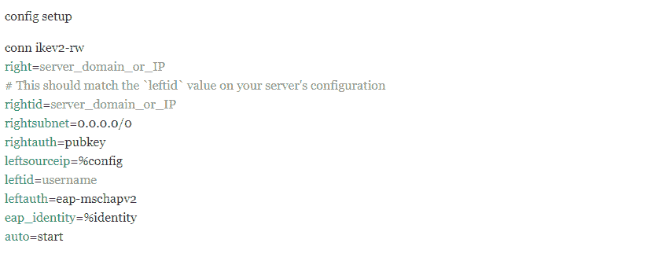

# Ubuntu 20.04 上的 IKev2 安装教程- Eldernode 博客

> 原文：<https://blog.eldernode.com/setup-ikev2-on-ubuntu-20-04/>


当今最常用的协议称为互联网密钥交换(IKE)。第一个版本发布于 1998 年，它的通用名称是 IKEv1。应该注意的是，默认情况下，IPsec 使用 IKE 的第一个版本。IKEv1 功能升级了其隐藏部分。为了在 2005 年升级，IKEv2 成立了。有了这次更新，该协议变得更加可靠，对 DOS 攻击更有弹性。IKEv2 是一种基于 IPsec 的协议，代表 Internet 密钥交换版本 2。它是思科和微软的联合产品，兼容多种平台。在本文中，我们要向您介绍 Ubuntu 20.04 上的**教程设置 IKev2。需要注意的是，如果你想购买一台 [Ubuntu VPS](https://eldernode.com/ubuntu-vps) 服务器，你可以访问 [Eldernode](https://eldernode.com/) 中提供的软件包。**

## **如何在 Ubuntu 20.04 上一步步设置 ike v2**

IKEv2 协议是从众所周知的 IPsec 协议派生出来的协议之一，它很好地执行了隧道过程。针对开源平台的 IKE 有几个版本。IKEv2 区别于其他 VPN 协议的最重要的优势之一是能够重新连接和重新建立连接。这意味着，如果连接中断，IKEv2 可以继续连接并继续工作。虽然许多移动设备更喜欢使用 L2TP/IPsec 协议组合，但 IKEv2 也是一个很好的选择。

按照教程在 [Ubuntu](https://blog.eldernode.com/tag/ubuntu/) 20.04 上安装、配置和运行 IKEv2。

## **在 Ubuntu 20.04 上设置 ike v2 | Ubuntu 18.04**

在 Ubuntu 20.04 上安装 IKEv2 并不复杂。在这篇文章中，我们将一步一步地教你如何在 Ubuntu 上配置和设置 IKEv2 VPN 服务器。和我们在一起。

### **在 Ubuntu 20.04 上安装 strong swan**

第一步是安装 StrongSwan。StrongSwan 是一个免费的 IPSec 资源守护程序，必须配置为 VPN 服务器。然后，您需要安装公钥基础设施组件。通过这样做，您可以创建一个证书颁发机构来验证您的基础结构。使用以下命令更新本地缓存并安装软件:

```
sudo apt update
```

```
sudo apt install strongswan strongswan-pki
```

### **如何创建认证机构(在 Ubuntu 20.04 上设置 ike v2)**

现在您已经成功安装了 StrongSwan，让我们继续创建证书。请注意，IKEv2 服务器需要一个证书来向客户端标识自己。现在您已经成功安装了 StrongSwan，让我们继续创建证书。 **strongswan-pki** 包附带了一个工具，用于生成认证参考和服务器认证，以帮助用户创建认证。

您必须首先创建多个目录来保存您正在处理的资源。需要注意的是，目录结构与 **/etc/ipsec.d** 中的部分目录兼容。所以我们最终会将所有创建的项目移动到哪里。在这里，我们决定锁定许可证，以防止其他用户看到私人文件。为此，请使用以下命令:

```
mkdir -p ~/pki/{cacerts,certs,private}
```

```
chmod 700 ~/pki
```

现在你需要生成一个**根密钥**。根密钥是 4096 位 RSA 密钥，用于签署根证书引用。因此，您可以执行以下命令来生成密钥:

```
ipsec pki --gen --type rsa --size 4096 --outform pem > ~/pki/private/ca-key.pem
```

成功创建密钥后，现在需要运行以下命令来创建根证书引用，并使用此密钥对根证书进行签名:

```
ipsec pki --self --ca --lifetime 3650 --in ~/pki/private/ca-key.pem \
```

```
--type rsa --dn "CN=VPN root CA" --outform pem > ~/pki/cacerts/ca-cert.pem
```

### **如何为 VPN 服务器生成证书**

在上一节中激活并设置了根证书许可证后，现在可以创建 VPN 服务器可以使用的证书了。应该注意，该证书允许客户端使用 CA 认证来验证服务器。为此，首先使用以下命令为 VPN 服务器创建一个私钥:

```
ipsec pki --gen --type rsa --size 4096 --outform pem > ~/pki/private/server-key.pem
```

在下一步中，您需要创建 VPN 服务器证书，并使用您在上一步中创建的证书参考密钥对其进行签名。因此，您必须按顺序执行以下命令。

***注意:*** 您必须在以下命令中将常用名( **CN** )和主题备用名( **SAN** )更改为您的 VPN 服务器的 DNS 或 IP 地址。

```
ipsec pki --pub --in ~/pki/private/server-key.pem --type rsa \
```

```
| ipsec pki --issue --lifetime 1825 \
```

```
--cacert ~/pki/cacerts/ca-cert.pem \
```

```
--cakey ~/pki/private/ca-key.pem \
```

```
--dn "CN=server_domain_or_IP" --san "server_domain_or_IP" \
```

```
--flag serverAuth --flag ikeIntermediate --outform pem \
```

```
~/pki/certs/server-cert.pem
```

现在您已经创建了 StrongSwan 所需的所有 **TLS/SSL** 文件，您可以将这些文件移动到 **/etc/ipsec.d** :

```
sudo cp -r ~/pki/* /etc/ipsec.d/
```

## **如何配置 strong swan**

让我们先备份该文件以供参考，然后使用以下命令从头开始:

```
sudo mv /etc/ipsec.conf{,.original}
```

在下一步中，您可以通过键入以下命令创建并打开一个新的空配置文件:

```
sudo nano /etc/ipsec.conf
```

您首先需要告诉 StrongSwan 记录守护进程状态，并允许重复连接来修复 bug。因此您需要将以下命令添加到 **/etc/ipsec.conf** 文件中:

```
config setup  charondebug="ike 1, knl 1, cfg 0"  uniqueids=no
```

下一步是为 VPN 创建一个配置部分。strong 还必须通知 Swan 创建 IKEv2 VPN 隧道。然后有必要在启动时自动加载这个配置部分。将以下几行添加到文件中:

```
. . .  conn ikev2-vpn  auto=add  compress=no  type=tunnel  keyexchange=ikev2  fragmentation=yes  forceencaps=yes
```

请注意，如果客户端意外断开连接，您必须配置死对等连接以清除“悬空”连接:

```
. . .  conn ikev2-vpn  . . .  dpdaction=clear  dpddelay=300s  rekey=no
```

接下来，您需要配置 IPSec 服务器端参数:

```
conn ikev2-vpn  . . .  left=%any  [[email protected]](/cdn-cgi/l/email-protection)_domain_or_IP  leftcert=server-cert.pem  leftsendcert=always  leftsubnet=0.0.0.0/0
```

这里，您需要使用以下命令配置客户端 IPSec 参数，例如私有 IP 地址和 DNS 服务器的范围:

```
. . .  conn ikev2-vpn  . . .  right=%any  rightid=%any  rightauth=eap-mschapv2  rightsourceip=10.10.10.0/24  rightdns=8.8.8.8,8.8.4.4  rightsendcert=never
```

要在连接客户时接收凭据，您必须输入以下命令:

```
. . .  conn ikev2-vpn  . . .  eap_identity=%identity
```

最后，您需要**保存**文件并退出。

### **配置 VPN 认证**

在上一节中，我们成功地配置了 VPN 服务器。但是由于还没有配置凭证，这里我们需要在一个特殊的配置文件 **ipsec.secrets** 中配置几项。使用所需的编辑器打开机密文件:

```
sudo nano /etc/ipsec.secrets
```

通过在配置文件中添加以下命令，告诉 StrongSwan 在哪里可以找到您的私钥:

```
: RSA "server-key.pem"
```

在下一步中，您必须使用以下命令定义用户信息:

```
your_username : EAP "your_password"
```

**保存**配置文件并退出。然后，要应用更改，您必须使用以下命令**重启**系统:

```
sudo systemctl restart strongswan
```

### **如何配置防火墙和内核 IP 转发**

在本节中，我们打算完成 StrongSwan 配置，以配置防火墙来允许 VPN 流量通过它。为此，您必须执行以下命令:

```
sudo ufw allow OpenSSH
```

```
sudo ufw enable
```

使用以下命令添加一个规则，以允许 UDP 流量到达标准 IPSec、500 和 4500 端口:

```
sudo ufw allow 500,4500/udp
```

要路由和发送 IPSec 数据包，您需要打开一个 UFW 配置文件并添加一些低级策略。请注意，您必须首先使用以下命令来找出服务器上用于访问互联网的网络接口:

```
ip route | grep default
```

这里重要的一点是，你的公共接口应该遵循单词“ **dev** ”。例如，以下输出显示了一个名为 **eth0** 的接口:

```
default via 203.0.113.7 dev eth0 proto static
```

下一步是在文本编辑器中打开 **/etc/ufw/before.rules** 文件:

```
sudo nano /etc/ufw/before.rules
```

下一步是在文件顶部附近(在*filter 行之前)添加以下配置:



您必须更改上述配置中的每个 **eth0** 实例，以使您找到的接口名称与 IP 路径相匹配。现在是时候在*filter 和 chain 定义行之后使用以下命令添加另一个配置块了:



完成上述更改后，**保存**文件并退出。

为了能够从一个接口路由到另一个接口，您需要使用以下命令打开 **UFW 内核**配置文件，并更改一些网络内核参数:

```
sudo nano /etc/ufw/sysctl.conf
```

下面的代码突出显示了您需要对文件进行的更改:



完成更改后，**保存**文件并退出。最后，您可以通过禁用并重新启用防火墙来启用所有更改。为此，您必须使用以下命令。

***注意:*** 执行以下命令后，会要求您确认进程。键入 **Y** 用新设置重新启用 UFW。

```
sudo ufw disable
```

```
sudo ufw enable
```

## **如何从 Ubuntu Linux** 连接 IKEv2

以下是如何通过 Ubuntu 20.04 连接到 IKEv2 的方法。您可以按照以下步骤，使用“管理 StrongSwan 即服务”方法连接到 IKEv2。您必须首先使用以下命令更新本地包缓存:

```
sudo apt update
```

然后，您需要运行以下命令来**安装 StrongSwan** 和相关软件:

```
sudo apt install strongswan libcharon-extra-plugins
```

接下来，您需要将 CA 证书复制到 **/etc/ipsec.d/cacerts** :

```
sudo cp /tmp/ca-cert.pem /etc/ipsec.d/cacerts
```

另一个重要的步骤是**禁用 StrongSwan** ，这样 VPN 就不会自动启动。为此，您需要从以下命令中获得帮助:

```
sudo systemctl disable --now strongswan
```

现在您需要在 **/etc/ipsec.secrets** 文件中配置您的 VPN 用户名和密码:

```
your_username : EAP "your_password"
```

最后，您需要如下编辑 **/etc/ipsec.conf** 文件来定义您的配置:



您可以使用以下命令分别将连接到虚拟专用网**和**断开**:**

```
sudo systemctl start strongswan
```

```
sudo systemctl stop strongswan
```

## 结论

像任何其他 VPN 协议一样，IKEv2 负责在用户和 VPN 服务器之间创建安全隧道。这个过程，首先是通过认证用户和服务器来完成的。然后商定使用哪种加密方法。在这篇文章中，我们试图一步一步地让你熟悉 Ubuntu 20.04 上的教程设置 IKev2。如果你愿意，可以参考文章[如何在 centos 8](https://blog.eldernode.com/how-to-setup-ikev2-on-centos-8-step-by-step/) 上设置 IKev2。