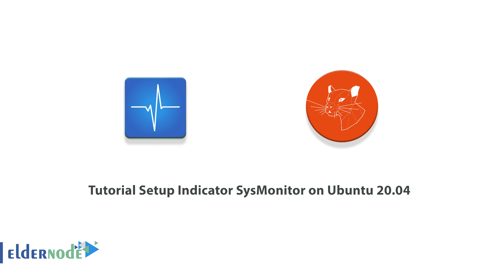
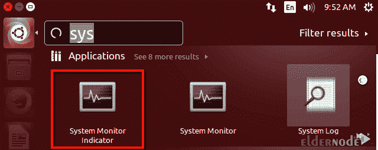
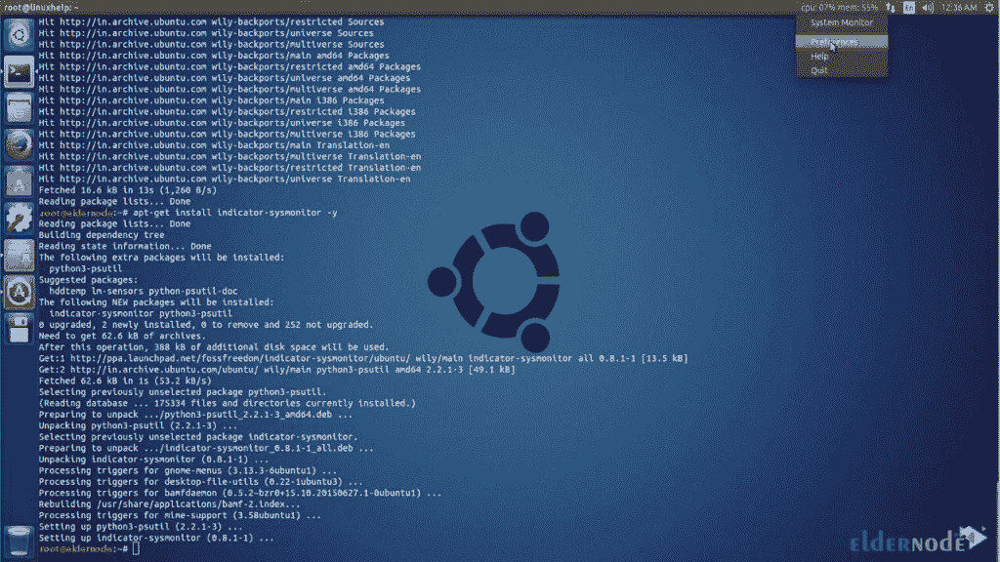
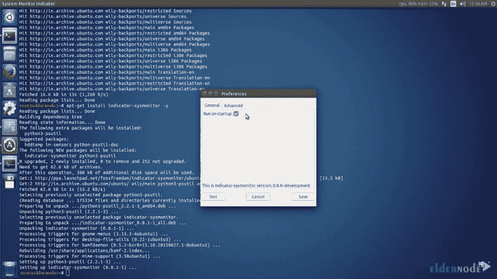
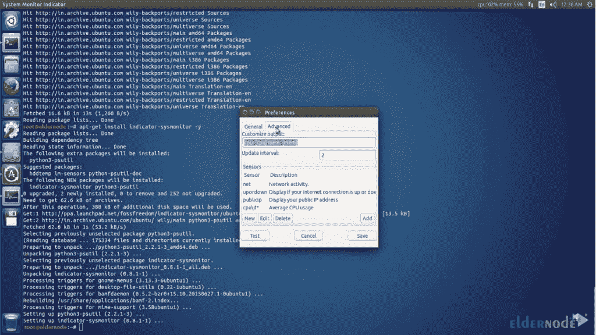

# Ubuntu 20.04 上的安装指示器 SysMonitor 教程

> 原文：<https://blog.eldernode.com/setup-indicator-sysmonitor-on-ubuntu/>



SysMonitor Indicator 是一个开源应用程序，提供实时系统信息。应该注意的是，这些显示系统活动，如 CPU 使用和内存使用。在本文中，我们将向您介绍 Ubuntu 20.04 上的**教程设置指示器 SysMonitor。如果你想购买一台 [Ubuntu VPS](https://eldernode.com/ubuntu-vps/) 服务器，你可以访问 [Eldernode](https://eldernode.com/) 中提供的软件包。**

## **如何在 Ubuntu 20.04 上设置显示器 SysMonitor**

SysMonitor 指示器还在条上显示各种温度传感器。它还允许用户执行他们的命令，并在顶栏中显示输出。应该注意的是，SysMonitor 指示器可以与 gnome-panel 和 Unity 一起正常工作。在下一节中，我们将简要介绍指示器 SysMonitor。然后我们会一步步教你如何在 [Ubuntu](https://blog.eldernode.com/tag/ubuntu/) 20.04 上安装 Indicator SysMonitor。最后，将解释 Ubuntu 20.04 上的设置指示器 SysMonitor 设置。

[inline _ east]

### **指标 SysMonitor** 简介

Ubuntu 有很多系统监控程序，但大多数都是在自己的窗口中显示信息。另一方面，如果您希望以纯文本方式监控少量系统参数，并且不想浪费时间切换窗口，那么让信息显示在面板中是一个理想的解决方案。

指示器 Sysmonitor 程序在屏幕上显示各种系统信息。如前一节所述，这些信息包括文件系统磁盘空间使用、网络活动、内存使用、CPU 使用和交换空间使用。指示器 Sysmonitor 还允许您执行脚本和命令，并在屏幕上显示它们的输出。

在下一节中，请跟随我们学习如何安装指示器 Sysmonitor。

## **在 Ubuntu 20.04 上安装显示器 SysMonitor**

在这一节，我们将教你如何一步一步地在 Ubuntu 20.04 上安装 Indicator SysMonitor。为此，只需按顺序执行以下步骤。由于 SysMonitor 指示器由 Fossfreedom 维护，您必须首先使用以下命令**添加 Fossfreedom 存储库**:

```
sudo add-apt-repository ppa:fossfreedom/indicator-sysmonitor
```

在下一步中，您必须使用以下命令更新系统，以应用更改:

```
sudo apt-get update
```

最后，您可以通过运行以下命令轻松地**安装指示器 SysMonitor** :

```
sudo apt-get install indicator-sysmonitor
```

### **Ubuntu 20.04 上的设置指示器 SysMonitor**

在上一节成功安装了 Indicator SysMonitor 之后，我们现在想教您如何设置和开始使用它。要**运行**指示器 SysMonitor，打开 Ubuntu 搜索框，输入**系统**。然后从可用选项中选择**系统监控指示灯**:



请注意，您必须右键单击**首选项**来更改和定制显示选项。



然后在启动时选择**运行**，点击**保存**。



请注意，此时您可以配置您选择的 SysMonitor 指示器。您还可以在桌面的顶栏中看到这些值。您也可以点击**高级**选项卡来检查任何高级设置。



## 结论

在本文中，我们试图在第一步中定义指示器 SysMonitor。然后我们教你如何安装指示器 SysMonitor，最后一步，我们教你如何在 Ubuntu 20.04 上安装指示器 SysMonitor。