# 如何在 VMware 工作站上安装和设置 Kali Linux

> 原文：<https://blog.eldernode.com/setup-kali-linux-on-vmware-workstation/>

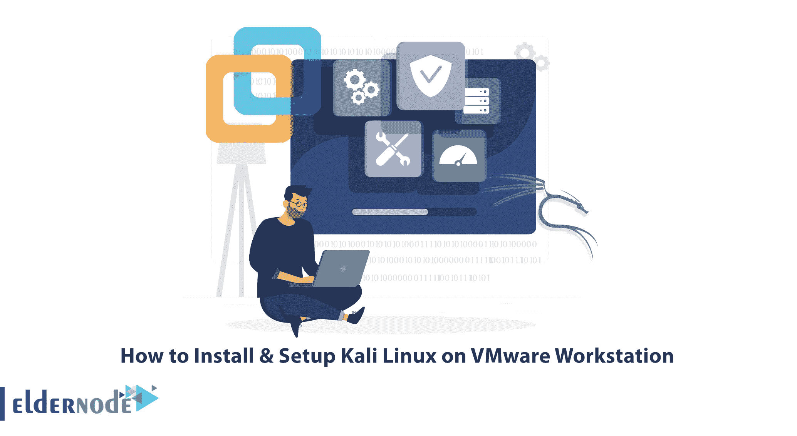

Kali Linux 是安全和渗透测试工作的最佳和理想的操作系统之一。我们建议您在 VMware 上安装 Kali Linux，因为这是熟悉这个高级操作系统的最佳选择之一。即使您在虚拟环境中搞乱了某个功能或者安装不正确，也不会对您的主机操作系统产生任何影响。本文将教你如何在 VMware 工作站上安装和设置 Kali Linux。如果你打算[用比特币](https://blog.eldernode.com/buy-dedicated-server-with-bitcoin/)购买专用服务器，你可以查看我们网站上提供的套装。

## **教程在 VMware 工作站上安装 Kali Linux**

Kali Linux 是一个基于 Debian 的 Linux 发行版，旨在测试和调查渗透和安全问题。它包括数百种不同的工具，使其非常适合执行安全任务，如渗透测试、安全研究和逆向工程。这个操作系统是由领先的信息安全培训公司进攻性安全公司开发的。

### **如何下载卡莉 Linux**

在 VMware 上安装 Kali Linux 之前，您需要做的第一件事是下载 Kali Linux 镜像文件。为此，导航到 [Kali Linux 的官方网站](https://www.kali.org/get-kali/#kali-virtual-machines)并向下滚动找到**虚拟机文档**部分。

Kali Linux 的下载页面提供了不同的映像类型供下载，包括 Installer、NetInstaller 和 Live。每种图像类型都适用于 32 位和 64 位架构。

现在，单击 **VMware** 部分的下载图标:

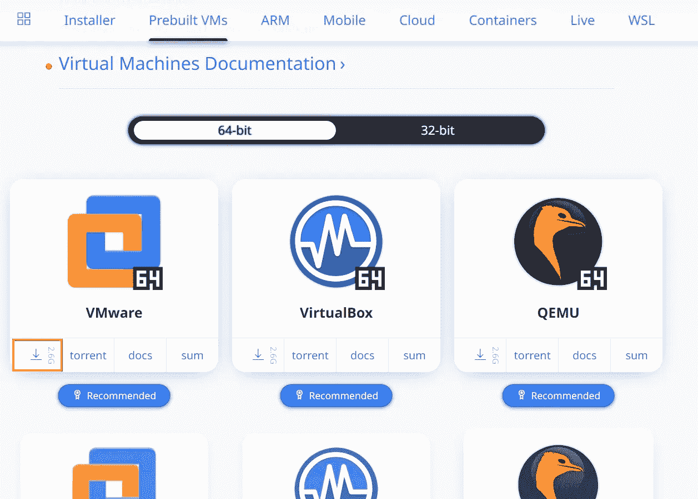

等待下载完成。

每个 Kali Linux 安装程序映像都允许您选择桌面环境(DE)和软件包(元软件包)来安装 Kali Linux 操作系统。最好保留默认选择，并在安装后根据需要添加更多的包。

## **如何在 VMware 工作站上设置 Kali Linux**

首先，启动 VMware Workstation 并选择**创建一个新的虚拟机**:

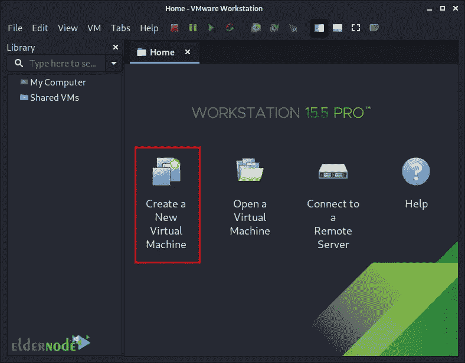

现在，您将看到以下屏幕。对于虚拟机配置，您应该选择 **Custom (advanced)** ,这样您可以更好地控制虚拟机的创建:

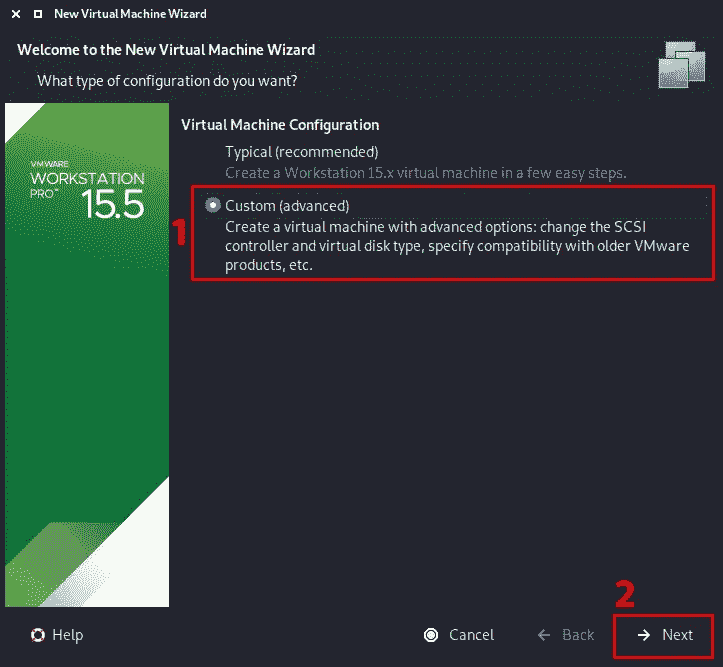

这一步需要选择**虚拟机硬件兼容性**。

更多的用户可以从 Kali Linux 中受益。请注意，如果您使用的是比 v8 更高版本的 VMware，启动后，VMware 会要求您升级虚拟机。这将消除旧 VMware 配置文件带来的任何限制。然而，大多数用户不会有自己的 Kali Linux VM 来使用所有这些额外的资源，所以他们不会从拥有最新的配置文件中受益，所以最好使用旧的配置文件:

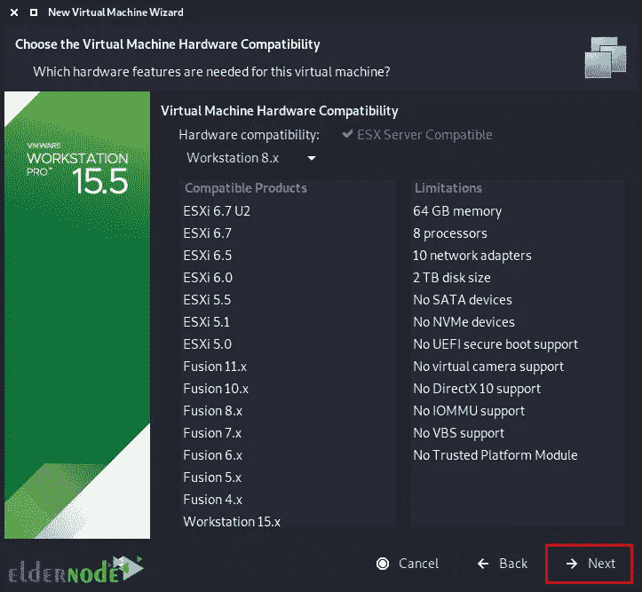

### **添加 Kali Linux 镜像文件**

接下来，点击**浏览**并导航到下载的 ISO 文件位置。然后选择用于安装的 Kali Linux 映像:

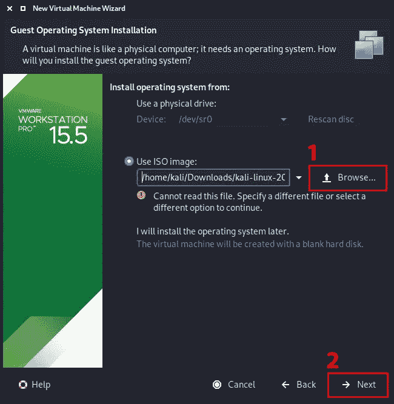

现在选择 **Linux** 和最新版本的 Debian 作为**客户操作系统**的版本:

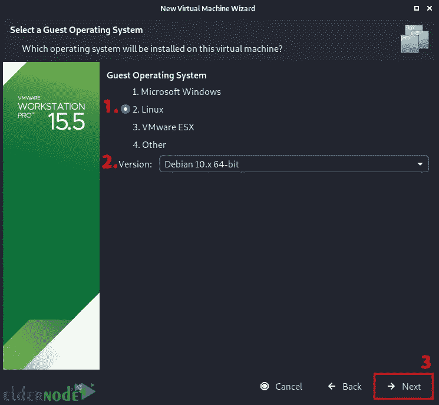

在这个屏幕中，您应该将**虚拟机命名为**。请注意，此名称将被用作文件名，并且从此处不能更改:

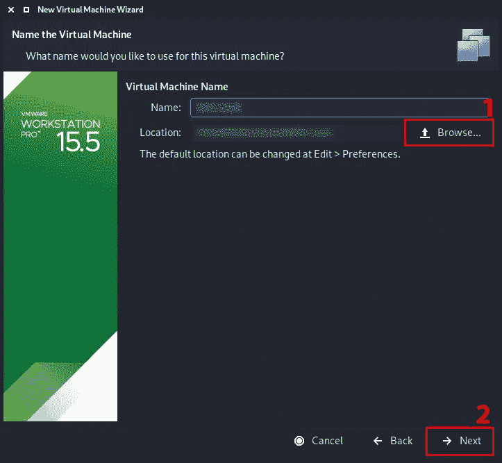

将出现**处理器**屏幕，允许您定义分配给虚拟机的资源数量。如果你给 Kali 分配更多的资源，Kali 可以同时更快地执行更多的任务。根据您的系统需求，您可以使用更多或更少的资源:

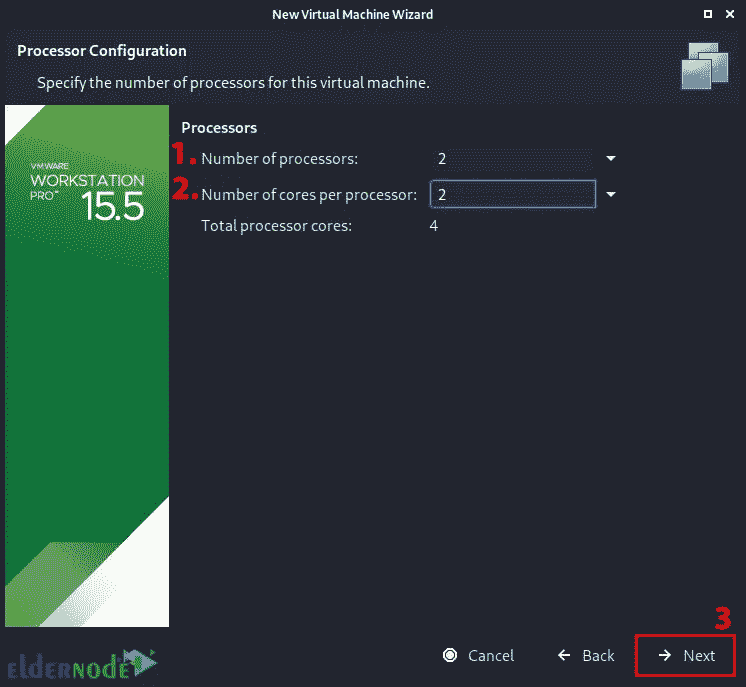

现在你需要定义要使用的 **RAM** 的数量。通过增加 RAM 的容量，可以打开更多的程序，并且执行得更好。Kali 中的各种工具会消耗大量资源:

### **选择网络类型**

接下来，为您想要添加的网络类型选择 **NAT 连接**。请记住，即使在虚拟机启动时，您也可以轻松地更改它。这允许 Kali VM 与互联网以及 LAN 连接的其余部分进行对话，而无需获得额外的 IP 地址。但是请注意，这不能接收反向 shells:

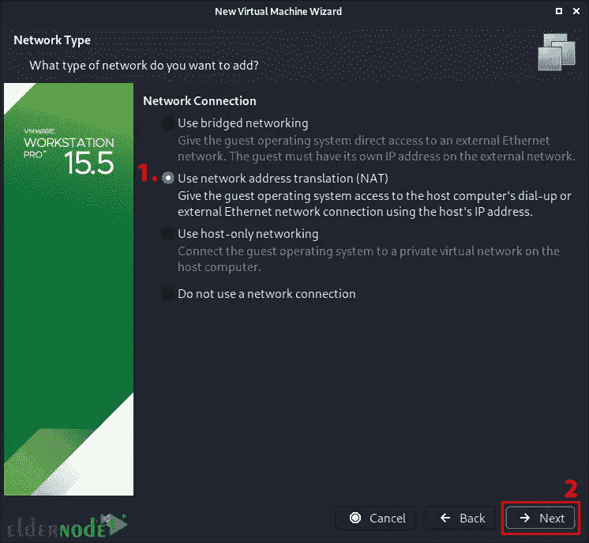

现在选择 **I/O 控制器类型**。您可以访问默认值 **LSI 逻辑**:

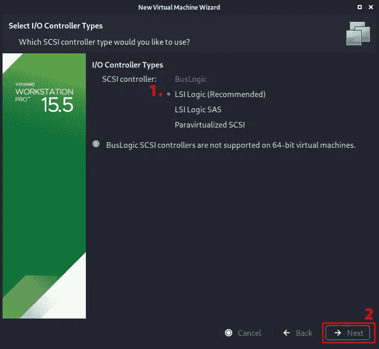

选择虚拟磁盘类型或接受默认值 **SCSI** :

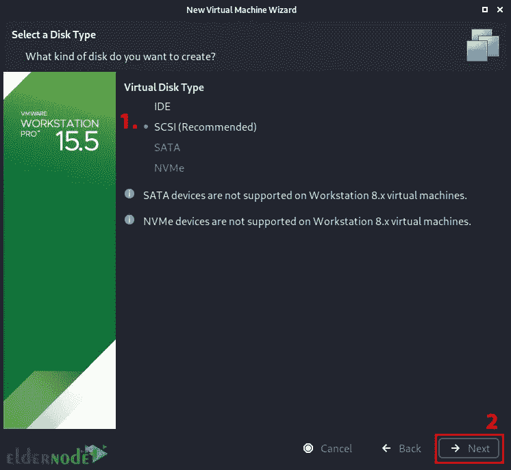

在此步骤中，创建一个新的虚拟磁盘，并定义虚拟硬盘的大小。创建虚拟机后，您可以增加或减少硬盘，但是如果您安装了 Kali，您将需要增加或减少分区来反映空间。我们选择**将虚拟磁盘分割成多个文件**选项:

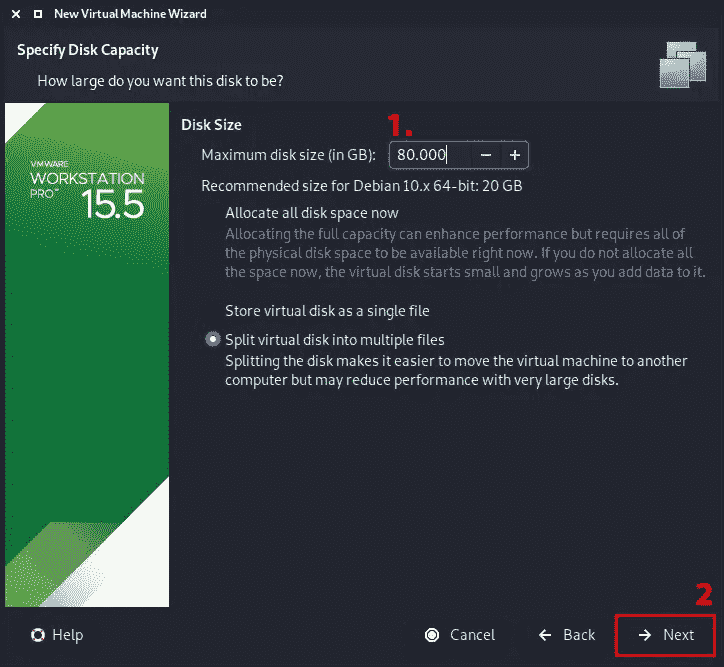

现在选择您想要存储它的磁盘文件的位置:

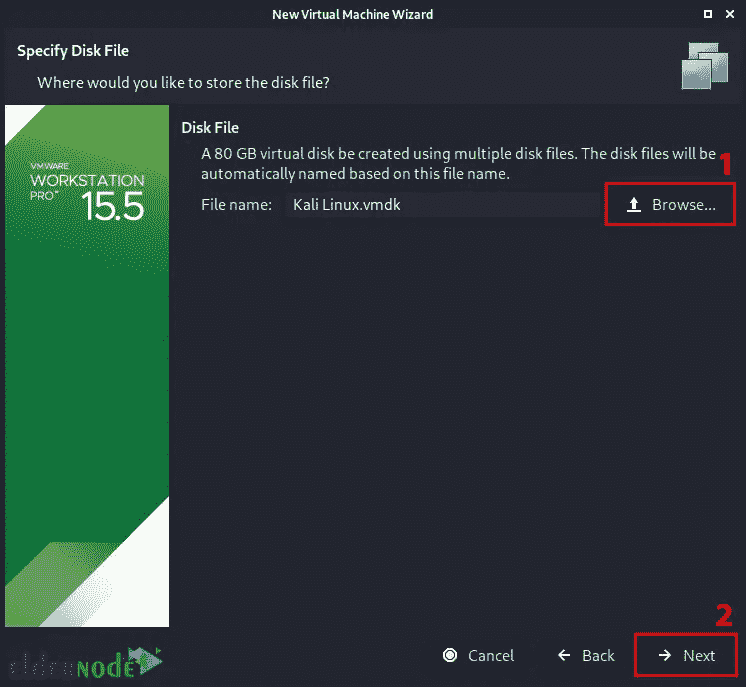

最后一个屏幕将显示您选择的设置的概述。按**结束**:

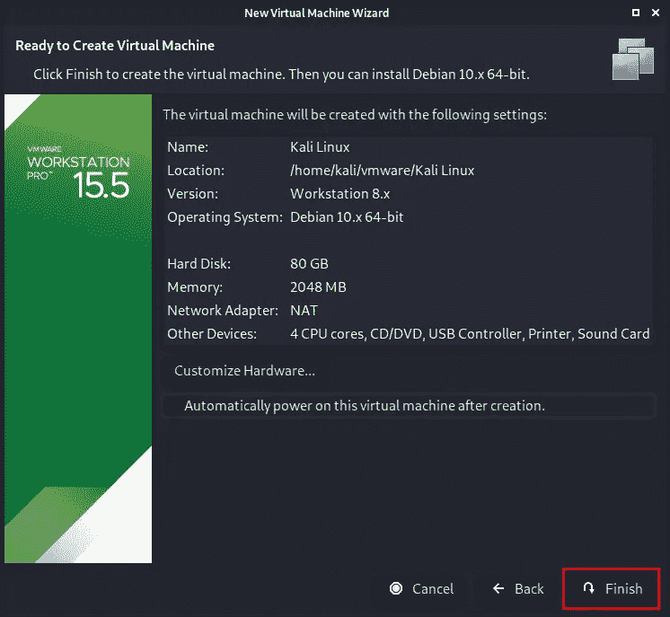

就是这样！

结论

## 在本文中，我们教您如何在 VMware Workstation 上安装和设置 Kali Linux。我希望这篇教程对你有用，并帮助你在 VMware 工作站上安装 Kali Linux。如果您在安装 Kali Linux 的过程中遇到任何问题，可以在评论区联系我们。

In this article, we taught you how to install & set up Kali Linux on VMware Workstation. I hope this tutorial was useful for you and helped you to install Kali Linux on VMware Workstation. If you encounter any problems in the process of installing Kali Linux, you can contact us in the comments section.