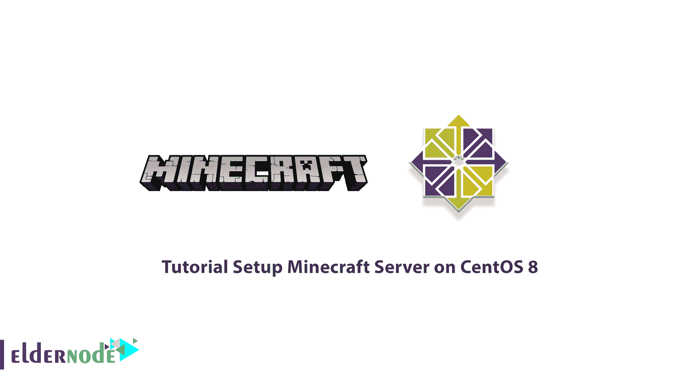
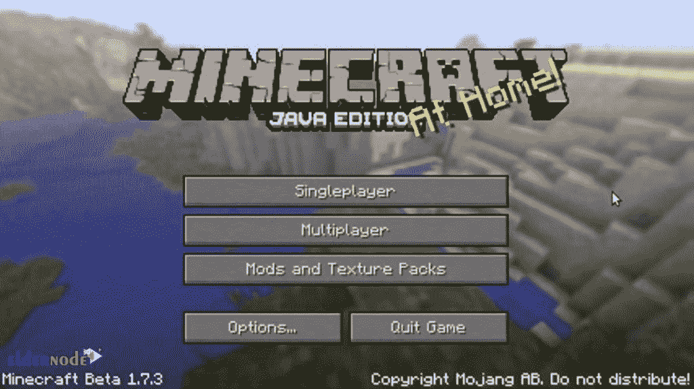

# CentOS 8 - Eldernode 博客上的《我的世界》服务器设置教程

> 原文：<https://blog.eldernode.com/setup-minecraft-server-on-centos/>



虽然《我的世界》供应是 11 岁，游戏仍然是最受玩家欢迎的标题之一。《我的世界》不是一个普通的游戏。这个游戏没有具体的目标，它的创作者也没有考虑过对你熟悉游戏环境以及如何实现进行一次完整的训练。《我的世界》游戏有趣的一点是，开放的世界让你可以完全自由地去任何你想去的地方。在本文中，我们打算向您介绍在 CentOS 8 上设置《我的世界》服务器的**教程。如果你愿意，你可以从 [Eldernode](https://eldernode.com/) 中可用的包中访问 [CentOS VPS](https://eldernode.com/centos-vps/) 服务器。**

## **如何在 CentOS 8**T3 上设置《我的世界》服务器

《我的世界》是一款“沙盒”风格的视频游戏。沙盒是一个轻量级的游戏，其中游戏者有充分的自由，选择自己，“何时”，“何地”和“如何”继续游戏。在接下来的部分，我们将通过《我的世界》来了解你。然后我们将训练 Java OpenJDK 如何安装在 [CentOS](https://blog.eldernode.com/tag/centos/) 8 上。在安装并提供必要的需求之后，它将最终安装并运行《我的世界》。请继续这篇文章。

### **《我的世界》简介**

[《我的世界》](https://blog.eldernode.com/how-to-setup-minecraft-server/)是魔江工作室最受欢迎、最具娱乐性的智力游戏。《我的世界》是一款不追求特定目标的 3D 游戏(当然是在众议院)，玩家可以自由选择如何玩。这款游戏的世界是三维粗糙的形式，游戏中的立方体和流体代表了土壤、岩石、树干、水、熔岩等多种材质。

这个游戏的原理实际上是把这些物体收集起来，放在一起。这些积木正在玩游戏。玩家一旦自由进入这个世界，就应该把这些积木从先前的地方拿走，放在某个地方建造建筑。可以说，游戏世界实际上是无限的，玩家的搜索和努力产生了多少游戏世界。

这个游戏的世界有不同的画布。在这些画布中，可以提到森林和沙漠、雪域、平原、山脉、洞穴、海洋、河流、山谷。游戏系统有白天和黑夜两个循环，每个循环在现实世界中只需要二十分钟。玩家面对的是各种生物(小怪)，比如动物，村民，或者敌方角色。动物是顺从的暴民，整天生产，寻找食物和原材料。敌人的怪物在晚上或者在黑暗的地方比如洞穴里制造蜘蛛，骷髅，僵尸。

继续这篇关于 CentOS 8 上的《我的世界》服务器的文章。

### **在 CentOS 8** 上设置《我的世界》的要求

在我们推出 how《我的世界》之前，您需要提供以下要求:

_ 使用公共 IP 地址访问 **CentOS VPS 服务器**。

_ [Putty SSH 客户端](https://www.chiark.greenend.org.uk/~sgtatham/putty/latest.html)

### **如何在 CentOS 8 上安装 Java open JDK**

创建《我的世界》服务器非常简单，第一步只需输入 CentOS VPS 服务器。然后需要使用下面的命令安装 JDK 1.6.0 打开 JDK:

```
ssh [[email protected]](/cdn-cgi/l/email-protection)
```

```
yum install java-1.6.0-openjdk
```

***注:*** 以防查看“这样可以吗？”，必须输入 **Y** 。

## **在 CentOS 8** 上设置《我的世界》服务器

一旦你成功安装了 JDK，那么你需要强迫一个用户运行你的[《我的世界》](https://en.wikipedia.org/wiki/Minecraft)服务器。请注意，这样做是出于安全目的，因为以 roots 用户身份运行《我的世界》服务器不是一种好的做法。

```
adduser mcserver
```

```
passwd mcserver
```

需要注意的是，为了更加安全，您必须输入安全的密码。

```
yum install screen
```

以下命令允许您运行 screen，同时从根目录执行下一步:

```
chown mcserver `tty`
```

现在，您可以使用以下命令更改用户并安装《我的世界》。需要注意的是，你必须为新版本的《我的世界》修改 URL。

```
su - mcserver
```

```
mkdir minecraft
```

```
cd minecraft
```

```
wget https://s3.amazonaws.com/Minecraft.Download/versions/1.11/minecraft_server.1.11.jar
```

```
chmod +x minecraft_server.jar
```

```
screen
```

```
echo "eula=true" > eula.txt
```

### **如何启动《我的世界》服务器**

在上一节中，我们教了您如何在 CentOS 8 上安装《我的世界》。如果您成功完成了所有这些步骤，您可以使用以下命令启动《我的世界》:

```
java -Xmx768M -Xms768M -jar minecraft_server.jar nogui
```



## 结论

先不说《我的世界》前几年不可思议的进步，这个游戏扩张的原因，它活跃的社区。用户花时间制作不同的材料，设计新的结构，寻找新的解决方案来消除问题，并实现可以让其他用户玩几个小时的机制。在这篇文章中，我们试图向你介绍《我的世界》。然后我们解释如何安装 Java OpenJDK，这是《我的世界》的先决条件。在最后一步，我们教你如何启动和开始《我的世界》。

[yasr _ visitor _ votes size = " medium "]