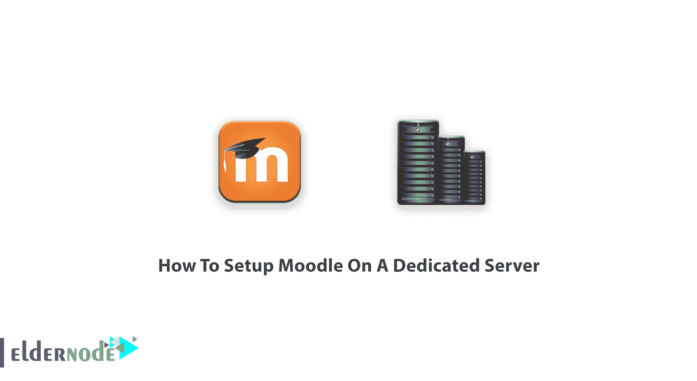

# 专用服务器上的教程设置 Moodle-elder node 博客

> 原文：<https://blog.eldernode.com/setup-moodle-on-a-dedicated-server/>



**M**modular**O**面向对象**D**dynamic**L**earning**E**n environment 是一家知名的学习管理网站。几十年来，在线交流已经成为人们生活的一部分，而在线教育只是其中的一部分。2020 年，电晕病毒协议迫使世界各地的学生开始在线学习。如果你正准备创建自己的在线学习网站，这本指南正是你所需要的。在本文中，你将学习如何在专用服务器上安装 Moodle。但是如果你还没有准备好你自己的专用服务器，支持你的团队正在等着你。一旦您购买了虚拟专用服务器，您就可以建立一个虚拟学习环境，并开始使用电子学习的功能来安全地呆在家里。

## **在专用服务器上设置 Moodle**

让我们看看什么是 Moodle，以及如何在您自己的服务器上使用它，请注意 Moodle 在专用服务器上工作得更好，强烈建议使用该软件，因为它需要单独的服务器。当你决定为一所学校，大学，工作场所，甚至一个私人在线课程建立一个网站时，你可能会考虑这个平台是否可以定制。

远程学习需要一个强大的基础设施来弥补面对面情境功能的不足。这个开源软件受 GPL 许可，是一个受欢迎的平台，因为它有令人满意的特性和功能。Moodle 为你提供了超过 1000 个插件和各种各样的主题。使用 Windows、Linux、OS X 甚至移动设备(Android 和 iPhone)都不成问题，因为 Moodle 支持所有这些设备。Moodle 尝试广泛使用，也达到了这个目的。桌面方面，Moodle 适用于 **Windows** 7 及更高版本。

对于习惯用平板电脑工作的人来说，Windows 10 是需要“Windows 周年更新”的。同样对于 MacOS 用户，支持的最低 macOS 版本是 macOS 10.9。最后，对于 Linux 爱好者来说，Moodle 支持 Ubuntu 12.04、Fedora 21 和 Debian 8 以及更高版本。如果你更喜欢从 Moodle 接收电子邮件，你需要 Unix/Linux 版的 Sendmail 或者 Windows 版的 [SMTP](https://blog.eldernode.com/how-to-find-the-smtp-address/) 邮件服务器。

## **如何在专用服务器上设置 Moodle(一步一步)**

### Moodle 系统的基本要求

在撰写本文时，Moodle 的最新稳定版本是 3.10，Moodle 的要求可能会因您希望安装的 Moodle 版本而有所不同。根据你需要什么样的网站和用户数量，需要的硬件会是可变的。

为了让本教程更好地发挥作用，请考虑以下**先决条件**:

**1-** 至少 200MB 磁盘空间用于 Moodle 代码&大约 5MB 用于你考虑的内容。

**2-** 1GB 或更多内存

**3-** 2GHz 双核处理器

**4-**PHP 5 . 6 . 5&MySQL 5 . 5 . 31 应该已经配置好了。

都为你准备好了吗？好了，我们开始吧！

## **在专用服务器上学习设置 Moodle**

安装软件的前一步是下载**安装文件。**显然， [Moodle 网站](https://moodle.org/)是下载文件和 Moodle 最新版本的最佳选择。通过这种方式，您可以确保安全，并且在面临文件中的任何问题时，您也可以依靠他们的帮助。一旦你从网站上下载了它，解压并找到 Moodle 创建的文件夹，其中包含许多文件和文件夹。该文件夹应该放在 web 服务器文档目录中。此外，您可以运行以下命令版本:

```
/usr/bin/php /path/to/moodle/admin/cli/install.php
```

**注意** : Moodle 程序文件应该符合你的文件权限，安装完成后必须检查。CLI 将为您创建 config.php，如果您在上一步中创建了它，它将不会运行。

接下来，您需要一个**空数据库**。新数据库有一个服务器主机名、一个名称、一个用户名和一个密码。记下它们以备后用。

众所周知，为了存储文件(内容、会话数据、临时数据等)，Moodle 需要一个**目录**。在创建该目录之前，应该估计其可能存储量。尽量保持优化，因为它应该能够快速兑现数据。**注意**不要让它直接从网上被访问，以防止任何安全漏洞。最后，请记住，它不能放在您 webroot 或 Moodle 程序文件目录中。

**现在，**是时候运行 **Moodle 安装程序**了。你可以使用推荐的方法**命令行**或**基于网络的安装程序**(适用于 Windows)。然而，继续这一部分来创建 Moodle 数据库和配置您的网站。

根据您的 Linux/Unix 版本，使用下面的示例命令:

```
chown www-data /path/to/moodle
```

```
cd /path/to/moodle/admin/cli
```

```
sudo -u www-data /usr/bin/php install.php
```

```
chown -R root /path/to/moodle
```

此外，如果您遇到了上述示例中不存在的任何选项，请使用以下命令查看选项的完整列表，以安全地选择默认值:

```
php install.php --help
```

如果你喜欢通过网络安装 Moodle，你选择了一个简单的方法。你只需要检查你的页面在安装过程中是否是公开的。打开浏览器，进入 Moodle 的主 UPL，让 **web 安装程序**脚本自动启动。

通过网络安装 Moodle 非常容易。确保在安装完成之前，您的页面不是公共的。根据您在网络服务器上放置 Moodle 文件的位置，它很可能是:

```
http://yourwebserver.com/moodle
```

或者

```
http://yourwebserver.com
```

然后，向导会提示您选择一种语言并确认版权。单击“下一步”让它确认路径和数据库设置。我们要求您记下数据库主机和数据库名称，现在是使用它的时候了。点击“下一步”后，Moodle 将完成服务器和软件检查。安装过程完成后，您可以在 Moodle 网站上设置管理员帐户。要让它保存您的登录信息，请输入该信息，然后点按“更新个人资料”。设置中的页面描述可以随时更新。

**注意**:如果您安装了任何可选插件，您必须在运行主安装脚本之前卸载它们，并在安装 Moodle 之后重新安装它们。

### Moodle 和浏览器

很容易，我们可以说 Moodle 兼容大多数浏览器，如 Chrome、Firefox、Safari(7 及以下版本不支持)、Edge 和 Internet Explorer(10 及以下版本不支持)。如果你想在移动设备上设置 Moodle，mobile safari 和 google chrome 都支持。

### **教程配置 Moodle**

要完成这一部分，你应该先在 Moodle 代码目录中找到文件**config-dist.php**，并将其复制到一个名为**config.php**的新文件中(你可以随时编辑这个文件)。打开您考虑过的编辑器，更改适当的设置以指向您的站点、目录和数据库。但是，在上线之前，您可以配置的选项并不多。在 Moodle 网站管理中，您可以找到如下选项:

**_** 外发邮件配置

**_** 设置您的 SMTP 服务器和认证

**_** 支持联系人

**_** 系统路径

**_** HTTP

**_** 更新时区

### 如何设置 Cron

为了确保定期运行，cron 是个好主意。因为 cron 每分钟都在运行，所以您建议使用它。Unix cron 条目如下所示:

```
/usr/bin/php /path/to/moodle/admin/cli/cron.php >/dev/null
```

一旦玉米运行正常，站点就会工作，所以**不要跳过**这一步。

## 结论

在本文中，您了解了如何在专用服务器上安装 Moodle。开始使用 Moodle 并创建您的在线课程。享受您的个性化仪表板、简单直观的文本编辑器，并与您的朋友分享您的进度。