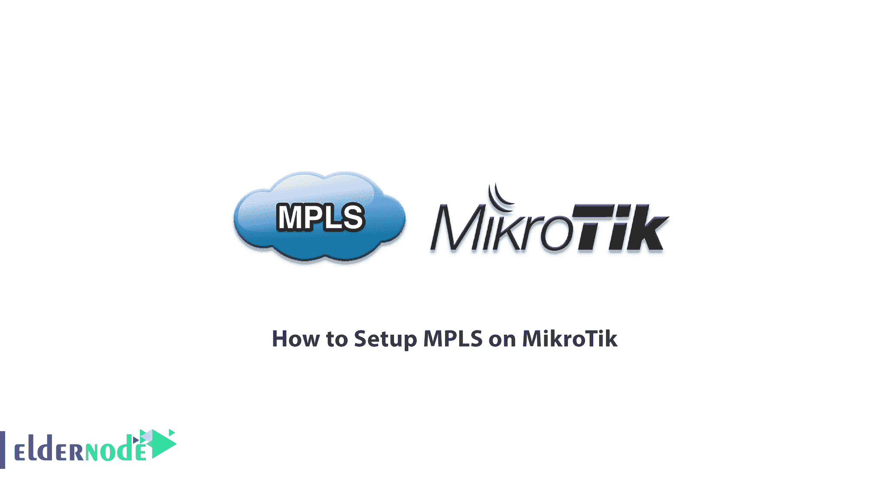
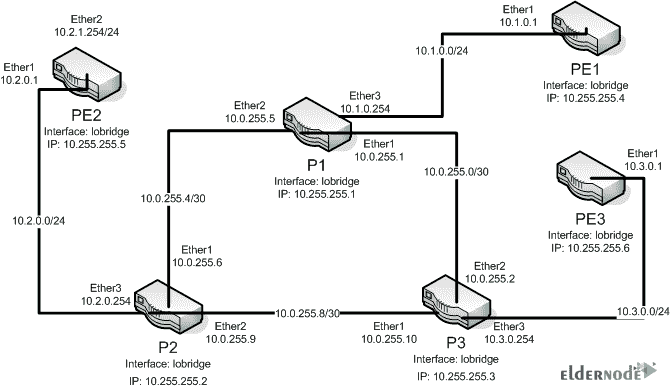
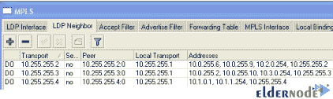

# 如何在 MikroTik - Eldernode 博客上设置 MPLS

> 原文：<https://blog.eldernode.com/setup-mpls-on-mikrotik/>



MPLS 代表多协议标签交换。这种传输技术已经成为流行和普及了几年的技术。MPLS 使用标记机制在网络上发送数据包。通常，如果我们要描述 MPLS 的功能，它使用路由平台中的标记机制来执行交换操作。也就是说，当进入 MPLS 网络时，基于目的地 IP 地址来标记分组。然后它被引导沿着第二层中的路径并基于这个标签到达目的地。在本文中，我们将向您学习如何在 MikroTik 上设置 MPLS。您可以访问 [Eldernode](https://eldernode.com/) 中可用的包来购买 [Mikrotik VPS](https://eldernode.com/mikrotik-vps-server/) 服务器。

## **教程在 MikroTik** 上设置 MPLS

MPLS 不位于 OSI 的特定层，它的功能位于第二层(数据链路)和第三层(网络)之间。这就是它作为第 2.5 层协议推出的原因。如前所述，MPLS 在数据包上使用标签机制。MPLS 标签分布在路由器之间，路由器可以使用这些标签来获得网络标签的映射。这些标签连接到 IP 数据包，使路由器能够使用这些标签发送数据包，而不管 IP 地址。在 MPLS 中，数据包是通过标签交换而不是 IP 交换发送的。

标签交换技术并不是一项新技术，帧中继和 ATM 网络已经用它来发送帧和信元。在帧中继和 ATM 中，标签在网络的每一跳都会改变。这是这两种技术和在 IP 包中发送的主要区别。当路由器发送 IP 数据包时，它不会更改目的地址。事实上，MPLS 标签是用来发送数据包的，并不使用 IP 地址。在本文的后续部分，我们将告诉您如何在 [MikroTik](https://blog.eldernode.com/tag/mikrotik/) 上设置 MPLS。

### **MPLS 的优势**

这里总结了在网络上使用 MPLS 的好处:

–使用集成网络基础设施

–优于 ATM 上的 IP

–无边界网关协议(BGP)核心

–交通流量优化

–交通工程

–MPLS VPN 的对等模型

### **在 MikroTik** 上设置 MPLS

为了建立 MPLS 网络，我们考虑了以下场景。此场景由三台提供商路由器和三台提供商边缘路由器组成。



第一步是在所有设备上创建环回接口。由于只创建一个 LDP 会话，两台路由器之间是否有多条链路并不重要，因此环回接口也可用于 LSR ID 和传输地址。

请注意以下命令:

**P1**

```
/interface bridge add name=lobridge
```

```
/ip address add address=10.255.255.1/32 interface=lobridge
```

请注意，其它路由器被设置为 10.255.255.2-6，如上所示:

**P2**

```
/interface bridge add name=lobridge
```

```
/ip address add address=10.255.255.2/32 interface=lobridge
```

**P3**

```
/interface bridge add name=lobridge
```

```
/ip address add address=10.255.255.3/32 interface=lobridge
```

**PE1**

```
/interface bridge add name=lobridge
```

```
/ip address add address=10.255.255.4/32 interface=lobridge
```

**PE2**

```
/interface bridge add name=lobridge
```

```
/ip address add address=10.255.255.5/32 interface=lobridge
```

**PE3**

```
/interface bridge add name=lobridge
```

```
/ip address add address=10.255.255.6/32 interface=lobridge
```

### **IP 寻址训练**

接下来，您需要配置设备以太网接口的 IP 地址。为此，请检查以下命令:

**P1**

```
/ip address
```

```
add address=10.0.255.1/30 interface=ether1
```

```
add address=10.0.255.5/30 interface=ether2
```

```
add address=10.1.0.254/24 interface=ether3
```

**P2**

```
/ip address
```

```
add address=10.0.255.6/30 interface=ether1
```

```
add address=10.0.255.9/30 interface=ether2
```

```
add address=10.2.0.254/24 interface=ether3
```

**P3**

```
/ip address
```

```
add address=10.0.255.10/30 interface=ether1
```

```
add address=10.0.255.2/30 interface=ether2
```

```
add address=10.3.0.254/24 interface=ether3
```

**PE1**

```
/ip address
```

```
add address=10.1.0.1/24 interface=ether1
```

**PE2**

```
/ip address
```

```
add address=10.2.0.1/24 interface=ether1
```

**PE3**

```
/ip address
```

```
add address=10.3.0.1/24 interface=ether1
```

### **如何设置动态路由**

在这一部分，您必须设置一个动态路由，使网络完全可达。通过这样做，LDP 将能够在您的网络上启动 MPLS 核心网络。

**P1**

```
/routing ospf instance
```

```
set distribute-default=never redistribute-connected=as-type-1 router-id=10.255.255.1 numbers=default
```

```
/routing ospf network
```

```
add area=backbone network=10.0.255.0/30
```

```
add area=backbone network=10.0.255.4/30
```

```
add area=backbone network=10.1.0.0/24
```

**P2**

```
/routing ospf instance
```

```
set distribute-default=never redistribute-connected=as-type-1 router-id=10.255.255.2 numbers=default
```

```
/routing ospf network
```

```
add area=backbone network=10.0.255.8/30
```

```
add area=backbone network=10.0.255.4/30
```

```
add area=backbone network=10.2.0.0/24
```

**P3**

```
/routing ospf instance
```

```
set distribute-default=never redistribute-connected=as-type-1 router-id=10.255.255.3 numbers=default
```

```
/routing ospf network
```

```
add area=backbone network=10.0.255.0/30
```

```
add area=backbone network=10.0.255.8/30
```

```
add area=backbone network=10.3.0.0/24
```

**PE1**

```
/routing ospf instance
```

```
set distribute-default=never redistribute-connected=as-type-1 router-id=10.255.255.4 numbers=default
```

```
/routing ospf network
```

```
add area=backbone network=10.1.0.0/24
```

**PE2**

```
/routing ospf instance
```

```
set distribute-default=never redistribute-connected=as-type-1 router-id=10.255.255.5 numbers=default
```

```
/routing ospf network
```

```
add area=backbone network=10.2.0.0/24
```

**PE3**

```
/routing ospf instance
```

```
set distribute-default=never redistribute-connected=as-type-1 router-id=10.255.255.6 numbers=default
```

```
/routing ospf network
```

```
add area=backbone network=10.3.0.0/24
```

应该注意的是，在执行上述步骤后，您现在应该有一个 OSPF 根系统:

### **如何设置 MPLS**

最后，您需要转到应该位于 MPLA 核心网络上的以太网接口，并在这些接口上启用 LDP:

**P1**

```
/mpls ldp
```

```
set enabled=yes lsr-id=10.255.255.1 transport-address=10.255.255.1
```

```
/mpls ldp interface
```

```
add interface=ether1
```

```
add interface=ether2
```

```
add interface=ether3
```

**P2**

```
/mpls ldp
```

```
set enabled=yes lsr-id=10.255.255.2 transport-address=10.255.255.2
```

```
/mpls ldp interface
```

```
add interface=ether1
```

```
add interface=ether2
```

```
add interface=ether3
```

**P3**

```
/mpls ldp
```

```
set enabled=yes lsr-id=10.255.255.3 transport-address=10.255.255.3
```

```
/mpls ldp interface
```

```
add interface=ether1
```

```
add interface=ether2
```

```
add interface=ether3
```

**PE1**

```
/mpls ldp
```

```
set enabled=yes lsr-id=10.255.255.4 transport-address=10.255.255.4
```

```
/mpls ldp interface
```

```
add interface=ether1
```

**PE2**

```
/mpls ldp
```

```
set enabled=yes lsr-id=10.255.255.5 transport-address=10.255.255.5
```

```
/mpls ldp interface
```

```
add interface=ether1
```

**PE3**

```
/mpls ldp
```

```
set enabled=yes lsr-id=10.255.255.6 transport-address=10.255.255.6
```

```
/mpls ldp interface
```

```
add interface=ether1
```

现在，在 **MPLS** 选项卡的 **LDP 邻居**部分，您的 LDP 邻居应该会显示给您。



您也可以使用以下命令:

```
mpls ldp neighbor print
```

## 结论

当今非常流行的 MPLS 协议提供了基于更新的方法路由数据包的能力。它还消除了对旧 IP 路由的需要，并以更高的速度路由我们的数据包。在本文中，我们试图让您熟悉如何在 MikroTik 上设置 MPLS。